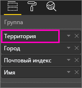
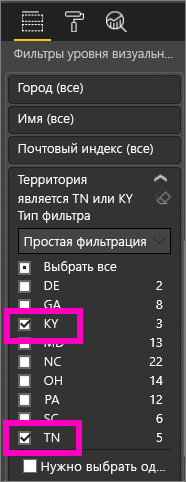
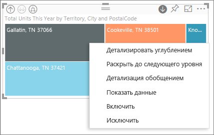
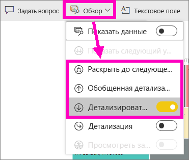
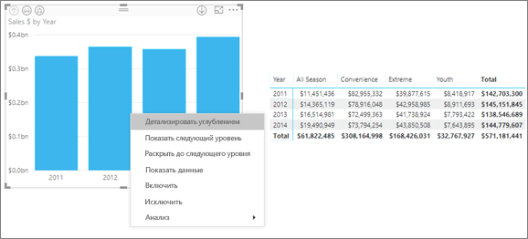
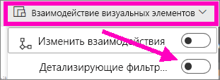
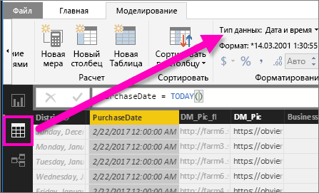

# Режим детализации в визуализации в Power BI

## Детализация с использованием иерархии
Если визуализация имеет иерархию, вы можете выполнить детализацию, чтобы отобразить дополнительные сведения. Например, вы можете создать визуализацию, которая отслеживает количество олимпийских медалей, с иерархией, состоящей из категорий "Спорт", "Дисциплина" и "Событие". По умолчанию в визуализации количество медалей будет отображаться по спортивным дисциплинам, таким как гимнастика, лыжный спорт, водные виды спорта и т. д. Но так как она имеет иерархию, после выбора одного из визуальных элементов (например, линейчатой диаграммы, графика или пузырьковой диаграммы) отобразятся более подробные данные. Выберите элемент **Водные виды спорта**, чтобы просмотреть данные по плаванию, прыжкам в воду и водному поло.  Затем выберите элемент **Прыжки в воду**, чтобы просмотреть данные по прыжкам с трамплина, прыжкам в воду и синхронным прыжкам в воду.

Вы можете добавлять иерархию только в собственные отчеты, но не в совместно используемые.
Не уверены, какая визуализация Power BI содержит иерархию?  Наведите указатель мыши на визуализацию, и если в верхнем углу появятся элементы управления детализацией, показанные ниже, значит визуализация имеет иерархию.

  
    

Даты — это уникальный тип иерархии. При добавлении поля даты в визуализацию Power BI автоматически добавляет иерархию времени, которая включает в себя год, квартал, месяц и день. Дополнительные сведения см. в статье [Иерархии и детализация визуальных элементов](../guided-learning/visualizations.yml?tutorial-step=18) или посмотрите видеоролик ниже.

  <iframe width="560" height="315" src="https://www.youtube.com/embed/MNAaHw4PxzE?list=PL1N57mwBHtN0JFoKSR0n-tBkUJHeMP2cP" frameborder="0" allowfullscreen></iframe>

> [!NOTE]
> Чтобы узнать, как создать иерархии с помощью Power BI Desktop, см. видеоролик, посвященный [созданию и добавлению иерархий](https://youtu.be/q8WDUAiTGeU)
> 

## Предварительные требования

1. В службе Power BI или приложении Power BI Desktop для детализации требуется визуализация с иерархией. 
   
2. Чтобы продолжить, [откройте пример анализа розничной торговли](../sample-datasets.md) и создайте диаграмму "дерево", на которой показано **общее количество единиц, проданных за этот год** (значения) с разбивкой по **территории**, **городу**, **почтовому индексу** и **имени** (группа).  Иерархия диаграммы "дерево" состоит из категорий "Территория", "Город", "Почтовый индекс" и "Название города". Каждая территория состоит из одного или нескольких городов, каждый город имеет один или несколько почтовых индексов и т. д. По умолчанию в визуализации отображаются только данные о территории, так как категория *Территория* стоит первой в списке.
   
   

2. Взаимосвязь разных значков детализации не всегда очевидна. Давайте рассмотрим ее на примере диаграммы "дерево", отфильтрованной для отображения двух небольших территорий: **KY** и **TN**. Выберите диаграмму дерева, затем в колонке **Фильтры уровня визуальных элементов** разверните раздел **Территория** и выберите элементы **KY** и **TN**.

        

   Теперь на диаграмме "дерево" отображаются только две территории.

   

## Три способа доступа к функциям детализации
У вас есть несколько способов вызвать функции детализации, обобщения и развертывания для визуализаций с иерархиями. Они описываются ниже. Все эти способы реализуют одно и то же действие, поэтому, ознакомившись с основными принципами детализации и развертывания, вы можете опробовать их все и выбрать понравившийся.

- Наведите указатель мыши на визуализацию, чтобы отобразились значки.  

    

- Щелкните визуализацию правой кнопкой мыши, чтобы открыть меню.
    
    

- В строке меню Power BI нажмите кнопку **Исследовать**.

   

## Пути детализации
### Детализация
Детализировать визуализацию можно несколькими способами. При ***детализации*** вы переходите к следующему уровню в иерархии. Например, с уровня **Территория** можно перейти на уровень города, затем на уровень почтового индекса и, наконец, на уровень названия. На каждом этапе отображаются новые сведения.

### Развернуть

При ***развертывании*** к текущему представлению добавляется дополнительный уровень иерархии. Например, на уровне **Территория** можно развернуть диаграмму "дерево" и добавить в нее сведения о городе, почтовом индексе и названии. На каждом последующем этапе отображаются те же сведения, что и на предыдущем, с добавлением одного нового уровня.

Кроме того, можно выбрать, должна ли детализация или развертывание выполняться по одному полю или по всем полям одновременно. 

## Детализацию по всем полям одновременно

1. Начните с верхнего уровня диаграммы "дерево", где отображаются данные для KY и TN. Расширьте диаграмму, выбрав один из маркеров и перетащив его вправо. 

     .

2. Чтобы перейти к детализации по ***всем полям одновременно***, щелкните двойную стрелку в левом верхнем углу визуализации . Теперь на диаграмме "дерево" представлены данные по городам в штатах Кентукки и Теннесси. 

    
   
5. Еще раз перейдите к следующему уровню в иерархии, теперь до почтового индекса.

    

3. Чтобы вернуться на предыдущий уровень детализации, выберите стрелку вверх в левом верхнем углу визуализации. .

## Детализация по одному полю за раз
Этот метод основан на использовании значка детализации, который находится в правом верхнем углу самой визуализации. 

1. Чтобы включить детализацию, щелкните значок детализации . Теперь можно выполнять детализацию по ***одному полю за раз***. 
   
   

   Если детализация отключена, при выборе визуального элемента (например, линейчатой или пузырьковой диаграммы либо листового узла) выполняется не детализация, а перекрестная фильтрация других диаграмм на странице отчета.

2. Выберите *листовой узел* для штата **TN**. Теперь на диаграмме "дерево" отображаются все города в штате Теннесси, в которых есть магазины. 

    

2. Вы можете продолжить детализацию с углублением по штату Теннесси или определенному городу этого штата либо вернуться на предыдущий уровень (см. раздел о **развертывании всех полей одновременно** ниже). Давайте произведем детализацию по одному полю за раз.  Выберите **Ноксвилл, TN**. Теперь на диаграмме "дерево" отображается почтовый индекс магазина в Ноксвилле. 

   

    Обратите внимание, что при переходе между уровнями детализации изменяется заголовок.  

## Развертывание всех полей и одного поля за раз
Диаграмма "дерево", на которой отображается только почтовый индекс, не очень информативна.  Давайте развернем ее на один уровень вниз в иерархии.  

1. Откройте диаграмму "дерево" и щелкните значок *развертывания вниз* . Теперь на диаграмме "дерево" отображаются 2 уровня иерархии: почтовый индекс и название магазина. 

    

2. Чтобы увидеть все 4 уровня иерархии данных для штата Теннесси, щелкайте стрелку детализации, пока не достигнете второго уровня на диаграмме "дерево": **Всего единиц в этом году по территории и городу**. 

    

3. Убедитесь в том, что детализация еще включена , и щелкните значок *развертывания вниз* . Теперь на диаграмме "дерево" отображаются дополнительные сведения: помимо города и штата, также отображается почтовый индекс. 

    

4. Еще раз щелкните значок *развертывания вниз*, чтобы на диаграмме "дерево" отобразились все 4 уровня иерархии данных для штата Теннесси. Чтобы просмотреть еще более подробные сведения, наведите указатель на листовой узел.

   

## Детализирующие фильтры для других визуальных элементов
При работе в режиме детализации вы можете выбрать, как детализация и развертывание будут влиять на другие визуализации на странице. 

По умолчанию при детализации другие визуальные элементы в отчете не фильтруются. Однако такую возможность можно включить в приложении Power BI Desktop и службе Power BI. 

1. В Power BI Desktop перейдите на вкладку **Формат** и установите флажок **Детализирующие фильтры для других визуализаций**.

    

2. Теперь, когда в визуальном элементе с иерархией выполняется детализация углублением, детализация обобщением или развертывание, фильтруются и другие визуальные элементы на странице. 

    

    

> [!NOTE]
> Чтобы включить эту возможность в службе Power BI, в верхней строке меню выберите **Интерактивное взаимодействие > Детализирующие фильтры для других визуализаций**.
>
> 

## Основные сведения об оси иерархии и группе иерархии
Ось иерархии и группу иерархии можно считать механизмами, позволяющими повышать и понижать степень детализации данных, которые вы хотите просмотреть. Любые данные, которые можно разбить на категории и подкатегории, считаются имеющими иерархическую структуру. Сюда, конечно, входят данные о датах и времени.

Можно создать визуализацию с иерархией в Power BI, выбрав одно или несколько полей данных, добавляемых в колодец **Ось** или **Группа**, вместе с данными, которые требуется просматривать как поля данных, в колодце **Значения**. Вы узнаете, имеют ли ваши данные иерархическую структуру, по тому, появляются ли значки *режима детализации* в верхних левом и правом углах визуализации. 

В сущности, целесообразно разбить иерархические данные на два типа.
- Данные о датах и времени. Если существует поле данных с типом данных DateTime, то у вас уже имеются иерархические данные. Power BI автоматически создает иерархию для любого поля данных, значения которого можно проанализировать в структуре [DateTime](https://msdn.microsoft.com/library/system.datetime.aspx). Достаточно просто добавить одно поле DateTime в колодец **Ось** или **Группа**.
- Категориальные данные. Если ваши данные извлекаются из коллекций, которые содержат вложенные коллекции, или в них существуют строки данных с общими значениями, то такие данные считаются иерархическими.

Power BI позволяет разворачивать данные по одному или по всем подмножествам. Вы можете выполнять детализацию, чтобы просматривать по одному подмножеству на каждом уровне или просмотреть все подмножества одновременно на каждом уровне. Например, можно выполнить детализацию, чтобы увидеть результаты для определенного года, или просмотреть все результаты для каждого года, продвигаясь вниз по иерархии. И наоборот, можно таким же образом понижать степень детализации.

В следующих разделах описывается повышение степени детализации от представления наивысшего уровня, представления среднего уровня и представления наинизшего уровня.

### Иерархические данные и данные о времени
В данном примере используйте [пример анализа розничной торговли](../sample-datasets.md) и создайте визуализацию в виде гистограммы с накоплением для просмотра месяцев **Month** (ось) по объемам продаж **TotalSales** (значения).  

Несмотря на то, что поле данных оси — **Month** (Месяц), в колодце **Ось** создается также категория **Year** (Год). Это происходит потому, что Power BI обеспечивает полную структуру DateTime для всех считываемых значений. На верхнем уровне иерархии отображаются данные за год.

Включите режим детализации и щелкните столбец на диаграмме, чтобы перейти на один уровень иерархии вниз. Вы увидите три столбца для данных по доступным кварталам. Затем в верхнем левом значке выберите пункт **Expand all down one level of the hierarchy** (Развернуть все на один уровень иерархии вниз). Затем повторите это действие еще раз, чтобы дойти до самого нижнего уровня иерархии, на котором показываются результаты для каждого месяца.

Помимо визуализации, иерархия также отражается в данных, отображаемых для каждого отчета. В следующей таблице показаны результаты команды **Show Data** (Просмотр данных) в отчете с детализацией от одного месяца или всех месяцев. 

Обратите внимание, что данные для квартального и годового отчетов одинаковы, но после детализации до уровня, указанного для **значений**, можно видеть, что отчет для одного месяца становится более конкретным, а отчет для всех месяцев имеет больше данных.

|Режим развертывания|Год|Квартал|Месяц|День|
| ---|:---:|:---:|:---:|---|
|Однонаправленная|||||
|Все|||||

### Данные иерархических категорий
Данные, которые моделируются по коллекциям и вложенным коллекциям, являются иерархическими. Хорошим примером таких данных являются данные о расположении. Рассмотрим таблицу в источнике данных, в столбцах которого указаны страна, регион, город и почтовый индекс. Данные, имеющие одинаковую страну, регион и город, являются иерархическими.

В данном примере используйте [пример анализа розничной торговли](../sample-datasets.md). Создайте визуализацию в виде гистограммы с накоплением для просмотра **общего количества единиц за этот год** (значения) по **территории**, **городу**, **почтовому индексу** и **названию** (группа).  

Если режим детализации включен, в верхнем левом углу три раза щелкните значок **Expand all down one level of the hierarchy** (Развернуть все на один уровень иерархии вниз).
Вы должны оказаться на самом низком уровне иерархии, на котором отображаются результаты для территории, города и почтового индекса.

Помимо визуализации, иерархия также отражается в данных, отображаемых для каждого отчета. В следующей таблице показаны результаты команды **Show Data** (Просмотр данных) в отчете с детализацией по одной территории или по всем территориям. По мере детализации можно видеть, как отчет для одной территории становится все более конкретным, а в отчете для всех территорий отображается все больше данных.

| Режим развертывания|Territory|Город|Почтовый индекс|Имя|
| ---|:---:|:---:|:---:|---|
|Однонаправленная|||||
|Все|||||

## Рекомендации и ограничения
* Если после добавления поля даты в визуализацию иерархия не была создана, это может означать, что это поле не сохранено в качестве даты. Если у вас есть набор данных, откройте его в представлении *Данные* в Power BI Desktop, выберите столбец, содержащий дату, а затем на вкладке "Моделирование" задайте для параметра **Data Type** (Тип данных) значение **Date** (Дата) или **Date/Time** (Дата и время). Если отчет предоставил вам другой пользователь, свяжитесь с ним и попросите внести изменения.  
  
  

## Дальнейшие действия
[Визуализации в отчетах Power BI](../visuals/power-bi-report-visualizations.md)

[Отчеты Power BI](end-user-reports.md)

[Power BI — основные понятия](end-user-basic-concepts.md)

Появились дополнительные вопросы? [Ответы на них см. в сообществе Power BI.](http://community.powerbi.com/)

