# Краткое руководство. Навигация в службе Power BI

Теперь, когда вы изучили основы Power BI, давайте ознакомимся с интерфейсом **службы Power BI**. Как упоминалось ранее, некоторые участники команды могут работать только в **Power BI Desktop**, формируя данные и создавая отчеты для других пользователей. Другие же участники могут проводить все время в службе Power BI, просматривая содержимое, созданное другими (**потребляя** его), или получая данные и создавая собственные отчеты и панели мониторинга (**создавая** содержимое). В этом кратком руководстве вы импортируете образец данных и с его помощью ознакомитесь с интерфейсом службы Power BI. 
 
## Предварительные требования

- Если вы не зарегистрированы в Power BI, перед началом работы [пройдите бесплатную регистрацию](https://app.powerbi.com/signupredirect?pbi_source=web).

- Прочитайте статью [Power BI — основные понятия](end-user-basic-concepts.md).

## Открытие службы Power BI и получение данных
Давайте получим образец данных для ознакомления со службой Power BI. Мы подготовили для вас три образца данных, и в этот раз мы используем данные по розничным магазинам.    
1. Перейдите на сайт app.powerbi.com и щелкните ссылку **Примеры**. 

    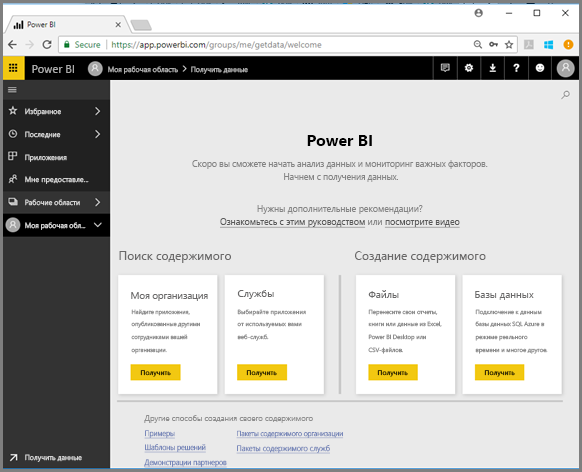

2. Последовательно выберите **Анализ розничной торговли — пример > Подключиться**.

    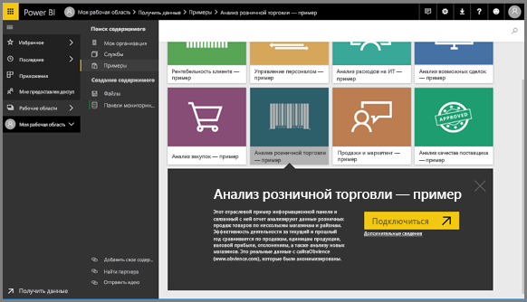

    Образец импортируется в службу Power BI, и откроется панель мониторинга. Наличие панелей мониторинга отличает службу Power BI от приложения Power BI Desktop. Образец также включает в себя отчет и набор данных, которые мы рассмотрим позднее.

    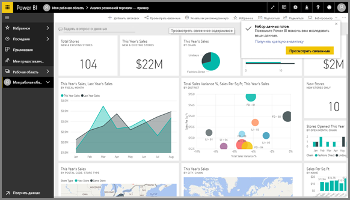

Посмотрите видео, в котором Аманда представит вам обзор интерфейса службы Power BI.  Затем сделайте то же самое, выполнив пошаговые инструкции, приведенные под видео.

<iframe width="560" height="315" src="https://www.youtube.com/embed/G26dr2PsEpk" frameborder="0" allowfullscreen></iframe>

## Просмотр содержимого (панелей мониторинга, отчетов, книг, наборов данных, рабочих областей, приложений)
Рассмотрим организацию основного содержимого (информационные панели, отчеты, наборы данных, книги). Содержимое отображается в контексте рабочей области. Пока у вас есть только одна рабочая область — **Моя рабочая область**. В ней хранится все ваше содержимое. Это своего рода личная песочница или рабочая область для хранения личного содержимого. Вы можете совместно использовать содержимое из своей рабочей области с коллегами. В разделе "Моя рабочая область" содержимое распределяется по 4 вкладкам: "Информационные панели", "Отчеты", "Книги" и "Наборы данных".

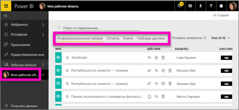

Выберите рабочую область в левой области навигации, после чего на холсте Power BI справа появятся вкладки для соответствующего содержимого (панели мониторинга, отчеты, книги, наборы данных).

Новый пользователь видит только одну рабочую область — **Моя рабочая область**.

На этих вкладках (которые также называются *представлениями содержимого*) приводятся сведения о содержимом и действия, которые можно с ним выполнять.  Например, на вкладке "Панели мониторинга" можно открыть панель мониторинга, поделиться содержимым, выполнить его поиск, создать, удалить, отсортировать содержимое и выполнить множество других действий.

Откройте панель мониторинга, выбрав ее имя.

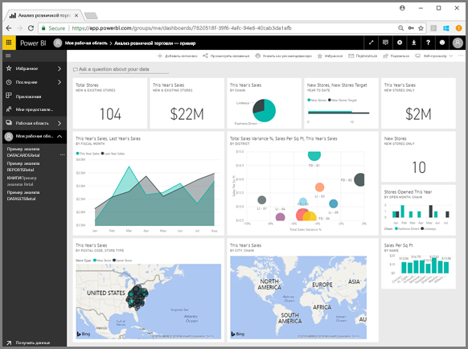

## Добавление панели мониторинга или отчета в избранное
**Избранное** позволяет быстро открывать самое важное для вас содержимое.  

1. Открыв панель мониторинга, щелкните **Добавить в избранное** в правом верхнем углу.
   
   
   
   Элемент **Добавить в избранное** изменится на **Удалить из избранного**, и значок звездочки станет желтым.
   
   

2. Чтобы увидеть список всего содержимого, добавленного в избранное, в левой области навигации выберите стрелку справа от пункта **Избранное**. Так как область навигации слева — это фиксированный элемент службы Power BI, список избранного доступен вам из любого раздела программы.
   
    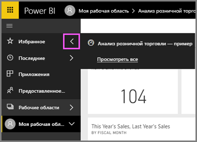
   
    Пока в избранном только один элемент. В избранное можно добавлять панели мониторинга, отчеты и приложения.  

1. Отметить панель мониторинга или отчет как избранное также можно на вкладке **Панели мониторинга** или **Отчеты** в рабочей области.  Откройте вкладку **Отчеты** и щелкните значок звездочки слева от имени отчета.
   
   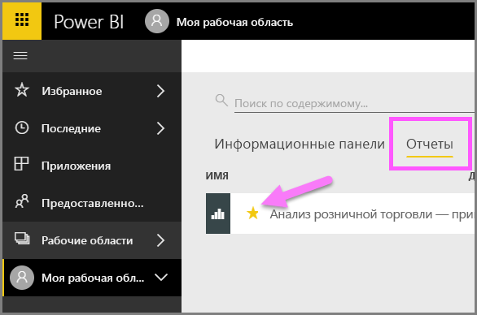

3. Откройте *область* **Избранное**, выбрав пункт **Избранное** в области навигации слева или щелкнув значок звездочки .
   
   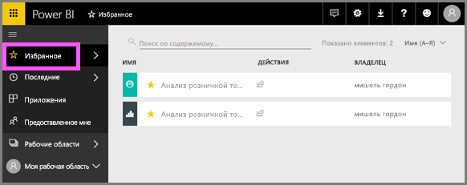
   
   Теперь в избранном два элемента: одна панель мониторинга и один отчет. Здесь вы можете искать и открывать содержимое, удалять его из избранного или делиться им с коллегами.

4. Выберите имя отчета, чтобы открыть его в редакторе отчетов.

    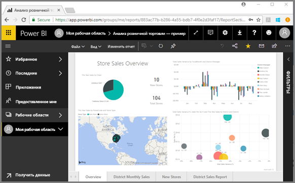

См. статью [Избранное](end-user-favorite.md) для получения дополнительных сведений.

## Доступ к последнему содержимому

1. Так же, как и с "Избранным", вы можете быстро открывать последнее содержимое откуда угодно в службе Power BI, нажав на стрелку рядом с меню **Последнее** в области навигации слева.

   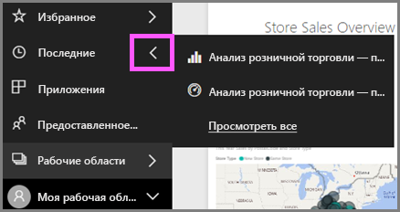

    Во всплывающем элементе выберите содержимое, чтобы открыть его.

2. Иногда нужно не открыть последнее содержимое, а просмотреть сведения о нем или выполнить другое действие, например поделиться им, экспортировать в Excel или запустить аналитику. В таком случае откройте область **Последние**, выбрав пункт **Последнее** или щелкнув соответствующий значок в области навигации слева. Если у вас несколько рабочих областей, в этом списке приводится содержимое из них всех.

   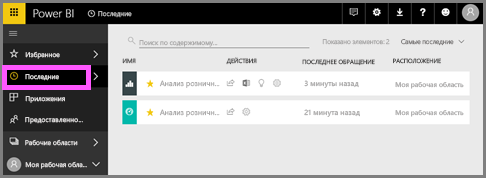

Дополнительные сведения см. в статье [Недавно просмотренное содержимое в службе Power BI](end-user-recent.md).

### Поиск и сортировка содержимого
Представление содержимого упрощает его поиск, фильтрацию и сортировку. Чтобы найти панель мониторинга, отчет или книгу, введите строку в области поиска. Power BI отфильтрует данные и покажет только содержимое, которое содержит строку поиска как часть названия.

Так как у вас только один образец, поиск и сортировка не требуются.  Но когда у вас много панелей мониторинга, отчетов, книг и наборов данных, эти функции очень полезны.

Вы также можете сортировать содержимое по имени или владельцу.  

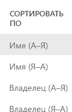

Дополнительные сведения см. в статье [Поиск и сортировка содержимого в Power BI](end-user-search-filter-sort.md).

## Очистка ресурсов
Завершив работу с этим кратким руководством, вы можете при необходимости удалить примеры панели мониторинга, отчета и набора данных "Анализ розничной торговли".

1. Откройте службу Power BI (app.powerbi.com) и войдите в нее.    
2. В панели навигации слева выберите **"Рабочие области" > "Моя рабочая область"**.  
    Видите желтую звездочку? Она показывает, что область является избранной.    
3. На вкладке **Панели мониторинга** щелкните значок **Удалить** в форме корзины напротив панели "Анализ розничной торговли".    

    

4. Выберите вкладку **Отчеты** и повторите действия по удалению для отчета "Анализ розничной торговли".
1. Выберите вкладку **Наборы данных** и повторите действия по удалению для набора данных "Анализ розничной торговли".

## Дальнейшие действия

> [!div class="nextstepaction"]
> [Режимы чтения и правки в службе Power BI](end-user-reading-view.md)