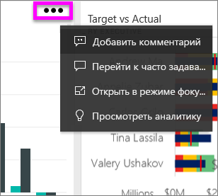
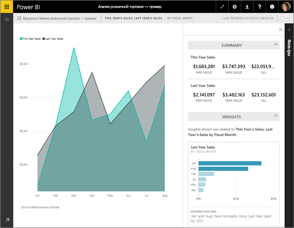
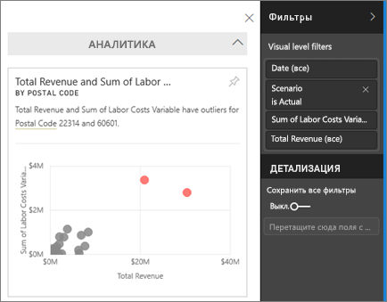
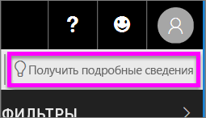
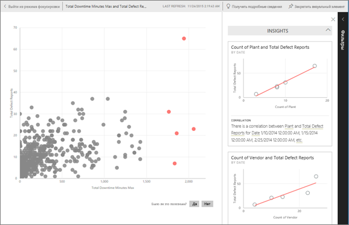

# Автоматическое создание аналитических сведений с помощью Power BI
Каждая плитка визуализации на панели мониторинга предоставляет возможности исследования данных. Щелкнув любую плитку, вы перейдете в отчет, где сможете фильтровать и сортировать наборы данных, использованные для отчета. Когда вы исследуете аналитические сведения, в Power BI выполняется поиск данных.

Краткая аналитика позволяет получить интересные интерактивные визуализации на основе имеющихся данных. Краткую аналитику можно выполнить для отдельной плитки панели мониторинга или даже для результатов предыдущей аналитики.

Функция аналитики основана на постоянно пополняемом [наборе усовершенствованных аналитических алгоритмов](end-user-insight-types.md), разработанных при сотрудничестве с подразделением Microsoft Research, которые мы продолжаем использовать, чтобы все больше людей могли анализировать данные новыми удобными способами.

## Запуск аналитики для плитки панели мониторинга
Когда вы выполняете аналитику для плитки панели мониторинга, Power BI использует для поиска только те данные, которые использовались для создания этой конкретной плитки. 

1. [Откройте панель мониторинга](end-user-dashboards.md).
2. Наведите указатель мыши на плитку. Щелкните многоточие (…) и выберите пункт **Просмотреть аналитические сведения**. 

    

3. Плитка откроется в [режиме фокусировки](end-user-focus.md) с карточками аналитики, которые отображаются с правой стороны.    
   
        
4. Вас заинтересовали эти сведения? Выберите карту анализа, чтобы ознакомиться с ними детально. Данные выбранного анализа отображаются слева, а справа отображаются новые карты анализа, основанные только на данных этого анализа.    

 ## Работа с карточками аналитики
   * Фильтровать визуализации.  Чтобы отобразились фильтры, в правом верхнем углу экрана выберите стрелку для развертывания панели "Фильтры".

     
   
   * Запустите аналитику для самой карточки аналитики. Часто это называют **связанными аналитическими сведениями**. В правом верхнем углу щелкните значок лампочки () или ссылку **Получить аналитику**.
     
     
     
     Результаты аналитики отображаются слева, а справа отображаются новые карточки, основанные только на данных этой аналитики.
     
     

Чтобы вернуться к первоначальному холсту аналитики, щелкните в верхнем левом углу действие **Выйти из режима фокусировки**.

## Рекомендации и устранение неполадок
- **Просмотр аналитики** не работает с DirectQuery — только с данными, отправленными в Power BI.
- **Просмотр аналитики** работает не со всеми типами плиток для панели мониторинга. Например, он недоступен для пользовательских визуальных элементов.<!--[custom visuals](end-user-custom-visuals.md)-->

## Дальнейшие действия
См. дополнительные сведения о доступных [типах краткой аналитики](end-user-insight-types.md).

