# Изменение размера страницы отчета
Из [предыдущих статьи и видео](../power-bi-report-display-settings.md) вы узнали о двух разных способах управления отображением страницы в отчетах Power BI: **Представление** и **Размер страницы**. Представление страницы и размер страницы доступны как в службе Power BI, так и в Power BI Desktop. Выглядят и действуют обе версии почти одинаково, но в этом руководстве мы используем только службу Power BI.

### Предварительные требования
- службе Power BI   
- [Пример отчета "Анализ розничной торговли"](../sample-retail-analysis.md)

## Во-первых, изменим параметры представления страницы

1. Откройте отчет в режиме чтения или редактирования, затем выберите вкладку отчета **Новые магазины**. По умолчанию эта страница отображается в режиме масштабирования **По размеру страницы**.  В этом случае страница отчета отображается по размеру страницы без полос прокрутки, однако при этом некоторые детали и заголовки могут стать слишком мелкими и неразборчивыми.

   
2. Убедитесь, что на холсте не выбраны визуализации. Выберите **Вид** и просмотрите параметры отображения.

   * В режиме чтения вы увидите следующее:

     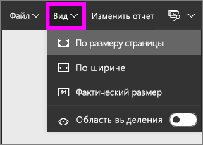
   * В режиме правки вы увидите следующее:

     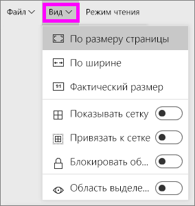

3. Давайте посмотрим, как будет выглядеть страница при использовании режима **Фактический размер**.

   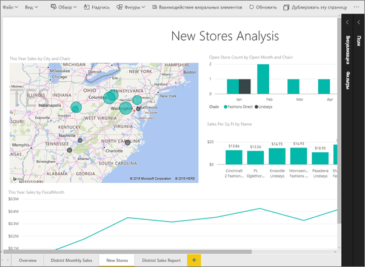

   Выглядит не очень. Панели мониторинга теперь содержит двойные полосы прокрутки.
4. Выберите режим **По ширине**.

   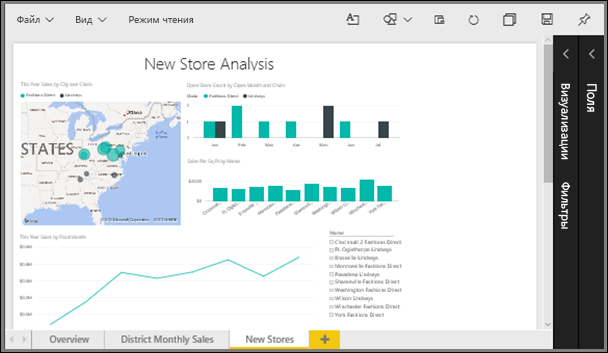

   Уже лучше. Одна полоса прокрутки еще осталась, но читать данные стало проще.

## Изменение представления по умолчанию для страницы отчета
Если вы являетесь *создателем* отчета, вы можете изменить представление по умолчанию для страниц отчета. Если отчет предоставляется другим пользователям, он будет открываться с настроенной вами страницы. *Потребители* отчета могут изменять представление, но не могут сохранить свой выбор, выйдя из отчета.

1. На странице отчета **Новые магазины** снова включите представление **Фактический размер**.

   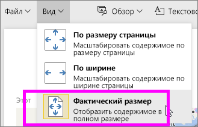

2. На странице **Продажи за месяц по региону** выберите режим представления **По ширине**.

3. На странице отчета **Обзор** сохраните значение представления по умолчанию.

4. Теперь сохраните отчет, выбрав **Файл > Сохранить**. Когда вы в следующий откроете этот отчет, страницы будут отображаться с новыми настройками представления. Давайте посмотрим.

   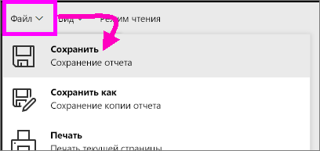
3. В верхней области навигации выберите имя текущей рабочей области, чтобы вернуться к ней.  

   
4. Выберите вкладку **Отчеты** и выберите тот же отчет ("Анализ розничной торговли").

    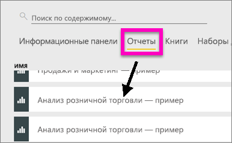
5. Откройте каждую страницу отчета, чтобы проверить новые настройки.

   

## Теперь давайте ознакомимся с параметром *размера страницы*
Параметры размера страницы доступны только в [режиме редактирования](../service-interact-with-a-report-in-editing-view.md), поэтому для их изменения вам нужны права на изменение отчета (режим *создателя*). Если вы подключены к любому из наших [примеров](../sample-datasets.md), вам предоставляются права *создателя* на эти отчеты.

1. В отчете [Анализ розничной торговли — пример](../sample-retail-analysis.md) откройте страницу "Ежемесячные продажи по району" в режиме правки.
2. Убедитесь, что на холсте не выбраны визуализации.  В области **Визуализации** выберите значок валика .
3. Выберите **Размер страницы** &gt; **Тип**, чтобы отобразить варианты размера страницы.

   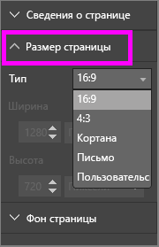
4. Выберите формат **Letter**.  На белой части холста останется только то содержимое, которое входит в область 816 x 1056 пикселей (формат Letter).

   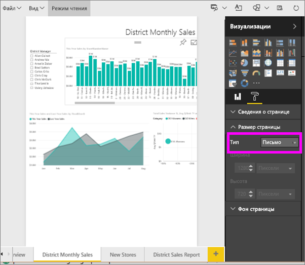
5. Выберите **Размер страницы** с соотношением сторон **16:9**.

   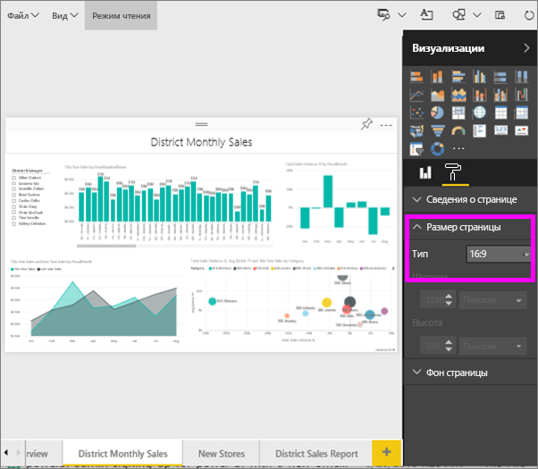

   Страница отчета будет отображаться в соотношении 16 (ширина) на 9 (высота). Чтобы узнать фактический используемый размер в пикселях, посмотрите на неактивные поля ширины и высоты (1280 x 720). Вокруг холста отчета много пустого пространства. Это связано с тем, что мы ранее задали режим **представления** "По ширине".
7. Попробуйте поработать с другими параметрами **размера страницы**.

## Сочетание настроек представления и размера страницы
Настройки представления в сочетании с размером страницы позволяют создать отчет, который будет хорошо выглядеть при предоставлении коллегам или встраивании в другое приложение.

В этом упражнении вы создадите страницу отчета, которая будет отображаться в приложении с пространством размером 500 пикселей в ширину и 750 пикселей в высоту.

На предыдущем шаге мы видели, что сейчас страница отчета отображается размером 1280 пикселей в ширину и 720 пикселей в высоту. В таком случае нам нужно выполнить много действий для изменения размера и реорганизации, чтобы все визуальные элементы отображались как следует.

1. Измените размер визуальных элементов и переместите их так, чтобы они вместились в такую часть текущего полотна, которая меньше его половины.

    
2. Выберите **Размер страницы** &gt; **Пользовательский**.
3. Установите для ширины значение 500, а для высоты — 750.

    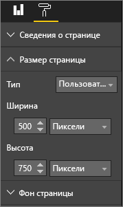
4. Настройте страницу отчета так, чтобы она выглядел наилучшим образом. Откорректируйте страницу, переключаясь между параметрами **Представление > Фактический размер** и **Представление > По размеру страницы**.

    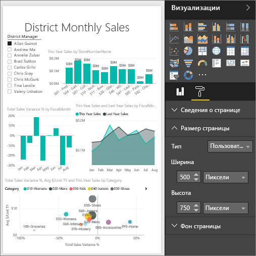

## Дальнейшие действия
[Создание пользовательской страницы ответов для Кортаны в Power BI](../service-cortana-answer-cards.md)

Назад к статье [Параметры отображения страницы в отчете Power BI](../power-bi-report-display-settings.md)

Появились дополнительные вопросы? [Ответы на них см. в сообществе Power BI.](http://community.powerbi.com/)
