# Просмотр отчетов в мобильных приложениях Power BI
Область применения:

|  |  |  |  |  |
|:--- |:--- |:--- |:--- |:--- |
| iPhone |iPad |Телефоны под управлением Android |Планшеты Android |Устройства под управлением Windows 10 |

Отчет Power BI — это интерактивное представление данных с визуальными элементами, которые отображают различные результаты и сведения, полученные из этих данных. Просмотр отчетов в мобильных приложениях Power BI — это последний шаг трехэтапной процедуры.

1. [Создание отчетов в Power BI Desktop](../../desktop-report-view.md). В Power BI Desktop можно даже [оптимизировать отчет для телефонов](mobile-apps-view-phone-report.md). 
2. Публиковать эти отчеты можно в службе Power BI [(https://powerbi.com)](https://powerbi.com) или на [Сервере отчетов Power BI](../../report-server/get-started.md)).  
3. После этого вы можете работать с отчетами в мобильных приложениях Power BI.

## Открытие отчета Power BI в мобильном приложении
Расположение отчетов Power BI в мобильном приложении зависит от места их получения. Они могут быть в расположении "Приложения", "Мне предоставлен доступ", "Рабочие области" (включая страницу "Моя рабочая область") или на сервере отчетов. Иногда получить отчет можно при помощи связанной панели мониторинга, а иногда они представлены в списке.

* На панели мониторинга коснитесь многоточия (...) в правом верхнем углу плитки и выберите команду **Открыть отчет**.
  
  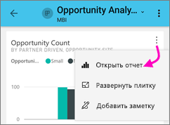
  
  Не на всех плитках можно открыть отчет. Например, плитки, созданные после ввода данных в поле вопросов и ответов, не открывают отчеты при касании. 
  
  На телефоне отчет открывается в альбомной ориентации, если он не [оптимизирован для просмотра на телефоне](mobile-reports-in-the-mobile-apps.md#view-reports-optimized-for-phones).
  
  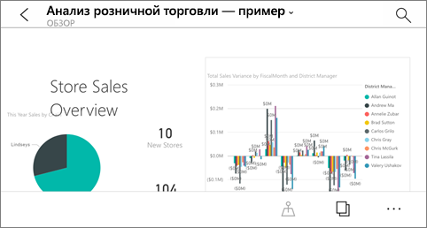

## Просмотр отчетов, оптимизированных для телефона
Можно создать макет отчета Power BI, оптимизированный для телефонов. Для страниц отчетов, оптимизированных для телефонов, добавлены новые возможности. Например, можно детализировать и сортировать визуальные элементы и получать доступ к [фильтрам, который добавил на страницу отчета автор отчета](mobile-apps-view-phone-report.md#filter-the-report-page-on-a-phone). Отчет откроется на телефоне со значениями, отфильтрованными в соответствии со значениями отчета, настроенными через веб-интерфейс, с отображенным сообщением о наличии на странице активных фильтров. Фильтры можно изменять прямо в телефоне.

В списке оптимизированный отчет отмечен специальным значком :

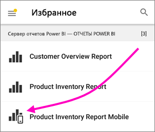

На телефоне такой отчет открывается в книжной ориентации.

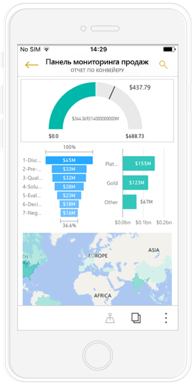

 Отчет может содержать ряд страниц, не оптимизированных для телефонов. В таком случае представление для каждой страницы будет переключаться с книжной в альбомную ориентацию.

Узнайте больше об [отчетах, оптимизированных для представления телефона](mobile-apps-view-phone-report.md).

## Использование срезов для фильтрации отчета
При создании отчетов в приложении Power BI Desktop или службе Power BI попробуйте [добавить на страницу отчета срезы](../../visuals/power-bi-visualization-slicers.md). Вы и ваши коллеги можете использовать их для фильтрации данных страницы в браузере и в мобильных приложениях. При просмотре отчета на телефоне вы можете видеть срезы и взаимодействовать с ними в альбомной ориентации, а также на странице, оптимизированной для книжной ориентации телефона. Если выбрать значение в срезе или фильтре в браузере, это значение будет установлено и при просмотре страницы в мобильном приложении. Вы увидите сообщение о наличии активных фильтров на странице.  

* Когда вы выбираете значение в срезе на странице отчета, фильтруются и другие визуальные элементы.
  
  
  
  На изображении ниже срез фильтрует гистограмму для отображения значений только за июль.

## Перекрестная фильтрация и выделение отчета
При выборе значения в визуальном элементе другие визуальные элементы не фильтруются. Связанные значения в других визуальных элементах выделяются.

* Коснитесь значения в визуальном элементе.
  
  
  
  При касании столбца "Large" в одном визуальном элементе выделяются связанные значения в других визуальных элементах. 

## Сортировка визуальных элементов на iPad или планшетном ПК
* Коснитесь диаграммы, многоточия (**…**), а затем коснитесь имени поля.
  
   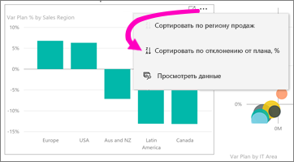
* Чтобы изменить порядок сортировки, снова коснитесь многоточия (**...**), а затем еще раз коснитесь того же имени поля.

## Увеличение и уменьшение детализации визуального элемента
Если автор отчета добавил в визуальный элемент возможность детализации, вы можете подробно просматривать значения в какой-то части этого элемента. Детализацию можно [добавить в визуальный элемент](../end-user-drill.md) в службе Power BI Desktop или Power BI. 

* Коснитесь и удерживайте определенный столбик или точку в визуальном элементе, чтобы отобразить всплывающую подсказку. Если в визуальном элементе доступна детализация, в нижней части подсказки будут стрелки. 
  
  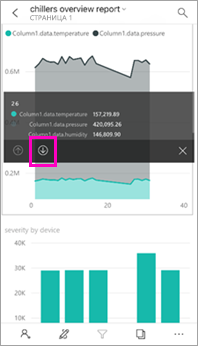

* Чтобы уменьшить детализацию, коснитесь в подсказке стрелки вверх.
  
  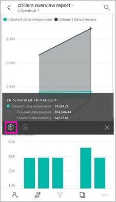

* Вы также можете детализировать все точки данных в визуальном элементе. Откройте его в режиме фокусировки и коснитесь значка обзора. Вы сможете выбрать показ всего следующего уровня либо развернуть текущий и следующий уровни.

   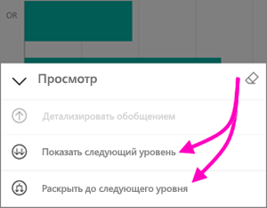

## Детализация с переходом между страницами

*Детализация* позволяет вам коснуться определенной части визуального элемента в Power BI и перейти на другую страницу отчета, отфильтрованную по выбранному значению. Автор отчета может задавать различные варианты детализации с переходом на разные страницы. В этом случае вы выбираете из них тот, который вам интересен. В следующем примере при касании значения в датчике можно выбрать детализацию **расходов по бизнес-сфере** или **планирования по бизнес-сфере**.

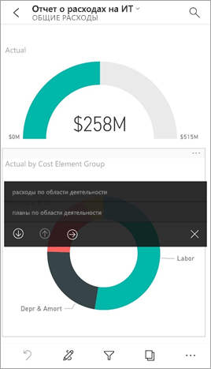

Чтобы вернуться в детализации на предыдущую страницу отчета, нажмите кнопку "Назад".

Читайте, как [добавить детализацию в Power BI Desktop](../../desktop-drillthrough.md).

## Отображение данных и копирование значений

Нажав многоточие (**...** ) в правом верхнем углу визуализации в мобильном отчете и выбрав **Show data** (Показать данные), можно отобразить данные, лежащие в основе визуализации.

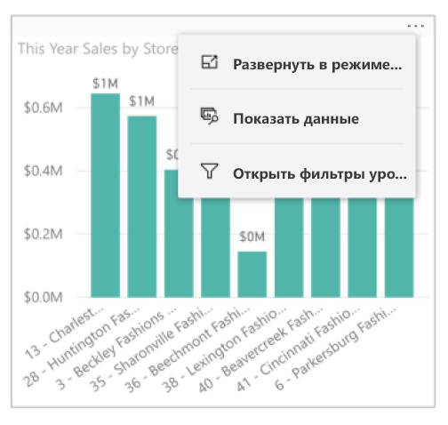

Долгое касание ячейки в отобразившейся таблице, отобразит собственное меню "Выделить и копировать", с помощью которого можно копировать данные из таблицы (или таблицу целиком).

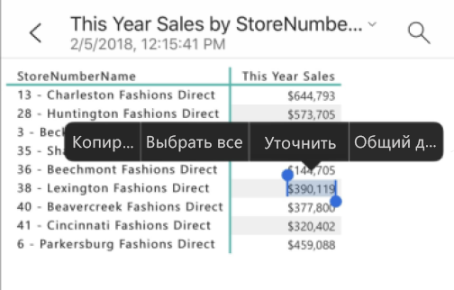

## Дальнейшие действия
* [Просмотр отчетов Power BI, оптимизированных для телефона, и взаимодействие с ними](mobile-apps-view-phone-report.md)
* [Создание отчетов, оптимизированных для мобильных приложений Power BI](../../desktop-create-phone-report.md)
* У вас появились вопросы? [Попробуйте задать вопрос в сообществе Power BI.](http://community.powerbi.com/)

