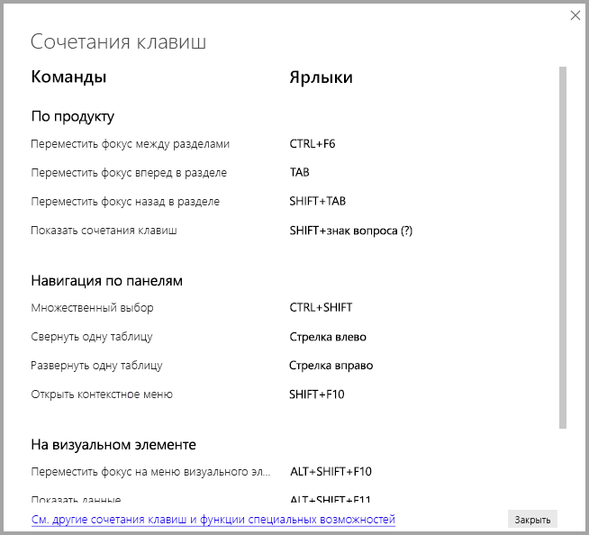
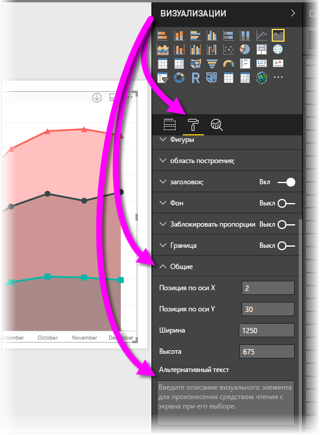

# Специальные возможности в отчетах Power BI Desktop
**Power BI Desktop** имеет функции, которые позволяют упростить использование отчетов **Power BI Desktop** и работу с ними людям с ограниченными возможностями. Эти функции включают возможность работать с отчетом, используя клавиатуру или средство чтения с экрана, фокусироваться на различных объектах на странице с помощью клавиши TAB и разумное использование меток в визуализации.

> [!NOTE]
> Эти специальные возможности доступны в **Power BI Desktop** с июня 2017 года и в последующих выпусках. Для будущих выпусков планируются дополнительные специальные возможности.
> 
> 

## Работа с отчетами Power BI Desktop с помощью клавиатуры или средства чтения с экрана
Начиная с выпуска **Power BI Desktop** за сентябрь 2017 г. вы можете нажимать клавишу **?**, чтобы отобразить окно с описанием специальных сочетаний клавиш, используемых в **Power BI Desktop**.

С улучшенными специальными возможностями вы можете работать с отчетом **Power BI Desktop** с помощью клавиатуры или средства чтения с экрана, используя следующие методы:

Вы можете **переключать фокус** между вкладками страницы отчета или объектами на открытой странице отчета с помощью клавиш **CTRL+F6**.

* Когда фокус находится на *вкладках страницы отчета*, используйте клавишу *TAB* или *клавиши со стрелками* для перемещения фокуса с одной страницы отчета на другую. Средство чтения с экрана читает вслух заголовок страницы отчета, если он в данный момент выбран. Чтобы загрузить страницу отчета, находящуюся в фокусе, используйте клавишу *ВВОД* или *ПРОБЕЛ*.
* Когда фокус находится на загруженной *странице отчета*, используйте клавишу *TAB*, чтобы смещать фокус на объекты на странице, в частности на текстовые поля, изображения, фигуры и диаграммы. Средство чтения с экрана зачитает тип объекта и предоставленное автором описание объекта. 

Вы можете нажать клавиши **ALT+SHIFT+F10** для перемещения фокуса на меню визуальных элементов.

Вы можете нажать клавиши **ALT+SHIFT+F11** для отображения доступной версии окна *Просмотр данных*.

Новые специальные сочетания клавиш добавлены, чтобы пользователи могли в полной мере пользоваться отчетами **Power BI Desktop** с помощью средства чтения с экрана и навигации с помощью клавиатуры.

## Советы по созданию доступных отчетов
Следующие советы помогут вам в создании более доступных отчетов **Power BI Desktop**.

* Для визуальных элементов **График**, **Диаграмма с областями**, **Комбинированная диаграмма**, а также **Точечная диаграмма** и **Пузырьковая диаграмма** включите маркеры и используйте различные *формы маркера* для каждой линии.
  
  * Для включения *меток* на панели **Визуализации** щелкните раздел **Формат**, разверните раздел **Фигуры**, а затем прокрутите вниз, чтобы найти переключатель **Метки**, и установите его в значение *Вкл.*
  * Затем выберите имена каждой линии (или области, если используете **диаграмму с областями**) в раскрывающемся списке в разделе **Фигуры**. Под раскрывающимся списком можно настроить многие аспекты метки, используемой для выбранной линии, включая ее форму, цвет и размер.
  
  
  
  * Благодаря использованию различных *форм меток* для каждой линии пользователям отчетов легче различать линии (или области).
* В дополнение к предыдущему пункту: не используйте цвет для передачи информации. Использование фигур в строках (метки, как описано выше) эффективнее.
* Выберите из коллекции *тему* с высокой контрастностью, удобную для людей, не различающих цвета, и импортируйте ее с помощью [функции предварительного просмотра **Theming**](desktop-report-themes.md) (Настройка темы).
* Для каждого объекта в отчете укажите *замещающий текст*. Таким образом пользователи отчета поймут, что представляет собой визуальный элемент (изображение, форма или текстовое поле), даже если они его не видят. Вы можете указать *замещающий текст* для любого объекта в отчете **Power BI Desktop**. Выберите объект (например, визуальный элемент, фигуру и т. д.) и на панели **Визуализации** выберите раздел **Формат**, разверните **Общие**, а затем прокрутите вниз и заполните текстовое поле **Замещающий текст**.
  
  
* Убедитесь, что текст отчета и фоновые цвета достаточно контрастны.
* Используйте легко читаемые размер текста и шрифта. Небольшой размер текста или шрифта, которые могут доставить трудности при чтении, бесполезны для обеспечения специальных возможностей.
* Включите заголовок, метки оси и данных во все визуальные элементы.

## Рекомендации и ограничения
В списке ниже описано несколько известных проблем и ограничений для специальных возможностей.

* JAWS поддерживается только в отчетах, просматриваемых в **службе Power BI**, включая все внедренные отчеты. Команда **Power BI Desktop** активно работает над поддержкой JAWS в отчетах, просматриваемых в **Power BI Desktop**.

## Дальнейшие действия
* [Использование тем отчетов в Power BI Desktop (предварительная версия)](desktop-report-themes.md)

