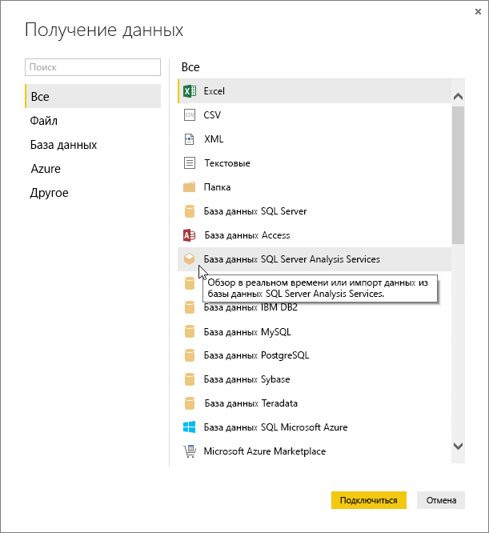
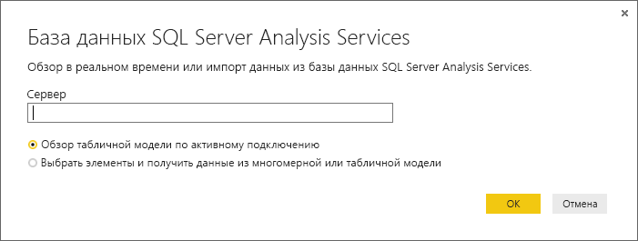
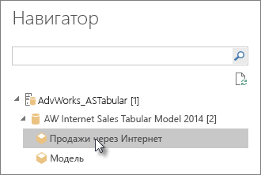
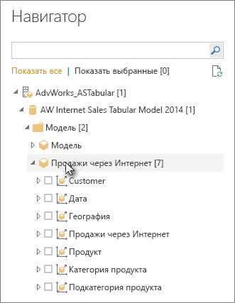
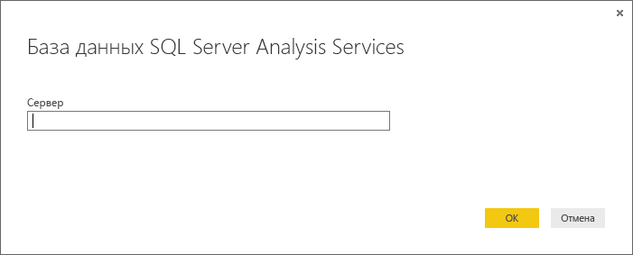

# Использование табличных данных служб Analysis Services в Power BI Desktop
Power BI Desktop предоставляет два способа подключения и получения данных из табличных моделей служб SQL Server Analysis Services: просмотр в режиме интерактивного подключения и выбор элементов и их импорт в Power BI Desktop.

Давайте рассмотрим это более подробно.

**Просмотр в режиме интерактивного подключения**. Когда используется интерактивное подключение, элементы в табличной модели или перспективе, такие как таблицы, столбцы и меры, отображаются в списке "Поля" Power BI Desktop. Средства расширенной визуализации и создания отчетности Power BI Desktop позволяют просматривать табличную модель новым, высокоинтерактивным способом.

В режиме интерактивного подключения данные из табличной модели не импортируются в Power BI Desktop. При взаимодействии пользователя с визуализацией Power BI Desktop запрашивает табличную модель и вычисляет отображаемые результаты. Пользователь всегда видит самые последние данные. Имейте в виду, табличные модели имеют высокий уровень безопасности. Какие именно элементы могут быть отображены в Power BI Desktop, определяется разрешениями для той табличной модели, к которой подключен пользователь.

Чтобы предоставить общий доступ к созданным в Power BI Desktop динамическим отчетам, необходимо опубликовать их на сайте Power BI. Чтобы опубликовать файл Power BI Desktop в режиме активного подключения к табличной модели на сайте Power BI, администратору следует установить и настроить локальный шлюз данных. Дополнительные сведения см. в статье [Локальный шлюз данных](service-gateway-onprem.md).

**Выбор элементов и их импорт в Power BI Desktop**. При таком режиме подключения можно выбрать в табличной модели или перспективе такие элементы, как таблицы, столбцы и меры, и загрузить их в модель Power BI Desktop. Для дальнейшего уточнения можно воспользоваться расширенным редактором запросов Power BI Desktop. Можно использовать возможности моделирования Power BI Desktop для дальнейшего моделирования данных. Между Power BI Desktop и табличной моделью интерактивное подключение не поддерживается. Далее вы можете автономно просматривать модель Power BI Desktop или опубликовать ее на вашем сайте Power BI.

## Подключение к табличной модели
1. В Power BI Desktop на вкладке **Главная** нажмите кнопку **Получить данные**.
   
   
2. Щелкните **База данных SQL Server Analysis Services**и затем нажмите кнопку **Подключиться**.
   
   
3. Введите имя сервера и выберите режим подключения. 
   
   
4. Этот шаг зависит от выбранного режима подключения:

* в режиме интерактивного подключения выберите в навигаторе табличную модель или перспективу.
  
  
* Если используется режим выбора элементов и получения данных, выберите в навигаторе табличную модель или перспективу. Далее для загрузки можно выбрать отдельные таблицы или столбцы. Чтобы сформировать данные до загрузки, нажмите кнопку "Изменить" — будет открыт редактор запросов. Когда все будет готово, нажмите кнопку загрузки для импорта данных в Power BI Desktop.

  

## Часто задаваемые вопросы
**Вопрос.** Нужен ли мне локальный шлюз данных?

**Ответ**. Это зависит от разных факторов. Если вы используете Power BI Desktop в режиме интерактивного подключения к табличной модели, но не планируете публикацию на своем сайте Power BI, шлюз не требуется. Если же вы планируете публиковать информацию на своем сайте Power BI, шлюз данных необходим, чтобы гарантировать безопасность связи между службой Power BI и вашим локальным сервером Analysis Services. Перед установкой шлюза поговорите со своим администратором сервера Analysis Services.

В режиме выбора элементов и получения данных вы импортируете данные табличной модели сразу в файл Power BI Desktop, поэтому шлюз не нужен.

**Вопрос**. В чем разница между интерактивным подключением к табличной модели из Power BI и подключением из Power BI Desktop?

**Ответ.** При активном подключении к табличной модели с сайта в службе Power BI к локальной базе данных Analysis Services вашей организации для безопасного обмена информацией требуется локальный шлюз данных. При интерактивном подключении к табличной модели из Power BI Desktop шлюз не требуется, так как и Power BI Desktop, и сервер Analysis Services, к которому выполняется подключение, работают локально в вашей организации. Однако шлюз необходим для публикации файла Power BI Desktop на вашем сайте Power BI.

**Вопрос**. Могу ли я после создания интерактивного подключения подключиться к другому источнику данных в том же файле Power BI Desktop?

**Ответ.** Нет. Вы не можете просматривать данные в режиме интерактивного подключения и подключиться к источнику данных другого типа в рамках одного файла. Если вы уже импортировали данные или подключились к другому источнику данных в файле Power BI Desktop, необходимо создать новый файл для просмотра данных в интерактивном режиме.

**Вопрос**. Могу ли я после создания интерактивного подключения редактировать модель или запрос в Power BI Desktop?

**Ответ**. Вы можете создать меры уровня отчета в Power BI Desktop, но при просмотре активных данных все остальные функции запросов и моделирования будут отключены.

**Вопрос**. Безопасно ли созданное интерактивное подключение?

**Ответ.** Да. Для подключения к серверу Analysis Services используются ваши текущие учетные данные Windows. При работе с данными в режиме интерактивного подключения вы не можете использовать базовые или сохраненные учетные данные ни в службе Power BI, ни в Power BI Desktop.

**Вопрос**. В навигаторе отображаются модель и перспектива. В чем разница?

**Ответ**. Перспектива — это конкретное представление табличной модели. Она может включать только отдельные таблицы, столбцы или меры в зависимости от того, какой именно анализ данных требуется. Табличная модель всегда содержит по меньшей мере одну перспективу, которая может включать все, что есть в модели. Если вы не уверены, что следует выбрать, обратитесь к вашему администратору.

## Изменение имени сервера после первого подключения
После создания файла Power BI Desktop с параметрами интерактивного подключения для просмотра данных может потребоваться перевести подключение на другой сервер. Например, если вы создали файл Power BI Desktop при подключении к серверу разработки, но перед публикацией в службе Power BI, вам необходимо подключиться к рабочему серверу.

1. Щелкните **Изменить запросы** на ленте.
   
   
2. Введите имя нового сервера.
   
   

