# Использование закладок для обмена аналитическими сведениями и создания историй в Power BI (предварительная версия)
С помощью **закладок** в Power BI вы можете сохранить текущие настройки представления страницы отчета, включая фильтрацию и состояние визуальных элементов, и вернуться к этому состоянию позже, просто выбрав сохраненную закладку. 

Вы также можете создать коллекцию закладок, расположить их в необходимом порядке и последовательно переходить к каждой закладке в презентации, чтобы выделить ряд аналитических сведений или привлечь внимание к истории о данных с помощью визуальных элементов и отчетов. 

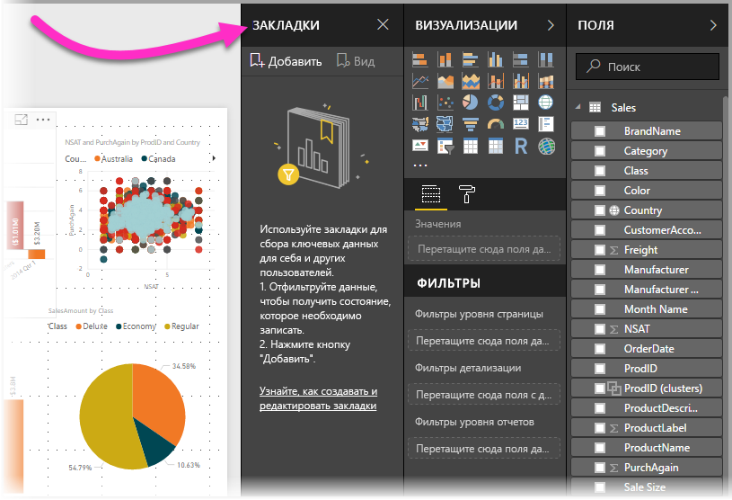

Существует множество вариантов применения закладок. Их можно использовать, чтобы отслеживать улучшение своих навыков создания отчетов (закладки удобно добавлять, удалять и переименовывать). Вы можете создавать закладки для построения презентации по типу PowerPoint с последовательным переходом по закладкам, таким образом представляя данные в отчете. Закладки также можно применять и другими способами, в зависимости от того, какие больше всего подходят вам.

### Включение предварительной версии функции "Закладки"
Новая функция **Закладки** доступна начиная с выпуска **Power BI Desktop** за **октябрь 2017 г.** и для отчетов с поддержкой закладок в **службе Power BI**. Чтобы включить эту предварительную версию функции, выберите **Файл > Параметры и настройки > Параметры > Предварительная версия функций** и установите флажок рядом с пунктом **Закладки**. После этого изменения приложение Power BI Desktop необходимо перезапустить.

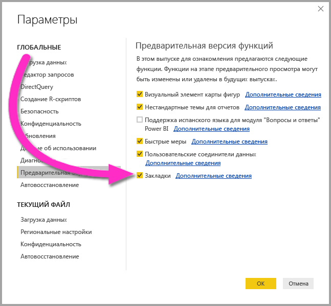

После этого изменения приложение **Power BI Desktop** необходимо перезапустить.

## Использование закладок
Чтобы использовать закладки, щелкните ленту **Представление** и установите флажок **Панель закладок**. 

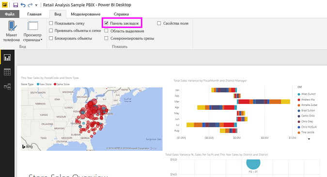

Когда создается закладка, вместе с ней сохраняются следующие элементы:

* текущая страница;
* Фильтры
* Срезы
* порядок сортировки;
* расположение при детализации;
* видимость объекта, настраиваемая с помощью панели **выбора**;
* режим фокусировки или режим **В центре внимания** для любого видимого объекта.

Сейчас в закладках не сохраняется состояние перекрестного выделения. 

Настройте вид страницы отчета для отображения в закладке. Когда вы упорядочите страницу отчета и визуальные элементы нужным образом, на панели **Закладки** щелкните **Добавить**, чтобы добавить закладку. 

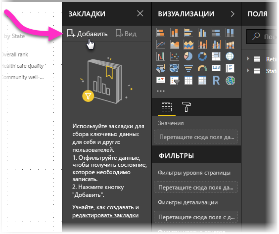

В **Power BI Desktop** будет создана закладка с универсальным именем. Вы можете легко *переименовать*, *удалить* или *обновить* закладку. Для этого щелкните многоточие рядом с ее именем и выберите действие в отобразившемся меню.

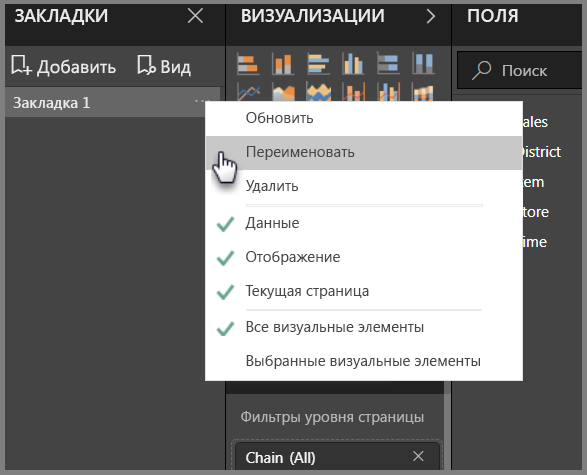

Когда закладка будет создана, для ее отображения просто щелкните закладку на панели **Закладки**. 

## Упорядочивание закладок
По мере создания закладок может оказаться, что они не всегда создаются в том порядке, в котором должны отображаться для аудитории. Это не проблема. Вы можете легко изменить порядок закладок.

Просто перетаскивайте их на панели **Закладки**, чтобы изменить порядок, как показано на следующем рисунке. Желтая строка между закладками указывает на расположение перетаскиваемой закладки.

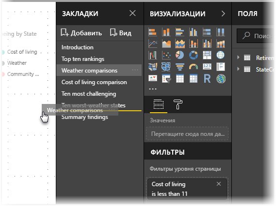

Порядок закладок может быть важным, если используется функция закладок **Представление**, описанная в следующем разделе.

## Представление закладок в виде слайд-шоу
Если необходимо показать свою коллекцию закладок в определенном порядке, на панели **Закладки** можно выбрать **Представление**, чтобы начать слайд-шоу.

При использовании режима **Представление** обратите внимание на несколько возможностей.

1. Имя закладки отображается в строке заголовка закладки в нижней части холста.
2. В строке заголовка закладки есть кнопки со стрелками для перемещения между следующей или предыдущей закладками.
3. Вы можете выйти из режима **Представление**, нажав кнопку **Выход** на панели **Закладки** или щелкнув **X** в строке заголовка закладки. 

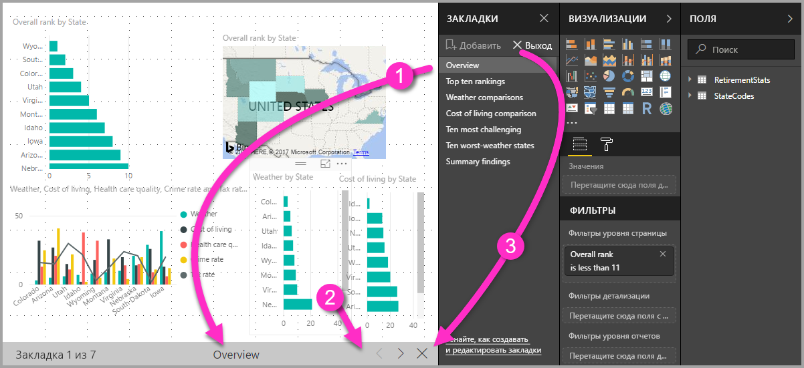

При работе в режиме **Представление** вы можете закрыть панель **Закладки** (щелкнув X на этой панели), чтобы предоставить дополнительное пространство для презентации. Также в режиме **Представление** все визуальные элементы являются интерактивными и доступны для перекрестного выделения, как и в других случаях взаимодействия с ними. 

## Видимость — использование панели выбора
С выпуском функции закладок также представлена новая панель **выбора**. Панель **выбора** содержит список всех объектов на текущей странице и позволяет выбрать объект и указать, является ли он видимым. 

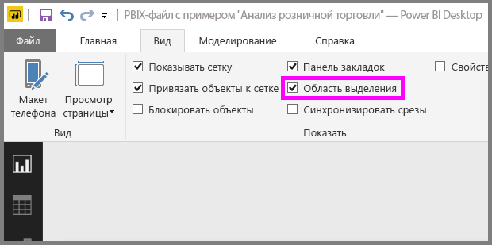

С помощью панели **выбора** вы можете выбрать объект. Кроме того, вы можете определить, нужно ли отображать ли объект сейчас, щелкнув значок в виде глаза справа от визуального элемента. 

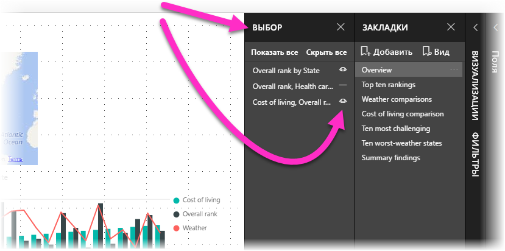

При добавлении закладки также сохраняется состояние видимости каждого объекта на основе его настроек на панели **выбора**. 

Важно помнить, что **срезы** по-прежнему используются для фильтрации страницы отчета, независимо от того, являются ли они видимыми. Таким образом, вы можете создавать различные закладки с разными настройками срезов и создавать совершенно разные представления (отражающие разные аналитические сведения) одной страницы отчета в нескольких закладках.

## Закладки для фигур и изображений
Вы также можете связывать фигуры и изображения с закладками. Если используется эта функция, при выборе объекта отобразится закладка, связанная с этим объектом. 

Чтобы назначить закладку для объекта, выберите объект, а затем на панели **Форматировать фигуру** щелкните **Ссылка**, как показано на следующем рисунке.

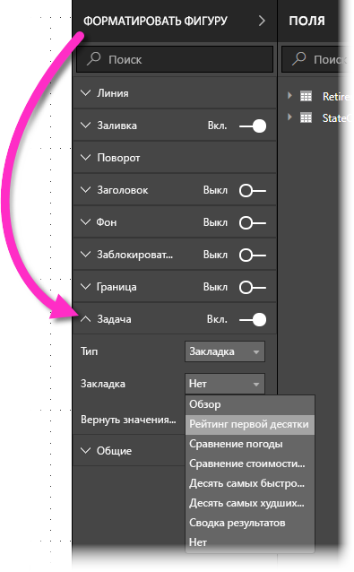

Когда вы перетащите ползунок **Ссылка** в положение **Вкл.**, вы сможете выбрать тип объекта: ссылка или закладка. Выбрав закладку, можно указать, с какой из закладок связан объект.

С помощью закладок, связанных с объектами, можно выполнять много разных действий. Можно создать наглядное оглавление на странице отчета или предоставить различные представления (например, шаблоны визуализации) одних и тех же сведений, просто щелкнув объект.

При работе в режиме редактирования для перехода по ссылке можно использовать сочетание "CTRL + щелчок". Если вы работаете в другом режиме, просто щелкните объект, чтобы перейти по ссылке. 

## Использование функции "В центре внимания"
Вместе с закладками в выпуске также представлена функция **В центре внимания**. Функция **В центре внимания** позволяет привлечь внимание к определенной диаграмме, например при отображении закладок в режиме **Представление**.

Давайте сравним режим **В центре внимания** с режимом **фокусировки**, чтобы увидеть, чем они отличаются.

1. В режиме **фокусировки** можно развернуть один визуальный объект на весь холст, щелкнув значок **режима фокусировки**.
2. В режиме **В центре внимания** можно выделить один визуальный элемент в его исходном размере, при этом другие визуальные элементы на странице станут почти прозрачными. 

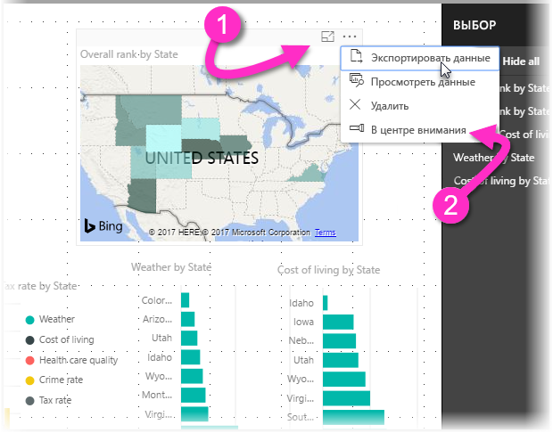

Если щелкнуть значок **фокусировки** визуального элемента на предыдущем изображении, страница будет выглядеть так:

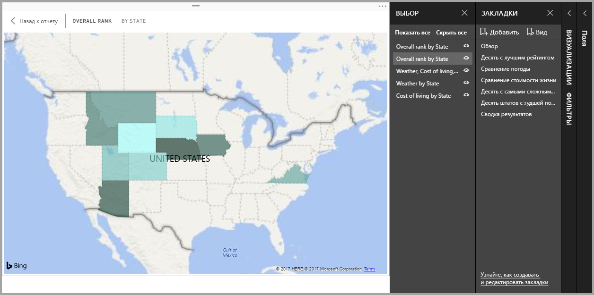

Если же в меню, которое открывается при выборе многоточия, для визуального элемента выбрать пункт **В центре внимания**, страница будет выглядеть, как на рисунке ниже:

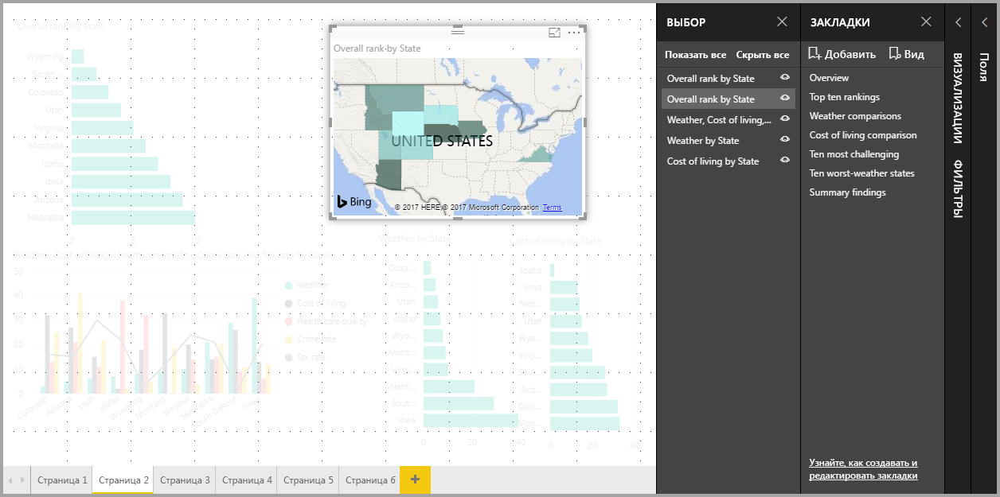

Если при добавлении закладки выбран один из режимов (режим фокусировки или "В центре внимания"), он сохранится в закладке.

## Закладки в службе Power BI
Если вы публикуете в **службе Power BI** отчет хотя бы с одной закладкой, вы сможете просматривать эти закладки и взаимодействовать с ними в **службе Power BI**. Чтобы функция закладок стала доступна в **службе Power BI**, в каждом публикуемом отчете необходимо создать по крайней мере одну закладку перед публикацией.

Если закладки доступны в отчете, можно выбрать **Представление > Область выделения** или **Представление > Панель закладок**, чтобы отобразить каждую панель.

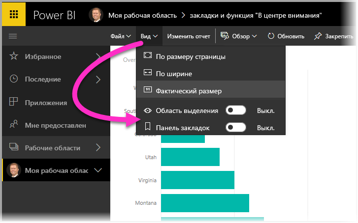

В **службе Power BI** **панель закладок** работает так же, как в **Power BI Desktop**, включая возможность выбора **представления** для отображения закладок по порядку в виде слайд-шоу.

Обратите внимание, что для перехода между закладками необходимо использовать серую строку заголовка закладки, а не черные стрелки. Черные стрелки используются для перемещения по страницам отчета.

## Рекомендации и ограничения
К предварительному выпуску функции **Закладки** применяется ряд ограничений и рекомендаций.

* Пользовательские визуальные элементы не работают с закладками, если эти элементы используются в качестве *источника* фильтра. Если вы примените пользовательские визуальные элементы для фильтрации элементов на странице (например, срез "Клавиши") и вернетесь на эту страницу с помощью закладки, страница может быть отфильтрована, но в пользовательском визуальном элементе не отобразятся данные о фильтрации страницы. 
* Состояние перекрестного выделения для панели отчета *не* сохраняется при создании закладки. 
* Если на страницу отчета добавить визуальный элемент после создания закладки, он будет отображаться в состоянии по умолчанию. Это также означает, что, если добавить срез на страницу с созданными ранее закладками, срез останется в состоянии по умолчанию.
* Перемещение визуальных элементов после создания закладки будет отражаться в закладке. 
* Чтобы закладки стали доступны в **службе Power BI**, публикуемый в ней отчет *должен* содержать по крайней мере одну закладку. Это обязательное требование для каждого публикуемого отчета.
* Так как закладки доступны только в предварительной версии, этот компонент не доступен в [**Power BI Desktop для сервера отчетов**](report-server/quickstart-create-powerbi-report.md).

## Дальнейшие действия
Дополнительные сведения о похожих функциях или функциях, которые взаимодействуют с закладками, см. в следующих статьях.

* [Использование детализации в Power BI Desktop](desktop-drillthrough.md)
* [Отображение плитки панели мониторинга или визуального элемента отчета в режиме фокусировки](service-focus-mode.md)

