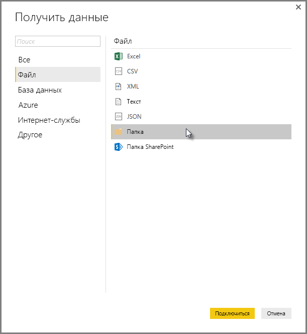
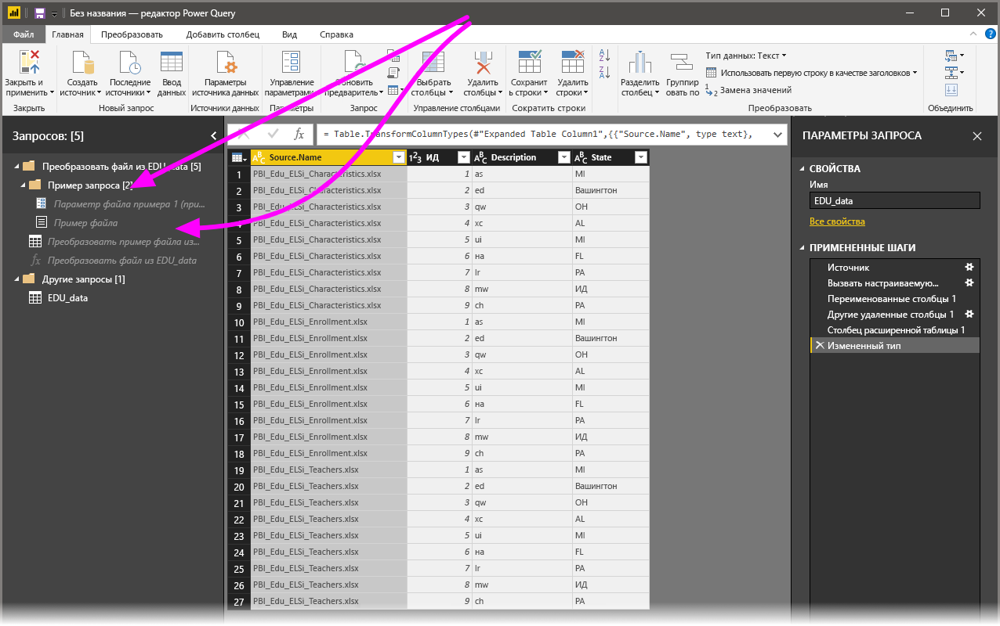

# Объединение двоичных файлов в Power BI Desktop
Один из самых эффективных способов импортировать данные в **Power BI Desktop** — это объединить нескольких файлов с одинаковыми схемами в одну логическую таблицу. В выпуске **Power BI Desktop** за ноябрь 2016 г. (и последующих выпусках) этот популярный способ стал еще более удобным и функциональным. В этой статье описывается, как его использовать.

Чтобы запустить объединение двоичных файлов из одной и той же папки, последовательно выберите **Получить данные > Файл > Папка**.

## Как объединение двоичных файлов выполнялось раньше
До выпуска **Power BI Desktop** за ноябрь 2016 г. можно было объединять определенные типы файлов с помощью преобразования **Объединить двоичные данные**. Но такой подход связан с рядом ограничений.

* Преобразования для каждого отдельного файла не учитывались до объединения файлов в одну таблицу. Следовательно, файлы нужно было часто объединять, а затем отфильтровывать *значения заголовков*, используя фильтрацию строк в процессе редактирования.
* Преобразование **Объединить двоичные данные** использовалось только для *текстовых* файлов и *CSV*-файлов. Его нельзя было применять с другими поддерживаемыми форматами: книгам Excel, JSON-файлам и т. п.

Пользователи просили сделать операцию **объединения двоичных файлов** интуитивно понятной, поэтому мы оптимизировали преобразование.

## Как объединение двоичных файлов выполняется сейчас
**Power BI Desktop** теперь управляет **объединением двоичных файлов** более эффективно. Для начала вам нужно выбрать преобразование **Объединить двоичные данные**. Это можно сделать на вкладке **Главная** ленты **редактора запросов** или непосредственно в столбце.

Преобразование **Объединить двоичные данные** теперь выполняется так.

* Преобразование **Объединить двоичные данные** анализирует каждый входной файл и определяет подходящий для использования формат (например, *текст*, *книга Excel* или файл *JSON*).
* Преобразование позволяет выбрать из первого файла определенный объект для извлечения (например, *книгу Excel*).
  
  
* Далее в процессе **объединения двоичных файлов** автоматически выполняется следующее:
  
  * Создается пример запроса, который выполняет все требуемые действия по извлечению в одном файле.
  * Создается *функциональный запрос*, который параметризует входные данные (файл или двоичные данные) в *экземпляр запроса*. Чтобы изменения в экземпляре запроса отражались в функциональном запросе, оба запроса связываются.
  * *Функциональный запрос* применяется к исходному запросу с использованием входных двоичных данных (например, к запросу *папки*). Таким образом этот запрос применяется к входным двоичным данным каждой строки, а затем полученные в результате извлечения данные разворачиваются как столбцы верхнего уровня.
    
    

Новый механизм позволяет легко **объединить двоичные данные** (файлы) в указанной папке, если они имеют одинаковый тип и структуру (как, например, одинаковые столбцы).

Кроме того, теперь можно легко применить дополнительные действия преобразования или извлечения, просто изменив автоматически созданный *экземпляра запроса*. Вам не нужно дублировать эти действия в *функциональном запросе*. Все изменения в *экземпляре запроса* автоматически создаются в связанном *функциональном запросе*.

## Дальнейшие действия
В Power BI Desktop можно подключаться к данным самых разных видов. Дополнительные сведения об источниках данных см. в перечисленных ниже статьях.

* [Начало работы с Power BI Desktop](desktop-getting-started.md)
* [Источники данных в Power BI Desktop](desktop-data-sources.md)
* [Формирование и объединение данных в Power BI Desktop](desktop-shape-and-combine-data.md)
* [Подключение к CSV-файлам в Power BI Desktop](desktop-connect-csv.md)   
* [Ввод данных непосредственно в Power BI Desktop](desktop-enter-data-directly-into-desktop.md)   

