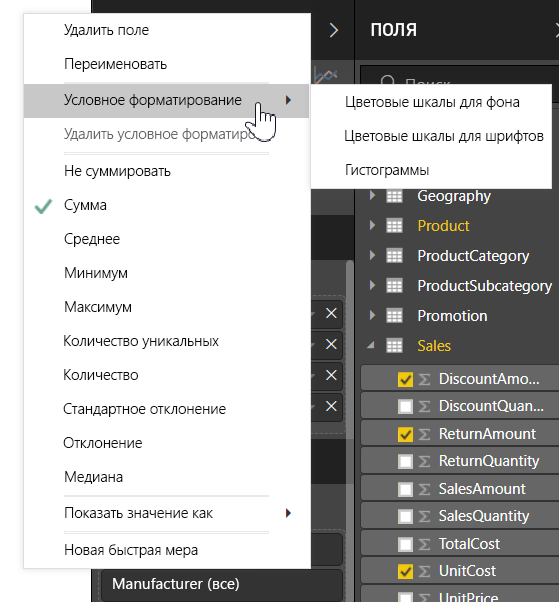
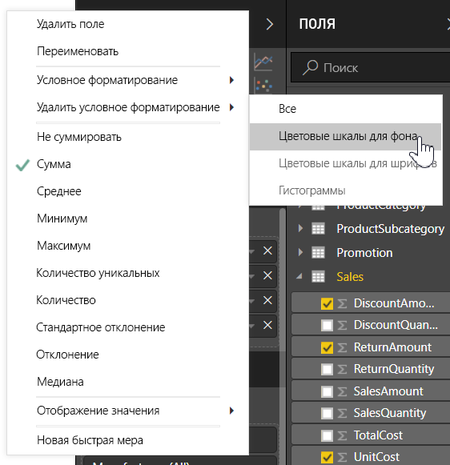
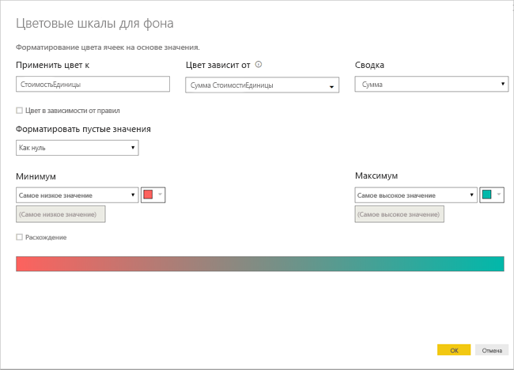
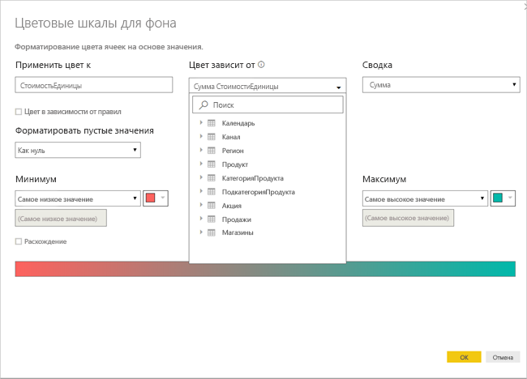
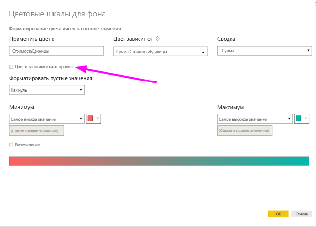
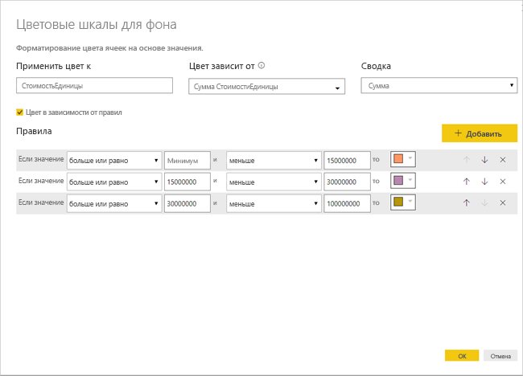
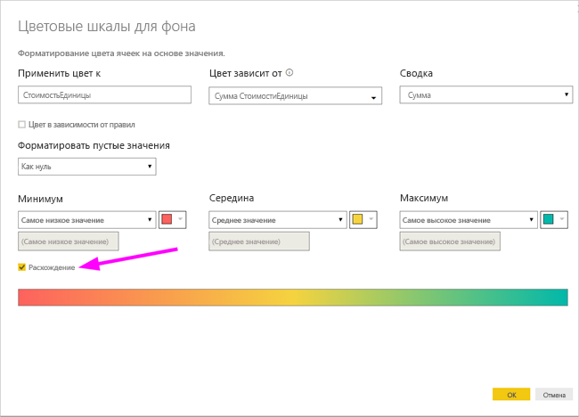
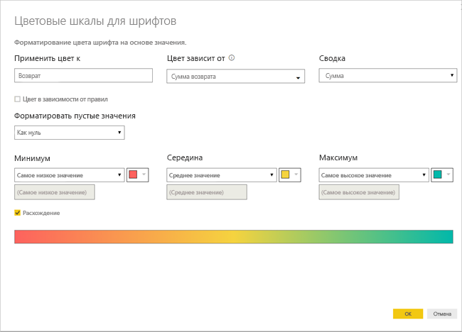
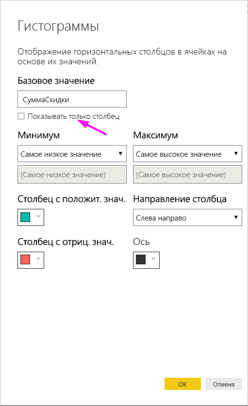
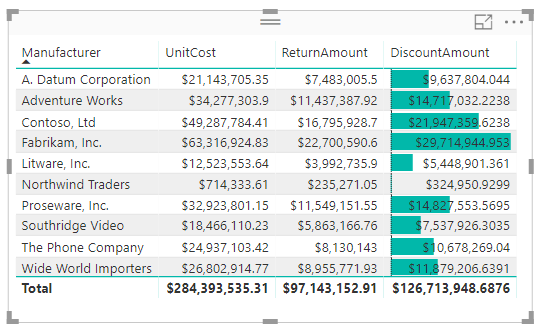

# Условное форматирование в таблицах 
С помощью условного форматирования в таблицах можно задать настраиваемые цвета ячеек на основе значений ячеек либо на основе других значений или полей, в том числе использовать градиент цветов. Значения ячеек также могут отображаться с гистограммами. 

Чтобы получить доступ к условному форматированию, в Power BI Desktop на панели **Визуализации** в разделе **Поля** в области **Значения** щелкните стрелку вниз рядом со значением, которое нужно отформатировать (или щелкните поле правой кнопкой мыши). Условное форматирование можно изменять только для полей из области **Значения** в разделе **Поля**.

В следующих разделах описывается каждый из этих трех параметров условного форматирования. К одному столбцу таблицы могут применяться один или несколько параметров.

> [!NOTE]
> При применении к таблице условное форматирование переопределяет любые пользовательские стили таблиц, примененные к ячейкам с условным форматированием.

Чтобы удалить условное форматирование из визуализации, повторно щелкните правой кнопкой мыши поле, выберите пункт **Удалить условное форматирование**, а затем выберите тип удаляемого форматирования.

## Цветовые шкалы для фона

Если выбрать **Условное форматирование**, а затем — **Цветовые шкалы для фона**, появляется представленное ниже диалоговое окно.

Чтобы выбрать в модели данных поле, от которого будут зависеть цвета, задайте его в качестве значения поля **Цвет зависит от**. Кроме того, можно указать тип агрегирования для выбранного поля с помощью значения **Обобщение**. Окрашиваемое поле указывается в поле **Применить цвет к**. Условное форматирование можно применять к текстовым полям и полям дат, если в качестве основы выбрано числовое значение.

Чтобы использовать отдельные значения цвета для заданных диапазонов значений, установите флажок **Цвет в зависимости от правил**. Чтобы использовать цветовой спектр, оставьте флажок **Цвет в зависимости от правил** снятым. 

### Цвет в зависимости от правил

Если установлен флажок **Цвет в зависимости от правил**, можно ввести один или несколько диапазонов значений, для каждого из которых задан цвет.  Каждый диапазон значений начинается с условия *Если значение*. Кроме того, для него задаются условие *и* и цвет.

Ячейки таблицы, содержащие значения из определенного диапазона, окрашиваются заданным цветом. На приведенном ниже рисунке определены три правила.

Пример таблицы теперь выглядит так:

### Минимальное и максимальное значения

Вы можете настроить значения *Минимум* и *Максимум* и соответствующие цвета. Установив флажок **Расхождение**, дополнительно можно настроить *центральное* значение.

Пример таблицы теперь выглядит так:

## Цветовые шкалы для шрифтов

Если выбрать **Условное форматирование**, а затем — **Цветовые шкалы для шрифтов**, появляется представленное ниже диалоговое окно. Оно похоже на диалоговое окно **Цветовые шкалы для фона**, но в нем меняется цвет шрифта, а не цвет фона ячейки.

Пример таблицы теперь выглядит так:

## Гистограммы

Если выбрать **Условное форматирование**, а затем — **Гистограммы**, появляется представленное ниже диалоговое окно. 

По умолчанию флажок **Показывать только столбец** снят, поэтому в ячейке таблицы отображаются как столбец, так и фактическое значение.

Если флажок **Показывать только столбец** установлен, в ячейке таблицы отображается только столбец.

