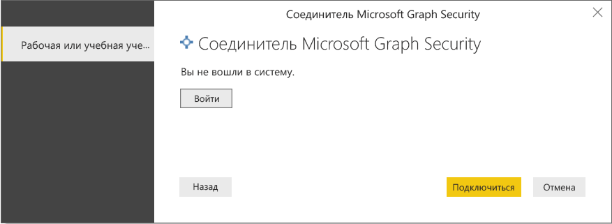
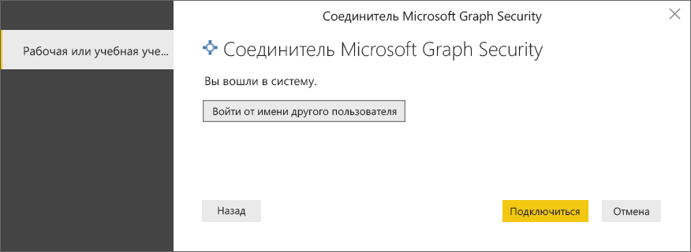
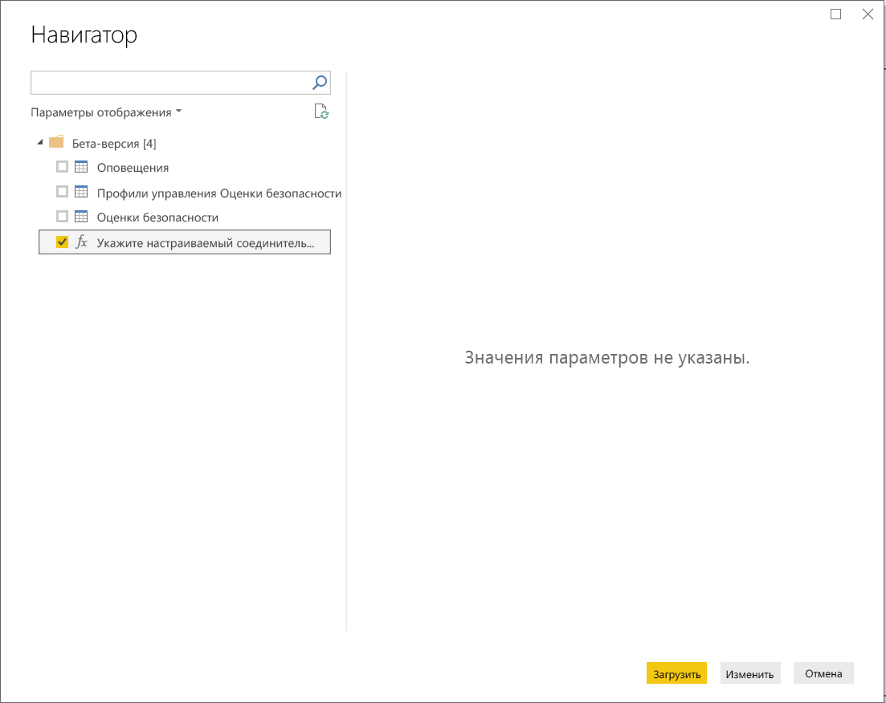
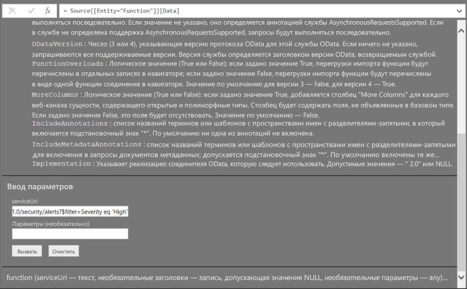

# Подключение к Microsoft Graph Security в Power BI Desktop

Power BI Desktop можно использовать для подключения к API Microsoft Graph Security с помощью соединителя Microsoft Graph Security для Power BI. Это даст вам возможность создавать панели мониторинга и отчеты, позволяющие получить ценную информацию относительно связанных с безопасностью [оповещений](https://docs.microsoft.com/graph/api/resources/alert?view=graph-rest-1.0) и [оценок безопасности](https://docs.microsoft.com/graph/api/resources/securescores?view=graph-rest-beta). [API Microsoft Graph Security](https://aka.ms/graphsecuritydocs) объединяет [несколько решений по обеспечению безопасности](https://aka.ms/graphsecurityalerts) Майкрософт и партнеров корпорации экосистемой для упрощения корреляции оповещений, доступа к обширной контекстной информации и упрощения автоматизации. Это позволяет организациям быстро анализировать и предпринимать действия во всех своих продуктах безопасности при одновременном снижении затрат и сложности создания и поддержки нескольких интеграций.

## Предварительные требования для подключения с помощью соединителя Microsoft Graph Security

* Чтобы использовать соединитель Microsoft Graph Security, необходимо иметь *явное* согласие администратора клиента Azure Active Directory (AD), входящее в состав [требований проверки подлинности Microsoft Graph Security](https://aka.ms/graphsecurityauth). Это согласие требует наличия идентификатора приложения и имени соединителя Microsoft Graph Security для Power BI, которые также можно найти на [портале Azure](https://portal.azure.com):

   | Свойство | Значение |
   |----------|-------|
   | **Имя приложения** | `MicrosoftGraphSecurityPowerBIConnector` |
   | **Идентификатор приложения** | `cab163b7-247d-4cb9-be32-39b6056d4189` |
   |||

   Чтобы дать согласие для соединителя, администратор клиента Azure AD может выполнить любые следующие действия:

   * [Предоставить согласие администратора клиента для приложений Azure AD](https://docs.microsoft.com/azure/active-directory/develop/v2-permissions-and-consent).

   * Во время первого запуска приложение может запрашивать согласие администратора клиента Azure AD через [интерфейс согласия приложения](https://docs.microsoft.com/azure/active-directory/develop/application-consent-experience).
   
* Учетная запись пользователя, использованная для входа при подключении с помощью соединителя Microsoft Graph Security для Power BI, должна быть членом роли администраторов с ограниченными правами чтения безопасности в Azure AD (читатель безопасности или администратор безопасности). Выполните действия в разделе [Назначение ролей Azure AD пользователям](https://docs.microsoft.com/graph/security-authorization#assign-azure-ad-roles-to-users). 

## Использование соединителя Microsoft Graph Security

Выполните следующие действия, чтобы использовать соединителя **Microsoft Graph Security**.

1. Выберите пункты **Получить данные —> Дополнительно...** на ленте **Главная** в Power BI Desktop.
2. Слева выберите категорию **Веб-службы**.
3. Щелкните  **Microsoft Graph Security (бета-версия)**.

    
    
4. В появившемся окне **Microsoft Graph Security** выберите версию API Microsoft Graph для запроса. Варианты: 1.0 и бета-версия.

    
    
5. Войдите в свою учетную запись Azure Active Directory при появлении запроса. Эта учетная запись должна иметь роль **Читатель безопасности**, как упоминалось в разделе "Необходимые условия" выше.

    
    
6. Если вы являетесь администратором клиента **и** еще не предоставили согласие для приложения соединителя Microsoft Graph Security для Power BI, как гласят предварительные требования, вы увидите следующее диалоговое окно. Выберите вариант **Предоставить согласие от лица организации**.

    
    
7. После входа вы увидите следующее окно, означающее, что вход выполнен успешно. Нажмите кнопку **Подключиться**.

    
    
8. После успешного подключения окно **Навигатор** выглядит следующим образом, отображая сущности, такие как оповещения и т. д., доступные в [API Microsoft Graph Security](https://aka.ms/graphsecuritydocs) для версии, выбранной на предыдущих шагах. Выберите сущности, чтобы импортировать и использовать их в **Power BI Desktop**. Нажмите кнопку **Загрузить** для получения представления результатов, описанного на шаге 10.

   
    
9. Если вы хотите сделать расширенный запрос к API Microsoft Graph Security, выберите функцию **Указать пользовательский URL-адрес Microsoft Graph Security для фильтрации результатов**. Это позволит вам осуществлять запрос [OData.Feed](https://docs.microsoft.com/power-bi/desktop-connect-odata) к API Microsoft Graph Security с необходимыми разрешениями для доступа к API.

   > [!NOTE]
   > Пример serviceUri, используемого ниже: `https://graph.microsoft.com/v1.0/security/alerts?$filter=Severity eq 'High'`. См. раздел [Поддерживаемые параметры запроса ODATA Graph](https://docs.microsoft.com/graph/query-parameters) для построения запросов фильтрации, заказа или получения большинства последних результатов.

   
    
   При выборе функции **Invoke** функция OData.Feed вызывает API, который открывает редактор запросов, где можно отфильтровать и уточнить набор данных, которые вы хотите использовать, а затем загрузить уточненный набор данных в Power BI Desktop.

10. На следующем рисунке показано окно результатов для сущностей Microsoft Graph Security, которые вы запросили.

   
    

Теперь вы можете работать с импортированной из соединителя Microsoft Graph Security информацией в приложении Power BI Desktop: создавать визуальные элементы и отчеты, а также подключать и импортировать прочие сведения, например книги Excel, базы и любые другие источники данных.

## Дальнейшие действия
* Ознакомьтесь с примерами и шаблонами Power BI с помощью этого соединителя в [репозитории примеров по Microsoft Graph Security для Power BI на GitHub](https://aka.ms/graphsecuritypowerbiconnectorsamples).

* Ознакомьтесь с пользовательскими сценариями и дополнительными сведениями в [записи блога о соединителе Microsoft Graph Security для Power BI](https://aka.ms/graphsecuritypowerbiconnectorblogpost).

* В Power BI Desktop можно подключаться к данным самых разных видов. Дополнительные сведения об источниках данных см. в перечисленных ниже статьях.

    * [Что такое Power BI Desktop?](desktop-what-is-desktop.md)
    * [Источники данных в Power BI Desktop](desktop-data-sources.md)
    * [Формирование и объединение данных в Power BI Desktop](desktop-shape-and-combine-data.md)
    * [Подключение к данным Excel в Power BI Desktop](desktop-connect-excel.md)
    * [Ввод данных непосредственно в Power BI Desktop](desktop-enter-data-directly-into-desktop.md)
