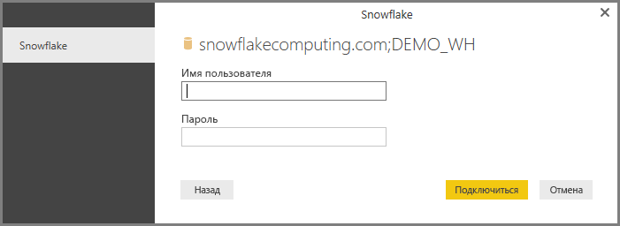

# Подключение к Snowflake в Power BI Desktop
В Power BI Desktop вы можете подключиться к хранилищу вычислительных ресурсов **Snowflake**, чтобы использовать его так же, как и любой другой источник данных в Power BI Desktop. 

> [!NOTE]
> Также *необходимо* установить **драйвер ODBC Snowflake** на компьютерах, использующих соединитель **Snowflake**, с помощью архитектуры, которая соответствует установке **Power BI Desktop** (32-разрядной или 64-разрядной). Просто щелкните следующую ссылку и [скачайте соответствующий драйвер ODBC Snowflake](http://go.microsoft.com/fwlink/?LinkID=823762).
> 
> 

## Подключение к хранилищу вычислительных ресурсов Snowflake
Для подключения к хранилищу вычислительных ресурсов **Snowflake** на вкладке **Главная** на ленте в Power BI Desktop выберите **Получить данные**. В области слева выберите категорию **База данных**. Отобразится пункт **Snowflake**.

В появившемся окне **Snowflake** введите или вставьте в поле имя хранилища вычислительных ресурсов Snowflake и нажмите кнопку **ОК**. Обратите внимание, что можно **импортировать** данные непосредственно в Power BI или использовать **DirectQuery**. Вы можете ознакомиться с дополнительными сведениями об [использовании DirectQuery](desktop-use-directquery.md).

При появлении запроса укажите имя пользователя и пароль.

> [!NOTE]
> Если указаны имя пользователя и пароль для определенного сервера **Snowflake**, Power BI Desktop будет использовать те же учетные данные при последующих попытках подключения. Эти учетные данные можно изменить, последовательно выбрав элементы **Файл > Параметры и настройки > Параметры источника данных**.
> 
> 

После успешного подключения откроется окно **Навигатор**, содержащее данные, доступные на сервере. Из них вы можете выбрать один или несколько элементов для импорта и использования в **Power BI Desktop**.

Вы можете **загрузить** выбранную таблицу, после чего таблица будет целиком перемещена в **Power BI Desktop**. Или же можно **изменить** запрос — в таком случае откроется **редактор запросов**, с помощью которого можно отфильтровать и уточнить набор нужных вам данных, а затем загрузить уточненный набор данных в **Power BI Desktop**.

## Дальнейшие действия
В Power BI Desktop можно подключаться к данным самых разных видов. Дополнительные сведения об источниках данных см. в перечисленных ниже статьях.

* [Что такое Power BI Desktop?](desktop-what-is-desktop.md)
* [Источники данных в Power BI Desktop](desktop-data-sources.md)
* [Формирование и объединение данных в Power BI Desktop](desktop-shape-and-combine-data.md)
* [Подключение к данным Excel в Power BI Desktop](desktop-connect-excel.md)   
* [Ввод данных непосредственно в Power BI Desktop](desktop-enter-data-directly-into-desktop.md)   

