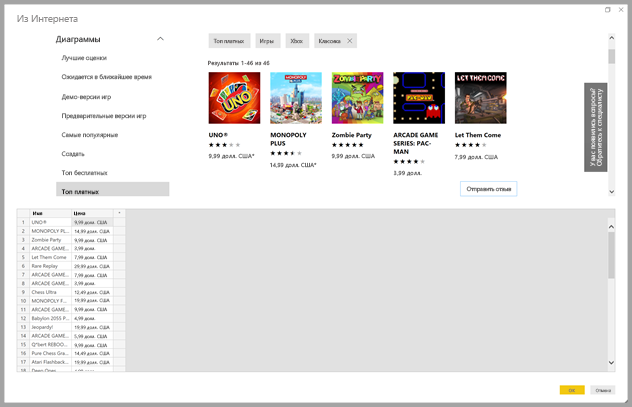
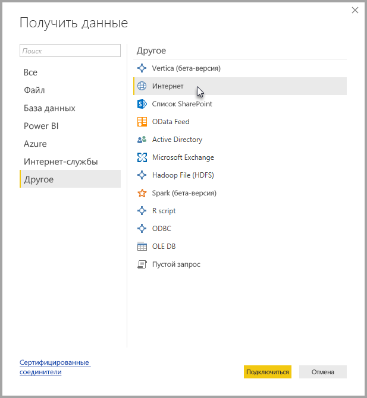
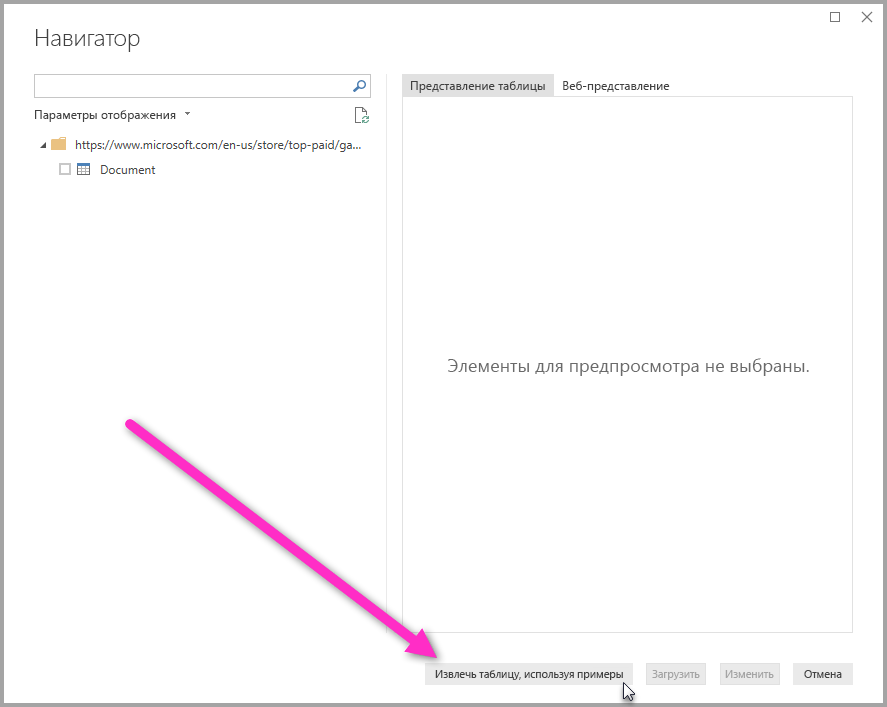
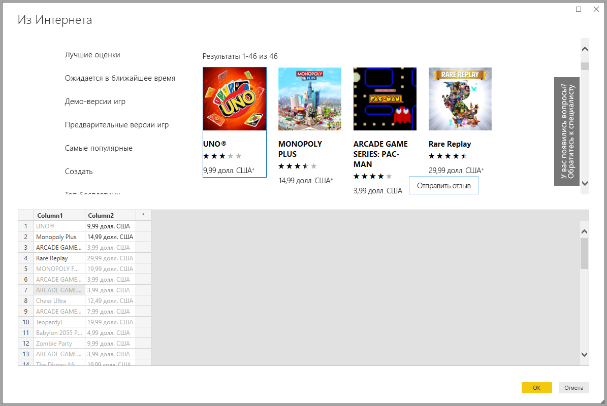
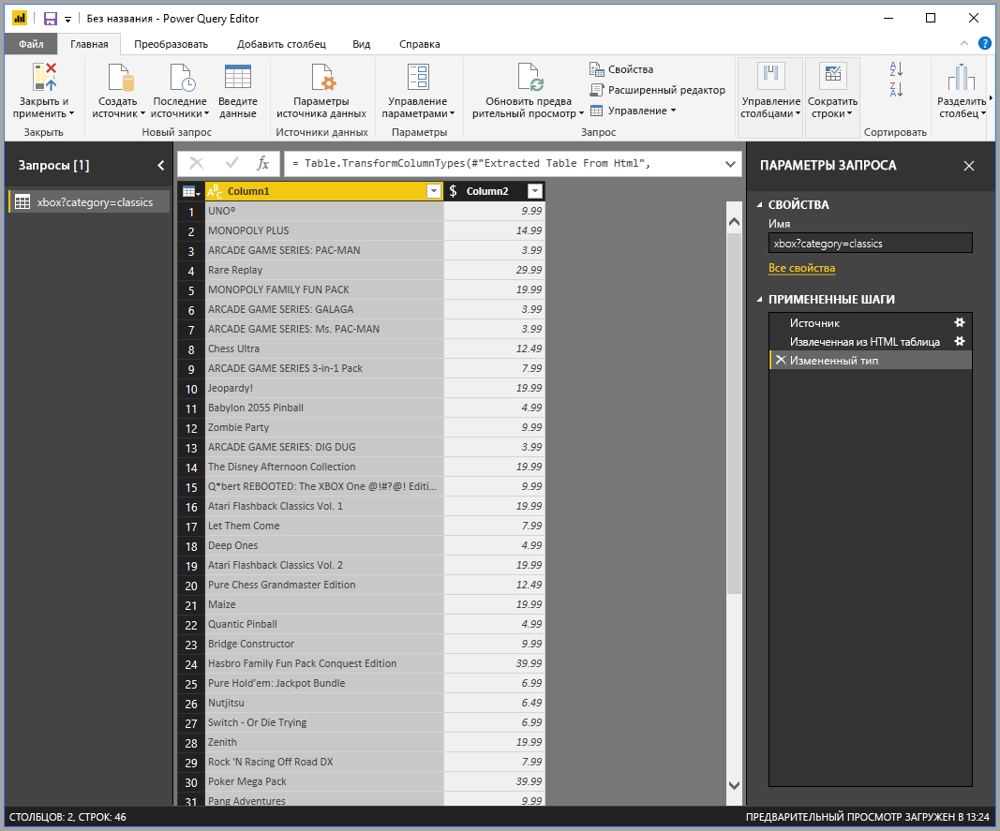

# Получение данных из веб-страницы по образцу

Функция получения данных из веб-страницы позволяет легко извлекать данные из веб-страниц и импортировать их в **Power BI Desktop**. Но данные на веб-страницах редко представлены в аккуратных и простых для расшифровки таблицах, и получение данных может оказаться сложной задачей, даже если сама страница выглядит хорошо структурированной и понятной. 

Теперь у вас есть решение. Функция **получения данных из Интернета по образцу** позволяет вам "объяснить" **Power BI Desktop**, какие данные нужно извлечь, предоставив в диалоговом окне соединителя образец этих данных, то есть один или несколько примеров, на основе которых служба соберет со страницы другие сходные данные. Это решение позволяет извлекать из веб-страниц данные любого типа, в том числе табличного *и* нетабличного формата. 

## Использование функции получения данных из Интернета по образцу

Чтобы использовать **получение данных из Интернета по образцу**, выберите **Получить данные** в меню вкладки **Главная**. В появившемся окне выберите **Другие** в списке категорий на панели слева, а затем выберите **Интернет**.

После этого введите URL-адрес той веб-страницы, из которой вы хотите извлечь данные. В этой статье мы продемонстрируем работу этого соединителя на примере веб-страницы Microsoft Store. 

Если вы хотите параллельно выполнять эти операции самостоятельно, скопируйте [URL-адрес хранилища Microsoft](https://www.microsoft.com/en-us/store/top-paid/games/xbox?category=classics), который мы используем в этой статье:

    https://www.microsoft.com/en-us/store/top-paid/games/xbox?category=classics

Когда вы щелкнете **ОК**, откроется диалоговое окно **Навигатор** со всеми таблицами, которые были автоматически обнаружены на этой веб-странице. В представленном ниже примере таблицы не найдены, но в нижней части страницы есть кнопка **Извлечь таблицу, используя примеры**, которая позволит вам задать образец данных.

Щелкните **Extract table using examples** (Извлечь таблицу, используя примеры), чтобы открыть интерактивное окно просмотра содержимого веб-страницы, где вы можете ввести примеры значений для извлекаемых данных. 

В нашем примере мы извлекаем *имя* и *цену* для каждой игры на странице. Достаточно указать для каждого столбца пару примеров значений, представленных на странице, как показано на следующем рисунке. Сразу после ввода этих образцов **Power Query** (это базовая технология, которая извлекает данные из веб-страниц) получает возможность извлечь данные, соответствующие шаблону, применяя интеллектуальные алгоритмы извлечения информации.

> Примечание. Предложения значений включают только значения, длина которых равна 128 символам или меньше.

Если нас полностью устраивают данные, извлеченные из веб-страницы, нужно выбрать **ОК** для перехода к **редактору запросов**, где можно применить к данным дополнительные преобразования или обработку, например объединить их с другими источниками данных.

Теперь вы можете создать на основе этих данных визуальные элементы или иначе использовать их в отчетах **Power BI Desktop**.

## Дальнейшие действия
В **Power BI Desktop** можно подключаться к данным самых разных видов. Дополнительные сведения об источниках данных см. в перечисленных ниже статьях.

* [Добавление столбца по образцу](desktop-add-column-from-example.md)
* [Подключение к веб-странице](desktop-connect-to-web.md)
* [Источники данных в Power BI Desktop](desktop-data-sources.md)
* [Формирование и объединение данных в Power BI Desktop](desktop-shape-and-combine-data.md)
* [Подключение к данным Excel в Power BI Desktop](desktop-connect-excel.md)   
* [Подключение к CSV-файлам в Power BI Desktop](desktop-connect-csv.md)   
* [Ввод данных непосредственно в Power BI Desktop](desktop-enter-data-directly-into-desktop.md)   

