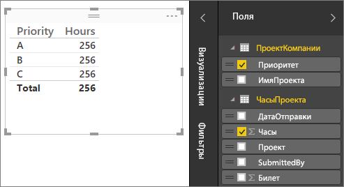
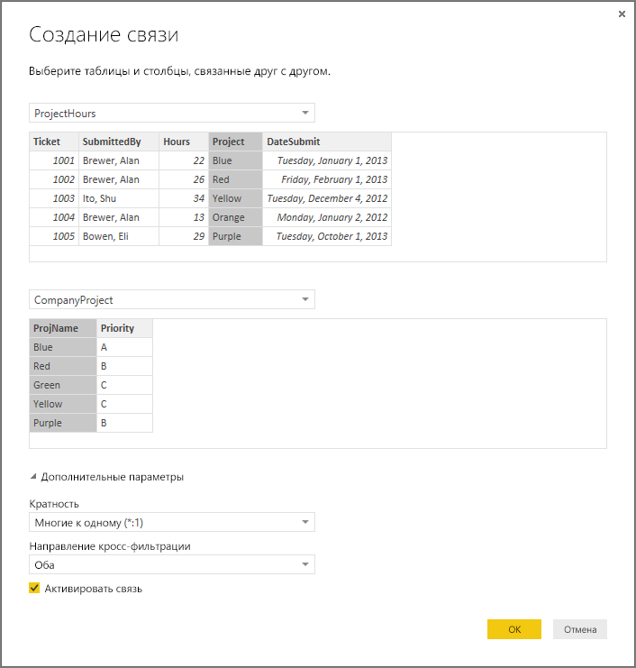
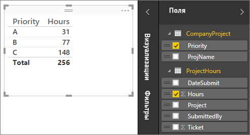
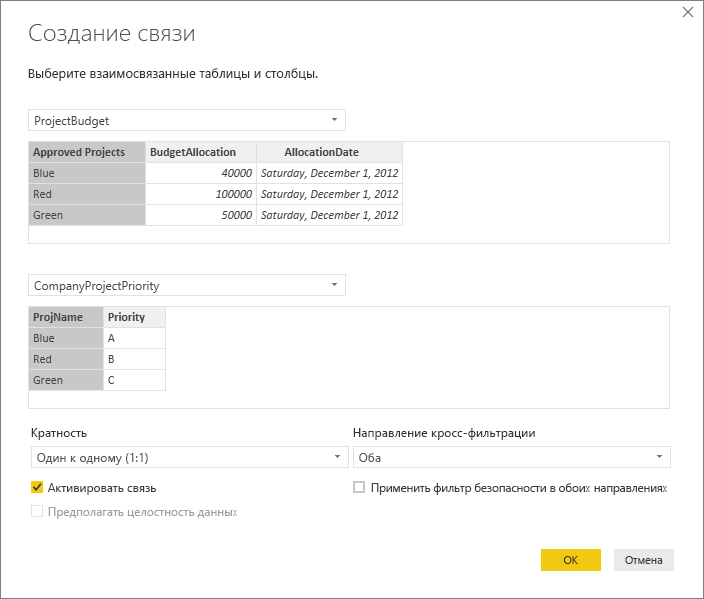
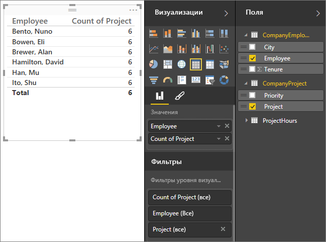
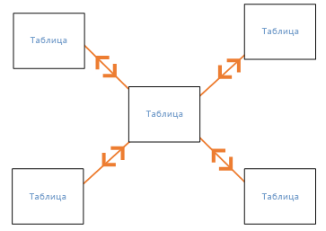
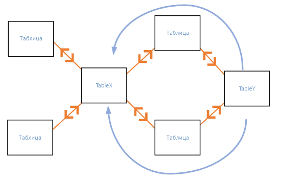
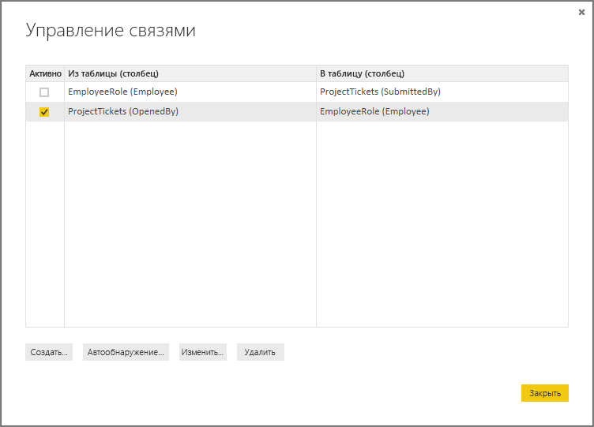
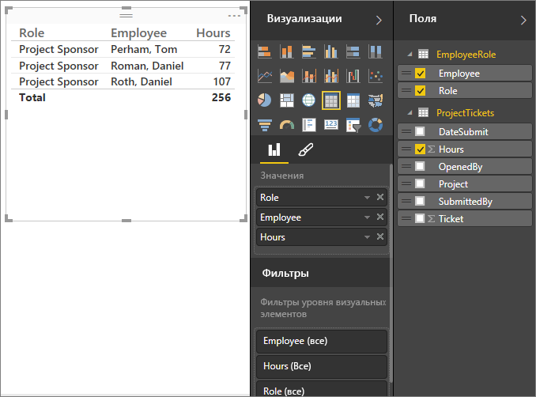
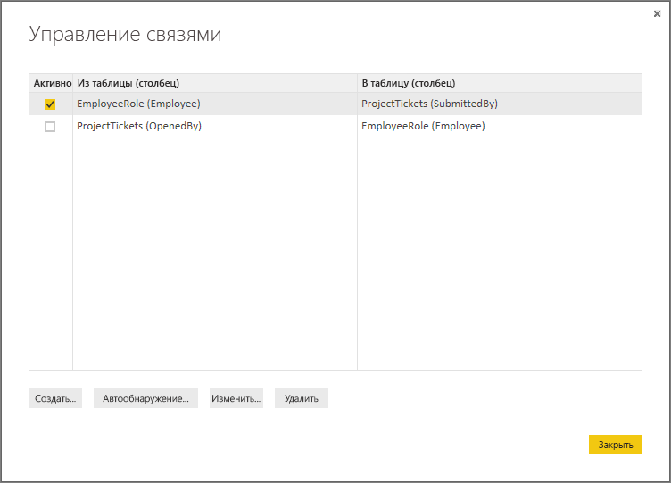

# Создание связей и управление ими в Power BI Desktop
При импорте нескольких таблиц вам, скорее всего, потребуется провести анализ данных из них всех. Связи между этими таблицами необходимы, чтобы точно вычислить результаты и отобразить правильные сведения в отчетах. Power BI Desktop значительно упрощает создание таких связей. Фактически в большинстве случаев вам не нужно ничего делать — функция автообнаружения сделает все автоматически. Однако в некоторых случаях может потребоваться создать связи вручную или внести некоторые изменения в полученные связи. В любом случае очень важно понимать связи в Power BI Desktop, а также способы их создания и изменения.

## Автообнаружение при загрузке
Если вы одновременно запрашиваете несколько таблиц, при загрузке данных Power BI Desktop автоматически попытается найти и создать связи. Свойства "Кратность", "Направление кроссфильтрации" и "Активная" задаются автоматически. Power BI Desktop анализирует имена столбцов в запрашиваемых таблицах, чтобы определить, существуют ли потенциальные связи. Если это так, эти связи создаются автоматически. Если Power BI Desktop не может определить соответствие с высоким уровнем достоверности, он не создаст связи автоматически. Вы по-прежнему можете использовать диалоговое окно "Управление связями" для создания и изменения связей.

## Создание связи с помощью автообнаружения
На вкладке **Главная** щелкните **Управление связями** \> **Автообнаружение**.

## Создание связи вручную
1. На вкладке **Главная** щелкните **Управление связями** \> **Создать**.
2. В диалоговом окне **Создание связи** в раскрывающемся списке первой таблицы выберите таблицу, а затем выберите столбец, который требуется использовать в связи.
3. В раскрывающемся списке второй таблицы сначала выберите другую таблицу для связи, а затем выберите нужный столбец и нажмите кнопку **ОК**.

По умолчанию Power BI Desktop автоматически настраивает свойства "Кратность" (направление), "Направление кроссфильтрации" и активность для новой связи, но при необходимости вы можете их изменить. Дополнительные сведения см. в разделе "Основные сведения о дополнительных параметрах" далее в этой статье.

Если ни в одной из таблиц, выбранных для связи, нет уникальных значений, появится сообщение об ошибке *Один из столбцов должен содержать уникальные значения*. По крайней мере одна из таблиц, участвующих в связи, *должна* иметь уникальный список ключевых значений. Это стандартное требование для любых реляционных баз данных. 

Устранить эту проблему можно несколькими способами.

* Используйте функцию "Удалить повторяющиеся строки", чтобы получить столбец с уникальными значениями. Недостаток такого подхода в том, что при удалении повторяющихся строк часть данных теряется, хотя часто на дублирование ключей (строк) есть причины.
* Добавьте промежуточную таблицу, состоящую из списка отдельных ключевых значений модели, а затем свяжите ее с обоими исходными столбцами, участвующими в связи.

Дополнительные сведения см. в [этой записи блога](https://blogs.technet.microsoft.com/cansql/2016/12/19/relationships-in-power-bi-fixing-one-of-the-columns-must-have-unique-values-error-message/).

## Изменение связи
1. На вкладке **Главная** щелкните **Управление связями**.
2. В диалоговом окне **Управление связями** выберите связь, а затем нажмите кнопку **Изменить**.

## Настройка дополнительных параметров
При создании или изменении связи вы можете настроить дополнительные параметры.  По умолчанию дополнительные параметры настраиваются автоматически с использованием наиболее подходящих значений. Параметры могут отличаться для каждой связи в зависимости от данных в столбцах.

## Кратность
**Многие к одному (\*:1)**  — это наиболее распространенный тип, используемый по умолчанию. Это означает, что у столбца в одной таблице может быть несколько экземпляров значения, а у другой связанной таблицы, которую часто называют таблицей подстановки, есть только один экземпляр значения.

**Один к одному (1:1)** — это означает, что столбец в этой таблице хранит только один экземпляр каждого значения, а у связанной таблицы также есть только один экземпляр каждого значения.

Дополнительные сведения об изменении кратности см. в разделе "Общие сведения о дополнительных параметрах" далее в этой статье.

## Направление кросс-фильтрации
**Двунаправленная** — это наиболее распространенное направление, используемое по умолчанию. Это означает, что при фильтрации обе таблицы обрабатываются так, будто они представляют одну таблицу.  Это хорошо работает с одной таблицей, которую окружает несколько таблиц подстановки.  Примером может служить таблица фактических данных по продажам с таблицей подстановки для отделов.  Такая конфигурация часто называется схемой типа "звезда" (центральная таблица с несколькими таблицами подстановки).  При наличии нескольких таблиц, у которых также есть таблицы подстановки (некоторые из которых являются общими), не следует использовать параметр "Двунаправленная".  Продолжая предыдущий пример, предположим, что в этом случае также есть таблица бюджета, содержащая целевой бюджет для каждого отдела.  Таблица отделов подключена к таблице продаж и таблице бюджета.  Избегайте направления связи "Двунаправленная" для конфигурации такого вида.

**Однонаправленная** — это означает, что фильтрация вариантов в подключенных таблицах выполняется в той таблице, где значения агрегируются. При импорте модели данных Power Pivot в Excel 2013 или более ранней версии все связи будут однонаправленными. 

Дополнительные сведения об изменении направления кроссфильтрации см. в разделе "Общие сведения о дополнительных параметрах" далее в этой статье.

## Активировать связь
Если этот флажок установлен, связь служит в качестве активной связи по умолчанию.  Если между двумя таблицами есть несколько связей, активная связь позволяет Power BI Desktop автоматически создавать визуализации, включающие обе таблицы.

Дополнительные сведения о том, когда нужно сделать определенную связь активной, см. в разделе "Общие сведения о дополнительных параметрах" далее в этой статье.

## Основные сведения о связях
После соединения двух таблиц с помощью связи вы можете работать с данными в обеих таблицах так, будто они находятся в одной таблице, что позволяет не беспокоиться о связях или преобразовании таблиц в плоскую структуру перед их импортом.  Во многих случаях Power BI Desktop может автоматически создавать связи, поэтому создавать эти связи самостоятельно необязательно. Но если Power BI Desktop не может с высокой степенью точности определить, должна ли быть определенная связь между двумя таблицами, он не будет создавать ее автоматически. В этом случае связь необходимо создать вам.   

Кратко рассмотрим, как связи работают в Power BI Desktop.

>[!TIP]
>Этот урок можно пройти самостоятельно. Скопируйте таблицу ProjectHours ниже на лист Excel, выберите все ячейки и щелкните **Вставка** \> **Таблица**. В диалоговом окне **Создание таблицы** просто нажмите кнопку **ОК**. Затем в поле **Имя таблицы**введите **ProjectHours**. То же сделайте для таблицы CompanyProject. Затем вы можете импортировать данные, нажав кнопку **Получить данные** в Power BI Desktop. Выберите книгу и таблицы в качестве источника данных.

Первая таблица, ProjectHours, представляет собой карточки учета рабочего времени, в которых зафиксировано время работы пользователя над определенным проектом.  

**ProjectHours**

| **Ticket** | **SubmittedBy** | **Hours** | **Project** | **DateSubmit** |
| ---:|:--- | ---:|:--- | ---:|
| 1001 |Brewer, Alan |22 |Синий |1.01.2013 |
| 1002 |Brewer, Alan |26 |Красный |1.02.2013 |
| 1003 |Ito, Shu |34 |Желтый |4.12.2012 |
| 1004 |Brewer, Alan |13 |Оранжевый |1.2.2012 |
| 1005 |Bowen, Eli |29 |Фиолетовый |1.10.2013 |
| 1006 |Bento, Nuno |35 |Зеленый |1.02.2013 |
| 1007 |Hamilton, David |10 |Желтый |1.10.2013 |
| 1008 |Han, Mu |28 |Оранжевый |2.01.2012 |
| 1009 |Ito, Shu |22 |Фиолетовый |1.02.2013 |
| 1010 |Bowen, Eli |28 |Зеленый |1.10.2013 |
| 1011 |Bowen, Eli |9 |Синий |15.10.2013 |

Вторая таблица, CompanyProject, — это список проектов с назначенным приоритетом: A, B или C. 

**CompanyProject**

| **ProjName** | **Priority** |
| --- | --- |
| Синий |A |
| Красный |B |
| Зеленый |C |
| Желтый |C |
| Фиолетовый |B |
| Оранжевый |C |

Обратите внимание, что каждая таблица содержит столбец проекта. Имена столбцов немного отличаются, но значения выглядят одинаковыми. Это важно, и мы вернемся к этому немного позже.

После импорта двух таблиц в модель создадим отчет. Первое, что мы хотим получить, — количество часов, выделенное проектам по приоритету, поэтому мы выберем **Priority** и **Hours** из раздела "Поля".

 

Если взглянуть на нашу таблицу на холсте отчета, можно увидеть количество часов **256,00** для каждого проекта, а также итоговое значение. Очевидно, что это неверно. Почему? Потому что мы не можем вычислить сумму значений из одной таблицы (Hours в таблице Project), разделенных по значениям из другой таблицы (Priority в CompanyProject), без связи между этими двумя таблицами.

Поэтому давайте создадим связь между этими двумя таблицами.

Помните, мы видели в обеих таблицах столбцы с именем проекта и похожими значениями? Мы используем их для создания связи между нашими таблицами.

Почему именно эти столбцы? Если рассмотреть столбец Project в таблице ProjectHours, мы увидим такие значения, как Синий, Красный, Желтый, Оранжевый и т. д. Фактически несколько строк имеют одинаковое значение. На самом деле у нас множество значений цветов для столбца Project.

Если мы рассмотрим столбец ProjName в таблице CompanyProject, мы увидим, что в нем используется только одно из значений цветов для проекта. На самом деле каждое значение цвета в этой таблице уникально, и это важно, поскольку мы можем создать связь между этими двумя таблицами. Это будет связь "многие к одному". В такой связи хотя бы один столбец в одной из таблиц должен содержать уникальные значения. Для некоторых связей существуют дополнительные параметры, и мы рассмотрим их позже. Сейчас мы попробуем создать связь между столбцами Project в каждой из двух таблиц.

### Создание связи
1. Щелкните **Управление связями**.
2. В окне **Управление связями**нажмите кнопку **Создать**. Откроется диалоговое окно **Создание связи**, в котором можно выбрать таблицы, столбцы и дополнительные параметры для нашей связи.
3. В первой таблице выберите **ProjectHours**, а затем выберите столбец **Project** . Это сторона связи "многие".
4. Во второй таблице выберите **CompanyProject**, а затем выберите столбец **ProjName** . Это сторона связи "один".  
5. Нажмите кнопку **ОК** в диалоговых окнах **Создание связи** и **Управление связями** .

В целях обучения мы создали связь трудным способом. Мы могли просто нажать кнопку "Автообнаружение" в диалоговом окне "Управление связями". То есть, автообнаружение уже сделало бы все автоматически при загрузке данных, если бы у обоих столбцов было одно и то же имя. Но это же слишком просто, не так ли?

Теперь снова рассмотрим таблицу на холсте отчета.

 

Теперь все выглядит гораздо лучше, не правда ли?

Когда мы суммируем часы по приоритету, Power BI Desktop найдет каждый экземпляр уникального значения цвета в таблице подстановки CompanyProject, затем найдет каждый экземпляр этих значений в таблице CompanyProject и вычислит сумму для каждого уникального значения.

Это было довольно просто, а с автообнаружением вам пришлось бы делать еще меньше.

## Общие сведения о дополнительных параметрах
При создании связи, будь то с помощью автообнаружения или вручную, Power BI Desktop автоматически настраивает дополнительные параметры на основе данных в таблицах. Вы можете настроить эти дополнительные параметры связи в нижней части диалогового окна "Создание и изменение связи".

 

Как мы уже говорили, обычно они задаются автоматически, и вам не нужно их изменять. Но в некоторых ситуациях может потребоваться настроить дополнительные параметры самостоятельно.

## Последующие обновления данных требуют другой кратности
Обычно Power BI Desktop может автоматически определить лучшую кратность для связи.  Если вам необходимо переопределить автоматические настройки, поскольку известно, что данные будут изменяться в будущем, можно выбрать нужное значение в элементе управления "Кратность". Рассмотрим пример, где нам необходимо выбрать другую кратность.

Таблица CompanyProjectPriority ниже — это список всех проектов компании и их приоритетов. Таблица ProjectBudget — это набор проектов, для которых был утвержден бюджет.

**ProjectBudget**

| **Approved Projects** | **BudgetAllocation** | **AllocationDate** |
|:--- | ---:| ---:|
| Синий |40 000 |1.12.2012 |
| Красный |100 000 |1.12.2012 |
| Зеленый |50 000 |1.12.2012 |

**CompanyProjectPriority**

| **Project** | **Priority** |
| --- | --- |
| Синий |A |
| Красный |B |
| Зеленый |C |
| Желтый |C |
| Фиолетовый |B |
| Оранжевый |C |

Мы создадим связь между столбцом Project в таблице CompanyProjectPriority и столбцом ApprovedProjects в таблице ProjectBudget следующим образом:

 

Кратность автоматически будет установлена как "один к одному" (1:1), а направление кроссфильтрации — "двунаправленное" (как и показано).  Это происходит, потому что для Power BI Desktop наилучшее сочетание двух таблиц выглядит следующим образом:

| **Project** | **Priority** | **BudgetAllocation** | **AllocationDate** |
|:--- | --- | ---:| ---:|
| Синий |A |40 000 |1.12.2012 |
| Красный |B |100 000 |1.12.2012 |
| Зеленый |C |50 000 |1.12.2012 |
| Желтый |C |  |  |
| Фиолетовый |B |  |  |
| Оранжевый |C |  |  |

Между двумя таблицами существует связь "один к одному", поскольку в столбце Project объединенной таблицы отсутствуют повторяющиеся значения. Столбец Project является однозначным, так как каждое значение встречается только один раз, поэтому строки из двух таблиц можно объединить напрямую без дублирования.

Однако предположим, что вы знаете, что данные изменятся при следующем обновлении. Обновленная версия таблицы ProjectBudget теперь содержит дополнительные строки для синего и красного цвета:

**ProjectBudget**

| **Approved Projects** | **BudgetAllocation** | **AllocationDate** |
| --- | ---:| ---:|
| Синий |40 000 |1.12.2012 |
| Красный |100 000 |1.12.2012 |
| Зеленый |50 000 |1.12.2012 |
| Синий |80 000 |1.06.2013 |
| Красный |90 000 |1.06.2013 |

 Это означает, что наилучшее сочетание двух таблиц теперь выглядит следующим образом: 

| **Project** | **Priority** | **BudgetAllocation** | **AllocationDate** |
| --- | --- | ---:| ---:|
| Синий |A |40 000 |1.12.2012 |
| Красный |B |100 000 |1.12.2012 |
| Зеленый |C |50 000 |1.12.2012 |
| Желтый |C |  |  |
| Фиолетовый |B |  |  |
| Оранжевый |C |  |  |
| Синий |A |80 000 |6.1.2013 |
| Красный |B |90 000 |6.1.2013 |

В этой новой объединенной таблице столбец Project содержит повторяющиеся значения.  У двух исходных таблиц не будет связи "один к одному" после обновления таблицы. Так как мы знаем, что будущие изменения приведут к появлению повторяющихся значений в столбце Project, нам нужно выбрать кратность "многие к одному" (\*:1). При этом сторона "многие" — это ProjectBudget, а сторона "один" — CompanyProjectPriority.

## Настройка направления кроссфильтрации для сложного набора таблиц и связей
Для большинства связей направление кроссфильтрации имеет значение "Двунаправленная".  Однако в некоторых редких обстоятельствах вам могут потребоваться значения, отличные от настроек по умолчанию, например при импорте модели из более старой версии Power Pivot, где все связи однонаправленные. 

Параметр "Двунаправленная" позволяет Power BI Desktop обрабатывать все аспекты связанных таблиц так, будто они представляют одну таблицу.  Тем не менее в некоторых ситуациях Power BI Desktop не может задать направление "Двунаправленная" и одновременно сохранить однозначный набор значений по умолчанию для отчетов. Если двунаправленное направление кроссфильтрации не задано, обычно это объясняется тем, что иначе возникла бы неоднозначность.  Если настройка по умолчанию для параметра кроссфильтрации не работает в вашей ситуации, попробуйте установить его на определенную таблицу или выбрать значение "Двунаправленная".

Однонаправленная кроссфильтрация подходит для многих ситуаций.  Фактически, если вы импортировали модель из Power Pivot в Excel 2013 или более ранней версии, все связи будут однонаправленными.  Однонаправленная связь означает, что фильтрация вариантов в подключенных таблицах выполняется в той таблице, где данные агрегируются.  В некоторых случаях понять кроссфильтрацию довольно сложно, так что давайте рассмотрим пример.

 

Если вы используете однонаправленную кроссфильтрацию и создаете отчет, суммирующий часы проекта, вы можете выбрать суммирование (или фильтрацию) по CompanyProject, Priority или CompanyEmployee, City.   Если же вам нужно подсчитать число сотрудников по проектам (менее типичный вопрос), это не сработает. Вы получите столбец с одинаковыми значениями.  В примере ниже направление кроссфильтрации обеих связей задано как однонаправленное — к таблице ProjectHours:

 

Фильтрация теперь будет направлена от CompanyProject к CompanyEmployee (как показано на рисунке ниже), но не будет достигать CompanyEmployee.  Но если выбрать двунаправленную кроссфильтрацию, это будет работать.  Параметр "Двунаправленная" направляет фильтрацию к Employee.

 

Если для кроссфильтрации выбран параметр "Двунаправленная", наш отчет будет отображаться правильно:

 

Кроссфильтрация в обоих направлениях хорошо работает для связей между таблицами, которые похожи на шаблон выше. Чаще всего такую конфигурацию называют схемой "звезда":

 

Направление кроссфильтрации плохо подходит для более общего случая, который часто встречается в базах данных, как показано на этой диаграмме:

 

При наличии подобного шаблона с циклами кроссфильтрация может создать неоднозначный набор связей. Например, если просуммировать поле из таблицы X и затем выбрать фильтрацию по какому-либо полю в таблице Y, будет неясно, как фильтр должен перемещаться: по верхней таблице или по нижней. Типичный пример шаблона этого типа: таблица X — таблица продаж с фактическими данными, а таблица Y — с данными бюджета. Еще пример: таблицы в середине являются таблицами подстановки, которыми пользуются две таблицы, например таблица подразделений и таблица регионов. 

Как и для активных и неактивных связей, Power BI Desktop не позволит установить двунаправленную связь, если она вызовет неоднозначность в отчетах. С этим можно справиться несколькими способами. Вот два самых типичных.

* Удалите или отметьте связи как неактивные, чтобы избежать неоднозначности. Затем вы сможете установить для связи двунаправленную кроссфильтрацию.
* Внесите таблицу дважды (с другим именем во второй раз), чтобы исключить циклы.  Тогда шаблон связей будет похож на схему "звезда".  В схеме типа "звезда" все связи можно назначить двунаправленными.

## Неверная активная связь
Когда Power BI Desktop автоматически создает связи, иногда между двумя таблицами встречается несколько связей.  В этом случае только одна из них должна быть активной.  Активная связь служит связью по умолчанию, чтобы при выборе полей из двух различных таблиц Power BI Desktop мог автоматически создать визуализацию.  Однако в некоторых случаях автоматически может быть выбрана неверная связь.  В диалоговом окне "Управление связями" можно сделать связь активной или неактивной. Кроме того, сделать связь активной можно в диалоговом окне "Изменение связи". 

Чтобы гарантировать, что существует связь по умолчанию, Power BI Desktop допускает только одну активную связь между двумя таблицами в определенный момент времени.  Поэтому сначала необходимо установить текущую связь как неактивную, а затем задать связь, которая будет активной.

Рассмотрим следующий пример. Первая таблица — ProjectTickets, а вторая таблица — EmployeeRole.

**ProjectTickets**

| **Ticket** | **OpenedBy** | **SubmittedBy** | **Hours** | **Project** | **DateSubmit** |
| ---:|:--- |:--- | ---:|:--- | ---:|
| 1001 |Perham, Tom |Brewer, Alan |22 |Синий |1.01.2013 |
| 1002 |Roman, Daniel |Brewer, Alan |26 |Красный |1.02.2013 |
| 1003 |Roth, Daniel |Ito, Shu |34 |Желтый |4.12.2012 |
| 1004 |Perham, Tom |Brewer, Alan |13 |Оранжевый |1.2.2012 |
| 1005 |Roman, Daniel |Bowen, Eli |29 |Фиолетовый |1.10.2013 |
| 1006 |Roth, Daniel |Bento, Nuno |35 |Зеленый |1.02.2013 |
| 1007 |Roth, Daniel |Hamilton, David |10 |Желтый |1.10.2013 |
| 1008 |Perham, Tom |Han, Mu |28 |Оранжевый |2.01.2012 |
| 1009 |Roman, Daniel |Ito, Shu |22 |Фиолетовый |1.02.2013 |
| 1010 |Roth, Daniel |Bowen, Eli |28 |Зеленый |1.10.2013 |
| 1011 |Perham, Tom |Bowen, Eli |9 |Синий |15.10.2013 |

**EmployeeRole**

| **Employee** | **Role** |
| --- | --- |
| Bento, Nuno |Project Manager |
| Bowen, Eli |Project Lead |
| Brewer, Alan |Project Manager |
| Hamilton, David |Project Lead |
| Han, Mu |Project Lead |
| Ito, Shu |Project Lead |
| Perham, Tom |Project Sponsor |
| Roman, Daniel |Project Sponsor |
| Roth, Daniel |Project Sponsor |

Фактически здесь две связи. Одна — между SubmittedBy в таблице ProjectTickets и Employee в таблице EmployeeRole, а другая — между OpenedBy в таблице ProjectTickets и Employee в таблице EmployeeRole.

 

Если мы добавим обе связи в модель (сначала OpenedBy), в диалоговом окне "Управление связями" будет показано, что связь OpenedBy активна:

 

Если мы создадим отчет, использующий поля Role и Employee из таблицы EmployeeRole и поле Hours из ProjectTickets в визуализации таблицы на холсте отчета, мы увидим только спонсоров проекта, так как только они открывали билет проекта.

 

Мы можем изменить активную связь и получить SubmittedBy вместо OpenedBy. В окне "Управление связями" отмените выбор связи ProjectTickets(OpenedBy) с EmployeeRole(Employee), а затем выберите связь Project Tickets(SubmittedBy) с EmployeeRole(Employee).

## Просмотр всех связей в представлении связей
Иногда модель содержит несколько таблиц и сложные связи между ними. Представление связей в Power BI Desktop показывает все связи в модели, их направление и кратность, используя легкие для понимания, настраиваемые диаграммы. Дополнительные сведения см. в разделе [Представление связей в Power BI Desktop](desktop-relationship-view.md).

