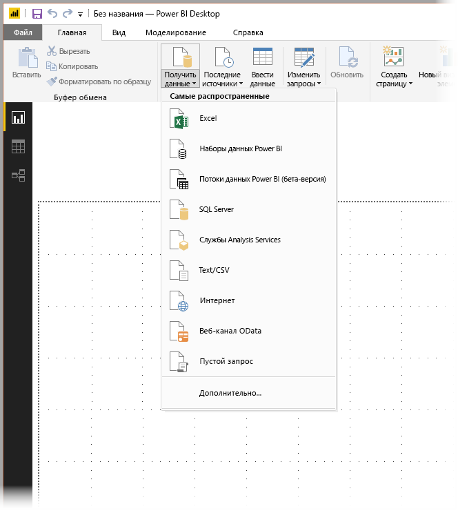
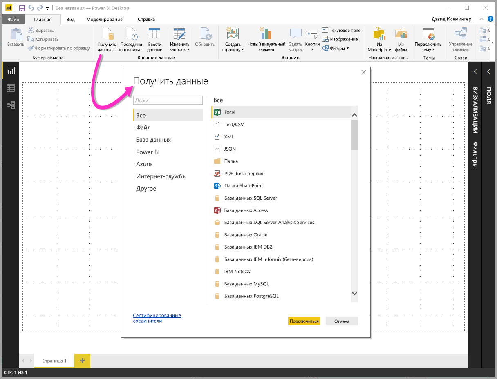
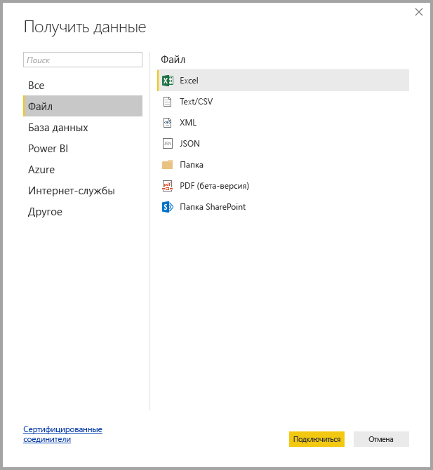
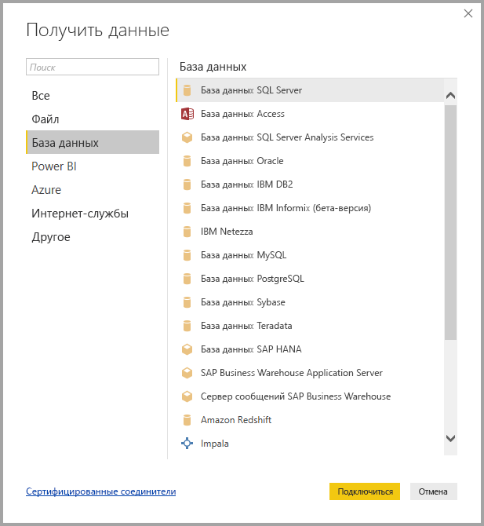
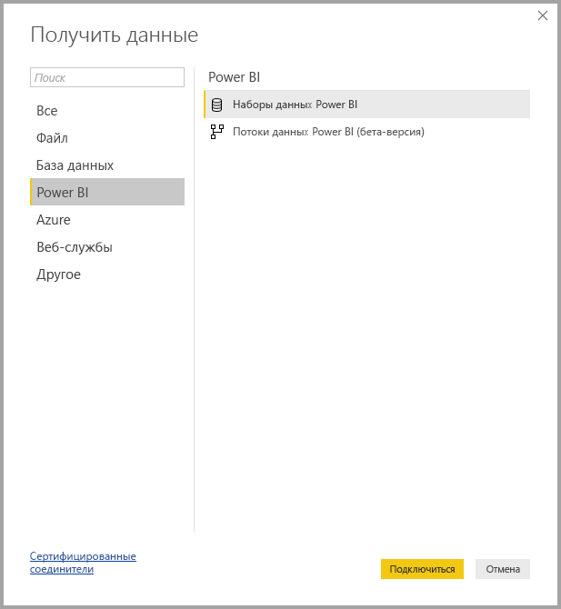
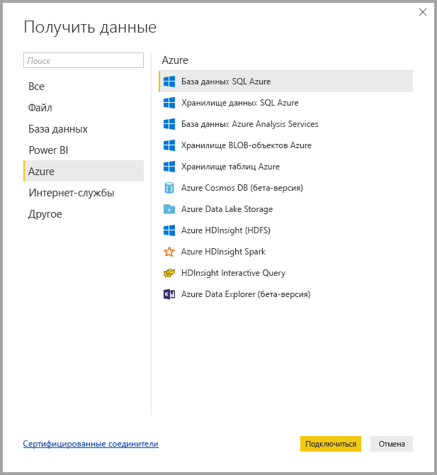
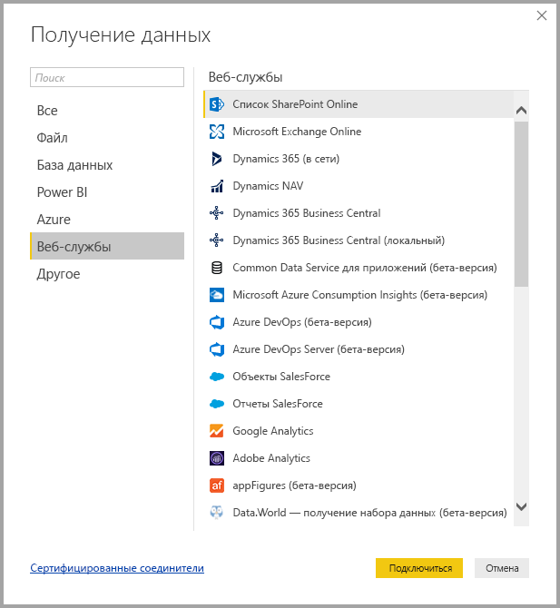
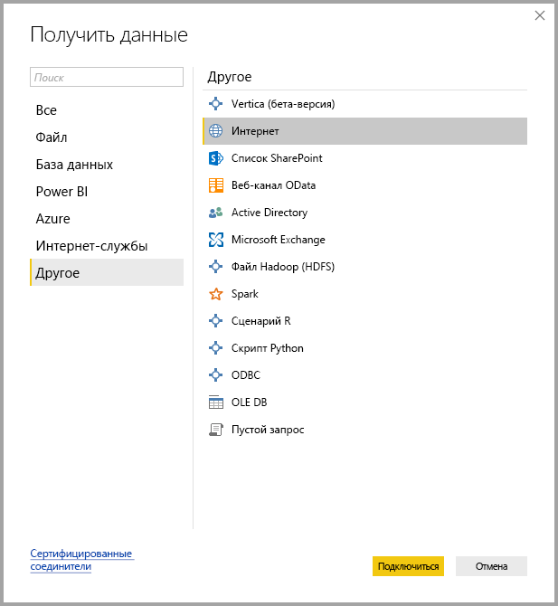

# Источники данных в Power BI Desktop
Power BI Desktop позволяет подключаться к данным из многих разных источников. Полный список доступных источников данных представлен в нижней части этой страницы.

Для подключения к данным выберите **Получить данные** на ленте **Главная** . Если щелкнуть стрелку вниз или текст **Получить данные** на кнопке, откроется меню **Наиболее распространенные** с типами данных, как показано на следующем рисунке:

Если щелкнуть **Еще...** в меню **Наиболее распространенные**, отобразится окно **Получить данные**. Чтобы открыть окно **Получить данные** (в обход меню **Наиболее распространенные** ), можно сразу щелкнуть **кнопку со значком** **Получить данные** .

> [!NOTE]
> Команда разработчиков Power BI постоянно расширяет список источников данных, доступных для приложения **Power BI Desktop** и **службы Power BI**. Поэтому вы часто будете видеть ранние версии источников данных в процессе разработки с пометкой *Бета-версия* или *Предварительная версия*. Все источники данных с пометкой *Бета-версия* или *Предварительная версия* имеют ограниченную поддержку и функциональные возможности и не должны использоваться в рабочих средах.
> 
> 

## Источники данных
Типы данных разделены на следующие категории:

* Все
* Файл
* База данных
* Power BI
* Azure
* Интернет-службы
* Другие

Категория **Все** включает все типы подключений данных из всех категорий.

Категория **Файл** предоставляет следующие подключения к данным:

* Excel
* Text/CSV.
* XML
* JSON
* Папка
* Папка SharePoint.

На следующем рисунке показано окно **Получить данные** для категории **Файл**.

Категория **База данных** предоставляет следующие подключения к данным:

* База данных SQL Server
* База данных Access
* База данных SQL Server Analysis Services
* База данных Oracle
* База данных IBM DB2
* база данных IBM Informix (бета-версия);
* IBM Netezza
* База данных MySQL
* База данных PostgreSQL
* База данных Sybase
* База данных Teradata
* База данных SAP HANA
* Сервер приложений SAP Business Warehouse
* Сервер сообщений SAP Business Warehouse (бета-версия)
* Amazon Redshift
* Impala
* Google BigQuery
* Снежинка
* Exasol

> [!NOTE]
> Некоторые соединители базы данных необходимо включить: выберите **Файл > Параметры и настройки > Параметры**, затем щелкните **Предварительная версия функций** и включите соединитель. Если некоторые из указанных выше соединителей не отображаются, а вы хотите их использовать, проверьте настройки параметра **Предварительная версия функций**. Также обратите внимание, что все источники данных с пометкой *Бета-версия* или *Предварительная версия* имеют ограниченную поддержку и функциональные возможности и не должны использоваться в рабочих средах.
> 
> 

На следующем рисунке показано окно **Получить данные** для категории **База данных**.

Категория **Power BI** предоставляет следующие подключения к данным:

* Наборы данных Power BI

На следующем рисунке показано окно **Получение данных** для **Power BI**.

Категория **Azure** предоставляет следующие подключения к данным:

* База данных SQL Azure
* Хранилище данных SQL Azure
* База данных Azure Analysis Services
* Хранилище BLOB-объектов Azure
* Хранилище таблиц Azure
* Azure Cosmos DB (бета-версия)
* Azure Data Lake Store
* Azure HDInsight (HDFS)
* Azure HDInsight Spark (бета-версия)
* HDInsight Interactive Query (бета-версия)
* Azure KustoDB (бета-версия)

На следующем рисунке показано окно **Получить данные** для категории **Azure**.

Категория **Интернет-службы** предоставляет следующие подключения к данным:

* Список SharePoint Online
* Microsoft Exchange Online
* Dynamics 365 (в сети);
* Dynamics NAV (бета-версия)
* Dynamics 365 Business Central
* Common Data Service для приложений (бета-версия)
* Common Data Service (бета-версия);
* Microsoft Azure Consumption Insights (бета-версия);
* Visual Studio Team Services (бета-версия)
* Объекты SalesForce
* Отчеты SalesForce
* Google Analytics
* Adobe Analytics
* appFigures (бета-версия)
* comScore Digital Analytix (бета-версия)
* Dynamics 365 для Customer Insights (бета-версия)
* Data.World — получение набора данных (бета-версия)
* Facebook
* GitHub (бета-версия)
* MailChimp (бета-версия)
* Merketo (бета-версия)
* Mixpanel (бета-версия)
* Planview Enterprise One — PRM (бета-версия)
* Planview Projectplace (бета-версия)
* QuickBooks Online (бета-версия)
* Smartsheet (бета-версия)
* SparkPost (бета-версия)
* Stripe (бета-версия)
* SweetIQ (бета-версия)
* Planview Enterprise One — CMT (бета-версия)
* Twilio (бета-версия)
* tyGraph (бета-версия)
* Webtrends (бета-версия)
* ZenDesk (бета-версия)
* TeamDesk (бета-версия)

На следующем рисунке показано окно **Получение данных** для категории **Интернет-службы**.

Категория **Другие** предоставляет следующие подключения к данным:

* Vertica (бета-версия);
* Интернет
* Список SharePoint
* Веб-канал OData
* Active Directory
* Microsoft Exchange
* Файл Hadoop (HDFS)
* Spark;
* Сценарий R
* ODBC
* OLE DB
* Пустой запрос

На следующем рисунке показано окно **Получение данных** для категории **Другие**.

> [!NOTE]
> Подключение к пользовательским источникам данных, полученным с помощью Azure Active Directory, сейчас не работает.
> 
> 

## Подключение к источнику данных
Чтобы подключиться к источнику данных, выберите его в окне **Получение данных** и нажмите кнопку **Подключить**. На следующем рисунке выбран источник **Интернет** из категории подключения к данным **Другие** .

Отображается окно подключения, зависящее от типа подключения к данным. Если необходимы учетные данные, вам будет предложено ввести их. На следующем рисунке показан ввод URL-адреса для подключения к интернет-источнику данных.

После ввода URL-адреса или сведений о подключении ресурса нажмите кнопку **ОК**. Power BI Desktop устанавливает подключение к источнику данных и представляет доступные источники данных в области **Навигатор**.

Для загрузки данных можно нажать кнопку **Загрузить** внизу области **Навигатор** или редактировать запрос перед загрузкой данных, нажав кнопку **Изменить** .

Это вся информация о подключении к источникам данных в Power BI Desktop. Попробуйте подключиться к данным из нашего растущего списка источников данных и следите за новостями — список постоянно пополняется.

## Дальнейшие действия
Power BI Desktop предоставляет широкие возможности. Дополнительные сведения об этих возможностях см. в следующих ресурсах.

* [Что такое Power BI Desktop?](desktop-what-is-desktop.md)
* [Общие сведения о запросах в Power BI Desktop](desktop-query-overview.md)
* [Типы данных в Power BI Desktop](desktop-data-types.md)
* [Формирование и объединение данных в Power BI Desktop](desktop-shape-and-combine-data.md)
* [Общие задачи с запросами в Power BI Desktop](desktop-common-query-tasks.md)    
