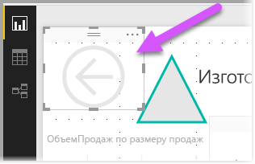
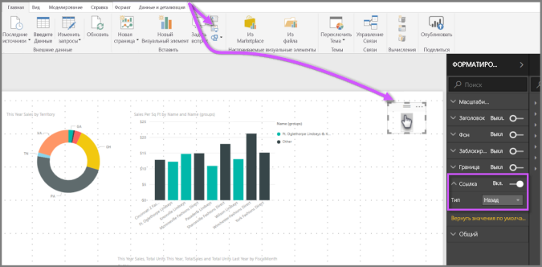
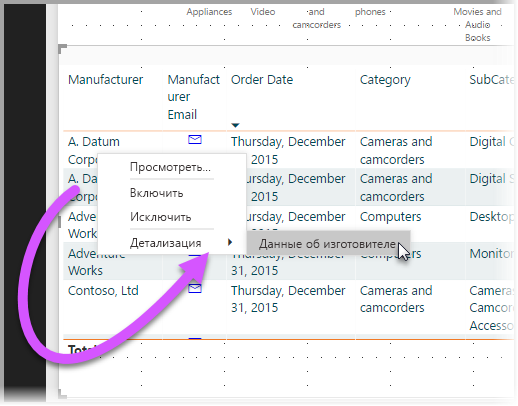

# Использование детализации в Power BI Desktop
Используя функцию **детализации** в **Power BI Desktop**, вы можете создать страницу отчета, посвященную определенной сущности, такой как поставщик, клиент или производитель. При использовании такой страницы пользователи могут щелкнуть правой кнопкой мыши точку данных на других страницах отчета и перейти для детализации на страницу определенной сущности, чтобы получить подробные сведения, отфильтрованные с учетом контекста.

## Использование детализации
Чтобы использовать **детализацию**, создайте страницу отчета с необходимыми визуальными элементами для типа сущности, для которой будет выполняться детализация. Например, если нужно выполнить детализацию по производителям, можно создать страницу детализации с визуальными элементами, которые показывают общий объем продаж, общее количество отправленных единиц товара, продажи по категориям, продажи по регионам и т. д. Таким образом, когда вы перейдете на эту страницу, отобразятся визуальные элементы, относящиеся к выбранному производителю, для которого выполнена детализация.

Затем на этой странице детализации в разделе **Поля** панели **Визуализации** перетащите поле, для которого требуется выполнить детализацию, в область **Фильтры детализации**.

Когда вы добавите поле в область **Фильтры детализации**, программа **Power BI Desktop** автоматически создаст визуальный элемент для *возврата*. В опубликованных отчетах этот визуальный элемент представляет собой кнопку. С ее помощью пользователи, которые работают с вашим отчетом в **службе Power BI**, смогут легко вернуться на страницу отчета, с которой они перешли (на которой они выбрали детализацию).

Так как кнопка *возврата* — это изображение, вы можете заменить его на любое другое изображение. Это не повлияет на работу кнопки, с помощью которой пользователи отчетов возвращаются к исходной странице. Чтобы использовать свое изображение для кнопки возврата, просто поместите изображение визуального элемента на страницу детализации, затем выберите этот визуальный элемент и переместите ползунок *Кнопка возврата* в положение "Включено". После этого изображение будет выполнять функцию кнопки *возврата*.

Когда страница **детализации** будет готова и пользователи щелкнут правой кнопкой мыши точку данных в отчете с полем, помещенным в область **Фильтры детализации** на странице детализации, отобразится контекстное меню, которое позволяет перейти на эту страницу для детализации.

Когда пользователи выбирают детализацию, страница фильтруется, отображая сведения о точке данных, которую они щелкнули правой кнопкой мыши. Например, если они щелкнули правой кнопкой мыши точку данных о компании Contoso (производитель) и выбрали выполнение детализации, на странице детализации, к которой они перешли, данные отфильтруются по компании Contoso.

> [!NOTE]
> На страницу детализации отчета можно перейти только из поля, добавленного в область **Фильтры детализации**. Из других контекстных сведений выполнить этот переход невозможно.
> 
> 

Это все, что нужно знать о **детализации** в отчетах. Это отличный способ получить развернутое представление со сведениями о сущности, выбранной для фильтра детализации.

