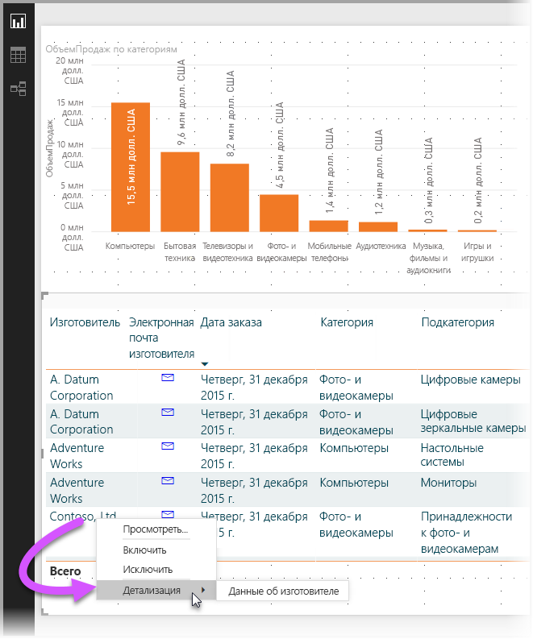
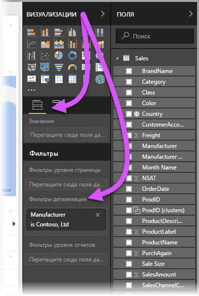
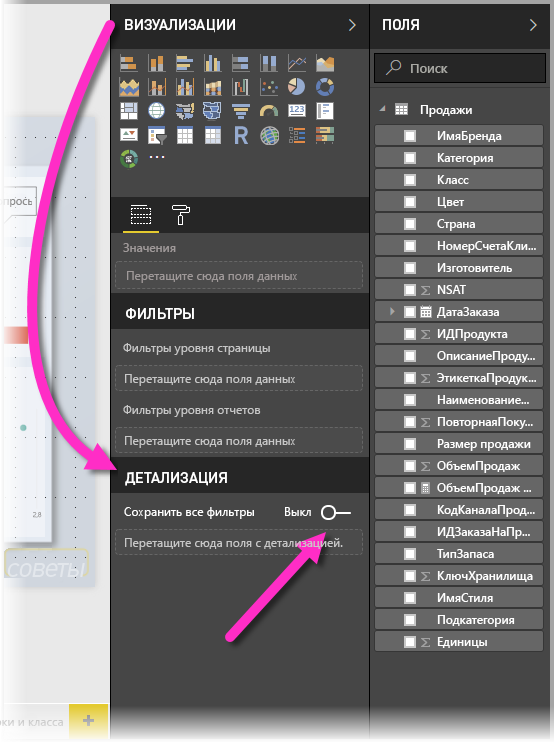
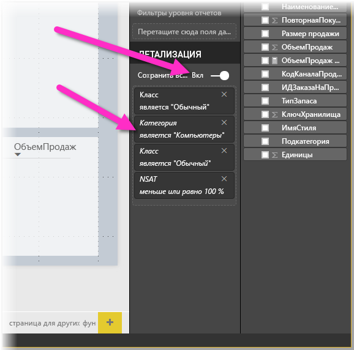

# Использование детализации в Power BI Desktop
С помощью функции **детализации** в **Power BI Desktop** вы можете создать страницу отчета, посвященную определенной сущности, такой как поставщик, клиент или производитель. При использовании такой страницы пользователи могут щелкнуть правой кнопкой мыши точку данных на других страницах отчета и перейти для детализации на страницу определенной сущности, чтобы получить подробные сведения, отфильтрованные с учетом контекста.

## Использование детализации
1. Чтобы использовать **детализацию**, создайте страницу отчета с необходимыми визуальными элементами для типа сущности, для которой будет выполняться детализация. 

    Например, если нужно выполнить детализацию по производителям, можно создать страницу детализации с визуальными элементами, которые показывают общий объем продаж, общее количество отправленных единиц товара, продажи по категориям, продажи по регионам и т. д. Таким образом, когда вы перейдете на эту страницу, отобразятся визуальные элементы, относящиеся к выбранному производителю.

2. Затем на странице детализации в разделе **Поля** панели **Визуализации** перетащите поле, для которого требуется выполнить детализацию, в область **Фильтры детализации**.

    

    Когда вы добавите поле в область **Фильтры детализации**, программа **Power BI Desktop** автоматически создаст визуальный элемент для *возврата*. В опубликованных отчетах этот визуальный элемент представляет собой кнопку. С ее помощью пользователи, которые работают с вашим отчетом в **службе Power BI**, смогут легко вернуться на страницу отчета, с которой они перешли (на которой они выбрали детализацию).

    

## Использование собственного изображения для кнопки возврата    
 Так как кнопка возврата — это изображение, вы можете заменить его на любое другое изображение. Это не повлияет на работу кнопки, с помощью которой пользователи отчетов возвращаются к исходной странице.

1. На вкладке **Главная** щелкните **Изображение**, а затем найдите изображение и поместите его на странице детализации.
2. Выберите новое изображение на странице детализации, в разделе "Формат изображения" установите ползунок для параметра **Ссылка** во включенное положение и задайте для параметра **Тип** значение **Назад**. Теперь изображение выполняет функцию кнопки возврата.

    

    Когда страница **детализации** будет готова и пользователи щелкнут правой кнопкой мыши точку данных в отчете с полем, помещенным в область **Фильтры детализации**, отобразится контекстное меню, которое поддерживает выполнение детализации для этой страницы.

    

    Когда пользователи отчета выбирают детализацию, страница фильтруется, отображая сведения о точке данных, которую они щелкнули правой кнопкой мыши. Например, если они щелкнули правой кнопкой мыши точку данных о компании Contoso (производитель) и выбрали выполнение детализации, на странице детализации, к которой они перешли, данные отфильтруются по компании Contoso.

## Передача всех фильтров в детализации

Начиная с версии **Power BI Desktop**, выпущенной в мае 2018 года, все примененные фильтры можно передавать в окно детализации. Например, вы выбрали определенную категорию продуктов, а затем отфильтровали визуальные элементы по этой категории, после чего выбрали детализацию. Вам может быть интересно узнать, как будет выглядеть детализация со всеми примененными фильтрами.

Чтобы сохранить все примененные фильтры, в разделе **Детализация** области **Визуализации** просто установите переключатель **Передать все фильтры** в положение **Вкл**. 

В версиях **Power BI Desktop**, выпущенных до мая 2018 года, поведение было таким, как если бы этот переключатель был установлен в положение **Выкл**.

При детализации визуального элемента можно увидеть, какие фильтры действуют в результате применения временных фильтров к исходному визуальному элементу. В окне детализации такие временные фильтры выделены курсивом. 

Имейте в виду, что так же можно было бы поступить и со страницами подсказок, но они будут работать неправильно, поэтому делать это не рекомендуется.

Это все, что нужно знать о **детализации** в отчетах. Это отличный способ получить развернутое представление со сведениями о сущности, выбранной для фильтра детализации.

## Дальнейшие действия

Рекомендуем также ознакомиться со следующими материалами:

* [Использование срезов в Power BI Desktop](desktop-slicers.md)

