# Использование языка R в редакторе запросов
В **редакторе запросов** Power BI Desktop можно использовать язык программирования **R**, который широко применяют специалисты по статистике, аналитики и специалисты по обработке данных. Интеграция языка R в **редактор запросов** позволяет выполнять очистку данных с помощью R, а также формирование и анализ данных в наборах данных, в частности заполнение отсутствующих данных, прогнозирование и кластеризацию. **R** — эффективный язык, который можно использовать в **редакторе запросов** для подготовки модели данных и создания отчетов.

## Установка R
Чтобы использовать **R** в **редакторе запросов** Power BI Desktop, необходимо установить **R** на локальном компьютере. Вы можете скачать и установить **R** бесплатно из различных расположений, включая [страницу скачивания Revolution Open](https://mran.revolutionanalytics.com/download/) и [репозиторий CRAN](https://cran.r-project.org/bin/windows/base/).

## Использование языка R в редакторе запросов
Чтобы продемонстрировать использование **R** в **редакторе запросов**, воспользуемся примером из набора данных фондовой биржи в CSV-файле, который вы можете [скачать здесь](http://download.microsoft.com/download/F/8/A/F8AA9DC9-8545-4AAE-9305-27AD1D01DC03/EuStockMarkets_NA.csv). Ниже перечислены шаги для этого примера.

1. Сначала загрузите данные в **Power BI Desktop**. В этом примере загрузите файл *EuStockMarkets_NA.csv* и выберите **Получить данные > CSV** на вкладке ленты **Главная** в **Power BI Desktop**.

   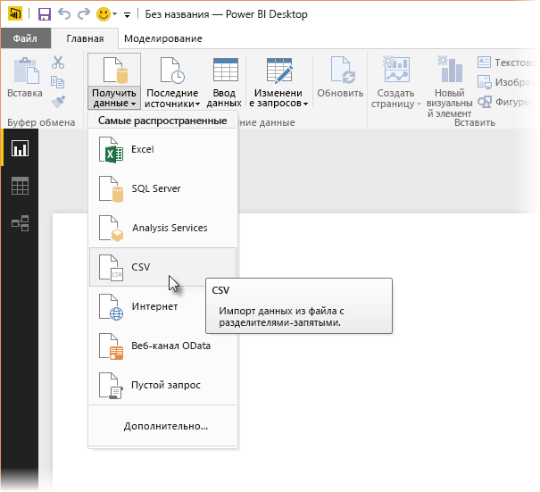
2. Выберите файл и нажмите кнопку **Открыть**. CSV-файл отобразится в диалоговом окне **CSV-файл**.

   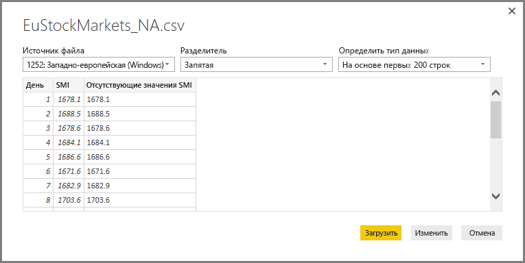
3. После того как данные загрузятся, вы увидите их в Power BI Desktop в области **Поля**.

   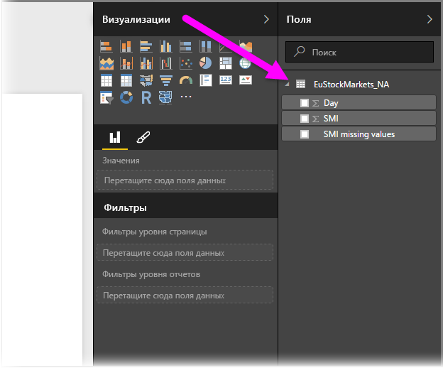
4. Откройте **редактор запросов**. Для этого в **Power BI Desktop** на вкладке **Главная** нажмите кнопку **Изменить запросы**.

   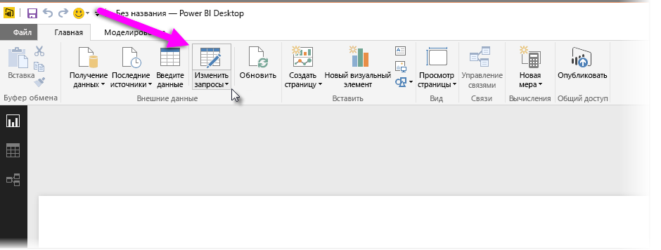
5. На вкладке **Преобразование** нажмите кнопку **Запустить сценарий R**. Откроется редактор **Запустить сценарий R**, который показан на следующем шаге. Обратите внимание, что в строках 15 и 20 отсутствуют данные, как и в других строках, которых не видно на приведенном ниже рисунке. В инструкциях ниже показано, как язык R может заполнить эти строки (и заполнит их).

   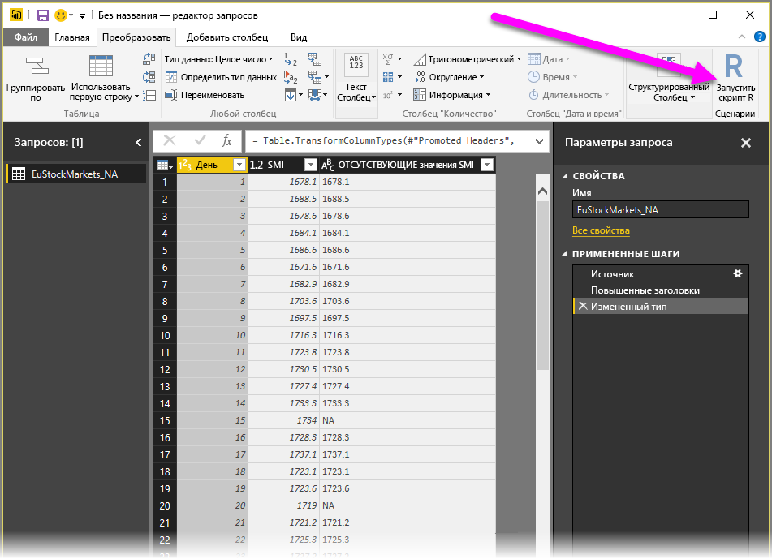
6. Например, введите следующий код сценария:

       library(mice)
       tempData <- mice(dataset,m=1,maxit=50,meth='pmm',seed=100)
       completedData <- complete(tempData,1)
       output <- dataset
       output$completedValues <- completedData$"SMI missing values"

   > [!NOTE]
   > Чтобы этот код сценария работал правильно, в вашей среде R должна быть установлена библиотека *mice*. Чтобы установить библиотеку Mice, выполните в своем экземпляре R следующую команду: |      > install.packages('mice')
   > 
   > 

   Код в диалоговом окне **Запустить сценарий R** будет выглядеть так:

   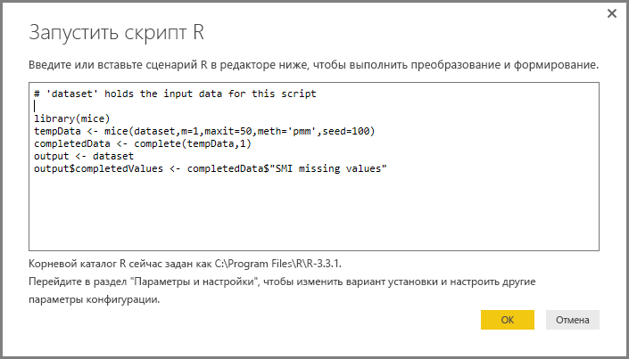
7. После нажатия кнопки **ОК** в **редакторе запросов** отображается предупреждение о конфиденциальности данных.

   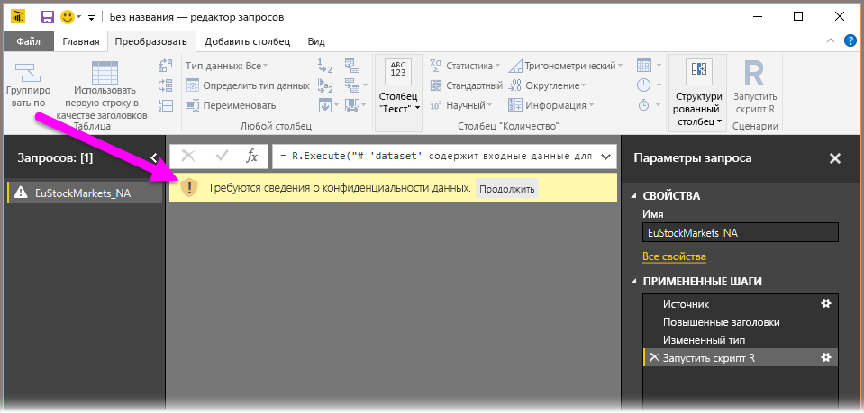
8. Чтобы сценарии R правильно работали в службе Power BI, уровень конфиденциальности всех источников данных должен иметь значение *Общедоступный*. Дополнительные сведения о параметрах конфиденциальности и результатах их использования см. в статье об [уровнях конфиденциальности](desktop-privacy-levels.md).

   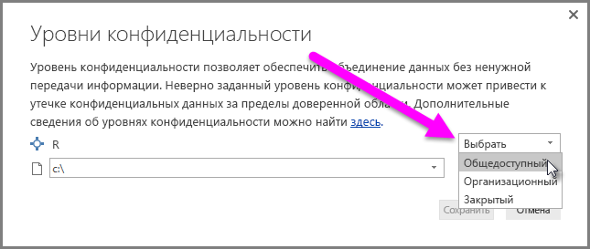

   Обратите внимание на новый столбец *completedValues* в области **Поля**. Обратите внимание на несколько отсутствующих элементов данных, например в строках 15 и 18. Следующий раздел описывает, как язык R обрабатывает эти строки.

Используя только пять строк сценария R, **редактор запросов** заполнит отсутствующие значения с помощью прогнозной модели.

## Создание визуальных элементов с помощью данных сценария R
Создадим визуальный элемент, чтобы увидеть, как код сценария R заполнил отсутствующие значения с помощью библиотеки *Mice* (см. рисунок ниже):

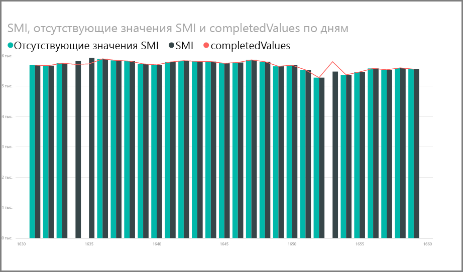

Когда будет создан визуальный элемент (а также другие визуальные элементы, которые требуется создать с помощью **Power BI Desktop**), вы можете сохранить файл **Power BI Desktop** в формате PBIX, а затем использовать в службе Power BI модель данных и включенные в нее сценарии R.

> [!NOTE]
> Хотите просмотреть заполненный PBIX-файл с результатами выполнения этих действий? Вам повезло: вы можете загрузить заполненный файл **Power BI Desktop**, используемый в этих примерах, [прямо здесь](http://download.microsoft.com/download/F/8/A/F8AA9DC9-8545-4AAE-9305-27AD1D01DC03/Complete%20Values%20with%20R%20in%20PQ.pbix).

После отправки PBIX-файла в службу Power BI необходимо выполнить еще несколько дополнительных действий, чтобы обновить данные (в службе) и включить обновление визуальных элементов в службе (для обновления визуальных элементов данным требуется доступ к R). Вот эти действия:

* **Включите запланированное обновление для набора данных**. Чтобы включить запланированное обновление для книги, содержащей набор данных со сценариями R, см. инструкции в статье [Настройка запланированного обновления](refresh-scheduled-refresh.md), которая также включает информацию о шлюзе **Personal Gateway**.
* **Установите шлюз Personal Gateway**. Установите **Personal Gateway** на компьютере, на котором сохранен файл и установлен язык R. Службе Power BI необходимо получить доступ к этой книге и повторно преобразовать для просмотра все обновленные визуальные элементы. См. дополнительную информацию в инструкциях по [установке и настройке шлюза Personal Gateway](service-gateway-personal-mode.md).

## Ограничения
Существуют ограничения на запросы, включающие сценарии R, которые созданы в **редакторе запросов**.

* Всем параметрам источника данных R должно быть присвоено значение *Общедоступный*. Все остальные действия в запросе, созданном в **редакторе запросов**, также должны быть общедоступными. Чтобы получить параметры источника данных, в **Power BI Desktop** выберите элементы **Файл > Параметры и настройки > Параметры источника данных**.

  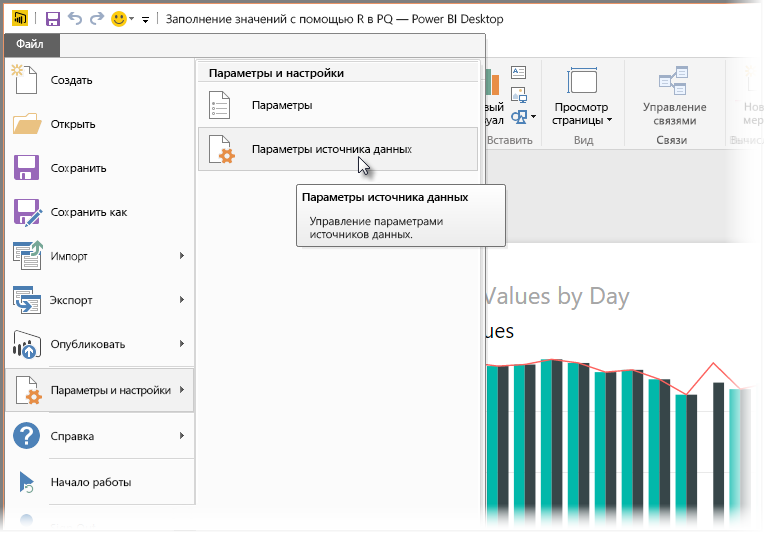

  В диалоговом окне **Параметры источника данных** выберите источники данных, а затем щелкните **Изменить разрешения...** и убедитесь, что для параметра **Уровень конфиденциальности** указано значение *Общедоступный*.

  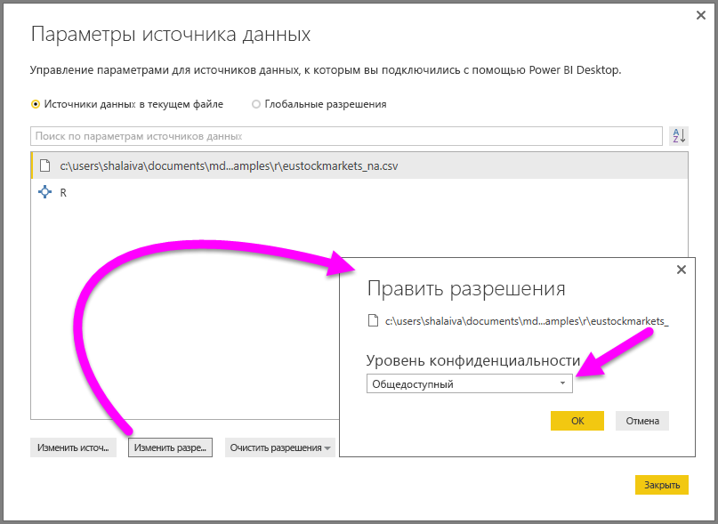    
* Чтобы включить запланированное обновление визуальных объектов R или набора данных, включите **запланированное обновление** и установите шлюз **Personal Gateway** на компьютере, на котором сохранена книга и установлен экземпляр R. Дополнительные сведения о запланированном обновлении и шлюзе Personal Gateway см. в статьях по ссылкам, приведенным в предыдущем разделе.

С помощью R и пользовательских запросов можно выполнять разные операции. Просматривайте и формируйте свои данные, придавая им нужный вид.

