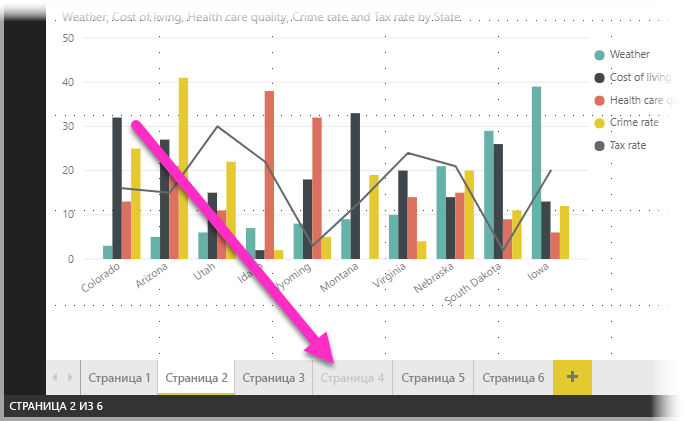

# Представление отчетов в Power BI Desktop
Если вы работали с Power BI, вы знаете, как просто можно создавать отчеты, предоставляющие динамические сведения о ваших данных. В Power BI Desktop также реализованы дополнительные возможности. С помощью Power BI Desktop можно создавать сложные запросы, объединять данные из нескольких источников, создавать связи между таблицами и многое другое.

Power BI Desktop содержит **представление отчетов**, где можно создать любое количество страниц отчета с визуализациями. Представление отчетов во многом похоже на режим редактирования отчета в службе Power BI. Вы можете перемещать визуализации, копировать, вставлять, объединять элементы и т. д.

Разница состоит в том, что при использовании Power BI Desktop вы можете работать с запросами и моделями данных, чтобы извлекать самые полезные сведения для отчетов. Затем вы можете сохранить файл Power BI Desktop где угодно — как на локальном диске, так и в облаке.

## Давайте посмотрим!
При первой загрузке данных в Power BI Desktop вы увидите **представление отчетов** с пустым холстом.

Можно переключаться между **представлениями отчетов**, **данных** и **связей**, щелкая значки в левой панели навигации:

После добавления данных можно добавить поля в новую визуализацию на холсте.

Чтобы изменить тип визуализации, выберите новый тип в группе **Визуализация** на ленте или щелкните визуализацию правой кнопкой мыши и выберите тип в списке **Изменить тип визуализации** .

> [!TIP]
> Поэкспериментируйте с различными типами визуализаций. Визуализация должна четко представлять информации о данных.
> 
> 

В начале отчет содержит по крайней мере одну пустую страницу. Страницы отображаются в области навигатора слева от холста. Вы можете добавить различные виды визуализаций на страницу, но главное не переборщить. Слишком много визуализаций на странице усложнят работу с ней и затруднят поиск нужной информации. Вы можете добавить новые страницы в отчет, просто нажав кнопку **Новая страница** на ленте.

Чтобы удалить страницу, нажмите кнопку **X** на вкладке этой страницы в нижней части представления отчета.

> [!NOTE]
> Отчеты и визуализации не могут быть закреплены на панели мониторинга из Power BI Desktop. Для этого вам необходимо [выполнить публикацию из Power BI Desktop](desktop-upload-desktop-files.md) на сайте Power BI.

## Скрытие страниц отчета

Кроме того, при создании отчета вы можете скрыть его страницы. Это полезно, когда вам нужно создать базовые данные или визуальные элементы в отчете, но не желательно, чтобы эти страницы видели другие пользователи. Например, при создании таблицы или вспомогательных визуальных элементов, которые используются на других страницах отчета. Есть много других индивидуальных причин, по которым вам, возможно, потребуется создать страницу отчета, а затем скрыть ее в отчете для публикации. 

Скрыть страницу отчета очень просто. Достаточно щелкнуть правой кнопкой мыши вкладку для страницы отчета и в появившемся меню выбрать **Скрыть**.

При скрытии страницы отчета учитывайте следующее:

* В **Power BI Desktop** вы по-прежнему отображается скрытое представление отчета, даже если заголовок страницы неактивен. На следующем рисунке скрыта страница 4.

    

* Скрытая страница отчета *не отображается* при его просмотре в **службе Power BI**.

* Скрытие страницы отчета *не* является мерой безопасности. Пользователи по-прежнему могут получить доступ к странице и ее содержимому с помощью детализации и других методов.

* Если скрыть страницу и перейти в режим просмотра, стрелки навигации не будут отображаться.

