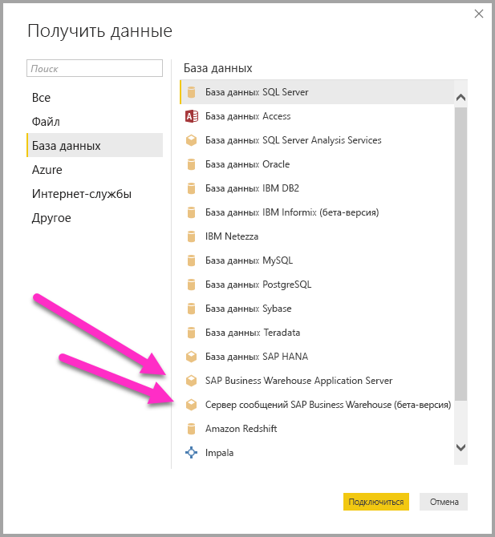
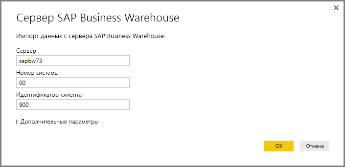
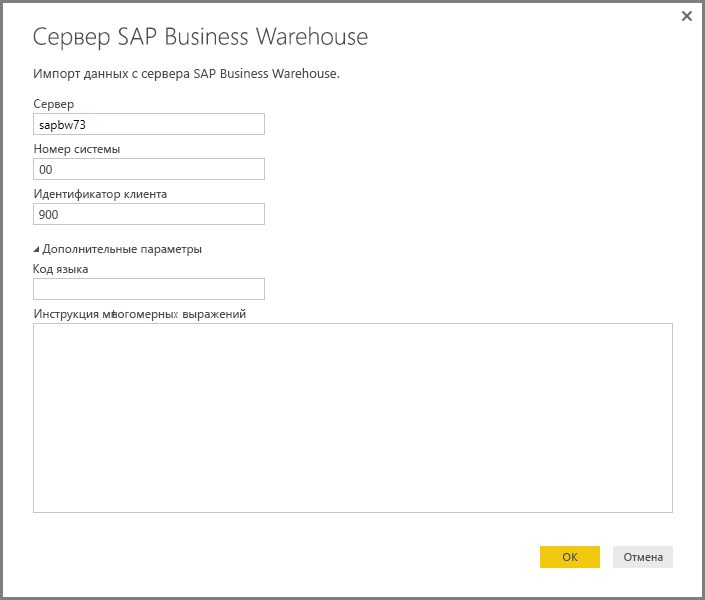
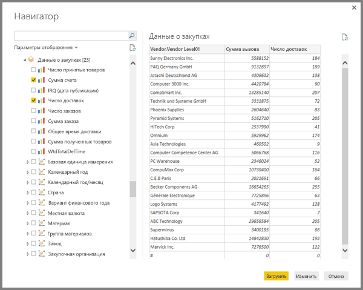
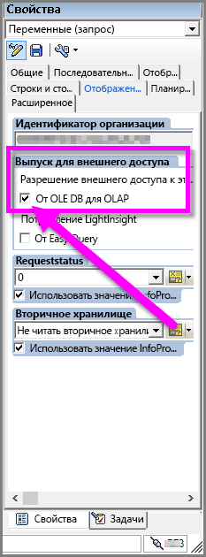

# Использование соединителя SAP BW в Power BI Desktop
С помощью Power BI Desktop вы можете получить доступ к данным **SAP BusinessWarehouse (BW)**.

## Установка соединителя SAP BW
Чтобы использовать **соединитель SAP BW**, выполните следующие действия по установке.

1. Установите библиотеку **SAP NetWeaver** на локальном компьютере. Библиотеку **SAP NetWeaver** можно получить у администратора SAP или непосредственно в [Центре скачивания программного обеспечения SAP](https://support.sap.com/swdc). В связи с частым изменением структуры **Центра скачивания программного обеспечения SAP** более конкретные рекомендации по навигации по этому сайту недоступны. Кроме того, библиотека **SAP NetWeaver** обычно входит в пакет установки клиентских средств SAP Client Tools.
   
   Чтобы получить ссылку на скачивание последней версии, введите в строку поиска запрос *SAP Note #1025361* (мы не гарантируем, что это точно поможет ее найти). Убедитесь, что архитектура библиотеки **SAP NetWeaver** (32-или 64-разрядная) соответствует архитектуре установленной у вас версии **Power BI Desktop**, а затем установите все файлы из **пакета SDK для RFC SAP NetWeaver** согласно примечаниям SAP.
2. В диалоговом окне **Получение данных** в категории **База данных** будет указан **сервер SAP Business Warehouse**.
   
   

## Возможности соединителя SAP BW
**Соединитель SAP BW** (предварительная версия) в Power BI Desktop позволяет пользователям импортировать данные из кубов **сервера SAP Business Warehouse**. Вы также можете использовать DirectQuery с **соединителем SAP BW**. Чтобы установить подключение, необходимо указать *сервер*, *номер системы* и *идентификатор клиента*.

Также можно указать два **дополнительных параметра**: код языка и пользовательскую инструкцию многомерных выражений для выполнения с использованием указанного сервера.

Если указана инструкция многомерных выражений, появится окно **Навигатор**, в котором отображается список кубов, доступных на сервере, а также параметр для детализации и выбора элементов из доступных кубов, включая измерения и меры. Power BI предоставляет запросы и кубы, предоставляемые [OLAP BAPI интерфейса открытого анализа BW](https://help.sap.com/saphelp_nw70/helpdata/en/d9/ed8c3c59021315e10000000a114084/content.htm).

После выбора одного или нескольких элементов на сервере создается выходная таблица для предварительного просмотра, которая определяется выбранными элементами.

В окне **Навигатор** также представлено несколько **параметров отображения**, которые позволяют делать следующее.

* **Параметры отображения *Только выбранные элементы* и *Все элементы* (представление по умолчанию):** эти параметры полезны для проверки окончательного набора выбранных элементов. В качестве альтернативы для просмотра можно выбрать *имена столбцов* в области *предварительного просмотра*.
* **Включить предварительный просмотр данных (по умолчанию):** вы можете включить или отключить предварительный просмотр данных в этом диалоговом окне. Отключение предварительного просмотра данных уменьшает количество вызовов к серверу, так как он больше не запрашивает данные для предварительного просмотра.
* **Технические имена:** SAP BW поддерживает наличие *технических имен* у объектов в кубе. Использование технических имен позволяет владельцу куба отображать *понятные* имена объектов куба, а не *физические имена* этих объектов в кубе.

После выбора всех необходимых объектов в окне **Навигатор** можно решить, что делать дальше, нажав одну из следующих кнопок в нижней части окна **Навигатор**.

* Если нажать кнопку **Загрузить**, активируется загрузка всего набора строк для выходной таблицы в модель данных Power BI Desktop, затем осуществляется переход к представлению **Отчет**, где можно начать визуализацию данных. Также вы можете внести дополнительные изменения с помощью представления **Данные** или **Связи**.
* Если нажать кнопку **Изменить**, отобразится **редактор запросов**, в котором можно выполнить дополнительное преобразование данных и фильтрацию, прежде чем весь набор строк будет передан в модель данных Power BI Desktop.

Помните, что кроме импорта данных из кубов **SAP BW**, вы также можете импортировать в Power BI Desktop данные из широкого диапазона других источников данных, а затем объединить их в один отчет. Это делает возможными самые разнообразные сценарии составления отчетов и аналитики на основе данных **SAP BW**.

## Устранение неполадок
В этом разделе приведены случаи устранения неполадок при работе с данной предварительной версией соединителя **SAP BW**.

1. Числовые данные из **SAP BW** возвращают точки в качестве десятичных разделителей вместо запятых. Например, 1,000,000 возвращается как 1.000.000.
   
   **SAP BW** возвращает десятичные данные с *,* (запятая) или *.* (точка) в качестве десятичного разделителя. Чтобы указать, какие **SAP BW** следует использовать для десятичного разделителя, драйвер, используемый **Power BI Desktop**, вызывает *BAPI_USER_GET_DETAIL*. Этот вызов возвращает структуру, называемую **DEFAULTS**, которая содержит поле с именем *DCPFM*, в котором хранится *нотация десятичного формата*. Он принимает одно из следующих трех значений:
   
       ‘ ‘ (space) = Decimal point is comma: N.NNN,NN
       'X' = Decimal point is period: N,NNN.NN
       'Y' = Decimal point is N NNN NNN,NN
   
   Клиенты, сообщавшие об этой проблеме, обнаружили, что вызов *BAPI_USER_GET_DETAIL* завершается сбоем для определенного пользователя (пользователь, для которого отображаются неверные данные) и сообщением об ошибке следующего вида:
   
       You are not authorized to display users in group TI:
           <item>
               <TYPE>E</TYPE>
               <ID>01</ID>
               <NUMBER>512</NUMBER>
               <MESSAGE>You are not authorized to display users in group TI</MESSAGE>
               <LOG_NO/>
               <LOG_MSG_NO>000000</LOG_MSG_NO>
               <MESSAGE_V1>TI</MESSAGE_V1>
               <MESSAGE_V2/>
               <MESSAGE_V3/>
               <MESSAGE_V4/>
               <PARAMETER/>
               <ROW>0</ROW>
               <FIELD>BNAME</FIELD>
               <SYSTEM>CLNTPW1400</SYSTEM>
           </item>
   
   Чтобы исправить эту ошибку, пользователи должны запросить у своего администратора SAP предоставить пользователю SAP BW, который используется в Power BI, право на выполнение *BAPI_USER_GET_DETAIL*. Стоит также убедиться, что пользователь задал необходимое значение *DCPFM*, описанное выше в этом решении для устранения неполадок.
2. **Возможность использования запросов SAP BEx**
   
   В Power BI Desktop можно выполнять запросы **BEx**, включив определенное свойство, как показано на следующем изображении:
   
   

