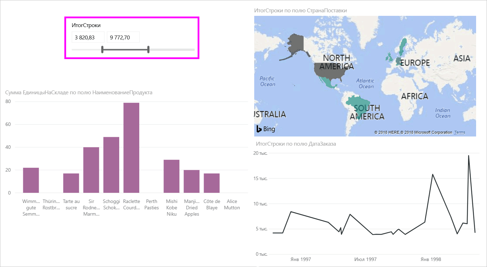
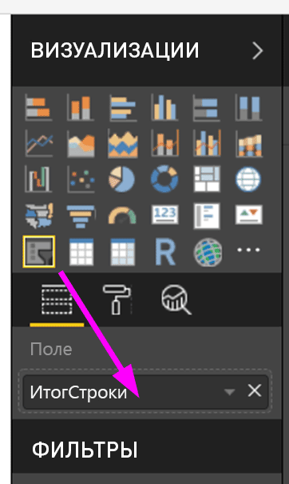
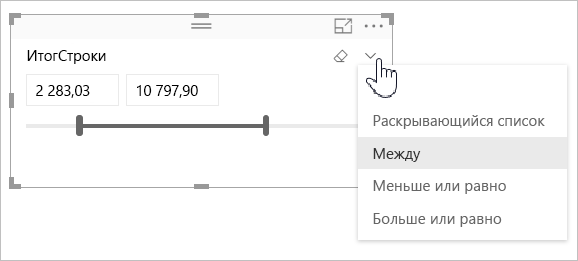
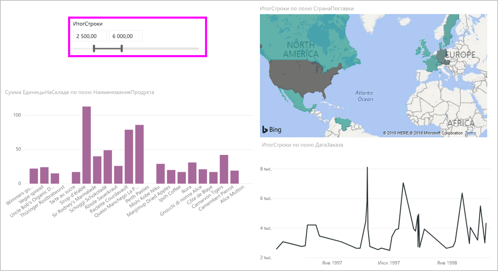
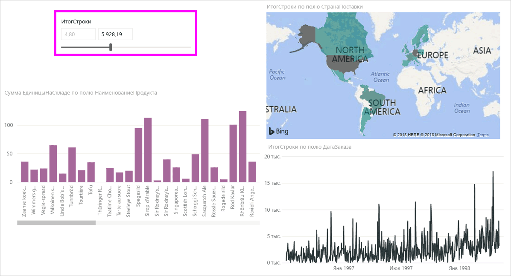
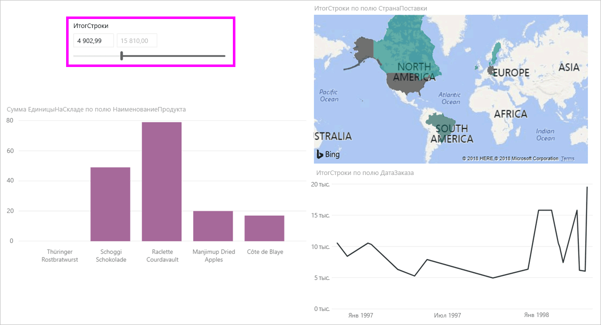

# Использование среза числового диапазона в Power BI Desktop
С помощью **среза числового диапазона** можно применять все виды фильтров к любому числовому столбцу в модели данных. Вы можете выбрать фильтрацию **по диапазону** чисел, а также по значению **не больше** или **не меньше** числа. Хотя эта функция может показаться простой, это очень эффективный способ для фильтрации данных.

## Использование среза числового диапазона
Вы можете использовать срез числового диапазона так же, как и любой другой срез. Просто создайте визуальный элемент **Срез** для отчета, а затем выберите числовое значение для значения **Поле**. На следующем изображении выбрано поле *LineTotal*.

В правом верхнем углу **среза числового диапазона** выберите ссылку со стрелкой вниз, чтобы отобразить меню.

Для числового диапазона можно выбрать один из следующих трех вариантов:

* "Между";
* Меньше или равно
* Больше или равно

При выборе в меню пункта **Между** отображается ползунок, используя который можно отфильтровать числовые значения, которые находятся в диапазоне чисел. Помимо использования самого ползунка можно щелкнуть любое поле и ввести значения. Это удобно, если нужно выполнить срез конкретных чисел, однако из-за степени детализации при перемещении среза достаточно сложно выбрать точное числовое значение.

На следующем рисунке фильтруется страница отчета для значений *LineTotal* в диапазоне от 2500,00 до 6000,00.

При выборе варианта **Меньше или равно** исчезает левый маркер ползунка (меньшее значение). При этом можно настроить только верхнюю границу ползунка. На следующем рисунке мы устанавливаем ползунок на числовое значение 5928,19.

Наконец, при выборе варианта **Больше или равно** исчезает правый маркер ползунка (максимальное значение). При этом можно настроить меньшее значение, как показано на следующем рисунке. Теперь в визуальных элементах на странице отчета отображаются только элементы, значение которых для *LineTotal* больше или равно 4902,99.

## Привязка к целым числам для среза числового диапазона

Срез числового диапазона будет обрезан до целых чисел, если базовое поле имеет тип данных **Целое число**. Это обеспечит точное выравнивание среза по целым числам. В полях с типом **Десятичное число** можно вводить или выбирать дробные числа. Форматирование, применяемое в текстовом поле, соответствует параметру форматирования поля, даже если вы можете вводить или выбирать более точные числа.

## Рекомендации и ограничения
Сейчас к **срезу числового диапазона** применяются следующие рекомендации и ограничения:

* Сейчас **срез числового диапазона** позволяет фильтровать каждую базовую строку данных и не позволяет отфильтровать агрегированные значения. Например, если используется поле *Sales Amount* (Сумма продаж), каждая транзакция, основанная на значениях *этого поля*, будет отфильтрована. Они фильтруются для каждой точки данных визуального элемента, а не по сумме значений поля *Sales Amount* (Сумма продаж).
* Сейчас это не работает с мерами.
* Вы можете вводить любые числа в текстовые поля числового среза, даже если они выходят за пределы диапазона значений базового столбца. Это позволяет настраивать фильтры, если известно, что в будущем данные могут измениться.
