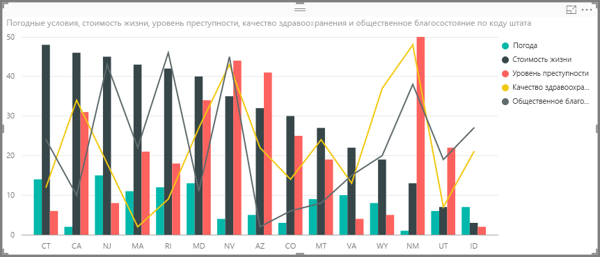
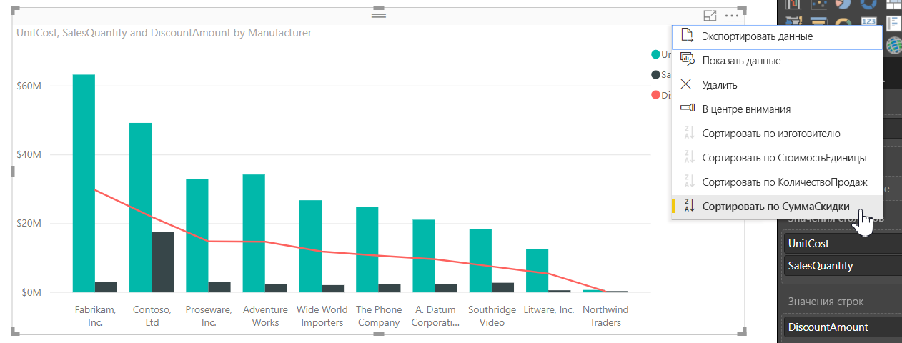
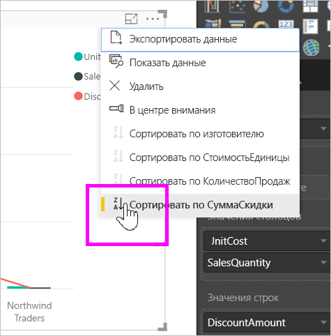
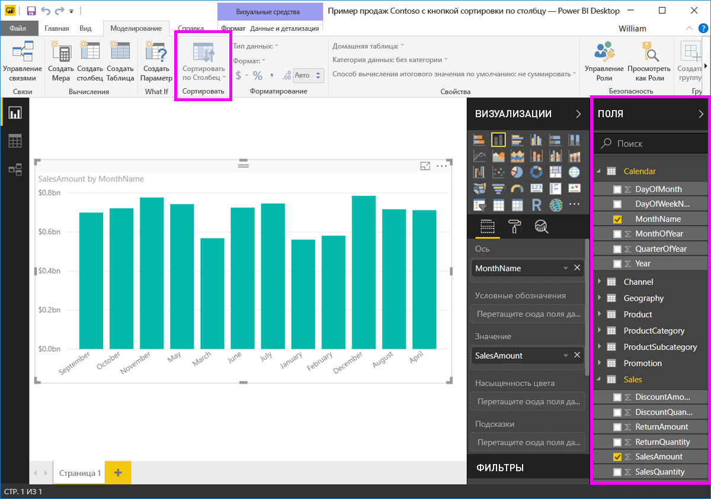
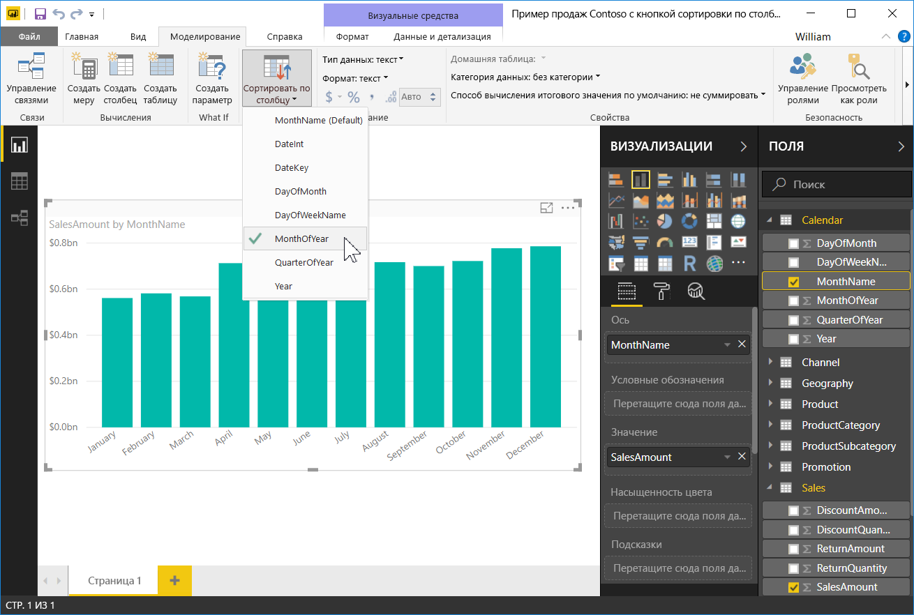

# Сортировка по столбцу в Power BI Desktop
В **Power BI Desktop** и **службе Power BI** можно изменять вид визуального элемента, выполнив сортировку по разным полям данных. Изменив порядок сортировки визуального элемента, вы можете выделить информацию, которую необходимо передать, и убедиться в том, что визуальный элемент отражает тенденцию (или акцент).

Независимо от того, используете ли вы числовые (например, объемы продаж) или текстовые данные (например, названия штатов), визуализации можно сортировать в любом требуемом порядке.  **Power BI** предоставляет гибкие возможности сортировки и меню быстрого доступа. В любом визуальном элементе щелкните меню с многоточием (...), а затем выберите поле, по которому необходимо выполнить сортировку, как показано на рисунке ниже.

## Более подробный пример
Давайте рассмотрим более подробный пример и узнаем, как это работает в **Power BI Desktop**.

На представленной ниже визуализации показаны затраты, количества и суммы по названию производителя. Визуализация приведена в том виде, как она выглядит до начала какой-либо сортировки.

Сейчас визуальный элемент отсортирован по полю **КоличествоПродаж**. Это становится понятно при сопоставлении цветов строк по возрастанию с условными обозначениями. Но есть более эффективный способ определить текущий столбец сортировки: меню многоточия (...) в правом верхнем углу визуального элемента. Щелкнув многоточие, мы увидим следующее:

* Текущим полем сортировки является **КоличествоПродаж**. На это указывает то, что пункт **Сортировать по КоличествоПродаж** выделен полужирным шрифтом и отмечен желтой полоской. 

* Текущее направление сортировки — от меньшего к большему, на что указывает небольшой значок с буквами **А–Я** (А над Я) и стрелкой вниз.

В следующих двух разделах мы по отдельности рассмотрим поле и направление сортировки.

## Выбор столбца для сортировки
Мы уже обратили внимание на желтую полоску рядом с пунктом **Сортировать по КоличествоПродаж** в меню **Дополнительные параметры**. Она указывает на то, что визуальный элемент сортируется по столбцу **КоличествоПродаж**. Выполнить сортировку по другому столбцу несложно: просто щелкните многоточие, чтобы вывести на экран меню, а затем выберите другой столбец.

На представленном ниже рисунке мы выбрали столбец *РазмерСкидки* в качестве основания для сортировки. Этот столбец оказался одним из горизонтальных, а не вертикальных элементов диаграммы. Вот так будет выглядеть визуальный элемент после выбора **Сортировать по РазмерСкидки**.

Обратите внимание на то, как изменилась диаграмма. Теперь элементы располагаются в порядке от максимального значения РазмерСкидки (в этом визуальном элементе это Fabrikam Inc.) до минимального значения (Northwind Traders). 

Но что делать, если требуется сортировка по возрастанию, а не по убыванию? В следующем разделе показано, насколько просто выполнить такую сортировку.

## Выбор порядка сортировки: по возрастанию или по убыванию
Приглядевшись к меню **Параметры** на предыдущем рисунке, мы увидим, что на значке рядом с пунктом **Сортировать по РазмерСкидки** есть буквы **Я–А** (Я над А). Посмотрите:

Когда отображается значок **Z/A**, визуальный элемент сортируется по выбранному столбцу в порядке от максимального значения к минимальному. Хотите это изменить? Никаких проблем: просто щелкните значок **Z/A**, порядок сортировки изменится на **A/Z**, и визуальный элемент будет отсортирован от минимального к максимальному значению (на основе выбранного столбца).

Ниже вы видите тот же визуальный элемент, но после щелчка по значку **Я–А** в пункте меню **Сортировать по РазмерСкидки** порядок в нем изменился. Обратите внимание на то, что Northwind Traders теперь первый производитель в списке, а Fabrikam Inc. — последний, то есть все стало наоборот.

Можно выполнить сортировку по любому столбцу визуального элемента: выберем КоличествоПродаж в качестве столбца, по которому нужно отсортировать диаграмму, с помощью пункта меню **Сортировать по КоличествоПродаж**, чтобы производители с наибольшим объемом продаж отображались первыми. Другие столбцы по-прежнему будут отображаться на диаграмме, однако они будут применяться к этому производителю. Вот как выглядит диаграмма с этими настройками.

## Сортировка с помощью кнопки "Сортировка по столбцу"
Вы также можете сортировать данные с помощью кнопки **Сортировка по столбцу** на ленте **Моделирование**.

Чтобы сортировать данные таким способом, вам нужно выбрать столбец в области **Поля**, а затем нажать кнопку **Сортировка по столбцу**, чтобы указать столбец для сортировки визуального элемента. Выберите в области **Поля** столбец (поле), который нужно сортировать, чтобы включить кнопку **Сортировка по столбцу**, иначе кнопка будет неактивна.

Рассмотрим типичный пример. У вас есть данные за каждый месяц года, и вы хотите отсортировать их в хронологическом порядке. Ниже показано, как это сделать.

1. Обратите внимание. Если выбрать визуальный элемент, но не выбрать столбец в области **Поля**, кнопка **Сортировка по столбцу** будет неактивна (отображается серым).
   
   

2. Когда вы выбираете в области **Поля** столбец, по которому нужно отсортировать данные, кнопка **Сортировка по столбцу** становится активной.
   
   
3. Выбрав визуальный элемент, выберите *МесяцГода* вместо значения по умолчанию (*НазваниеМесяца*). Визуальный элемент теперь будет отсортирован в нужном порядке — по месяцу года.
   
   

Вот и все! Не забудьте выбрать столбец в области **Поля**, чтобы активировать кнопку **Сортировка по столбцу**.

## Возврат к столбцу для сортировки по умолчанию
Сортировку можно выполнять по любому столбцу, но бывают случаи, когда требуется вернуть визуальный элемент к столбцу для сортировки по умолчанию. Это не проблема. Для визуального элемента, для которого был выбран столбец сортировки (помните, что рядом с выбранным столбцом сортировки отображается желтая полоска в меню с многоточием), откройте меню **Дополнительные параметры** и снова выберите нужный столбец: визуализация возвращается к столбцу сортировки по умолчанию.

Например, вот наша диаграмма:

Если вернуться в меню и снова выбрать столбец **КоличествоПродаж**, визуальный элемент вернется к стандартной сортировке по алфавиту по **производителю**, как показано на рисунке ниже.

Создание нужных диаграмм и изображений очень сильно упрощается благодаря такому широкому набору возможностей сортировки.

