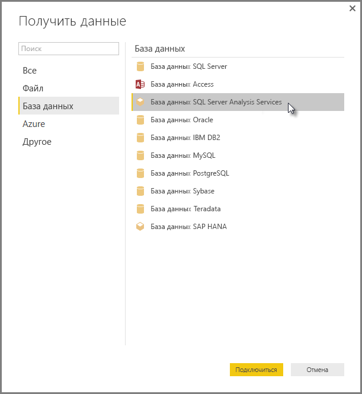

# Подключение к многомерным моделям SSAS в Power BI Desktop
С помощью Power BI Desktop вы можете получить доступ к **многомерным моделям SSAS**, которые обычно называются **SSAS MD**.

Для подключения к базе данных **SSAS MD** выберите **Получить данные &gt; База данных &gt; База данных SQL Server Analysis Services**, как показано на следующем рисунке.

**Многомерные модели SSAS** в режиме активного подключения поддерживаются как в службе Power BI, так и в Power BI Desktop. Вы также можете опубликовать и отправить в службу Power BI отчеты, использующие **многомерные модели SSAS** в режиме активного подключения.

## Функции и возможности многомерных моделей SSAS
В следующих разделах описаны функции и возможности Power BI и подключений к многомерным моделям SSAS.

### Табличные метаданные многомерных моделей
В таблице ниже продемонстрировано соответствие между многомерными объектами и табличными метаданными, возвращаемыми приложением Power BI Desktop. Power BI запрашивает табличные метаданные у моделей и использует полученную информацию при отправке соответствующих запросов DAX в службы Analysis Services, когда вы создаете визуализации (например, таблицы, матрицы, диаграммы или срезы).

| Многомерный объект BISM | Табличные метаданные |
| --- | --- |
| Куб |Модель |
| Измерение куба |Таблица |
| Атрибуты измерения (ключи, имя) |Столбцы |
| Группа мер |Таблица |
| Мера |Мера |
| Меры без связи с группами мер |В таблице *Меры* |
| Связь между группой мер и измерением куба |Связь |
| Перспектива |Перспектива |
| КПЭ |КПЭ |
| Пользовательские иерархии и иерархии «родители-потомки» |Иерархии |

### Меры, группы мер и КПЭ
Группы мер в многомерном кубе доступны в Power BI как таблицы с ведущим знаком ∑ в области **Поля** . Вычисляемые меры, с которыми не связаны группы мер, собраны в специальной таблице под названием *Меры* в табличных метаданных.

В многомерной модели можно задать набор мер или КПЭ в кубе в *папке отображения*, что помогает упростить сложные модели. Power BI распознает папки отображения в табличных метаданных и показывает меры и КПЭ в таких папках. КПЭ в многомерных базах данных поддерживают *значения*, *цели*, *изображения состояния* и *изображения тренда*.

### Тип атрибутов измерения
Многомерные модели также поддерживают возможность связывания атрибутов измерений с определенными типами атрибутов. Например, в табличных метаданных доступно измерение **география** , в котором атрибуты *Город*, *Область или край*, *Страна* и *почтовый индекс* связаны с соответствующими географическими типами. Power BI распознает метаданные, что позволяет создавать визуализации в виде карт. Соответствующие связи помечены значком *карта* рядом с соответствующим элементом в области **Поле** в Power BI.

Power BI также может выводить изображения при наличии поля, содержащего их URL-адреса. Такие поля имеют тип *ImageURL* в приложении SQL Server Data Tools (и, соответственно, в Power BI), а сведения об этом типе передаются в Power BI в табличных метаданных. Power BI может загружать такие изображения по URL-адресу и выводить их в визуальных элементах.

### Иерархии «родители-потомки»
Многомерные модели поддерживают иерархии «родители-потомки» ( *иерархия* в табличных метаданных). Каждый уровень иерархии «родители-потомки» представлен в табличных метаданных в виде скрытого столбца. Ключевой атрибут измерения типа «родители-потомки» в табличных метаданных недоступен.

### Вычисляемые элементы измерения
Многомерные модели поддерживают возможность создания *вычисляемых элементов*различных типов. Ниже перечислены два самых распространенных типа таких элементов.

* Вычисляемые элементы иерархий атрибутов, не имеющего общего родителя с элементом *Все*
* Вычисляемые элементы пользовательских иерархий

*Вычисляемые элементы иерархий атрибутов* доступны в многомерных моделях в качестве значений столбца. Для вычисляемых элементов такого типа существует еще несколько ограничений и параметров.

* У атрибута измерения может быть необязательный неизвестный элемент *UnknownMember*.
* Атрибут, содержащий вычисляемые элементы, не может быть ключевым атрибутом измерения, если не является его единственным атрибутом.
* Атрибут, содержащий вычисляемые элементы, не может быть атрибутом иерархии «родители-потомки».

Вычисляемые элементы пользовательских иерархий не видны в Power BI. Вы можете подключиться к кубу, содержащему вычисляемые элементы в пользовательских иерархиях, но не сможете увидеть эти элементы, если они не соответствуют ограничениям, перечисленным в списке выше.

### Безопасность
В многомерных моделях безопасность на уровне измерений и ячеек реализована с помощью *ролей*. При подключении к кубу с помощью Power BI выполняется проверка подлинности и наличия необходимых разрешений. Когда для пользователя действует *безопасность измерения* , элементы соответствующего измерения не видны ему в Power BI. Однако когда для пользователя определено разрешение *безопасности ячейки* , в соответствии с которым ограничен доступ к определенным ячейкам, этот пользователь не может подключиться к кубу с помощью Power BI.

## Ограничения многомерных моделей SSAS в Power BI Desktop
На использование **SSAS MD**налагаются некоторые ограничения.

* Для правильной работы соединителя SSAS MD Power BI Desktop на серверах должны работать службы Analysis Services SQL Server 2012 с пакетом обновления 1 (SP1) и накопительным пакетом обновления 4 (CU4) или более поздней версии
* Из Power BI недоступны *действия* и *именованные наборы* , но вы можете подключаться к кубам, которые их содержат, и создавать визуальные элементы и отчеты. ****

## Поддерживаемые возможности для работы с многомерными моделями SSAS в Power BI Desktop
В Power BI Desktop поддерживаются перечисленные ниже возможности для работы с многомерными моделями SSAS.

* В этом выпуске **SSAS MD** поддерживается использование следующих элементов (см. [дополнительные сведения](https://msdn.microsoft.com/library/jj969574.aspx) об этих функциях):
  * папки отображения;
  * тенденции ключевых показателей эффективности;
  * элементы по умолчанию;
  * атрибуты измерения;
  * вычисляемые элементы измерения (это должен быть единственный действительный элемент, если измерение имеет несколько атрибутов, это не может быть ключевой атрибут измерения, если только он не является единственным атрибутом, и это не может быть родительский-дочерний атрибут);
  * типы атрибутов измерения;
  * Иерархии
  * меры (с группами мер или без них);
  * меры как данные Variant;
  * ключевые показатели эффективности;
  * URL-адреса изображений;
  * безопасность измерения.

