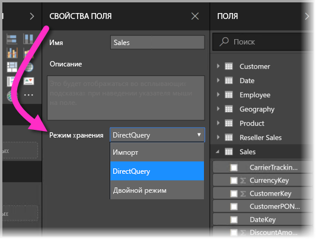
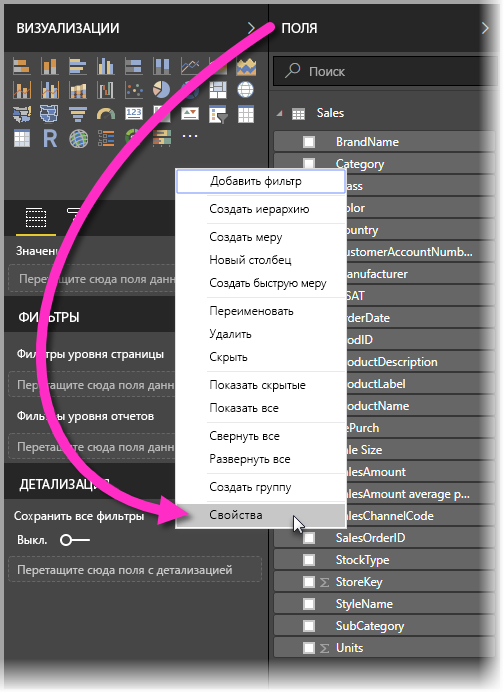
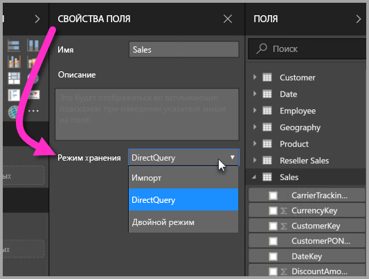

# Режим хранения в Power BI Desktop (предварительная версия)

В **Power BI Desktop** можно указать **режим хранения** для таблиц, который позволяет указывать, будут ли табличные данные кэшироваться в памяти для отчетов. 

Использование **режима хранения** предоставляет много возможностей. Можно указать **режим хранения** для каждой отдельной таблицы в модели, тем самым позволяя одному набору данных использовать одно или несколько следующих преимуществ:

* **Производительность запросов** — по мере взаимодействия пользователей с визуальными элементами в отчетах Power BI запросы DAX отправляются к набору данных. Кэширование данных в память путем надлежащей настройки **режима хранения** помогает значительно повысить производительность и улучшить интерактивность отчетов.
* **Большие наборы данных** — таблицы, которые не кэшируются, не потребляют память для кэширования. Можно включить интерактивный анализ для больших наборов данных, которые слишком велики или дороги для полного кэширования в память. Также можно указать, какие таблицы следует кэшировать, а какие нет.
* **Оптимизация обновления данных** — таблицы, которые не кэшируются, не нужно обновлять. Можно сократить время обновления, кэшируя только необходимые данные для соблюдения соглашений об уровне обслуживания и бизнес-требований.
* **Требование использования практически в реальном времени** — таблицы с требованием использования практически в реальном времени могут выиграть от отсутствия кэширования, что уменьшает задержку при передаче данных.
* **Обратная запись** — обратная запись позволяет бизнес-пользователям исследовать сценарии гипотез, изменяя значения ячеек. Пользовательские приложения могут применять изменения к источнику данных. Таблицы, которые не кэшируются, могут отражать изменения немедленно, позволяя быстро анализировать результаты.

Функция **режима хранения** в **Power BI Desktop** является одной из трех связанных функций:

* **Составные модели** — позволяют включить в отчет несколько подключений к данным, в том числе подключения DirectQuery или импорт, в любой комбинации.
* **Связи "многие ко многим"** — с помощью **составных моделей** можно устанавливать **связи "многие ко многим"** между таблицами, устраняя требования к уникальным значениям в таблицах и необходимость в прежних решениях, таких как введение новых таблиц только для установления связей. 
* **Режим хранения** — теперь можно указать, какие визуальные элементы требуют запроса к внутренним источникам данных. Визуальные элементы, которым запрос не требуется, импортируются, даже если они основаны на DirectQuery. Это позволяет повысить производительность и снизить нагрузку на серверную часть решения. Ранее даже простые визуальные элементы, например срезы, инициировали запросы к серверным источникам. 

Все три связанные функции этой коллекции для **составных моделей** описаны в отдельных статьях:

* **Составные модели** подробно описаны в отдельной статье [Составные модели в Power BI Desktop (предварительная версия)](desktop-composite-models.md).
* **Связи "многие ко многим"** описаны в отдельной статье [Связи "многие ко многим" в Power BI Desktop (предварительная версия)](desktop-many-to-many-relationships.md).
* **Режим хранения** подробно описан в этой статье.

## Включение предварительной версии функции режима хранения

Функция **режима хранения** доступна в режиме предварительной версии, поэтому ее необходимо сначала включить в **Power BI Desktop**. Чтобы включить **режим хранения**, выберите **Файл > Параметры и настройки > Параметры > Предварительная версия функций** и установите флажок **Составные модели**. 

Чтобы включить эту функцию, нужно перезапустить **Power BI Desktop**.

## Использование свойства режима хранения

**Режим хранения** — это свойство, которое можно задать для каждой таблицы в модели. Чтобы задать **режим хранения**, выберите таблицу в области **Поля** и щелкните правой кнопкой мыши, чтобы вызвать контекстное меню. В контекстном меню выберите **Свойства**.

Выбранный **режим хранения** отобразится в области **Свойства поля** для таблицы. Здесь можно просмотреть текущий **режим хранения** или изменить его.

Для **режима хранения** доступны три значения:

* **Импорт** — при заданном значении **Импорт** импортированные таблицы кэшируются. Запросы, отправленные к набору данных Power BI, которые возвращают данные из таблиц импорта, могут быть выполнены только из кэшированных данных.
* **DirectQuery** — при этой настройке таблицы DirectQuery не кэшируются. Запросы, отправленные к набору данных Power BI (например, запросы DAX), которые возвращают данные из таблиц DirectQuery, могут быть выполнены только путем выполнения запросов по требованию к источнику данных. В запросах, отправленных к источнику данных, используется язык запросов этого источника (например, SQL).
* **Двойной** — двойные таблицы могут функционировать как кэшированные или некэшированные, в зависимости от контекста запроса, отправленного к набору данных Power BI. В некоторых случаях запросы выполняются из кэшированных данных; в других случаях они выполняются путем выполнения запроса по требованию к источнику данных.

Переключение таблицы в режим импорта является *необратимой* операцией; таблицу нельзя будет перевести обратно в режим DirectQuery или двойной режим.

## Ограничения для таблиц DirectQuery и двойных таблиц

К двойным таблицам применяются те же ограничения, что и к таблицам DirectQuery. К ним относятся ограниченный набор М-преобразований и ограниченные функции DAX в вычисляемых столбцах. Дополнительные сведения см. в разделе о [следствиях использования DirectQuery](desktop-directquery-about.md#implications-of-using-directquery).

## Правила связей в таблицах с разными режимами хранения

Связи должны соответствовать правилам в зависимости от **режима хранения** связанных таблиц. В этом разделе приведены примеры допустимых сочетаний. Полные сведения см. в статье о [связях "многие ко многим" в Power BI Desktop (предварительная версия)](desktop-many-to-many-relationships.md).

В наборе данных с одним источником данных допустимы следующие сочетания связей **один ко многим**:

| Таблица на стороне **многих** | Таблица на стороне **1** |
| ------------- |----------------------| 
| Двойной режим          | Двойной режим                 | 
| Импорт        | Импорт или двойной режим       | 
| DirectQuery   | DirectQuery или двойной режим  | 

## Распространение двойного режима
Давайте рассмотрим пример. Возьмем следующую простую модель, где все таблицы поступают из единого источника, поддерживающего режим импорта и DirectQuery.

Для начала предположим, что все таблицы в этой модели являются таблицами DirectQuery. Если мы затем изменим **режим хранения** таблицы *SurveyResponse* на импорт, отобразится следующий запрос:

Для таблиц измерений (*Customer*, *Date* и *Geography*) нужно выбрать режим **Двойной**, чтобы обеспечить соответствие с описанными ранее правилами связей. Чтобы не настраивать требование заблаговременно задавать для этих таблиц **двойной** режим, можно выполнить одну операцию.

Логика распространения помогает управлять моделями, которые содержат большое количество таблиц. Предположим, у вас есть модель с 50 таблицами, и только некоторые таблицы фактов (транзакционные таблицы) нужно кэшировать. Логика в **Power BI Desktop** определяет минимальный набор таблиц измерений, которым нужно задать **двойной** режим, поэтому вам не нужно об этом беспокоиться.

Логика распространения обрабатывает только одну сторону в рамках связей **один ко многим**.

* Изменение таблицы *Customer* с переводом в режим **Импорт** (вместо изменения *SurveyResponse*) не допускается из-за ее связей с таблицами DirectQuery *Sales* и *SurveyResponse*.
* Изменение таблицы *Customer* с переводом в режим **Двойной** (вместо изменения *SurveyResponse*) разрешено. Логика распространения при этом также задает для таблицы *Geography* **двойной** режим.

## Пример использования режима хранения
Давайте продолжим работу с примером из предыдущего раздела и представим, что мы применяем следующие параметры свойств **режима хранения**:

| Таблица                   | Режим хранения         |
| ----------------------- |----------------------| 
| *Sales*                 | DirectQuery          | 
| *SurveyResponse*        | Импорт               | 
| *Date*                  | Двойной режим                 | 
| *Customer*              | Двойной режим                 | 
| *Geography*             | Двойной режим                 | 

Применение таких параметров свойств режима хранения приводит к следующему поведению, если предположить, что в таблице *Sales* содержится значительный объем данных.
* Таблицы измерений (*Date*, *Customer* и *Geography*) кэшируются, поэтому изначальное время загрузки отчетов должно быть небольшим при получении значений срезов для отображения.
* Отсутствие кэширования таблицы *Sales* приводит к следующим результатам:
    * время обновления данных и потребление памяти сокращается;
    * запросы отчетов на основе таблицы *Sales* выполняются в режиме DirectQuery, что может занимать больше времени, но практически в реальном времени, так как не добавляется задержка на кэширование.

* Запросы отчетов на основе таблицы *SurveyResponse* возвращаются из кэша в памяти и поэтому должны выполняться относительно быстро.

## Запросы, попадающие или не попадающие в кэш

Подключив **SQL Profiler** к порту диагностики **Power BI Desktop**, можно увидеть, какие запросы попадают или не попадают в кэш в памяти, выполняя трассировку на основе следующих событий:

* Queries Events\Query Begin
* Query Processing\Vertipaq SE Query Begin
* Query Processing\DirectQuery Begin

Для каждого события *Query Begin* проверьте другие события с таким же идентификатором *ActivityID*. Например, если событие *DirectQuery Begin* отсутствует, но есть событие *Vertipaq SE Query Begin*, это значит, что ответ на запрос поступил из кэша.

Запросы, которые обращаются к таблицам в **двойном** режиме, возвращают данные из кэша по возможности, в противном случае они направляются к DirectQuery.

Продолжая предыдущий пример, следующий запрос обращаются только к столбцу из таблицы *Date* в **двойном** режиме. Таким образом, он должен попасть в кэш.

Следующий запрос обращается только к столбцу из таблицы *Sales* в режиме **DirectQuery**. Таким образом, он *не* должен попасть в кэш.

Следующий запрос примечателен тем, что в нем сочетаются оба столбца. Этот запрос не попадет в кэш. Изначально вы могли ожидать получение значений *CalendarYear* из кэша и значений *SalesAmount* из источника с последующим объединением результатов, но это будет менее эффективно, чем отправка операции SUM/GROUP BY в систему источника. Если операция будет принудительно отправлена в источник, количество возвращенных строк будет гораздо меньше. 

> [!NOTE]
> Это поведение отличается от [связей "многие ко многим" в Power BI Desktop (предварительная версия)](desktop-many-to-many-relationships.md) при объединении кэшированных и некэшированных таблиц.

## Кэши должны поддерживаться в синхронизированном состоянии

Запросы, отображенные в предыдущем разделе, показывают, что таблицы в **двойном** режиме иногда попадают в кэш, а иногда не попадают. Из-за этого, если кэш устареет, могут быть возвращены разные значения. При выполнении запроса не производится попытка скрыть проблемы с данными, например фильтрацией результатов DirectQuery для соответствия кэшированным значениям. Предполагается, что у вы знаете характеристики своих потоков данных, чтобы в соответствии с этим выполнять разработку. При необходимости можно воспользоваться установленными методами обработки таких ситуаций на стороне источника.

**Двойной** режим хранения — это способ оптимизировать производительность. Его следует использовать так, чтобы это не затронуло возможность удовлетворения бизнес-требований. Для реализации альтернативного поведения рекомендуется использовать приемы, описанные в статье [Связи "многие ко многим" в Power BI Desktop (предварительная версия)](desktop-many-to-many-relationships.md).

## Представление данных
Если хотя бы для одной таблицы в наборе данных установлен **режим хранения** "Импорт" или "Двойной", отображается вкладка **Представление данных**.

При выборе в *представлении данных** таблиц в **двойном** режиме или режиме **импорта** отображаются кэшированные данные. Таблицы DirectQuery не отображают данные. Вместо этого отображается сообщение о том, что таблицы DirectQuery не могут быть показаны.

## Рекомендации и ограничения

В этом выпуске **режима хранения** есть несколько ограничений. Также следует учитывать его связь с **составными моделями**.

Следующие многомерные источники нельзя использовать с **составными моделями**:

* SAP HANA
* SAP Business Warehouse
* Службы SQL Server Analysis Services
* Наборы данных Power BI

При подключении к этим многомерным источникам с помощью DirectQuery нельзя также подключиться к другому источнику DirectQuery или сочетать их с импортированными данными.

Существующие ограничения для использования DirectQuery по-прежнему применяются при применении **составных моделей**. Многие из этих ограничений теперь относятся к таблице в зависимости от **режима хранения** этой таблицы. Например, вычисляемый столбец в импортированной таблице может ссылаться на другие таблицы, но вычисляемый столбец в таблице DirectQuery по-прежнему ограничен ссылками только на столбцы той же таблицы. Другие ограничения применяются к модели в целом, если все таблицы в пределах модели являются таблицами DirectQuery. Например, функции **Краткая аналитика** и **Вопросы и ответы** недоступны в модели, если какая-либо из таблиц в ней используется в **режиме хранения** DirectQuery. 

## Дальнейшие действия

В следующих статьях содержатся дополнительные сведения о составных моделях, а также подробно описан режим DirectQuery:

* [Составные модели в Power BI Desktop (предварительная версия)](desktop-composite-models.md)
* [Связи "многие ко многим" в Power BI Desktop (предварительная версия)](desktop-many-to-many-relationships.md)

Статьи о DirectQuery:

* [Использование DirectQuery в Power BI](desktop-directquery-about.md)
* [Источники данных, поддерживаемые DirectQuery в Power BI](desktop-directquery-data-sources.md)

