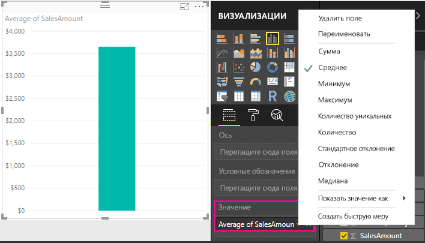
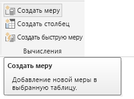
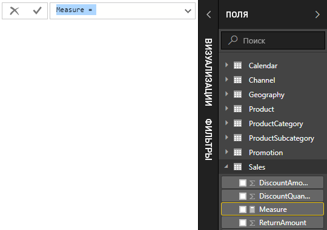
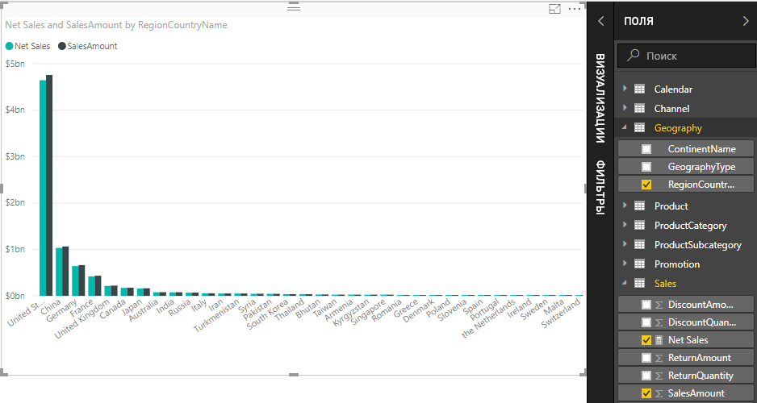
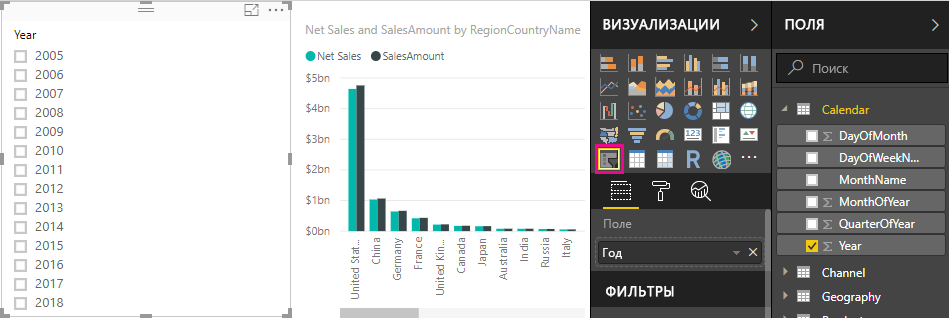
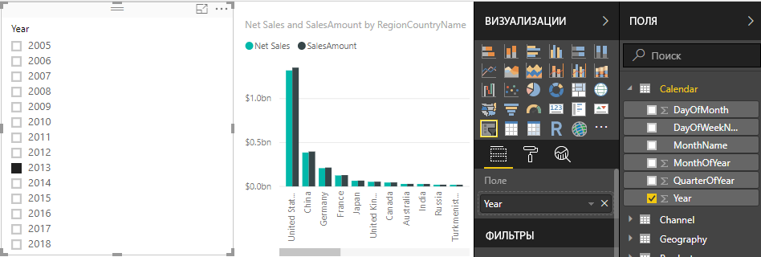

# Учебник. Создание собственных мер в Power BI Desktop
Некоторые эффективные решения для анализа данных в Power BI Desktop можно создать, используя меры. Меры полезны тем, что они выполняют вычисления с вашими данными, когда вы работаете с отчетами. В этом руководстве объясняется, что такое меры, и как создать несколько собственных базовых мер в Power BI Desktop.

### Предварительные требования
- Это руководство предназначено для пользователей Power BI, которые знают, как использовать Power BI Desktop для создания более сложных моделей. Вы должны уметь использовать запрос для импорта данных, работать с несколькими связанными таблицами и добавлять поля на холст отчета. Если вы еще не знакомы с Power BI Desktop, прочтите статью [Начало работы с Power BI Desktop](desktop-getting-started.md).
  
- Скачайте файл [Contoso Sales Sample for Power BI Desktop](http://download.microsoft.com/download/4/6/A/46AB5E74-50F6-4761-8EDB-5AE077FD603C/Contoso%20Sales%20Sample%20for%20Power%20BI%20Desktop.zip), который содержит данные по продаже товаров через Интернет вымышленной компании Contoso, Inc. Так как эти данные импортированы из базы данных, вы не сможете подключаться к источнику данных или просматривать его в редакторе запросов. Извлеките файл на своем компьютере и откройте его в Power BI Desktop.

## Общие сведения о мерах

Чаще всего меры создаются автоматически. В файле Contoso Sales Sample установите флажок рядом с полем **SalesAmount** в таблице **Продажи** в области полей или перетащите **SalesAmount** на холст отчета. Отобразится новая визуализация в виде гистограммы, на которой показана сума всех значений в столбце SalesAmount таблицы "Продажи".

В области полей каждое поле со значком "сигма"  является числовым. С его значениями можно выполнять статистические вычисления. Чтобы не выводить таблицу с двумя миллионами строк значений SalesAmount, Power BI Desktop определяет числовой тип данных, а затем автоматически создает и вычисляет меру для статистической обработки данных. Сумма — это функция статистической обработки по умолчанию для числовых данных. Но вы можете легко применить другой тип, например вычисление среднего значения или подсчет. Без понимания статистических вычислений вы не сможете работать с мерами, так как каждая мера выполняет статистическое вычисление определенного типа. 

Чтобы для диаграммы изменить тип статистических вычислений на вычисление среднего значения, в области **Значение** на панели визуализаций щелкните стрелку вниз рядом с **SalesAmount** и выберите **Среднее**. Тогда визуализация изменится и будет отображать среднее значение всех продаж в поле SalesAmount.

Вы можете изменять тип статистического вычисления в зависимости от требуемого результата, но не все типы применяются к каждому числовому типу данных. Например, для поля SalesAmount имеет смысл вычислить сумму и среднее значение. Также может применяться вычисление максимального и минимального значения. Но подсчет количества для поля SalesAmount не имет смысла, так как хотя его значения и числовые, они представляют денежные значения.

Значения, вычисленные из мер, изменяются по мере работы с отчетом. Например, если перетащить поле **RegionCountryName** из таблицы **География** на диаграмму, то для каждой страны отобразится среднее значение объема продаж.

Когда в результате работы с отчетом изменяется результат меры, вы влияете на *контекст* меры. Каждый раз при взаимодействии с визуализациями отчетов вы изменяете контекст, в котором вычисляются и отображаются результаты меры.

## Создание и использование собственных мер

В большинстве случаев Power BI автоматически вычисляет и возвращает значения в зависимости от выбранных вами типов полей и статистических вычислений. Но в некоторых случаях требуется создавать собственные меры для более сложных или особых вычислений. С помощью Power BI Desktop вы можете создавать собственные меры на языке формул DAX. 

В формулах DAX используются многие функции, операторы и синтаксис из формул Excel. Но функции DAX предназначены для работы с реляционными данными и выполнения более динамических вычислений по мере вашей работы с отчетами. Существует более 200 функций DAX, которые делают все: от простых вычислений, таких как подсчет суммы и среднего значения, до более сложных статистических функций и функций фильтрации. Доступно множество материалов по DAX. Закончив работу с этим руководством, обязательно ознакомьтесь со статьей [Основные сведения о DAX в Power BI Desktop](desktop-quickstart-learn-dax-basics.md).

Когда вы создаете собственную меру, она добавляется в список полей для выбранной вами таблицы. Такая мера называется *моделью*. Одно из главных преимуществ мер модели заключается в том, что вы можете присвоить им любое имя, упрощая их определение. Кроме того, меры можно использовать в качестве аргументов в других выражениях DAX. Также можно создавать меры, которые очень быстро выполняют сложные вычисления.

>[!TIP]
>Начиная с выпуска Power BI Desktop за февраль 2018 г., большинство стандартных вычислений доступны в виде **быстрых мер**. Они позволяют создавать формулы DAX на основе входных данных, которые вы вводите в диалоговом окне. Эти быстрые и эффективные вычисления также отлично подходят для изучения DAX или присвоения начальных значений для своих пользовательских мер. Чтобы создать или просмотреть быстрые меры, выберите **Новая быстрая мера** в списке **Дополнительные параметры** таблицы или в разделе **Вычисления** вкладки "Главная" на ленте. Дополнительные сведения о создании и использовании быстрых мер см. в статье [Использование быстрых мер для простого выполнения стандартных и мощных вычислений](desktop-quick-measures.md).

### Создание меры

Предположим, что вам нужно проанализировать чистую выручку от продаж, вычтя скидки и возвраты из общей суммы продаж. Вам потребуется мера, которая независимо от контекста в визуализации должна вычесть сумму DiscountAmount и ReturnAmount из суммы SalesAmount. В списке полей нет поля с именем Net Sales. Но есть стандартные блоки, с помощью которых можно создать собственную меру для вычисления чистой выручки от продаж. 

1.  В области полей щелкните правой кнопкой мыши таблицу **Продажи** или наведите на нее указатель и щелкните многоточие (...) — пункт **Дополнительные параметры**, а затем выберите **Новая мера**. Новая мера будет сохранена в таблице продаж, где ее будет проще найти.
    
    
    
    Вы также можете создать меру, нажав кнопку **Создать меру** на вкладке "Главная" ленты в Power BI Desktop.
    
    
    
    >[!TIP]
    >Если мера создается с помощью ленты, такую меру можно создать в любой таблице. Но меру будет проще найти, если создать ее в той таблице, в которой она будет использоваться. В нашем случае сначала выберите таблицу "Продажи", чтобы сделать ее активной, а затем щелкните **Новая мера**. 
    
    В верхней части холста отчета появится строка формул, в которой можно переименовать меру и ввести формулу DAX.
    
    
    
2.  По умолчанию новая мера получает имя Measure. Если ее не переименовать, другие новые меры получат имена Measure 2, Measure 3 и т. д. Чтобы меру было проще определить, выделите **Measure** в строке формул и введите **Net Sales**.
    
3.  Теперь вы можете ввести свою формулу. После знака равенства начните вводить **SUM**. По мере ввода отобразится раскрывающийся список предложений со всеми функциями DAX, начинающимися с веденной вами буквы. Прокрутите список вниз, если в нем нужно выбрать **SUM**, и нажмите клавишу "ВВОД".
    
    
    
    Появится открывающая скобка вместе со списком предложений всех доступных столбцов, которые можно передать в функцию SUM.
    
    
    
    Выражения всегда появляются между открывающей и закрывающей скобкой. В нашем случае выражение будет содержать один аргумент, передаваемый в функцию SUM — столбец SalesAmount. Начните вводить текст SalesAmount, пока в списке не останется только одно значение: Sales(SalesAmount). Имя столбца, которому предшествует имя таблицы, называется *полным именем* столбца. Полные имена столбцов делают формулы более удобными для чтения. 
    
    
    
4. Выберите **Sales[SalesAmount]**, а затем введите закрывающую скобку.
    
    > [!TIP]
    > Синтаксические ошибки чаще всего бывают вызваны отсутствующей или неправильно расположенной закрывающей скобкой.
    
    
    
5.  Чтобы вычесть два другие столбца, сделайте следующее:
    1. После закрывающей круглой скобки для первого выражения введите пробел, затем оператор "минус" (**-**) и еще один пробел. 
    2. Введите другую функцию SUM и начните вводить текст DiscountAmount, пока не отобразится имя столбца **Sales[DiscountAmount]**, которое нужно выбрать в качестве аргумента. Добавьте закрывающую круглую скобку. 
    3. Введите пробел, еще один оператор "минус", пробел, еще одну функцию SUM со столбцом **Sales[ReturnAmount]** в качестве аргумента и закрывающую круглую скобку.
    
    
    
6.  Нажмите клавишу "ВВОД" или кнопку с галочкой в строке формул, чтобы завершить и проверить формулу. Теперь проверенная мера готова к использованию в списке полей для таблицы "Продажи". 
    
    
    
Если при вводе формулы вам не хватило места или нужно разделить формулу на несколько строк, щелкните шеврон вниз справа от строки формулы, чтобы появилось больше места.

Вы можете разделить части формулы на разные строки, нажимая клавиши **ALT+ВВОД** или перемещаясь по строке с помощью клавиши **TAB**.

### Использование меры в отчете
Теперь можно добавить меру Net Sales на холст отчета, чтобы вычислять чистую выручку от продаж независимо от других полей, добавляемых в отчет. Чтобы посмотреть чистую выручку от продаж по странам, сделайте следующее:

1. Выберите меру **Net Sales** в таблице **Продажи**, чтобы перетащить ее на холст отчета.
    
2. Выберите поле **RegionCountryName** в таблице **География** и перетащите его на диаграмму.
    
    
    
Чтобы увидеть разницу между чистой выручкой от продаж и суммой продаж по странам, выберите поле **SalesAmount** и перетащите его на диаграмму. 

Теперь в диаграмме используются две меры: SalesAmount, которая суммировалась автоматически, и созданная вами мера Net Sales. Каждая мера вычисляется в контексте другого поля — RegionCountryName.
    
### Использование меры со срезом

Вы можете добавить срез, чтобы можно было фильтровать суммы чистой выручки от продаж и суммы продаж по календарным годам.
    
1.  Щелкните пустое место рядом с диаграммой, затем в области **Визуализации** выберите визуализацию **Таблица**. На холсте отчета будет создано пустое представление таблицы.
    
    
    
2.  Перетащите поле **Year** из таблицы **Календарь** в новую пустую визуализацию таблицы. Так как Year — это числовое поле, Power BI Desktop суммирует его значения, но это ничего не дает для статистических вычислений. 
    
    
    
3.  В области **Значения** на панели визуализаций щелкните стрелку вниз рядом со столбцом **Year**, а затем выберите **Не суммировать**. Теперь в таблице отображаются отдельные годы.
    
    
    
4.  Выберите значок **среза** на панели "Визуализации", чтобы преобразовать таблицу в срез.

    
    
5.  Выберите любое значение в срезе **Year**, чтобы отфильтровать диаграмму **Чистая выручка от продаж и сумма продаж по странам** соответствующим образом. Меры Net Sales и SalesAmount вычисляются заново и показывают результаты только в контексте выбранного поля года. 
    
    

### Использование меры в другой мере

Если нужно узнать, какие продукты имели самую высокую выручку от продаж на единицу, вам потребуется мера, которая разделит чистую выручку от продаж на количество проданных единиц. Вы можете создать меру, которая разделит результат меры Net Sales на сумму Sales[SalesQuantity].

1.  Создайте меру с именем **Net Sales per Unit** в таблице "Продажи".
    
2.  В строке формул начните вводить **Net Sales**. В списке предложений отобразятся варианты, которые можно добавить. Выберите **[Net Sales]**.
    
    
    
    Можно также сослаться на меру, введя только открывающую квадратную скобку (**[**). В списке предложений отобразятся только меры, которые можно добавить в формулу.
    
    
    
3.  Введите пробел, оператор деления (**/**), еще одни пробел, функцию SUM, а затем введите **Quantity**. В списке предложений отобразятся все столбцы со словом Quantity в имени. Выберите **Sales[SalesQuantity]**, введите закрывающую скобку и нажмите клавишу "ВВОД" или кнопку с галочкой, чтобы проверить формулу. Формула должна выглядеть следующим образом:
    
    `Net Sales per Unit = [Net Sales] / SUM(Sales[SalesQuantity])`
    
4. Выберите меру **Net Sales per Unit** в таблице "Продажи" или перетащите меру в пустую область на холсте отчета. На диаграмме показана сумма чистой выручки от всех продаж на единицу товара, что не очень информативно. 
    
    
    
5. Чтобы получить другое представление, измените тип визуализации диаграммы на **Диаграмма дерева**.
    
    
    
6. Выберите поле **ProductCategory**  или перетащите его на древовидную диаграмму или в поле "Группа" на панели "Визуализации". Эти сведения уже представляют интерес.
    
    
    
7. Попробуйте удалить поле **ProductCategory**, а вместо него перетащить поле **ProductName** на диаграмму. 
    
    
    
Сейчас мы просто забавляемся, но нужно признать, что это здорово! Попробуйте другие способы фильтрации и форматирования визуализации.

## Что вы узнали
Меры увеличивают возможности получения аналитической информации из данных. Вы узнали, как создавать меры с помощью строки формул, присваивать им имена, которые более удобны для работы, искать и выбирать нужные элементы формулы с помощью списка предложений DAX. Вы также ознакомились с понятием контекста, в котором результаты вычислений в мерах изменяются в соответствии с другими полями или другими выражениями в формуле.

## Дальнейшие действия
- Дополнительные сведения о быстрых мерах Power BI Desktop, которые предоставляют много стандартных вычислений, см. в статье [Использование быстрых мер для простого выполнения стандартных и мощных вычислений](desktop-quick-measures.md).
  
- Чтобы более подробно изучить формулы DAX и создавать более сложные меры, см. статью [Основные сведения о DAX в Power BI Desktop](desktop-quickstart-learn-dax-basics.md). В этой статье описываются основные понятия языка DAX, такие как синтаксис, функции, и дается более глубокое объяснение контекста.
  
- Рекомендуется добавить в избранное [справочник по языку выражений анализа данных (DAX)](https://msdn.microsoft.com/library/gg413422.aspx). В нем можно найти подробные сведения о синтаксисе DAX, операторах и более чем о 200 функциях DAX.

