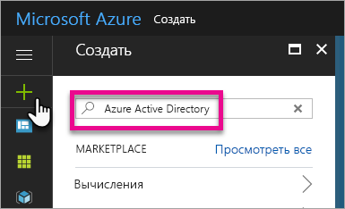
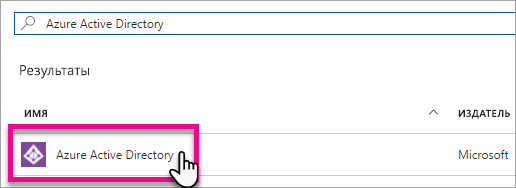
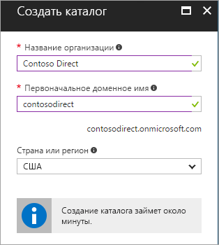
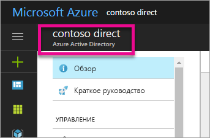
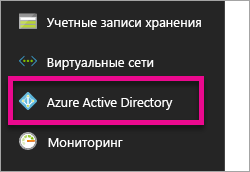
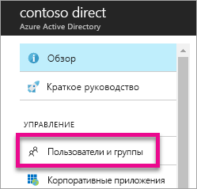
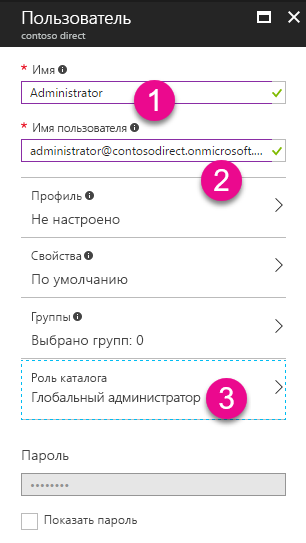
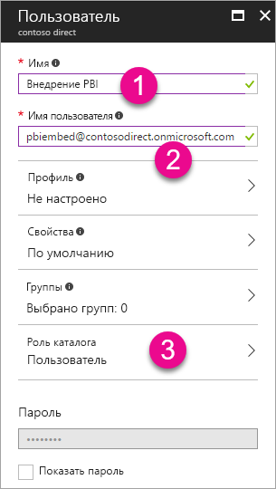

# Создание клиента Azure Active Directory для использования с Power BI
Узнайте, как создать клиент Azure Active Directory (Azure AD) для использования с пользовательским приложением с помощью интерфейсов REST API для Power BI.

Клиент — это представитель организации в Azure Active Directory. Это выделенный экземпляр службы Azure AD, который организация получает и приобретает при регистрации в облачной службе Майкрософт, например Azure, Microsoft Intune или Office 365. Каждый клиент Azure AD уникален и отделен от других клиентов Azure AD.

После получения клиента Azure AD вы можете определить приложение и назначить разрешения, чтобы использовать в приложении интерфейсы REST API для Power BI.

Возможно, у вашей организации уже есть клиент Azure AD, который можно использовать для приложения. Вы можете использовать этот клиент для потребностей приложения или создать клиент специально для вашего приложения. В этой статье рассматривается, как создать клиент.

## Создание клиента Azure Active Directory
Для интеграции Power BI в пользовательское приложение необходимо определить приложение в Azure AD. Для этого нужен каталог в Azure AD. Это и есть ваш клиент. Если у вашей организации еще нет клиента, так как вы не используете Power BI или Office 365, его необходимо создать. Его также может потребоваться создать, если вы не хотите использовать приложение совместно с клиентом вашей организации. Так вы можете хранить все данные по отдельности.

Или можно просто создать клиент для тестирования.

Чтобы создать клиент Azure AD, сделайте следующее:

1. Перейдите на [портал Azure](https://portal.azure.com) и войдите под учетной записью, имеющей подписку Azure.
2. Щелкните **знак плюса (+)** и выполните поиск по запросу *Azure Active Directory*.
   
    
3. Выберите **Azure Active Directory** в результатах поиска.
   
    
4. Выберите **Создать**.
5. Укажите **название организации** вместе с **исходным доменным именем**. После этого выберите **Создать**. Будет создан каталог.
   
    
   
   > [!NOTE]
   > Исходный домен будет частью onmicrosoft.com. Вы можете добавить другие доменные имена позже. Каталогу клиента можно назначить несколько доменов.
   > 
   > 
6. После завершения создания каталога щелкните значок сведений для управления созданным каталогом.

Ваш каталог создан. Теперь необходимо добавить пользователя в клиент.

## Создание пользователей в клиенте Azure Active Directory
Теперь, когда у нас есть каталог, давайте создадим хотя бы двух пользователей. Один пользователь будет назначен глобальным администратором клиента, а другой — главным пользователем для внедрения. Это можно рассматривать как учетную запись службы.

1. На портале Azure убедитесь, что вы находитесь в колонке Azure Active Directory.
   
    
   
    Если нет, щелкните значок Azure Active Directory в левой области служб.
   
    
2. В разделе **Управление** выберите **Пользователи и группы**.
   
    
3. Выберите **Все пользователи**, а затем — **+ Новый пользователь**.
4. Укажите имя для этого пользователя. Это будет глобальный администратор клиента. Вам также необходимо изменить **роль каталога** на *Глобальный администратор*. Вы также можете отобразить временный пароль. Когда все будет готово, выберите **Создать**.
   
    
5. Теперь необходимо выполнить те же действия для обычного пользователя в клиенте. Их также можно использовать для внедрения главной учетной записи. На этот раз мы используем **роль каталога** *Пользователь*. Обязательно запишите пароль. После этого выберите **Создать**.
   
    
6. Зарегистрируйтесь в Power BI с учетной записью пользователя, созданной на шаге 5. Это можно сделать, перейдя на страницу [powerbi.com](https://powerbi.microsoft.com/get-started/) и выбрав **Попробовать бесплатно** в разделе *Power BI — Совместная работа и общий доступ в облаке*.
   
    
   
    При регистрации вам будет предложена бесплатная 60-дневная версия Power BI Pro. Вы можете подписаться на эту версию, чтобы стать пользователем версии Pro. Теперь вы также можете начать разработку внедренного решения, если это необходимо.
   
   > [!NOTE]
   > Зарегистрируйтесь с адресом электронной почты, указанным для учетной записи пользователя.
   > 
   > 

## Дальнейшие действия
Теперь, когда у вас есть клиент Azure AD, вы можете использовать его для тестирования элементов в Power BI или перейти к внедрению панелей мониторинга и отчетов Power BI в приложение. Дополнительные сведения о внедрении элементов см. в статье [Как внедрять панели мониторинга, отчеты и плитки Power BI](embedding-content.md).

[Что такое каталог Azure AD?](https://docs.microsoft.com/azure/active-directory/active-directory-whatis)  
[Как получить клиент Azure Active Directory](https://docs.microsoft.com/azure/active-directory/develop/active-directory-howto-tenant)  

Появились дополнительные вопросы? [Попробуйте задать вопрос в сообществе Power BI.](http://community.powerbi.com/)

