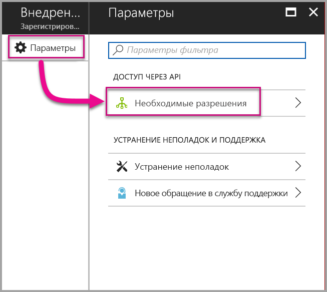
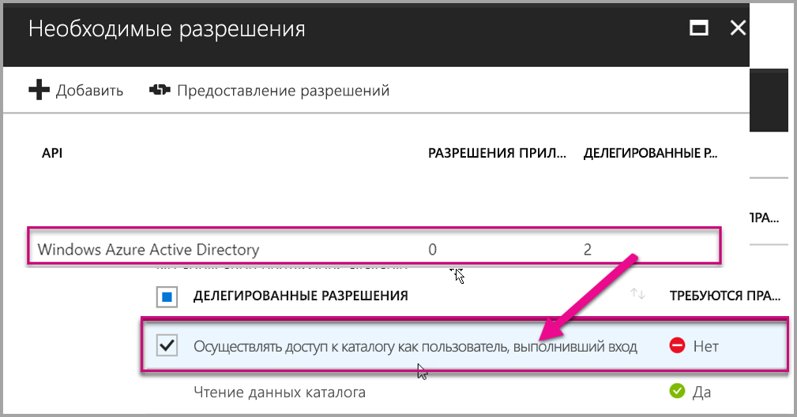
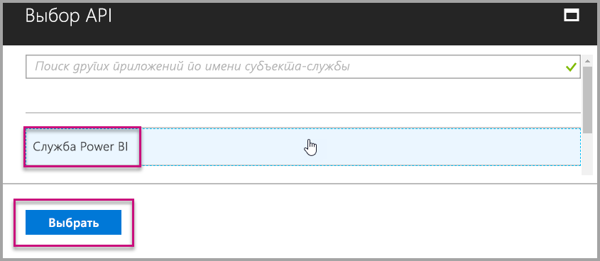
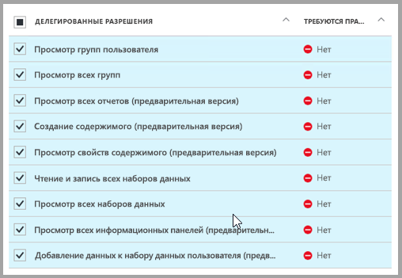
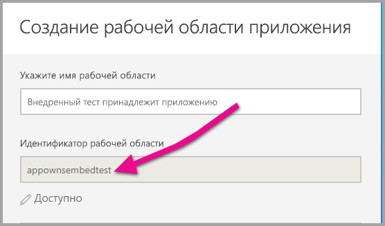
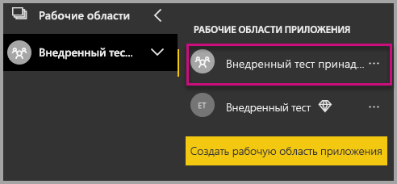
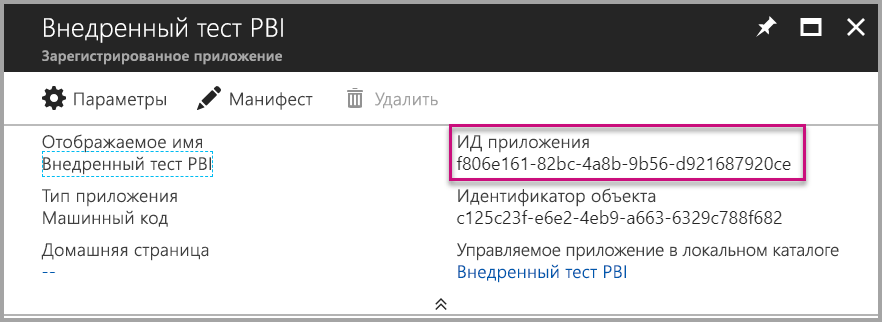

# <a name="tutorial-embed-a-power-bi-report-dashboard-or-tile-into-an-application-for-your-customers"></a>Руководство. Внедрение отчета, панели мониторинга или плитки Power BI в приложение для клиентов
Служба **Power BI Embedded в Azure** позволяет внедрять в приложение отчеты, панели мониторинга и плитки с помощью модели **данных, принадлежащих приложению**. Модель **данных, принадлежащих приложению**, позволяет приложению использовать Power BI как встроенную платформу аналитики. Обычно это сценарий **разработчика и независимого поставщика программного обеспечения**. Как **разработчик и независимый поставщик программного обеспечения** вы можете создавать содержимое Power BI, отображающее отчеты, панели мониторинга или плитки в приложении. При этом приложение будет полностью интегрированным и интерактивным, а пользователям не потребуется лицензия Power BI, и они не будут знать, что это Power BI. Из этого руководства вы узнаете, как правильно интегрировать отчет в приложение с помощью пакета SDK **Power BI** для .NET и API JavaScript **Power BI** в системе, предоставляющей клиентам ресурсы **Power BI Embedded в Azure**  по модели **данных, принадлежащих приложению**.

Из этого руководства вы узнаете, как выполнять следующие задачи:
>[!div class="checklist"]
>* регистрация приложения в Azure;
>* внедрение отчета Power BI в приложение.

## <a name="prerequisites"></a>Предварительные требования
Чтобы начать работу, вам потребуется учетная запись **Power BI Pro** (это ваша **главная учетная запись**) и подписка **Microsoft Azure**.

* Если вы не зарегистрированы в **Power BI**, перед началом работы [пройдите бесплатную регистрацию](https://powerbi.microsoft.com/en-us/pricing/).
* Если у вас нет подписки Azure, перед началом работы [создайте бесплатную учетную запись](https://azure.microsoft.com/free/?WT.mc_id=A261C142F).
* Вам потребуется собственная установка [клиента Azure Active Directory ](create-an-azure-active-directory-tenant.md).
* Также нужно установить [Visual Studio](https://www.visualstudio.com/) 2013 или более поздней версии.

## <a name="setup-your-embedded-analytics-development-environment"></a>Настройка среды разработки для встроенной аналитики

Чтобы внедрить в приложение отчеты, панели мониторинга и плитки, внедрение необходимо настроить в вашей среде. В процессе настройки необходимо выполнить указанные ниже действия.

Воспользуйтесь [средством адаптации](https://aka.ms/embedsetup/AppOwnsData), чтобы быстро приступить к работе и скачать пример приложения, с помощью которого можно создать среду и внедрить отчет.

Если вы решили настроить среду вручную, см. инструкции ниже.
### <a name="register-an-application-in-azure-active-directory-azure-ad"></a>Регистрация приложения в Azure Active Directory

Регистрация приложения в Azure Active Directory нужна для того, чтобы предоставить приложению доступ к REST API Power BI. Это позволит создать удостоверение для приложения и предоставить ему разрешения на доступ к ресурсам REST Power BI.

1. Примите [условия использования API Microsoft Power BI](https://powerbi.microsoft.com/api-terms).

2. Войдите на [портал Azure](https://portal.azure.com).
 
    

3. На панели навигации слева выберите **Все службы**, выберите **Регистрация приложений** и щелкните **Регистрация нового приложения**.
   
    </br>
    

4. Следуя инструкциям на экране, создайте приложение. Чтобы применить модель данных, принадлежащих приложению, необходимо использовать тип **собственного приложения**. Также укажите **универсальный код ресурса (URI) перенаправления**, который требуется **Azure AD** для ответа на запросы маркеров. Это значение уникально для вашего приложения (например, `http://localhost:13526/redirect`).

    

### <a name="apply-permissions-to-your-application-within-azure-active-directory"></a>Предоставление разрешений для приложения в Azure AD

Кроме разрешений, представленных на странице регистрации приложения, потребуется несколько дополнительных разрешений. Вам нужно войти в систему с помощью *главной* учетной записи, используемой для внедрения, или учетной записи глобального администратора.

### <a name="use-the-azure-active-directory-portal"></a>Использование портала Azure Active Directory

1. На портале Azure перейдите к колонке [Регистрация приложений](https://portal.azure.com/#blade/Microsoft_AAD_IAM/ApplicationsListBlade) и выберите приложение, используемое для внедрения.
   
    

2. В разделе **Параметры** откройте **Доступ через API** и выберите **Необходимые разрешения**.
   
    

3. Выберите **Microsoft Azure Active Directory** и затем установите флажок **Осуществляйте доступ к каталогу как пользователь, выполнивший вход**. Нажмите кнопку **Сохранить**.
   
    

4. Нажмите кнопку **Добавить**.

    

5. Щелкните **Select an API** (Выбор API).

    

6. Последовательно выберите **Служба Power BI** и **Выбрать**.

    

7. Установите все разрешения в разделе **Делегированные разрешения**. Их необходимо выбирать по одному. Это позволит сохранить настройки. После завершения щелкните **Сохранить**.
   
    

8. В колонке **Необходимые разрешения** выберите **Предоставить разрешения**.
   
    Действие **Предоставить разрешения** требуется для того, чтобы в *главную учетную запись* не отправлялись запросы на продолжение из Azure AD. Если это действие выполняется с учетной записью глобального администратора, необходимо предоставить разрешения на использование приложения всем пользователям в вашей организации. Если это действие выполняется для *главной учетной записи*, а не для учетной записи глобального администратора, разрешения на использование этого приложения потребуется предоставить только для *главной учетной записи*.
   
    

## <a name="setup-your-power-bi-environment"></a>Настройка рабочей среды Power BI

### <a name="create-an-app-workspace"></a>Создание рабочей области приложения

Если вы планируете внедрить отчеты, панели мониторинга и (или) плитки в приложение для клиентов, необходимо разместить содержимое в рабочей области этого приложения. *Главная* учетная запись должна предоставлять права администратора для рабочей области приложения.

1. Начнем с создания рабочей области. Последовательно выберите **Рабочие области** > **Создать рабочую область приложения**. Именно здесь вы будете размещать содержимое, к которому нужен доступ из приложения.

    

2. Присвойте рабочей области имя. Если соответствующее поле **Workspace ID** (Идентификатор рабочей области) недоступно, измените это имя, чтобы указать уникальный идентификатор. Он также должен стать именем приложения.

    

3. Вы можете выбрать один из доступных вариантов. Если вы выбрали **Общедоступный**, все пользователи организации смогут просматривать содержимое рабочей области. С другой стороны, если выбрать **Частный**, только члены рабочей области смогут просматривать ее содержимое.

    

    После создания группы изменить параметр открытого или закрытого доступа нельзя.

4. Вы также можете задать права для членов рабочей области: разрешить **изменение** содержимого или предоставить доступ **только для просмотра**.

    

5. Добавьте адреса электронной почты сотрудников, которым необходимо предоставить доступ к рабочей области, и нажмите кнопку **Добавить**. Вы не можете добавлять псевдонимы групп, а только отдельных пользователей.

6. Предоставьте каждому пользователю либо права участника, либо администратора. Администраторы могут самостоятельно изменять рабочую область, в том числе добавлять других участников. Участники могут изменять содержимое рабочей области (за исключением тех случаев, когда они имеют доступ только на просмотр). Публиковать приложения могут и администраторы, и участники.

    Теперь можно перейти к просмотру новой рабочей области. После этого служба Power BI создаст рабочую область и откроет ее. Она отображается в списке рабочих областей, в которые вы входите. Администратор может щелкнуть многоточие (…), чтобы вернуться и внести изменения в рабочую область, например добавить новых участников или изменить разрешения.

    

### <a name="create-and-publish-your-reports"></a>Создание и публикация отчетов

Вы можете создавать отчеты и наборы данных с помощью Power BI Desktop, а затем публиковать эти отчеты в рабочей области приложения. У пользователя, публикующего отчеты в рабочей области приложения, должна быть лицензия Power BI Pro.

1. Скачайте пример [демонстрационной версии блога](https://github.com/Microsoft/powerbi-desktop-samples) из GitHub.

    

2. Откройте PBIX-файл с образцом отчета в **Power BI Desktop**.

   

3. Опубликуйте его в **рабочей области приложения**.

   

    Теперь вы можете просмотреть отчет в веб-службе Power BI.

   

## <a name="embed-your-content-using-the-sample-application"></a>Внедрение содержимого с помощью примера приложения

Сделайте следующее, чтобы начать внедрять содержимое, использующее модель данных, принадлежащих приложению.

1. Чтобы приступить к работе, скачайте [пример с данными, принадлежащими приложению](https://github.com/Microsoft/PowerBI-Developer-Samples) из GitHub.

    

2. Откройте файл Web.config из этого примера приложения. Здесь есть пять полей, которые нужно заполнить, чтобы успешно запустить приложение. Это **clientId**, **groupId**, **reportId**, **pbiUsername** и **pbiPassword**.

    

    Укажите в поле **clientId** значение **идентификатора приложения** из **Azure**. Поле **clientId** используется приложением для его идентификации для пользователей, у которых запрашиваются разрешения. Чтобы получить значение **clientId**, выполните следующие действия.

    Войдите на [портал Azure](https://portal.azure.com).

    

    На панели навигации слева выберите **Все службы** и щелкните **Регистрация приложений**.

     Выберите приложение, для которого вам нужно значение **clientId**.

    

    Отобразится **идентификатор приложения**, указанный в поле идентификатора GUID. Поместите этот **идентификатор приложения** в поле **clientId** для приложения.

    

    Укажите в поле **groupId** значение **GUID рабочей области приложения** из Power BI.

    

    Укажите в поле **reportId** значение **GUID отчета** из Power BI.

    

    * Укажите в поле **pbiUsername** имя главной учетной записи Power BI.
    * Укажите в поле **pbiPassword** пароль для главной учетной записи Power BI.

3. Запустите приложение!

    Сначала выберите **Запуск** в **Visual Studio**.

    

    Теперь выберите **Внедрить отчет**. В зависимости от того, какое содержимое вы хотите проверить (отчеты, панели мониторинга или плитки), выберите нужный вариант в приложении.

    

    Теперь вы можете просмотреть отчет в примере приложения.

    

## <a name="embed-your-content-within-your-application"></a>Внедрение содержимого в приложении
Несмотря на то, что шаги по внедрению содержимого можно выполнить с помощью [интерфейсов REST API Power BI](https://docs.microsoft.com/rest/api/power-bi/), примеры кода, описанные в этой статье, созданы с помощью **пакета SDK для .NET**.

Чтобы внедрять содержимое для клиентов в приложении, вам нужно получить **токен доступа** из **Azure AD** для главной учетной записи. Необходимо [получить маркер доступа Azure AD](get-azuread-access-token.md#access-token-for-non-power-bi-users-app-owns-data) для приложения Power BI, использующего **данные, принадлежащие приложению**, прежде чем выполнять вызовы в [REST API Power BI](https://docs.microsoft.com/rest/api/power-bi/).

Для создания клиента Power BI с помощью маркера **доступа** потребуется создать объекта клиента Power BI, что позволит вам работать с интерфейсами [REST API Power BI](https://docs.microsoft.com/rest/api/power-bi/). Для этого **AccessToken** упаковывается в объект ***Microsoft.Rest.TokenCredentials***.

```csharp
using Microsoft.IdentityModel.Clients.ActiveDirectory;
using Microsoft.Rest;
using Microsoft.PowerBI.Api.V2;

var tokenCredentials = new TokenCredentials(authenticationResult.AccessToken, "Bearer");

// Create a Power BI Client object. It is used to call Power BI APIs.
using (var client = new PowerBIClient(new Uri(ApiUrl), tokenCredentials))
{
    // Your code to embed items.
}
```

### <a name="get-the-content-item-you-want-to-embed"></a>Получение элемента содержимого, который нужно внедрить
Вы можете использовать объект клиента Power BI, чтобы получить ссылку на элемент, который требуется внедрить.

Ниже приведен пример кода для получения первого отчета из определенной рабочей области.

*Пример получения элемента содержимого (отчета, панели мониторинга или плитки), который вы хотите внедрить, можно найти в файле Controllers\HomeController.cs в [примере приложения](#embed-your-content-within-a-sample-application).*

```csharp
using Microsoft.PowerBI.Api.V2;
using Microsoft.PowerBI.Api.V2.Models;

// You need to provide the GroupID where the dashboard resides.
ODataResponseListReport reports = client.Reports.GetReportsInGroupAsync(GroupId);

// Get the first report in the group.
Report report = reports.Value.FirstOrDefault();
```

### <a name="create-the-embed-token"></a>Создание маркера внедрения
Необходимо, чтобы создаваемый токен внедрения можно было использовать из API JavaScript. Токен внедрения связан только с внедряемым элементом. Таким образом, при каждом внедрении части содержимого Power BI нужно создавать отдельный токен внедрения. Дополнительные сведения, включая информацию о том, какой уровень **accessLevel** нужно использовать, см. в статье [GenerateToken API](https://msdn.microsoft.com/library/mt784614.aspx) (Интерфейс API GenerateToken).

Ниже приведен пример добавления токена внедрения для отчета в приложении.

*Пример создания токена внедрения для отчета, панели мониторинга или плитки можно найти в файле Controllers\HomeController.cs в [примере приложения](#embed-your-content-within-a-sample-application).*

```csharp
using Microsoft.PowerBI.Api.V2;
using Microsoft.PowerBI.Api.V2.Models;

// Generate Embed Token.
var generateTokenRequestParameters = new GenerateTokenRequest(accessLevel: "view");
EmbedToken tokenResponse = client.Reports.GenerateTokenInGroup(GroupId, report.Id, generateTokenRequestParameters);

// Generate Embed Configuration.
var embedConfig = new EmbedConfig()
{
    EmbedToken = tokenResponse,
    EmbedUrl = report.EmbedUrl,
    Id = report.Id
};
```

Предполагается, что класс создается для **EmbedConfig** и **TileEmbedConfig**. Эти примеры доступны в файлах **Models\EmbedConfig.cs** и **Models\TileEmbedConfig.cs**.

### <a name="load-an-item-using-javascript"></a>Загрузка элемента с помощью JavaScript
Чтобы загрузить отчет в элемент div веб-страницы, вы можете использовать JavaScript. 

В примере используются модели **EmbedConfig** и **TileEmbedConfig** и представления отчета.

*Пример добавления представления для отчета, панели мониторинга или плитки доступен в файлах Views\Home\EmbedReport.cshtml, Views\Home\EmbedDashboard.cshtml или Views\Home\Embedtile.cshtml в [примере приложения](#embed-your-content-within-a-sample-application).*

```javascript
<script src="~/scripts/powerbi.js"></script>
<div id="reportContainer"></div>
<script>
    // Read embed application token from Model
    var accessToken = "@Model.EmbedToken.Token";

    // Read embed URL from Model
    var embedUrl = "@Html.Raw(Model.EmbedUrl)";

    // Read report Id from Model
    var embedReportId = "@Model.Id";

    // Get models. models contains enums that can be used.
    var models = window['powerbi-client'].models;

    // Embed configuration used to describe the what and how to embed.
    // This object is used when calling powerbi.embed.
    // This also includes settings and options such as filters.
    // You can find more information at https://github.com/Microsoft/PowerBI-JavaScript/wiki/Embed-Configuration-Details.
    var config = {
        type: 'report',
        tokenType: models.TokenType.Embed,
        accessToken: accessToken,
        embedUrl: embedUrl,
        id: embedReportId,
        permissions: models.Permissions.All,
        settings: {
            filterPaneEnabled: true,
            navContentPaneEnabled: true
        }
    };

    // Get a reference to the embedded report HTML element
    var reportContainer = $('#reportContainer')[0];

    // Embed the report and display it within the div container.
    var report = powerbi.embed(reportContainer, config);
</script>
```

С полнофункциональным примером на основе API JavaScript вы можете ознакомиться на странице [средства "Площадка"](https://microsoft.github.io/PowerBI-JavaScript/demo). Это очень удобный способ быстро протестировать разные примеры Power BI Embedded. Дополнительные сведения об API JavaScript вы найдете на странице [вики-сайта PowerBI-JavaScript](https://github.com/Microsoft/powerbi-javascript/wiki).

## <a name="move-to-production"></a>Начало эксплуатации в рабочей среде

После завершения разработки приложения нужно вернуться к рабочей области приложения с выделенной емкостью. Для перехода к рабочей среде требуется выделенная емкость.

### <a name="create-a-dedicated-capacity"></a>Создание выделенной емкости
Создав выделенную емкость, вы получите преимущество выделенного ресурса для клиента. Рабочие области, которые не были назначены в выделенную емкость, потребуется добавить в общую емкость. Создать выделенную емкость можно с помощью решения [Выделенная емкость Power BI Embedded](https://docs.microsoft.com/azure/power-bi-embedded/create-capacity) в Azure.

Токены внедрения с лицензиями PRO предназначены для разработки и тестирования при разработке, поэтому количество таких токенов, создаваемых главной учетной записью Power BI, ограничено. Необходимо приобрести выделенную емкость, чтобы иметь возможность внедрения в рабочей среде. В этом случае не будет ограничения на количество создаваемых токенов. Выберите [Доступные компоненты](https://docs.microsoft.com/rest/api/power-bi/availablefeatures/getavailablefeatures), чтобы проверить данные по использованию Embedded, выраженные в процентах от общей емкости. Суммарный объем использования основан на главной учетной записи.

### <a name="assign-an-app-workspace-to-a-dedicated-capacity"></a>Назначение выделенной емкости для рабочей области приложения

После создания выделенной емкости назначьте выделенную емкость рабочей области приложения. Для этого сделайте следующее.

1. В **службе Power BI** разверните рабочие области и щелкните многоточие возле рабочей области, которую вы используете для внедрения содержимого. Затем выберите команду **Изменить рабочие области**.

    

2. Разверните элемент **Дополнительно**, затем включите **выделенную емкость** и выберите созданную выделенную емкость. Затем выберите **Сохранить**.

    

Если у вас остались вопросы о Power BI Embedded, воспользуйтесь [разделом часто задаваемых вопросов](embedded-faq.md).  Если в приложении возникают проблемы, связанные с Power Bi Embedded, примените инструкции из [руководства по устранению неполадок](embedded-troubleshoot.md).

Появились дополнительные вопросы? [Попробуйте задать вопрос в сообществе Power BI.](http://community.powerbi.com/)