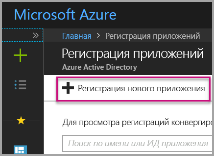
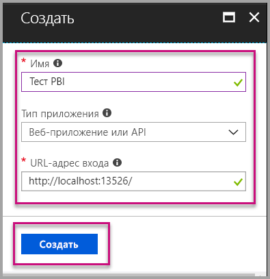
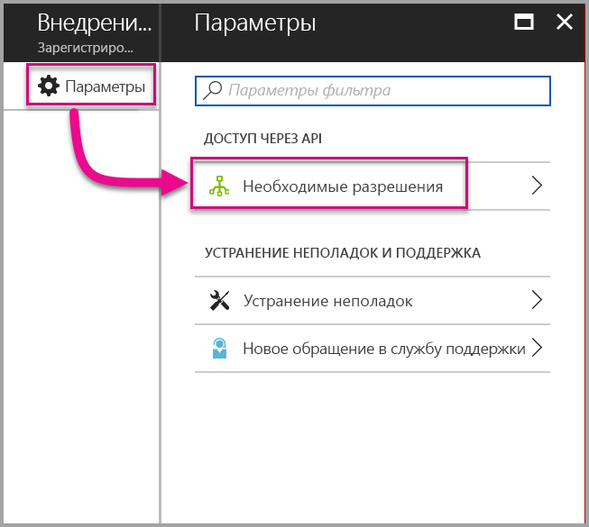
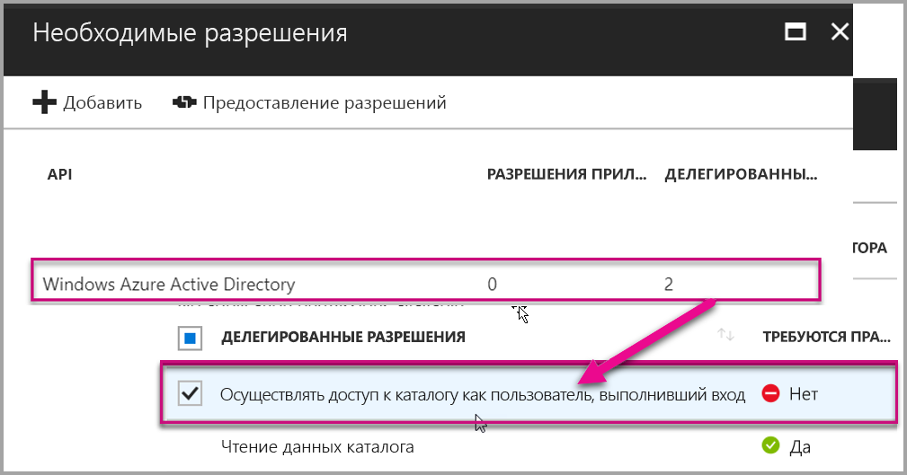
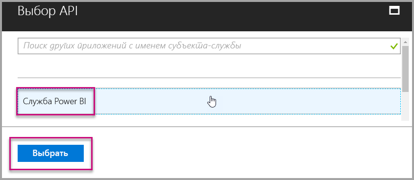
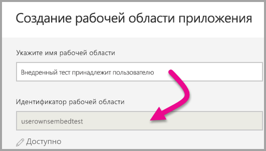
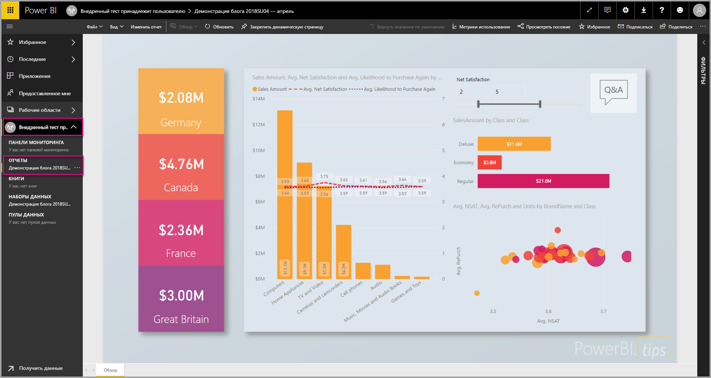
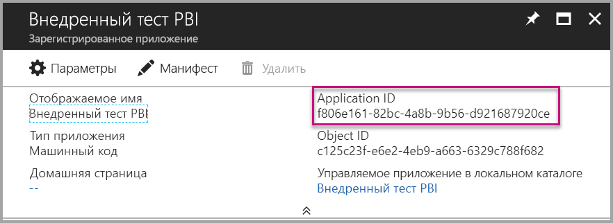
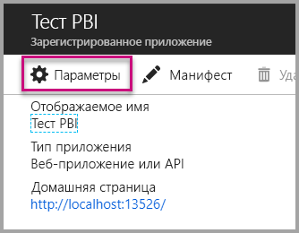

# <a name="tutorial-embed-a-power-bi-report-dashboard-or-tile-into-an-application-for-your-organization"></a>Руководство. Внедрение отчетов, панелей мониторинга и плиток Power BI в приложение для организации

В **Power BI** можно внедрять в приложение отчеты, панели мониторинга и плитки, используя принадлежащие пользователю данные. **Принадлежащие пользователю данные** для приложения расширяют возможности службы Power BI, позволяя использовать встроенную аналитику. В этом руководстве показано, как интегрировать отчет в приложение. Вы можете использовать пакет SDK для .NET Power BI и API Power BI для JavaScript для внедрения Power BI в приложение для вашей организации.


В этом руководстве вы выполните следующие задачи:
> [!div class="checklist"]
> * регистрация приложения в Azure;
> * внедрение отчета Power BI в приложение.

## <a name="prerequisites"></a>Предварительные требования

Чтобы начать работу, вам потребуются учетная запись Power BI Pro и подписка Microsoft Azure:

* Если вы не зарегистрированы в Power BI Pro, перед началом работы [пройдите регистрацию для получения бесплатной пробной версии](https://powerbi.microsoft.com/en-us/pricing/).
* Если у вас нет подписки Azure, перед началом работы [создайте бесплатную учетную запись](https://azure.microsoft.com/free/?WT.mc_id=A261C142F).
* Настройте свой [клиент Azure Active Directory (Azure AD)](create-an-azure-active-directory-tenant.md).
* Установите [Visual Studio](https://www.visualstudio.com/) версии 2013 или более поздней.

## <a name="set-up-your-embedded-analytics-development-environment"></a>Настройка среды разработки для встроенной аналитики

Чтобы внедрить в приложение отчеты, панели мониторинга и плитки, внедрение необходимо настроить в вашей среде. Для настройки выполните одно из следующих действий:

* Воспользуйтесь [средством настройки внедрения](https://aka.ms/embedsetup/UserOwnsData), чтобы быстро приступить к работе и скачать пример приложения, с помощью которого можно создать среду и внедрить отчет.

* Если вы решили установить среду вручную, следуйте инструкциям в следующих разделах.

### <a name="register-an-application-in-azure-active-directory"></a>Регистрация приложения в Azure Active Directory

Регистрация приложения в Azure Active Directory нужна для того, чтобы предоставить приложению доступ к REST API Power BI. Это позволит создать удостоверение для приложения и предоставить ему разрешения на доступ к ресурсам REST Power BI.

1. Примите [условия использования API Microsoft Power BI](https://powerbi.microsoft.com/api-terms).

2. Войдите на [портал Azure](https://portal.azure.com).

    

3. На панели навигации слева выберите **Все службы** и щелкните **Регистрация приложений**. Затем выберите **Регистрация нового приложения**.

    </br>

    

4. Следуя инструкциям на экране, создайте приложение. Чтобы применить модель **данных, принадлежащих пользователю**, используйте **тип приложения** **веб-приложение или API**. Укажите **URL-адрес входа**, который требуется в Azure AD для возврата ответов на запросы токенов. Введите значение, относящееся к вашему приложению. Например, `http://localhost:13526/`.

    

### <a name="apply-permissions-to-your-application-within-azure-active-directory"></a>Предоставление разрешений для приложения в Azure AD

Кроме разрешений, представленных на странице регистрации приложения, потребуется несколько дополнительных разрешений. Войдите с учетной записью глобального администратора, чтобы включить разрешения.

### <a name="use-the-azure-active-directory-portal"></a>Использование портала Azure Active Directory

1. На портале Azure перейдите к колонке [Регистрация приложений](https://portal.azure.com/#blade/Microsoft_AAD_IAM/ApplicationsListBlade) и выберите приложение, используемое для внедрения.

    

2. Выберите **Параметры**. В разделе **Доступ через API** выберите **Необходимые разрешения**.

    

3. Выберите **Microsoft Azure Active Directory**. Затем установите флажок **Осуществлять доступ к каталогу как пользователь, выполнивший вход**. Нажмите кнопку **Сохранить**.

    

4. Нажмите кнопку **Добавить**.

    

5. Щелкните **Выбор API**.

    

6. Выберите **Служба Power BI**. Затем нажмите **Выбрать**.

    

7. Установите все разрешения в разделе **Делегированные разрешения**. Их необходимо выбирать по одному, чтобы сохранить настройки. После завершения щелкните **Сохранить**.

    

## <a name="set-up-your-power-bi-environment"></a>Настройка рабочей среды Power BI

### <a name="create-an-app-workspace"></a>Создание рабочей области приложения

Если вы планируете внедрить отчеты, панели мониторинга и (или) плитки в приложение для клиентов, необходимо разместить содержимое в рабочей области этого приложения:

1. Начнем с создания рабочей области. Выберите **Рабочие области** > **Создать рабочую область приложения**. В этой рабочей области вы будете размещать содержимое, к которому нужен доступ из приложения.

    

2. Присвойте рабочей области имя. Если соответствующее поле **Workspace ID** (Идентификатор рабочей области) недоступно, измените это имя, чтобы указать уникальный идентификатор. Это имя также должно быть именем приложения.

    

3. Вы можете выбрать один из доступных вариантов. Если вы выбрали **Общедоступный**, все пользователи организации смогут просматривать содержимое рабочей области. Если выбрать **Частный**, только члены рабочей области смогут просматривать ее содержимое.

    

    После создания группы изменить параметр открытого или закрытого доступа нельзя.

4. Вы также можете задать права для членов и разрешить редактирование или только просмотр.

    

5. Добавьте адреса электронной почты сотрудников, которым необходимо предоставить доступ к рабочей области, и нажмите кнопку **Добавить**. Вы не можете добавлять псевдонимы групп, а только отдельных пользователей.

6. Предоставьте каждому пользователю либо права участника, либо администратора. Администраторы могут самостоятельно изменять рабочую область, в том числе добавлять других участников. Участники могут изменять содержимое рабочей области (за исключением тех случаев, когда они имеют доступ только на просмотр). Публиковать приложения могут и администраторы, и участники.

    Теперь можно перейти к просмотру новой рабочей области. После этого служба Power BI создаст рабочую область и откроет ее. Она отображается в списке рабочих областей, в которые вы входите. Администратор может щелкнуть многоточие (…), чтобы вернуться и внести изменения в рабочую область, например добавить новых участников или изменить разрешения.

    

### <a name="create-and-publish-your-reports"></a>Создание и публикация отчетов

С помощью Power BI Desktop можно создавать отчеты и наборы данных. Затем можно публиковать эти отчеты в рабочей области приложения. У пользователя, публикующего отчеты в рабочей области приложения, должна быть лицензия Power BI Pro.

1. Скачайте пример [демонстрационной версии блога](https://github.com/Microsoft/powerbi-desktop-samples) из GitHub.

    

2. Откройте PBIX-файл с образцом отчета в Power BI Desktop.

   

3. Опубликуйте его в рабочей области приложения.

   

    Теперь вы можете просмотреть отчет в веб-службе Power BI.

   

## <a name="embed-your-content-by-using-the-sample-application"></a>Внедрение содержимого с помощью примера приложения

Следуйте инструкциям, чтобы внедрить содержимое с помощью примера приложения.

1. Чтобы начать работу, скачайте [пример с данными, принадлежащими пользователю](https://github.com/Microsoft/PowerBI-Developer-Samples), из GitHub. Примеров приложений три: для [отчетов](https://github.com/Microsoft/PowerBI-Developer-Samples/tree/master/User%20Owns%20Data/integrate-report-web-app), [панелей мониторинга](https://github.com/Microsoft/PowerBI-Developer-Samples/tree/master/User%20Owns%20Data/integrate-dashboard-web-app) и [плиток](https://github.com/Microsoft/PowerBI-Developer-Samples/tree/master/User%20Owns%20Data/integrate-tile-web-app). В этой статье рассматривается приложение для **отчетов**.

    

2. Откройте файл **Cloud.config** в примере приложения. Здесь есть несколько полей, которые нужно заполнить, чтобы запустить приложение: **ApplicationID** и **ApplicationSecret**.

    

    Укажите в поле **ApplicationID** значение **идентификатора приложения** из Azure. Поле **ApplicationID** используется приложением для его идентификации пользователями, у которых запрашиваются разрешения.

    Чтобы получить значение **ApplicationID**, сделайте следующее.

    1. Войдите на [портал Azure](https://portal.azure.com).

       

    2. На панели навигации слева выберите **Все службы** и щелкните **Регистрация приложений**.

       

    3. Выберите приложение, для которого нужно использовать **ApplicationID**.

       

    4. Отобразится **идентификатор приложения**, указанный в поле идентификатора GUID. Поместите этот **идентификатор приложения** в поле **ApplicationID** приложения.

        

    Заполните сведения **ApplicationID** из раздела **Ключи** раздела **Регистрация приложений** в **Azure**.

    Чтобы получить значение **ApplicationSecret**, сделайте следующее.

    1. Войдите на [портал Azure](https://portal.azure.com).

       

    2. На панели навигации слева выберите **Все службы** и щелкните **Регистрация приложений**.

       

    3. Выберите приложение, для которого нужно использовать **ApplicationSecret**.

       

    4. Выберите **Параметры**.

       

    5. Выберите раздел **Ключи**.

       

    6. Введите имя в поле **Описание** и выберите длительность. Затем выберите **Сохранить**, чтобы получить **Значение** для вашего приложения. Когда вы закроете панель **Ключи** после сохранения значения ключа, поле значения отображается только как скрытое. На этом этапе вы не можете получить значение ключа. Если вы потеряете значение ключа, потребуется создать новое на портале Azure.

          

    7. Укажите в поле **groupId** идентификатор GUID рабочей области приложения из Power BI.

       

    8. Укажите в поле **reportId** идентификатор GUID отчета из Power BI.

       

3. Запустите приложение:

    Выберите **Запуск** в **Visual Studio**.

    

    После выберите **Получить отчет**.

    

    Теперь вы можете просмотреть отчет в примере приложения.

    

## <a name="embed-your-content-within-your-application"></a>Внедрение содержимого в приложении

Несмотря на то, что шаги по внедрению содержимого можно выполнить с помощью [интерфейсов REST API Power BI](https://docs.microsoft.com/rest/api/power-bi/), примеры кода, описанные в этой статье, созданы с помощью пакета SDK для .NET.

Чтобы интегрировать отчет в веб-приложение, используйте REST API Power BI или пакет SDK Power BI C#. Можно также использовать маркер доступа Azure Active Directory для получения отчета. Затем вы загружаете отчет, используя тот же токен доступа. REST API Power BI обеспечивает программный доступ к определенным ресурсам Power BI. Дополнительные сведения см. в документации по [интерфейсу REST API для Power BI](https://docs.microsoft.com/rest/api/power-bi/) и [интерфейсу API JavaScript для Power BI](https://github.com/Microsoft/PowerBI-JavaScript).

### <a name="get-an-access-token-from-azure-ad"></a>Получение токена доступа из Azure AD

Перед вызовами REST API Power BI в приложении потребуется получить маркер доступа из Azure AD. Дополнительные сведения см. в статье [Authenticate users and get an Azure AD access token for your Power BI app](get-azuread-access-token.md) (Проверка подлинности для пользователей и получение маркера доступа Azure AD для приложения Power BI).

### <a name="get-a-report"></a>Получение отчета

Для получения отчета Power BI используется операция [Получение отчетов](https://docs.microsoft.com/rest/api/power-bi/reports/getreports), возвращающая список отчетов Power BI. В списке отчетов можно получить идентификатор отчета.

### <a name="get-reports-by-using-an-access-token"></a>Получение отчетов с помощью маркера доступа

Операция [Получение отчетов](https://docs.microsoft.com/rest/api/power-bi/reports/getreports) возвращает список отчетов. Можно получить один отчет в списке отчетов.

Для вызова REST API необходимо включить заголовок *авторизации* в формате *Носитель {маркер доступа}*.

#### <a name="get-reports-with-the-rest-api"></a>Получение отчетов с помощью REST API

Ниже приведен пример кода для получения отчетов с помощью **REST API**:

> [!NOTE]  
> Пример получения элемента содержимого, который вы хотите внедрить, можно найти в файле **Default.aspx.cs** в [примере приложения](#embed-your-content-using-the-sample-application). Это может быть отчет, панель мониторинга или плитка.

```csharp
using Newtonsoft.Json;

//Get a Report. In this sample, you get the first Report.
protected void GetReport(int index)
{
    //Configure Reports request
    System.Net.WebRequest request = System.Net.WebRequest.Create(
        String.Format("{0}/Reports",
        baseUri)) as System.Net.HttpWebRequest;

    request.Method = "GET";
    request.ContentLength = 0;
    request.Headers.Add("Authorization", String.Format("Bearer {0}", accessToken.Value));

    //Get Reports response from request.GetResponse()
    using (var response = request.GetResponse() as System.Net.HttpWebResponse)
    {
        //Get reader from response stream
        using (var reader = new System.IO.StreamReader(response.GetResponseStream()))
        {
            //Deserialize JSON string
            PBIReports Reports = JsonConvert.DeserializeObject<PBIReports>(reader.ReadToEnd());

            //Sample assumes at least one Report.
            //You could write an app that lists all Reports
            if (Reports.value.Length > 0)
            {
                var report = Reports.value[index];

                txtEmbedUrl.Text = report.embedUrl;
                txtReportId.Text = report.id;
                txtReportName.Text = report.name;
            }
        }
    }
}

//Power BI Reports used to deserialize the Get Reports response.
public class PBIReports
{
    public PBIReport[] value { get; set; }
}
public class PBIReport
{
    public string id { get; set; }
    public string name { get; set; }
    public string webUrl { get; set; }
    public string embedUrl { get; set; }
}
```

#### <a name="get-reports-by-using-the-net-sdk"></a>Получение отчетов с помощью пакета SDK для .NET

Вы можете использовать пакет SDK для .NET, чтобы получить список отчетов, не вызывая REST API напрямую. В следующем примере кода показано, как получить список отчетов:

```csharp
using Microsoft.IdentityModel.Clients.ActiveDirectory;
using Microsoft.PowerBI.Api.V2;
using Microsoft.PowerBI.Api.V2.Models;

var tokenCredentials = new TokenCredentials(<ACCESS TOKEN>, "Bearer");

// Create a Power BI Client object. It is used to call Power BI APIs.
using (var client = new PowerBIClient(new Uri(ApiUrl), tokenCredentials))
{
    // Get the first report all reports in that workspace
    ODataResponseListReport reports = client.Reports.GetReports();

    Report report = reports.Value.FirstOrDefault();

    var embedUrl = report.EmbedUrl;
}
```

### <a name="load-a-report-by-using-javascript"></a>Загрузка отчета с помощью JavaScript

Чтобы загрузить отчет в элемент div веб-страницы, вы можете использовать JavaScript. Ниже приведен пример кода для получения отчета из определенной рабочей области:

> [!NOTE]  
> Пример загрузки элемента содержимого, который вы хотите внедрить, можно найти в файле **Default.aspx** в [примере приложения](#embed-your-content-using-the-sample-application). Это может быть отчет, панель мониторинга или плитка.

```javascript
<!-- Embed Report-->
<div> 
    <asp:Panel ID="PanelEmbed" runat="server" Visible="true">
        <div>
            <div><b class="step">Step 3</b>: Embed a report</div>

            <div>Enter an embed url for a report from Step 2 (starts with https://):</div>
            <input type="text" id="tb_EmbedURL" style="width: 1024px;" />
            <br />
            <input type="button" id="bEmbedReportAction" value="Embed Report" />
        </div>

        <div id="reportContainer"></div>
    </asp:Panel>
</div>
```

#### <a name="sitemaster"></a>Site.master

```javascript
window.onload = function () {
    // client side click to embed a selected report.
    var el = document.getElementById("bEmbedReportAction");
    if (el.addEventListener) {
        el.addEventListener("click", updateEmbedReporte, false);
    } else {
        el.attachEvent('onclick', updateEmbedReport);
    }

    // handle server side post backs, optimize for reload scenarios
    // show embedded report if all fields were filled in.
    var accessTokenElement = document.getElementById('MainContent_accessTokenTextbox');
    if (accessTokenElement !== null) {
        var accessToken = accessTokenElement.value;
        if (accessToken !== "")
            updateEmbedReport();
    }
};

// update embed report
function updateEmbedReport() {

    // check if the embed url was selected
    var embedUrl = document.getElementById('tb_EmbedURL').value;
    if (embedUrl === "")
        return;

    // get the access token.
    accessToken = document.getElementById('MainContent_accessTokenTextbox').value;

    // Embed configuration used to describe the what and how to embed.
    // This object is used when calling powerbi.embed.
    // You can find more information at https://github.com/Microsoft/PowerBI-JavaScript/wiki/Embed-Configuration-Details.
    var config = {
        type: 'report',
        accessToken: accessToken,
        embedUrl: embedUrl
    };

    // Grab the reference to the div HTML element that will host the report.
    var reportContainer = document.getElementById('reportContainer');

    // Embed the report and display it within the div container.
    var report = powerbi.embed(reportContainer, config);

    // report.on will add an event handler which prints to Log window.
    report.on("error", function (event) {
        var logView = document.getElementById('logView');
        logView.innerHTML = logView.innerHTML + "Error<br/>";
        logView.innerHTML = logView.innerHTML + JSON.stringify(event.detail, null, "  ") + "<br/>";
        logView.innerHTML = logView.innerHTML + "---------<br/>";
    }
  );
}
```

## <a name="using-a-power-bi-premium-dedicated-capacity"></a>Использование выделенной емкости Power BI Premium

После завершения разработки приложения нужно вернуться к рабочей области приложения с выделенной емкостью.

### <a name="create-a-dedicated-capacity"></a>Создание выделенной емкости

Создав выделенную емкость, вы получите преимущество выделенного ресурса для содержимого в рабочей области приложения. Вы можете создать выделенную емкость с помощью [Power BI Premium](../service-premium.md).

В таблице ниже перечислены номера SKU Power BI Premium, доступные в [Microsoft Office 365](../service-admin-premium-purchase.md).

| Узел емкости | Общее количество виртуальных ядер<br/>(серверная часть + внешний интерфейс) | Виртуальные ядра в серверной части | Виртуальные ядра для внешнего интерфейса | Ограничения для подключений DirectQuery и активных подключений | Максимальное число страниц, отображаемых в часы максимальной нагрузки |
| --- | --- | --- | --- | --- | --- |
| EM1 |1 виртуальное ядро |0,5 виртуальных ядер, 10 ГБ ОЗУ |0,5 виртуальных ядер |3,75 в секунду |150–300 |
| EM2 |2 виртуальных ядра |1 виртуальное ядро, 10 ГБ ОЗУ |1 виртуальное ядро |7,5 в секунду |301–600 |
| EM3 |4 виртуальных ядра |2 виртуальных ядра, 10 ГБ ОЗУ |2 виртуальных ядра |15 в секунду |601–1200 |
| P1 |8 виртуальных ядер |4 виртуальных ядра, 25 ГБ ОЗУ |4 виртуальных ядра |30 в секунду |1201–2400 |
| P2 |16 виртуальных ядер |8 виртуальных ядер, 50 ГБ ОЗУ |8 виртуальных ядер |60 в секунду |2401–4800 |
| P3 |32 виртуальных ядра |16 виртуальных ядер, 100 ГБ ОЗУ |16 виртуальных ядер |120 в секунду |4801–9600 |
| P4 |64 виртуальных ядра |32 виртуальных ядра, 200 ГБ ОЗУ |32 виртуальных ядра |240 в секунду |9601–19 200 |
| P5 |128 виртуальных ядер |64 виртуальных ядра, 400 ГБ ОЗУ |64 виртуальных ядра |480 в секунду |19 201–38 400 |

> [!NOTE]
> - Если вы пытаетесь выполнить внедрение с приложениями Microsoft Office, вы можете использовать номера SKU EM для доступа к содержимому по бесплатной лицензии Power BI. Но нельзя получить доступ к содержимому с бесплатной лицензией Power BI, если вы используете Powerbi.com или Power BI Mobile.
> - Если вы хотите выполнить внедрение с приложениями Microsoft Office через Powerbi.com или Power BI Mobile, вы можете получить доступ к содержимому с бесплатной лицензией Power BI.

### <a name="assign-an-app-workspace-to-a-dedicated-capacity"></a>Назначение выделенной емкости для рабочей области приложения

После создания выделенной емкости ей можно назначить рабочую область приложения. Для этого сделайте следующее:

1. В службе Power BI разверните рабочие области и щелкните многоточие возле рабочей области, которую вы используете для внедрения содержимого. Затем выберите команду **Изменить рабочие области**.

    

2. Разверните раздел **Дополнительно** и включите **Выделенную емкость**. Выберите выделенную емкость, которую вы создали. Затем выберите **Сохранить**.

    

3. После нажатия кнопки **Сохранить** рядом с именем рабочей области приложения должен появиться ромб.

    

## <a name="admin-settings"></a>Параметры администрирования

Глобальные администраторы или администраторы служб Power BI могут включать и отключать возможность использования REST API для клиента. Администраторы Power BI могут задать этот параметр для всей организации или отдельных групп безопасности. По умолчанию он включен для всей организации. Можно внести эти изменения на [портале администрирования Power BI](../service-admin-portal.md).

## <a name="next-steps"></a>Дальнейшие действия

В этом руководстве вы узнали, как внедрить содержимое Power BI в свое приложение с помощью учетной записи организации Power BI. Теперь вы можете попробовать внедрить содержимое Power BI в приложение с помощью приложений. Кроме того, вы можете попробовать внедрить содержимое Power BI для своих клиентов:

> [!div class="nextstepaction"]
> [Внедрение из приложений](embed-from-apps.md)

> [!div class="nextstepaction"]
>[Внедрение для клиентов](embed-sample-for-customers.md)

Если у вас возникли вопросы, [задайте их участникам сообщества Power BI](http://community.powerbi.com/).
