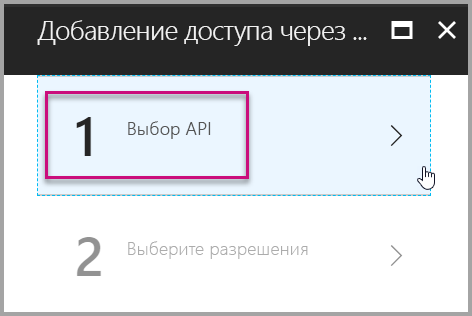
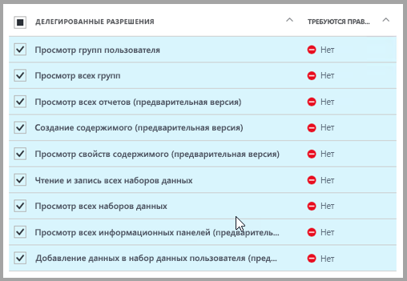
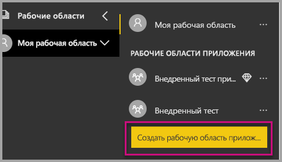
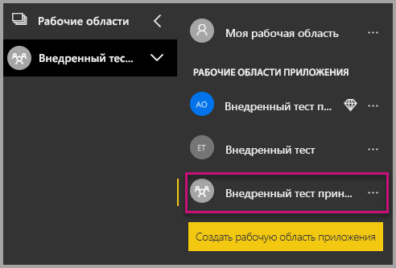
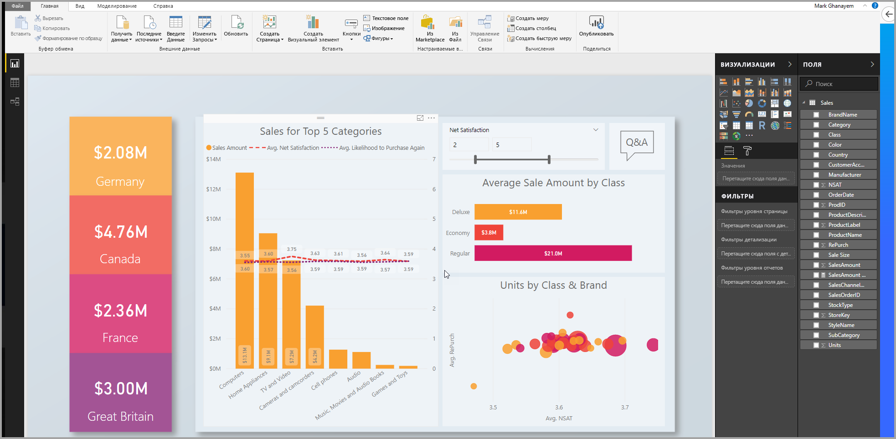
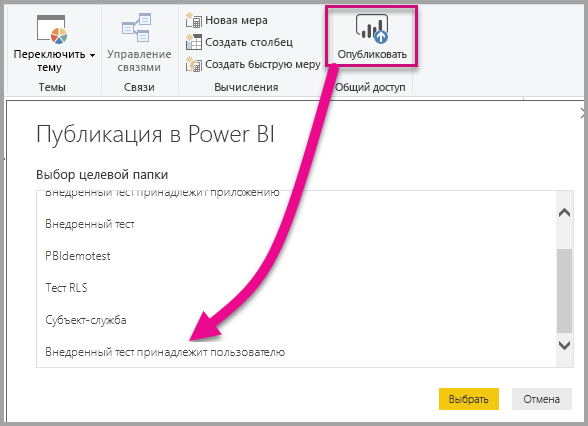
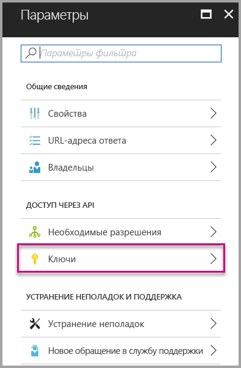
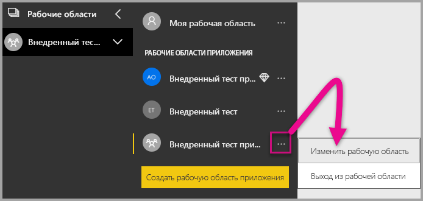
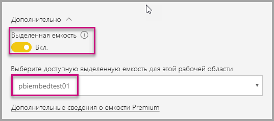
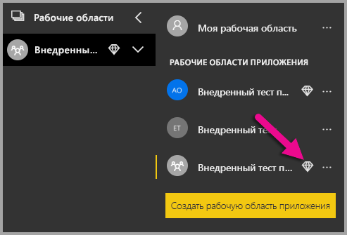

# <a name="tutorial-embed-a-power-bi-report-dashboard-or-tile-into-an-application-for-your-organization"></a>Руководство: внедрение отчета, панели мониторинга или плитки Power BI в приложение для организации
Из этого руководства вы узнаете, как интегрировать отчет в приложение с помощью **пакета SDK для .NET Power BI** и **API JavaScript для Power BI** при внедрении **Power BI** в приложение для организации. Служба **Power BI** позволяет внедрять в приложение отчеты, панели мониторинга и плитки с помощью модели **данных, принадлежащих пользователю**. **Данные, принадлежащие пользователю**, позволяют приложению расширить возможности службы Power BI.


Из этого руководства вы узнаете, как выполнять следующие задачи:
>[!div class="checklist"]
>* регистрация приложения в Azure;
>* внедрение отчета Power BI в приложение.

## <a name="prerequisites"></a>Предварительные требования
Чтобы начать работу, вам потребуются учетная запись **Power BI Pro** и подписка **Microsoft Azure**.

* Если вы не зарегистрированы в **Power BI**, перед началом работы [пройдите бесплатную регистрацию](https://powerbi.microsoft.com/en-us/pricing/).
* Если у вас нет подписки Azure, перед началом работы [создайте бесплатную учетную запись](https://azure.microsoft.com/free/?WT.mc_id=A261C142F).
* Вам потребуется собственная установка [клиента Azure Active Directory ](create-an-azure-active-directory-tenant.md).
* Также нужно установить [Visual Studio](https://www.visualstudio.com/) 2013 или более поздней версии.

## <a name="setup-your-embedded-analytics-development-environment"></a>Настройка среды разработки для встроенной аналитики

Чтобы внедрить в приложение отчеты, панели мониторинга и плитки, внедрение необходимо настроить в вашей среде. В процессе настройки необходимо выполнить указанные ниже действия.

Воспользуйтесь [средством адаптации](https://aka.ms/embedsetup/UserOwnsData), чтобы быстро приступить к работе и скачать пример приложения, с помощью которого можно создать среду и внедрить отчет.

Если вы решили настроить среду вручную, см. инструкции ниже.
### <a name="register-an-application-in-azure-active-directory-azure-ad"></a>Регистрация приложения в Azure Active Directory

Регистрация приложения в Azure Active Directory нужна для того, чтобы предоставить приложению доступ к REST API Power BI. Это позволит создать удостоверение для приложения и предоставить ему разрешения на доступ к ресурсам REST Power BI.

1. Примите [условия использования API Microsoft Power BI](https://powerbi.microsoft.com/api-terms).

2. Войдите на [портал Azure](https://portal.azure.com).

    

3. На панели навигации слева выберите **Все службы**, выберите **Регистрация приложений** и щелкните **Регистрация нового приложения**.

    </br>
    

4. Следуя инструкциям на экране, создайте приложение. Чтобы применить модель **данных, принадлежащих пользователю**, необходимо использовать тип приложения **веб-приложение или API**. Также укажите **URL-адрес входа**, который нужен **Azure AD** для ответа на запросы токенов. Введите значение, относящееся к вашему приложению, например http://localhost:13526/).

    

### <a name="apply-permissions-to-your-application-within-azure-active-directory"></a>Предоставление разрешений для приложения в Azure AD

Кроме разрешений, представленных на странице регистрации приложения, потребуется несколько дополнительных разрешений. Войдите в систему по учетной записи *глобального администратора*, чтобы включить разрешения.

### <a name="use-the-azure-active-directory-portal"></a>Использование портала Azure Active Directory

1. На портале Azure перейдите к колонке [Регистрация приложений](https://portal.azure.com/#blade/Microsoft_AAD_IAM/ApplicationsListBlade) и выберите приложение, используемое для внедрения.

    

2. В разделе **Параметры** откройте **Доступ через API** и выберите **Необходимые разрешения**.

    

3. Выберите **Microsoft Azure Active Directory** и затем установите флажок **Осуществляйте доступ к каталогу как пользователь, выполнивший вход**. Нажмите кнопку **Сохранить**.

    

4. Нажмите кнопку **Добавить**.

    

5. Щелкните **Select an API** (Выбор API).

    

6. Последовательно выберите **Служба Power BI** и **Выбрать**.

    

7. Установите все разрешения в разделе **Делегированные разрешения**. Их необходимо выбирать по одному. Это позволит сохранить настройки. После завершения щелкните **Сохранить**.

    

## <a name="setup-your-power-bi-environment"></a>Настройка рабочей среды Power BI

### <a name="create-an-app-workspace"></a>Создание рабочей области приложения

Если вы планируете внедрить отчеты, панели мониторинга и (или) плитки в приложение для клиентов, необходимо разместить содержимое в рабочей области этого приложения.

1. Начнем с создания рабочей области. Последовательно выберите **Рабочие области** > **Создать рабочую область приложения**. Именно здесь вы будете размещать содержимое, к которому нужен доступ из приложения.

    

2. Присвойте рабочей области имя. Если соответствующее поле **Workspace ID** (Идентификатор рабочей области) недоступно, измените это имя, чтобы указать уникальный идентификатор. Он также должен стать именем приложения.

    

3. Вы можете выбрать один из доступных вариантов. Если вы выбрали **Общедоступный**, все пользователи организации смогут просматривать содержимое рабочей области. С другой стороны, если выбрать **Частный**, только члены рабочей области смогут просматривать ее содержимое.

    

    После создания группы изменить параметр открытого или закрытого доступа нельзя.

4. Вы также можете задать права для членов рабочей области: разрешить **изменение** содержимого или предоставить доступ **только для просмотра**.

    

5. Добавьте адреса электронной почты сотрудников, которым необходимо предоставить доступ к рабочей области, и нажмите кнопку **Добавить**. Вы не можете добавлять псевдонимы групп, а только отдельных пользователей.

6. Предоставьте каждому пользователю либо права участника, либо администратора. Администраторы могут самостоятельно изменять рабочую область, в том числе добавлять других участников. Участники могут изменять содержимое рабочей области (за исключением тех случаев, когда они имеют доступ только на просмотр). Публиковать приложения могут и администраторы, и участники.

    Теперь можно перейти к просмотру новой рабочей области. После этого служба Power BI создаст рабочую область и откроет ее. Она отображается в списке рабочих областей, в которые вы входите. Администратор может щелкнуть многоточие (…), чтобы вернуться и внести изменения в рабочую область, например добавить новых участников или изменить разрешения.

    

### <a name="create-and-publish-your-reports"></a>Создание и публикация отчетов

Вы можете создавать отчеты и наборы данных с помощью Power BI Desktop, а затем публиковать эти отчеты в рабочей области приложения. У пользователя, публикующего отчеты в рабочей области приложения, должна быть лицензия Power BI Pro.

1. Скачайте пример [демонстрационной версии блога](https://github.com/Microsoft/powerbi-desktop-samples) из GitHub.

    

2. Откройте PBIX-файл с образцом отчета в **Power BI Desktop**.

   

3. Опубликуйте его в **рабочей области приложения**.

   

    Теперь вы можете просмотреть отчет в веб-службе Power BI.

   

## <a name="embed-your-content-using-the-sample-application"></a>Внедрение содержимого с помощью примера приложения

Сделайте следующее, чтобы начать внедрять содержимое, использующее модель данных, принадлежащих приложению.

1. Чтобы начать работу, скачайте [пример с данными, принадлежащими пользователю](https://github.com/Microsoft/PowerBI-Developer-Samples), из GitHub.  Примеров приложений три: для [отчетов](https://github.com/Microsoft/PowerBI-Developer-Samples/tree/master/User%20Owns%20Data/integrate-report-web-app), для [панелей мониторинга](https://github.com/Microsoft/PowerBI-Developer-Samples/tree/master/User%20Owns%20Data/integrate-dashboard-web-app) и для [плиток](https://github.com/Microsoft/PowerBI-Developer-Samples/tree/master/User%20Owns%20Data/integrate-tile-web-app).  В указанных ниже шагах в статье описывается приложение для **отчетов**.

    

2. Откройте файл Cloud.config в примере приложения. Здесь есть несколько полей, которые нужно заполнить, чтобы запустить приложение: **ClientID** и **ClientSecret**.

    

    Укажите в поле **ClientID** значение **идентификатора приложения** из **Azure**. Поле **ClientID** используется приложением для его идентификации для пользователей, у которых запрашиваются разрешения.

    Чтобы получить значение **ClientID**, сделайте следующее.

    Войдите на [портал Azure](https://portal.azure.com).

    

    На панели навигации слева выберите **Все службы** и щелкните **Регистрация приложений**.

    

    Выберите приложение, для которого нужно использовать **ClientID**.

    

    Отобразится **идентификатор приложения**, указанный в поле идентификатора GUID. Поместите этот **идентификатор приложения** в поле **ClientID** приложения.

    

    Заполните сведения **ClientSecret** из раздела **Ключи** раздела **Регистрация приложений** в **Azure**.

    Чтобы получить **ClientSecret**, сделайте следующее.

    Войдите на [портал Azure](https://portal.azure.com).

    

    На панели навигации слева выберите **Все службы** и щелкните **Регистрация приложений**.

    

    Выберите приложение, для которого нужно использовать **ClientSecret**.

    

    Выберите **Параметры**.

    

    Выберите раздел **Ключи**.

    

    Укажите в поле **Описание** имя и выберите **Длительность**, а затем нажмите кнопку **Сохранить**, чтобы получить **Значение** для приложения. Когда вы сохраните **значение ключа** и закроете колонку **Ключи**, поле значения будет отображаться как **_Скрытое_** и вы не сможете извлечь **значение ключа**. Если вы потеряете **значение ключа**, потребуется создать новое на **портале Azure**.

    

     Укажите в поле **groupId** значение **GUID рабочей области приложения** из Power BI.

    

    Укажите в поле **reportId** значение **GUID отчета** из Power BI.

    

3. Запустите приложение!

    Сначала выберите **Запуск** в **Visual Studio**.

    

    После выберите **Получить отчет**.

    

    Теперь вы можете просмотреть отчет в примере приложения.

    

## <a name="embed-your-content-within-your-application"></a>Внедрение содержимого в приложении
Несмотря на то, что шаги по внедрению содержимого можно выполнить с помощью [интерфейсов REST API Power BI](https://docs.microsoft.com/rest/api/power-bi/), примеры кода, описанные в этой статье, созданы с помощью **пакета SDK для .NET**.

Для интеграции отчета в веб-приложение используется **REST API Power BI** или **пакет SDK для C# в Power BI**; для получения отчета — **токен доступа** проверки подлинности Azure Active Directory (AD). После вы загружаете отчет, используя тот же **токен доступа**. **REST API Power BI** обеспечивает программный доступ к определенным ресурсам **Power BI**. Дополнительные сведения см. в документации по [интерфейсу REST API для Power BI](https://docs.microsoft.com/rest/api/power-bi/) и [интерфейсу API JavaScript для Power BI](https://github.com/Microsoft/PowerBI-JavaScript).

### <a name="get-an-access-token-from-azure-ad"></a>Получение токена доступа из Azure AD
Перед вызовами REST API Power BI в приложении потребуется получить **токен доступа** из Azure AD. Дополнительные сведения см. в статье [Authenticate users and get an Azure AD access token for your Power BI app](get-azuread-access-token.md) (Проверка подлинности для пользователей и получение маркера доступа Azure AD для приложения Power BI).

### <a name="get-a-report"></a>Получение отчета
Для получения отчета **Power BI** используется операция [Получение отчетов](https://docs.microsoft.com/rest/api/power-bi/reports/getreports), возвращающая список отчетов **Power BI**. В списке отчетов можно получить идентификатор отчета.

### <a name="get-reports-using-an-access-token"></a>Получение отчетов с помощью маркера доступа
Операция [Получение отчетов](https://docs.microsoft.com/rest/api/power-bi/reports/getreports) возвращает список отчетов. Можно получить один отчет в списке отчетов.

Для вызова REST API необходимо включить заголовок *авторизации* в формате *Носитель {маркер доступа}*.

#### <a name="get-reports-with-the-rest-api"></a>Получение отчетов с помощью REST API

Ниже приведен пример кода для получения отчетов с помощью **REST API**.

*Пример получения элемента содержимого (отчета, панели мониторинга или плитки), который вы хотите внедрить, можно найти в файле **_Default.aspx.cs_** в [примере приложения](#embed-your-content-using-the-sample-application).*

```csharp
using Newtonsoft.Json;

//Get a Report. In this sample, you get the first Report.
protected void GetReport(int index)
{
    //Configure Reports request
    System.Net.WebRequest request = System.Net.WebRequest.Create(
        String.Format("{0}/Reports",
        baseUri)) as System.Net.HttpWebRequest;

    request.Method = "GET";
    request.ContentLength = 0;
    request.Headers.Add("Authorization", String.Format("Bearer {0}", accessToken.Value));

    //Get Reports response from request.GetResponse()
    using (var response = request.GetResponse() as System.Net.HttpWebResponse)
    {
        //Get reader from response stream
        using (var reader = new System.IO.StreamReader(response.GetResponseStream()))
        {
            //Deserialize JSON string
            PBIReports Reports = JsonConvert.DeserializeObject<PBIReports>(reader.ReadToEnd());

            //Sample assumes at least one Report.
            //You could write an app that lists all Reports
            if (Reports.value.Length > 0)
            {
                var report = Reports.value[index];

                txtEmbedUrl.Text = report.embedUrl;
                txtReportId.Text = report.id;
                txtReportName.Text = report.name;
            }
        }
    }
}

//Power BI Reports used to deserialize the Get Reports response.
public class PBIReports
{
    public PBIReport[] value { get; set; }
}
public class PBIReport
{
    public string id { get; set; }
    public string name { get; set; }
    public string webUrl { get; set; }
    public string embedUrl { get; set; }
}
```

#### <a name="get-reports-using-the-net-sdk"></a>Получение отчетов с помощью пакета SDK для .NET
Вы можете использовать пакет SDK для .NET, чтобы получить список отчетов, не вызывая REST API напрямую. Ниже приведен пример кода для получения списка отчетов.

```csharp
using Microsoft.IdentityModel.Clients.ActiveDirectory;
using Microsoft.PowerBI.Api.V2;
using Microsoft.PowerBI.Api.V2.Models;

var tokenCredentials = new TokenCredentials(<ACCESS TOKEN>, "Bearer");

// Create a Power BI Client object. It is used to call Power BI APIs.
using (var client = new PowerBIClient(new Uri(ApiUrl), tokenCredentials))
{
    // Get the first report all reports in that workspace
    ODataResponseListReport reports = client.Reports.GetReports();

    Report report = reports.Value.FirstOrDefault();

    var embedUrl = report.EmbedUrl;
}
```

### <a name="load-a-report-using-javascript"></a>Загрузка отчета с помощью JavaScript
Чтобы загрузить отчет в элемент div веб-страницы, вы можете использовать JavaScript.

Ниже приведен пример кода для получения отчета из определенной рабочей области.

*Пример загрузки элемента содержимого (отчета, панели мониторинга или плитки), который вы хотите внедрить, можно найти в файле **_Default.aspx_** в [примере приложения](#embed-your-content-using-the-sample-application).*

```javascript
<!-- Embed Report-->
<div> 
    <asp:Panel ID="PanelEmbed" runat="server" Visible="true">
        <div>
            <div><b class="step">Step 3</b>: Embed a report</div>

            <div>Enter an embed url for a report from Step 2 (starts with https://):</div>
            <input type="text" id="tb_EmbedURL" style="width: 1024px;" />
            <br />
            <input type="button" id="bEmbedReportAction" value="Embed Report" />
        </div>

        <div id="reportContainer"></div>
    </asp:Panel>
</div>
```

**Site.master**

```javascript
window.onload = function () {
    // client side click to embed a selected report.
    var el = document.getElementById("bEmbedReportAction");
    if (el.addEventListener) {
        el.addEventListener("click", updateEmbedReporte, false);
    } else {
        el.attachEvent('onclick', updateEmbedReport);
    }

    // handle server side post backs, optimize for reload scenarios
    // show embedded report if all fields were filled in.
    var accessTokenElement = document.getElementById('MainContent_accessTokenTextbox');
    if (accessTokenElement !== null) {
        var accessToken = accessTokenElement.value;
        if (accessToken !== "")
            updateEmbedReport();
    }
};

// update embed report
function updateEmbedReport() {

    // check if the embed url was selected
    var embedUrl = document.getElementById('tb_EmbedURL').value;
    if (embedUrl === "")
        return;

    // get the access token.
    accessToken = document.getElementById('MainContent_accessTokenTextbox').value;

    // Embed configuration used to describe the what and how to embed.
    // This object is used when calling powerbi.embed.
    // You can find more information at https://github.com/Microsoft/PowerBI-JavaScript/wiki/Embed-Configuration-Details.
    var config = {
        type: 'report',
        accessToken: accessToken,
        embedUrl: embedUrl
    };

    // Grab the reference to the div HTML element that will host the report.
    var reportContainer = document.getElementById('reportContainer');

    // Embed the report and display it within the div container.
    var report = powerbi.embed(reportContainer, config);

    // report.on will add an event handler which prints to Log window.
    report.on("error", function (event) {
        var logView = document.getElementById('logView');
        logView.innerHTML = logView.innerHTML + "Error<br/>";
        logView.innerHTML = logView.innerHTML + JSON.stringify(event.detail, null, "  ") + "<br/>";
        logView.innerHTML = logView.innerHTML + "---------<br/>";
    }
  );
}
```

## <a name="using-a-power-bi-premium-dedicated-capacity"></a>Использование выделенной емкости Power BI Premium

После завершения разработки приложения нужно вернуться к рабочей области приложения с выделенной емкостью.

### <a name="create-a-dedicated-capacity"></a>Создание выделенной емкости
Создав выделенную емкость, вы получите преимущество выделенного ресурса для содержимого в рабочей области приложения. Вы можете создать выделенную емкость с помощью [Power BI Premium](../service-premium.md).

В таблице ниже перечислены доступные номера SKU Power BI Premium в [Office 365](../service-admin-premium-purchase.md).

| Узел емкости | Число виртуальных ядер<br/>*(серверная часть и интерфейс)* | Серверные виртуальные ядра | Интерфейсные виртуальные ядра | Ограничения для подключений DirectQuery и активных подключений | Максимальное число страниц, отображаемых в часы максимальной нагрузки |
| --- | --- | --- | --- | --- | --- |
| EM1 |1 виртуальное ядро |5 виртуальных ядер; 10 ГБ ОЗУ |,5 виртуального ядра |3,75 в секунду |150–300 |
| EM2 |2 виртуальных ядра |1 виртуальное ядро; 10 ГБ ОЗУ |1 виртуальное ядро |7,5 в секунду |301–600 |
| EM3 |4 виртуальных ядра |2 виртуальных ядра; 10 ГБ ОЗУ |2 виртуальных ядра |15 в секунду |601–1200 |
| P1 |8 виртуальных ядер |4 виртуальных ядра; 25 ГБ ОЗУ |4 виртуальных ядра |30 в секунду |1201–2400 |
| P2 |16 виртуальных ядер |8 виртуальных ядер; 50 ГБ ОЗУ |8 виртуальных ядер |60 в секунду |2401–4800 |
| P3 |32 виртуальных ядра |16 виртуальных ядер; 100 ГБ ОЗУ |16 виртуальных ядер |120 в секунду |4801–9600 |
| P4 |64 виртуальных ядра |32 виртуальных ядра; 200 ГБ ОЗУ |32 виртуальных ядра |240 в секунду |9601–19 200
| P5 |128 виртуальных ядер |64 виртуальных ядра, 400 ГБ ОЗУ |64 виртуальных ядра |480 в секунду |19 201–38 400

*С **_номерами SKU EM_** **вы можете** получить доступ к содержимому с бесплатной лицензией Power BI, если хотите выполнить внедрение с помощью **_приложений MS Office_**, но **у вас нет доступа к** содержимому с бесплатной лицензией Power BI при использовании **_Powerbi.com_** или **_Power BI Mobile_**.*

*С **_номерами SKU P_** **вы можете** получить доступ к содержимому с бесплатной лицензией Power BI, если хотите выполнить внедрение с помощью **_приложений MS Office_**, при использовании **_Powerbi.com_** или **_Power BI Mobile_**.*

### <a name="assign-an-app-workspace-to-a-dedicated-capacity"></a>Назначение выделенной емкости для рабочей области приложения

После создания выделенной емкости ей можно назначить рабочую область приложения. Для этого сделайте следующее.

1. В **службе Power BI** разверните рабочие области и щелкните многоточие возле рабочей области, которую вы используете для внедрения содержимого. Затем выберите команду **Изменить рабочие области**.

    

2. Разверните элемент **Дополнительно**, затем включите **выделенную емкость** и выберите созданную выделенную емкость. Затем выберите **Сохранить**.

    

3. После нажатия кнопки **Сохранить** рядом с именем рабочей области приложения должен появиться **ромб**.

    

## <a name="admin-settings"></a>Параметры администрирования

Глобальные администраторы или администраторы служб Power BI могут включать и отключать возможность использования REST API для клиента. Администраторы Power BI могут задать этот параметр для всей организации или отдельных групп безопасности. По умолчанию установлено состояние "Включено для всей организации". Это можно сделать на [портале администрирования Power BI](../service-admin-portal.md).

## <a name="next-steps"></a>Дальнейшие действия
В этом руководстве вы узнали, как внедрить содержимое Power BI в свое приложение с помощью **учетной записи организации Power BI**. Теперь вы можете попробовать внедрить содержимое Power BI в приложение с помощью приложений.  Кроме того, вы можете попробовать внедрить содержимое Power BI для своих клиентов.

> [!div class="nextstepaction"]
> [Внедрение из приложений](embed-from-apps.md)

> [!div class="nextstepaction"]
>[Внедрение для клиентов](embed-sample-for-customers.md)

Появились дополнительные вопросы? [Попробуйте задать вопрос в сообществе Power BI.](http://community.powerbi.com/)
