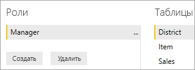

# <a name="use-row-level-security-with-power-bi-embedded-content"></a>Использование безопасности на уровне строк во встроенном содержимом Power BI
Безопасность на уровне строк (RLS) может использоваться для ограничения доступа пользователей к данным внутри отчета или набора данных, позволяя нескольким различным пользователям использовать один и тот же отчет при просмотре различных данных. Безопасность на уровне строк может использоваться при внедрении отчетов из Power BI.

Если вы выполняете внедрение для пользователей, не работающих с Power BI (данные принадлежат приложению), что обычно является сценарием ISV, то эта статья предназначена именно для вас. Вам понадобится настроить маркер внедрения для учетной записи пользователя и роли. Далее вы узнаете, как это сделать.

При внедрении пользователей Power BI (данные принадлежат пользователю) в своей организации RLS работает также, как и напрямую в службе Power BI. Больше ничего не нужно делать в своем приложении. Дополнительные сведения см. в статье [Безопасность на уровне строк (RLS) в Power BI](../service-admin-rls.md).


Чтобы воспользоваться преимуществами RLS, важно понимать три основных понятия: пользователи, роли и правила. Давайте рассмотрим каждый элемент подробнее.

**Пользователи.** Это пользователи, просматривающие отчеты. В Power BI Embedded пользователи идентифицируются по свойству имени пользователя в маркере внедрения.

**Роли.** Пользователи принадлежат к различным ролям. Роль — это контейнер для правил и может иметь имя *Менеджер по продажам* или *Торговый представитель*. Роли можно создать в Power BI Desktop. Дополнительные сведения см. в статье [Безопасность на уровне строк (RLS) в Power BI Desktop](../desktop-rls.md).

**Правила.** Роли имеют правила, являющиеся фильтрами, которые будут применяться к данным. Это может быть чем-то простым, например "Страна = США", или чем-то гораздо более динамичным.
Для оставшейся части этой статьи мы предоставим пример создания RLS, а затем его использования во внедренном приложении. В примере используется PBIX-файл с [примером анализа розничной торговли](http://go.microsoft.com/fwlink/?LinkID=780547).


## <a name="adding-roles-with-power-bi-desktop"></a>Добавление ролей с помощью Power BI Desktop
В примере анализа розничной торговли отображаются сведения о продажах во всех магазинах розничной сети. Без RLS будут отображаться те же данные, независимо от того, какой региональный менеджер входит в отчет и просматривает его. Представители высшего руководства решили, что региональный менеджер должен видеть только продажи по магазинам, которыми они управляют. Для этого можно использовать RLS.

RLS создается в Power BI Desktop. При открытии набора данных и отчета можно переключиться в представление схемы для ее просмотра:


Вот несколько моментов, на которые следует обратить внимание в этой схеме:

* Все меры, например **Общий объем продаж**, хранятся в таблице фактов **Продажи**.
* Имеются четыре дополнительные связанные таблицы измерений: **Позиция**, **Время**, **Магазин** и **Округ**.
* Стрелки на линиях связи указывают, каким образом фильтры могут передаваться из одной таблицы в другую. Например, если поместить фильтр к **Time[Date]**, в текущей схеме отфильтруются только значения в таблице **Продажи**. Этот фильтр не повлияет на другие таблицы, так как все стрелки в линиях связи указывают на таблицу продаж.
* В таблице **Округ** представлены сведения о менеджере каждого округа:
  
    

Основываясь на этой схеме, если мы применим фильтр к колонке **Региональный менеджер** в таблице **Округ**, который совпадает с пользователем, просматривающим отчет, то фильтр также отфильтрует таблицы **Магазин** и **Продажи**, чтобы показывать только данные для имеющегося регионального менеджера.

Вот как это сделать.

1. На вкладке **Моделирование** выберите **Управление ролями**.
   
    
2. Создайте роль **Диспетчер**.
   
    
3. В таблице **Округ** введите такое выражение DAX: **[District Manager] = USERNAME()**.
   
    
4. Чтобы убедиться, что правила работают, на вкладке **Моделирование** выберите **Просмотреть как роли**, а затем выберите созданную роль **Менеджер** вместе с ролью **Другой пользователь**. Введите имя **Andrew Ma** для пользователя.
   
    
   
    Теперь в отчете будут отображаться данные, как если бы вы выполнили вход с данными пользователя **Andrew Ma**.

Если применить фильтр таким образом, как это сделали мы, будут отфильтрованы все записи в таблицах **Округ**, **Магазин** и **Продажи**. Однако из-за направления фильтра на связях между таблицами **Продажи** и **Время**, таблицы **Продажи** и **Позиция**, а также **Позиция** и **Время** не будут отфильтрованы. Чтобы узнать больше о двунаправленной перекрестной фильтрации, скачайте технический документ [Bidirectional cross-filtering in SQL Server Analysis Services 2016 and Power BI Desktop](http://download.microsoft.com/download/2/7/8/2782DF95-3E0D-40CD-BFC8-749A2882E109/Bidirectional%20cross-filtering%20in%20Analysis%20Services%202016%20and%20Power%20BI.docx) (Двунаправленная перекрестная фильтрация в SQL Server Analysis Services 2016 и Power BI Desktop).

## <a name="applying-user-and-role-to-an-embed-token"></a>Применение пользователя и роли для маркера внедрения
После настройки ролей Power BI Desktop нужно выполнить ряд действий в приложении, чтобы воспользоваться их преимуществами.

Пользователи проходят проверку подлинности и авторизацию с помощью приложения. Маркеры внедрения используются для предоставления им доступа к конкретным отчетам Power BI Embedded. Power BI Embedded не имеет каких-либо конкретных данных о пользователе. Для работы RLS необходимо передать некоторый дополнительный контекст в маркере внедрения в форме удостоверений. Это можно сделать с помощью API [GenerateToken](https://msdn.microsoft.com/library/mt784614.aspx).

API [GenerateToken](https://msdn.microsoft.com/library/mt784614.aspx) принимает список удостоверений с обозначением соответствующих наборов данных. Сейчас можно указать только одно удостоверение. В будущем будет добавлена поддержка нескольких наборов данных для внедрения информационных панелей. Для работы RLS необходимо передать следующее как часть удостоверения.

* **username (обязательно).** Это строка, которая может использоваться для идентификации пользователя при применении правила RLS. Вы можете указать только одного пользователя.
* **roles (обязательно).** Строка, содержащая роли для выбора при применении правил безопасности на уровне строк. При передаче нескольких ролей их нужно передавать в виде строкового массива.
* **dataset (обязательно).** Это набор данных, предназначенный для внедряемого отчета. В списке наборов данных можно указать только один набор. В будущем будет поддерживаться несколько наборов данных для внедрения информационных панелей.

Вы можете создать маркер внедрения с помощью метода **GenerateTokenInGroup** в **PowerBIClient.Reports**. Сейчас поддерживаются только отчеты.

Например, можно изменить пример [PowerBIEmbedded_AppOwnsData](https://github.com/Microsoft/PowerBI-Developer-Samples/tree/master/App%20Owns%20Data). *Строки 76 и 77 Home\HomeController.cs* можно обновить с:

```
// Generate Embed Token.
var generateTokenRequestParameters = new GenerateTokenRequest(accessLevel: "view");

var tokenResponse = await client.Reports.GenerateTokenInGroupAsync(GroupId, report.Id, generateTokenRequestParameters);
```

на

```
var generateTokenRequestParameters = new GenerateTokenRequest("View", null, identities: new List<EffectiveIdentity> { new EffectiveIdentity(username: "username", roles: new List<string> { "roleA", "roleB" }, datasets: new List<string> { "datasetId" }) });

var tokenResponse = await client.Reports.GenerateTokenInGroupAsync("groupId", "reportId", generateTokenRequestParameters);
```

При вызове REST API обновленный API теперь принимает дополнительный массив JSON с именем **identities**, содержащий имя пользователя, список строковых ролей и список наборов данных строк, например:

```
{
    "accessLevel": "View",
    "identities": [
        {
            "username": "EffectiveIdentity",
            "roles": [ "Role1", "Role2" ],
            "datasets": [ "fe0a1aeb-f6a4-4b27-a2d3-b5df3bb28bdc" ]
        }
    ]
}
```

Теперь, когда все части соединены, когда кто-то войдет в ваше приложение для просмотра этого отчета, будут отображаться только данные, на просмотр которых у пользователя есть разрешение, как это определено безопасностью на уровне строк.

## <a name="working-with-analysis-services-live-connections"></a>Работа с активными подключениями к службам Analysis Services
Безопасность на уровне строк можно использовать с активными подключениями к службам Analysis Services для локальных серверов. При использовании этого типа подключения вы должны учитывать ряд определенных понятий.

Действующее удостоверение, предоставленное для свойства имени пользователя, должно предназначаться для пользователя Windows с разрешениями на сервере служб Analysis Services.

**Настройка локального шлюза данных**

[Локальный шлюз данных](../service-gateway-onprem.md) используется при работе с активными подключениями к Analysis Services. При создании токена внедрения с указанным удостоверением необходимо указать главную учетную запись в качестве учетной записи администратора шлюза. Если главная учетная запись не указана, безопасность на уровне строк не будет правильно применена к данным. Пользователь без прав администратора шлюза может предоставлять роли, но при этом он должен указать свое имя для действующего удостоверения.

**Использование ролей**

Роли могут предоставляться вместе с удостоверением в токене внедрения. Если роль не указана, для разрешения связанных ролей используется указанное имя пользователя.

## <a name="considerations-and-limitations"></a>Рекомендации и ограничения
* Назначение ролей пользователям в службе Power BI не влияет на безопасность на уровне строк при использовании маркера внедрения.
* Хотя служба Power BI не применяет параметр RLS для администраторов и участников с разрешениями на изменение, но при указании удостоверения с маркером внедрения они будут применены к данным.
* Передача информации об удостоверении при вызове GenerateToken поддерживается только для чтения и записи отчета. Поддержка других ресурсов будет доступна позже.
* Активные подключения к службам Analysis Services поддерживаются для локальных серверов.
* Динамические подключения Azure Analysis Services не поддерживаются.
* Если для базового набора данных не требуется RLS, запрос GenerateToken **не** должен содержать действующее удостоверение.
* Если базовый набор данных является облачной моделью (кэшированная модель или DirectQuery), действующее удостоверение должно включать хотя бы одну роль. В противном случае роли не буду назначены.
* В списке удостоверений можно указать только одно удостоверение. Мы используем список для включения маркеров с несколькими удостоверениями для внедрения информационных панелей в будущем.

Появились дополнительные вопросы? [Попробуйте задать вопрос в сообществе Power BI.](https://community.powerbi.com/)

