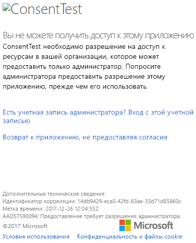
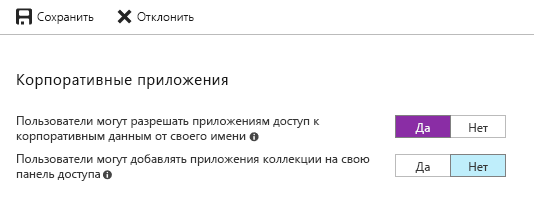

# <a name="troubleshooting-your-embedded-application"></a>Устранение неполадок внедренного приложения

В этой статье описаны распространенные проблемы, которые могут возникнуть при внедрении содержимого из Power BI.

## <a name="tools-for-troubleshooting"></a>Инструменты для устранения неполадок

### <a name="fiddler-trace"></a>Трассировка Fiddler

[Fiddler](http://www.telerik.com/fiddler) — это бесплатный инструмент от Telerik, отслеживающий трафик HTTP.  Вы можете просматривать всю работу программных интерфейсов Power BI с клиентского компьютера. Это позволяет найти ошибки и другие связанные сведения.


### <a name="f12-in-browser-for-front-end-debugging"></a>Отладка интерфейса нажатием клавиши F12 в браузере

При нажатии клавиши F12 запустится окно средства разработки в браузере. Это позволяет просмотреть информацию о сетевом трафике и другие сведения.


### <a name="extracting-error-details-from-power-bi-response"></a>Извлечение сведений об ошибке из ответа Power BI

В этом фрагменте кода показано, как извлечь сведения об ошибке из HTTP-исключения:

```
public static string GetExceptionText(this HttpOperationException exc)
{
    var errorText = string.Format("Request: {0}\r\nStatus: {1} ({2})\r\nResponse: {3}",
    exc.Request.Content, exc.Response.StatusCode, (int)exc.Response.StatusCode, exc.Response.Content);
    if (exc.Response.Headers.ContainsKey("RequestId"))
    {
        var requestId = exc.Response.Headers["RequestId"].FirstOrDefault();
        errorText += string.Format("\r\nRequestId: {0}", requestId);
    }

    return errorText;
}
```
Рекомендуем вести журнал идентификаторов запросов и сведений об ошибках для устранения неполадок.
Укажите идентификатор запроса при обращении в службу поддержки Майкрософт.

## <a name="app-registration"></a>Регистрация приложений

**Сбой регистрации приложения**

В сообщениях об ошибках на портале Azure или на странице регистрации приложения в Power BI будет упоминаться о недостаточных правах. Чтобы зарегистрировать приложение, требуются права администратора в клиенте Azure AD или разрешение на регистрацию приложения для пользователей без прав администратора.

**Служба Power BI не отображается на портале Azure при регистрации нового приложения**

В Power BI должен зарегистрироваться по крайней мере один пользователь. Если **служба Power BI** не отображается в списке API, в Power BI нет зарегистрированных пользователей.

## <a name="rest-api"></a>API-интерфейсы REST

**При вызове API возвращается ошибка 401**

Для дальнейшего анализа может потребоваться захватить трафик с помощью Fiddler. Может отсутствовать необходимая область разрешений для зарегистрированного приложения в Azure AD. Убедитесь, что требуемая область присутствует в зарегистрированном приложении для Azure AD на портале Azure.

**При вызове API возвращается ошибка 403**

Для дальнейшего анализа может потребоваться захватить трафик с помощью Fiddler. Ошибка 403 может возникнуть по нескольким причинам.

* Пользователь превысил количество внедренных токенов, которое может быть создано в общей емкости. Для создания внедренных токенов необходимо приобрести емкости Azure и назначить рабочую область этой емкости. См. раздел [Создание емкости Power BI Embedded на портале Azure](https://docs.microsoft.com/azure/power-bi-embedded/create-capacity).
* Истек срок действия токена аутентификации Azure AD.
* Пользователь, прошедший аутентификацию, не входит в группу (рабочую область приложения).
* У пользователя, прошедшего аутентификацию, нет прав администратора в группе (рабочей области приложения).
* Заголовок авторизации может быть указан неправильно. Убедитесь, что он не содержит опечаток.

Возможно, понадобится обновить токен аутентификации в серверной части приложения, прежде чем вызывать GenerateToken.

```
    GET https://wabi-us-north-central-redirect.analysis.windows.net/metadata/cluster HTTP/1.1
    Host: wabi-us-north-central-redirect.analysis.windows.net
    ...
    Authorization: Bearer eyJ0eXAiOi...
    ...
 
    HTTP/1.1 403 Forbidden
    ...
     
    {"error":{"code":"TokenExpired","message":"Access token has expired, resubmit with a new access token"}}
```

## <a name="authentication"></a>Проверка подлинности

### <a name="authentication-failed-with-aadsts70002-or-aadsts50053"></a>Сбой проверки подлинности с ошибкой AADSTS70002 или AADSTS50053

**(AADSTS70002: ошибка при проверке учетных данных. AADSTS50053: слишком много попыток входа с неправильным идентификатором пользователя или паролем)**

Если вы работаете с Power BI Embedded, используете прямую проверку подлинности Azure AD Direct и при входе получаете такие сообщения, как ***error:unauthorized_client,error_description:AADSTS70002: ошибка при проверке учетных данных. AADSTS50053: слишком много попыток входа с неправильным идентификатором пользователя или паролем***, что происходит из-за отключения функции прямой проверки подлинности 14.06.2018 по умолчанию.

Вы можете снова включить эту функцию с помощью [политики Azure AD](https://docs.microsoft.com/en-us/azure/active-directory/manage-apps/configure-authentication-for-federated-users-portal#enable-direct-authentication-for-legacy-applications), которую можно связать с организацией или [субъектом-службой](https://docs.microsoft.com/en-us/azure/active-directory/develop/active-directory-application-objects#service-principal-object).

Эту функцию рекомендуется включать только для отдельных приложений.

Чтобы создать эту политику, вы должны быть **глобальным администратором** для каталога, в котором создается и назначается политика. Ниже приведен пример сценария для создания политики и ее назначения пакету обновления для этого приложения:

1. Установите [модуль PowerShell предварительной версии Azure AD](https://docs.microsoft.com/en-us/powershell/azure/active-directory/install-adv2?view=azureadps-2.0).

2. Выполните следующие команды PowerShell, строку за строкой (убедившись, что переменная $sp не имеет более одного приложения в качестве результата).

```powershell
Connect-AzureAD
```

```powershell
$sp = Get-AzureADServicePrincipal -SearchString "Name_Of_Application"
```

```powershell
$policy = New-AzureADPolicy -Definition @("{`"HomeRealmDiscoveryPolicy`":{`"AllowCloudPasswordValidation`":true}}") -DisplayName EnableDirectAuth -Type HomeRealmDiscoveryPolicy -IsOrganizationDefault $false
```

```powershell
Add-AzureADServicePrincipalPolicy -Id $sp.ObjectId -RefObjectId $policy.Id 
```

Назначив политику, подождите около 15–20 секунд для распространения перед тестированием.

**Сбой GenerateToken при предоставлении действующего удостоверения**

Сбой GenerateToken с предоставленным действующим удостоверением может произойти по нескольким причинам:

* Набор данных не поддерживает действующие удостоверение.
* Не указано имя пользователя.
* Не предоставлена роль.
* Не указано значение для DatasetId.
* У пользователя нет нужных прав.

Чтобы узнать причину ошибки, сделайте следующее:

* Выполните операцию [get dataset](https://docs.microsoft.com/rest/api/power-bi/datasets). Для свойства IsEffectiveIdentityRequired указано значение true?
* Имя пользователя является обязательным для любого свойства EffectiveIdentity.
* Если IsEffectiveIdentityRolesRequired имеет значение true, нужно указать роль.
* DatasetId является обязательным для любого свойства EffectiveIdentity.
* У пользователя Analysis Services должны быть права администратора шлюза.

### <a name="aadsts90094-the-grant-requires-admin-permission"></a>AADSTS90094: предоставление требует разрешения администратора

**_Признаки:_**</br>
Если пользователь без прав администратора пытается первый раз войти в приложение и дать согласие, выводится следующая ошибка:
* ConsentTest необходимо разрешение на доступ к ресурсам в вашей организации, которое может предоставить только администратор. Попросите администратора предоставить разрешение этому приложению, прежде чем его использовать.
* AADSTS90094: предоставление требует разрешения администратора.

    

Пользователь с правами администратора может войти в систему и успешно предоставить разрешение.

**_Основная причина:_**</br>
Согласие пользователя отключено для клиента.

**_Возможно несколько вариантов исправления:_**

*Включение согласия пользователя для всего клиента (все пользователи, все приложения)*
1. На портале Azure выберите Azure Active Directory => "Пользователи и группы" => "Параметры пользователя".
2. Включите параметр "Пользователи могут разрешать приложениям доступ к корпоративным данным от своего имени", а затем сохраните изменения.

    

*Предоставление разрешений администратором* Предоставьте разрешения для приложения от имени администратора — для всего клиента или для конкретного пользователя.

## <a name="data-sources"></a>Источники данных

**Независимый поставщик программного обеспечения хочет использовать разные учетные данные для одного источника данных**

Источник данных может иметь один набор учетных данных для одного главного пользователя. Если необходимо использовать разные учетные данные, создайте дополнительных главных пользователей. Затем назначьте разные учетные данные в каждом контексте главного пользователя и внедрите их, используя токен Azure AD этого пользователя.

## <a name="content-rendering"></a>Отображение содержимого

**Произошел сбой или истекло время ожидания при отображении или использовании внедренного содержимого**

Убедитесь, что срок действия токена аутентификации не истек. Проверьте, не истек ли срок действия токена аутентификации, и обновите его. Дополнительные сведения см. в статье [Refresh token using JavaScript SDK example](https://github.com/Microsoft/PowerBI-JavaScript/wiki/Refresh-token-using-JavaScript-SDK-example) (Пример обновления токена с помощью пакета SDK для JavaScript).

**Не загружается отчет или панель мониторинга**

Если пользователь не видит отчет или панель мониторинга, убедитесь, что они загружаются правильно в PowerBI.com. Отчет или панель мониторинга не будут работать в приложении, если они не загружаются в PowerBI.com.

**Отчет или панель мониторинга медленно работает**

Откройте файл в Power BI Desktop или в PowerBI.com и убедитесь, что производительность приемлема, чтобы исключить проблемы с приложением или интерфейсами API для внедрения.

## <a name="onboarding-experience-tool-for-embedding"></a>Средство подключения для внедрения

Воспользуйтесь [средством подключения для внедрения](https://aka.ms/embedsetup), чтобы быстро скачать образец приложения. Затем можно сравнить свое приложение с образцом.

### <a name="prerequisites"></a>Предварительные требования

Перед использованием средства подключения для внедрения проверьте, есть ли все необходимые компоненты. Вам потребуются учетная запись **Power BI Pro** и подписка **Microsoft Azure**.

* Если вы не зарегистрированы в **Power BI**, перед началом работы [пройдите бесплатную регистрацию](https://powerbi.microsoft.com/en-us/pricing/).
* Если у вас нет подписки Azure, перед началом работы [создайте бесплатную учетную запись](https://azure.microsoft.com/free/?WT.mc_id=A261C142F).
* Вам потребуется собственная установка [клиента Azure Active Directory ](create-an-azure-active-directory-tenant.md).
* Также нужно установить [Visual Studio](https://www.visualstudio.com/) 2013 или более поздней версии.

### <a name="common-issues"></a>Распространенные проблемы

Ниже перечислены некоторые распространенные проблемы, которые могут возникнуть при тестировании с помощью средства подключения для внедрения.

#### <a name="using-the-embed-for-your-customers-sample-application"></a>Использование образца приложения "Внедрение для клиентов"

Если вы работаете с решением **Внедрение для клиентов**, сохраните и распакуйте файл *PowerBI-Developer-Samples.zip*. Затем откройте папку *PowerBI-Developer-Samples-master\App Owns Data* и запустите файл *PowerBIEmbedded_AppOwnsData.sln*.

При выборе варианта **Предоставление разрешений** (этап "Предоставление разрешений"), возникает следующая ошибка:

    AADSTS70001: Application with identifier <client ID> was not found in the directory <directory ID>

Нужно закрыть всплывающее окно, подождать несколько секунд и повторить попытку. Это действие может потребоваться выполнить несколько раз. Проблема возникает из-за того, что с момента завершения регистрации приложения до момента, когда оно становится доступным для внешних интерфейсов API, проходит некоторое время.

При запуске образца приложения появляется следующее сообщение об ошибке:

    Password is empty. Please fill password of Power BI username in web.config.

Эта ошибка возникает по той причине, что единственным значением, которое не вносится в образец приложения, является ваш пароль пользователя. Откройте файл Web.config в решении и заполните поле pbiPassword своим паролем.

#### <a name="using-the-embed-for-your-organization-sample-application"></a>Использование образца приложения "Внедрение для организации"

Если вы работаете с решением **Внедрение для организации**, сохраните и распакуйте файл *PowerBI-Developer-Samples.zip*. Затем откройте папку *PowerBI-Developer-Samples-master\User Owns Data\integrate-report-web-app* и запустите файл *pbi-saas-embed-report.sln*.

При запуске образца приложения **Внедрение для организации** возникает следующая ошибка:

    AADSTS50011: The reply URL specified in the request does not match the reply URLs configured for the application: <client ID>

Причина в том, что URL-адрес перенаправления, указанный для приложения веб-сервера, отличается от URL-адреса образца. Чтобы зарегистрировать образец приложения, используйте `http://localhost:13526/` в качестве URL-адреса перенаправления.

Если необходимо изменить зарегистрированное приложение, узнайте, как изменить [зарегистрированное в Azure AD приложение](https://docs.microsoft.com/azure/active-directory/develop/active-directory-integrating-applications#updating-an-application), чтобы оно могло предоставлять доступ к веб-интерфейсам API.

Если необходимо изменить профиль пользователя или данные Power BI, ознакомьтесь с [соответствующей процедурой](https://docs.microsoft.com/en-us/power-bi/service-basic-concepts).

Дополнительные сведения см. в разделе с [вопросами и ответами о Power BI Embedded](embedded-faq.md).

Появились дополнительные вопросы? [Ответы на них см. в сообществе Power BI.](http://community.powerbi.com/)