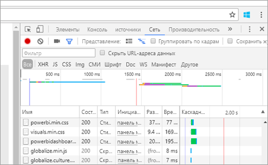

# <a name="troubleshooting-your-embedded-application"></a>Устранение неполадок внедренного приложения

В этой статье описаны распространенные проблемы, которые могут возникнуть при внедрении содержимого из Power BI.

## <a name="tools-for-troubleshooting"></a>Инструменты для устранения неполадок

### <a name="fiddler-trace"></a>Трассировка Fiddler

[Fiddler](http://www.telerik.com/fiddler) — это бесплатный инструмент от Telerik, отслеживающий трафик HTTP.  Вы можете просматривать всю работу программных интерфейсов Power BI с клиентского компьютера. Это позволяет найти ошибки и другие связанные сведения.


### <a name="f12-in-browser-for-front-end-debugging"></a>Отладка интерфейса нажатием клавиши F12 в браузере

При нажатии клавиши F12 запустится окно средства разработки в браузере. Это позволяет просмотреть информацию о сетевом трафике и другие сведения.



### <a name="extracting-error-details-from-power-bi-response"></a>Извлечение сведений об ошибке из ответа Power BI

В этом фрагменте кода показано, как извлечь сведения об ошибке из HTTP-исключения:

```
public static string GetExceptionText(this HttpOperationException exc)
{
    var errorText = string.Format("Request: {0}\r\nStatus: {1} ({2})\r\nResponse: {3}",
    exc.Request.Content, exc.Response.StatusCode, (int)exc.Response.StatusCode, exc.Response.Content);
    if (exc.Response.Headers.ContainsKey("RequestId"))
    {
        var requestId = exc.Response.Headers["RequestId"].FirstOrDefault();
        errorText += string.Format("\r\nRequestId: {0}", requestId);
    }

    return errorText;
}
```
Рекомендуем вести журнал идентификаторов запросов и сведений об ошибках для устранения неполадок.
Укажите идентификатор запроса при обращении в службу поддержки Майкрософт.

## <a name="app-registration"></a>Регистрация приложений

**Сбой регистрации приложения**

В сообщениях об ошибках на портале Azure или на странице регистрации приложения в Power BI будет упоминаться о недостаточных правах. Чтобы зарегистрировать приложение, требуются права администратора в клиенте Azure AD или разрешение на регистрацию приложения для пользователей без прав администратора.

**Служба Power BI не отображается на портале Azure при регистрации нового приложения**

В Power BI должен зарегистрироваться по крайней мере один пользователь. Если **служба Power BI** не отображается в списке API, в Power BI нет зарегистрированных пользователей.

## <a name="rest-api"></a>API-интерфейсы REST

**При вызове API возвращается ошибка 401**

Для дальнейшего анализа может потребоваться захватить трафик с помощью Fiddler. Может отсутствовать необходимая область разрешений для зарегистрированного приложения в Azure AD. Убедитесь, что требуемая область присутствует в зарегистрированном приложении для Azure AD на портале Azure.

**При вызове API возвращается ошибка 403**

Для дальнейшего анализа может потребоваться захватить трафик с помощью Fiddler. Ошибка 403 может возникнуть по нескольким причинам.

* Пользователь превысил количество внедренных токенов, которое может быть создано в общей емкости. Для создания внедренных токенов необходимо приобрести емкости Azure и назначить рабочую область этой емкости. См. раздел [Создание емкости Power BI Embedded на портале Azure](https://docs.microsoft.com/en-us/azure/power-bi-embedded/create-capacity).
* Истек срок действия токена аутентификации Azure AD.
* Пользователь, прошедший аутентификацию, не входит в группу (рабочую область приложения).
* У пользователя, прошедшего аутентификацию, нет прав администратора в группе (рабочей области приложения).
* Заголовок авторизации может быть указан неправильно. Убедитесь, что он не содержит опечаток.

Возможно, понадобится обновить токен аутентификации в серверной части приложения, прежде чем вызывать GenerateToken.

```
    GET https://wabi-us-north-central-redirect.analysis.windows.net/metadata/cluster HTTP/1.1
    Host: wabi-us-north-central-redirect.analysis.windows.net
    ...
    Authorization: Bearer eyJ0eXAiOi...
    ...
 
    HTTP/1.1 403 Forbidden
    ...
     
    {"error":{"code":"TokenExpired","message":"Access token has expired, resubmit with a new access token"}}
```

**Сбой GenerateToken при предоставлении действующего удостоверения**

Сбой GenerateToken с предоставленным действующим удостоверением может произойти по нескольким причинам:

* Набор данных не поддерживает действующие удостоверение.
* Не указано имя пользователя.
* Не предоставлена роль.
* Не указано значение для DatasetId.
* У пользователя нет нужных прав.

Чтобы узнать причину ошибки, сделайте следующее:

* Выполните операцию [get dataset](https://msdn.microsoft.com/library/mt784653.aspx). Для свойства IsEffectiveIdentityRequired указано значение true?
* Имя пользователя является обязательным для любого свойства EffectiveIdentity.
* Если IsEffectiveIdentityRolesRequired имеет значение true, нужно указать роль.
* DatasetId является обязательным для любого свойства EffectiveIdentity.
* У пользователя Analysis Services должны быть права администратора шлюза.

## <a name="data-sources"></a>Источники данных

**Независимый поставщик программного обеспечения хочет использовать разные учетные данные для одного источника данных**

Источник данных может иметь один набор учетных данных для одного главного пользователя. Если необходимо использовать разные учетные данные, создайте дополнительных главных пользователей. Затем назначьте разные учетные данные в каждом контексте главного пользователя и внедрите их, используя токен Azure AD этого пользователя.

## <a name="content-rendering"></a>Отображение содержимого

**Произошел сбой или истекло время ожидания при отображении или использовании внедренного содержимого**

Убедитесь, что срок действия токена аутентификации не истек. Проверьте, не истек ли срок действия токена аутентификации, и обновите его. Дополнительные сведения см. в статье [Refresh token using JavaScript SDK example](https://github.com/Microsoft/PowerBI-JavaScript/wiki/Refresh-token-using-JavaScript-SDK-example) (Пример обновления токена с помощью пакета SDK для JavaScript).

**Не загружается отчет или панель мониторинга**

Если пользователь не видит отчет или панель мониторинга, убедитесь, что они загружаются правильно в PowerBI.com. Отчет или панель мониторинга не будут работать в приложении, если они не загружаются в PowerBI.com.

**Отчет или панель мониторинга медленно работает**

Откройте файл в Power BI Desktop или в PowerBI.com и убедитесь, что производительность приемлема, чтобы исключить проблемы с приложением или интерфейсами API для внедрения.

Дополнительные сведения см. в разделе с [вопросами и ответами о Power BI Embedded](embedded-faq.md).

Появились дополнительные вопросы? [Ответы на них см. в сообществе Power BI.](http://community.powerbi.com/)


