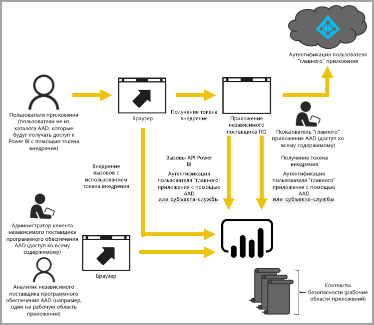

# Внедрение в Power BI
Power BI предоставляет интерфейсы API для внедрения панелей мониторинга и отчетов в приложения. Интерфейсы API Power BI предоставляют сопоставимые возможности и уровень доступа к последним функциям Power BI (включая панели мониторинга, шлюзы и рабочие области приложений) для внедрения содержимого.

## Единый API
Существуют два основных сценария внедрения содержимого Power BI.  Внедрение для пользователей в организации (у которых есть лицензия Power BI) и внедрение для пользователей и клиентов, которым не требуются лицензии Power BI. REST API Power BI поддерживает оба сценария. 

Для пользователей и клиентов, у которых нет лицензий Power BI, вы можете внедрить панели мониторинга и отчеты в настраиваемое приложение, используя один API для обслуживания организации и клиентов. Клиенты будут видеть данные, которыми управляет приложение. А пользователям Power BI в организации будут предоставляться дополнительные возможности для просмотра *своих данных* прямо в Power BI или в контексте внедренного приложения. При внедрении содержимого вы можете воспользоваться всеми преимуществами JavaScript и REST API.

Пример того, как работает внедрение, см. в [примере внедрения JavaScript](https://microsoft.github.io/PowerBI-JavaScript/demo/).

## Внедрение для организации
Внедрение для организации позволяет расширить возможности службы Power BI. Чтобы пользователи вашего приложения могли просмотреть свое содержимое, им нужно войти в службу Power BI. Когда сотрудник организации войдет в приложение, он получит доступ только к своим панелям мониторинга и отчетам или предоставленным ему в службе Power BI. 

*Примеры внедрения для организации включают интеграцию внутреннего веб-приложения, веб-части SharePoint Online и Microsoft Teams.*

Сведения о внедрении для организации см. в следующих статьях:

* [Интеграция информационной панели в приложение](integrate-dashboard.md)
* [Интеграция плитки в приложение](integrate-tile.md)
* [Интеграция отчета в приложение](integrate-report.md)

При внедрении для пользователей Power BI возможности самообслуживания, например редактирование, сохранение и т. д., доступны посредством [API JavaScript](https://github.com/Microsoft/PowerBI-JavaScript).

## Внедрение для клиентов
Внедрение для клиентов позволяет внедрять панели мониторинга и отчеты для пользователей, у которых нет учетной записи Power BI. Вашим клиентам ничего не нужно знать о Power BI. Чтобы создать внедренное приложение, требуется хотя бы одна учетная запись Power BI Pro. Эта учетная запись используется как главная для вашего приложения. Ее можно назвать учетной записью прокси-сервера. Учетная запись Power BI Pro также позволяет создавать токены внедрения, которые обеспечивают доступ к панелям мониторинга и отчетам в службе Power BI, принадлежащих вашему приложению и управляемых им. 

*Пример внедрения для клиентов — это ISV-приложение, продаваемое другим компаниям.*

Для внедрения панелей мониторинга, отчетов и плиток используются те же интерфейсы API, что и в процессе внедрения для организации.

> [!IMPORTANT]
> Процесс внедрения зависит от службы Power BI, а ваши клиенты — нет. Чтобы просмотреть содержимое приложения, пользователям не нужно регистрироваться в службе Power BI.
> 
> 

Когда все будет готово к переносу в рабочую среду, рабочую область приложения нужно будет включить в емкость. Power BI Embedded в Microsoft Azure предоставляет емкость для использования с приложениями.

Дополнительные сведения о внедрении см. в статье [Как внедрять панели мониторинга, отчеты и плитки Power BI](embedding-content.md).

Если вы используете службу коллекций рабочих областей Power BI в Azure, сведения о переносе содержимого см. в статье [Как перенести содержимое коллекции рабочих областей Power BI Embedded в Power BI](migrate-from-powerbi-embedded.md).

## Дальнейшие действия
[Как внедрять панели мониторинга, отчеты и плитки Power BI](embedding-content.md)  
[Как перенести содержимое коллекции рабочих областей Power BI Embedded в Power BI](migrate-from-powerbi-embedded.md)  
[Что такое Power BI Premium?](../service-premium.md)  
[Репозиторий Git JavaScript API](https://github.com/Microsoft/PowerBI-JavaScript)  
[Репозиторий Git Power BI C#](https://github.com/Microsoft/PowerBI-CSharp)  
[Пример внедрения JavaScript](https://microsoft.github.io/PowerBI-JavaScript/demo/)  
[Технический документ по планированию емкости для внедренной аналитики](https://aka.ms/pbiewhitepaper)  
[Техническая документация по Power BI Premium](https://aka.ms/pbipremiumwhitepaper)  

Появились дополнительные вопросы? [Попробуйте задать вопрос в сообществе Power BI.](http://community.powerbi.com/)

