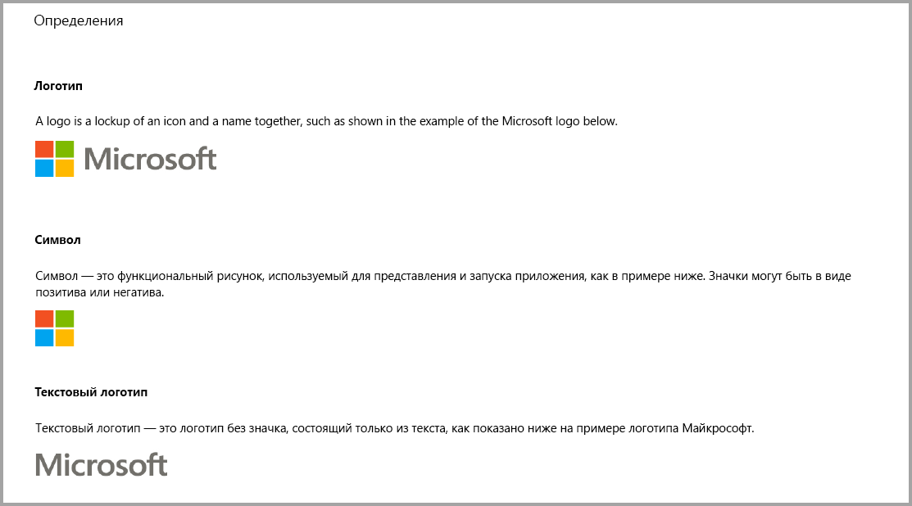
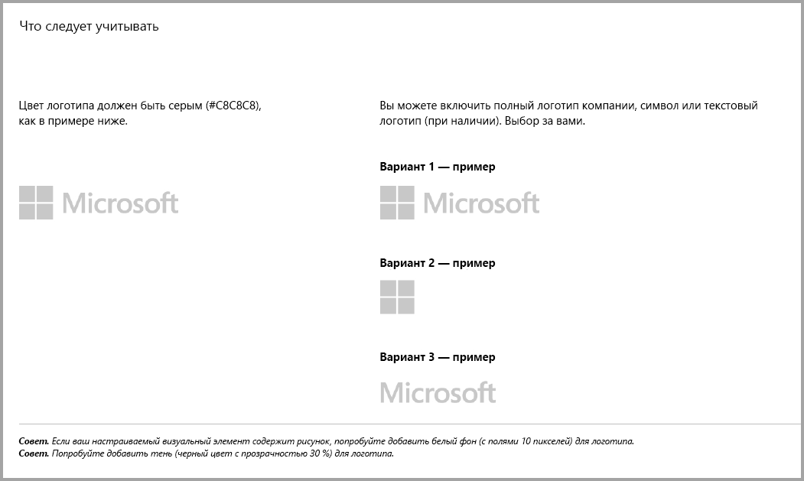
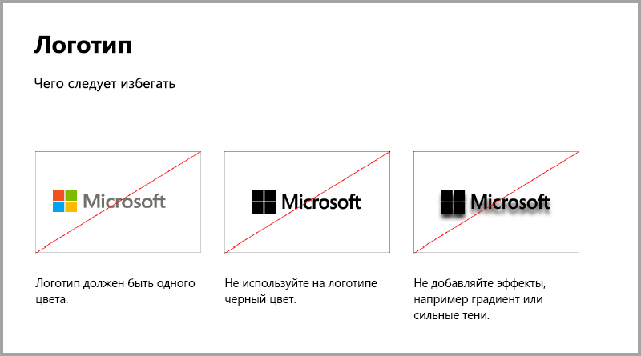
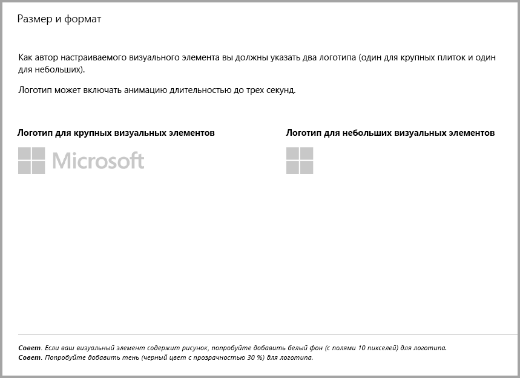
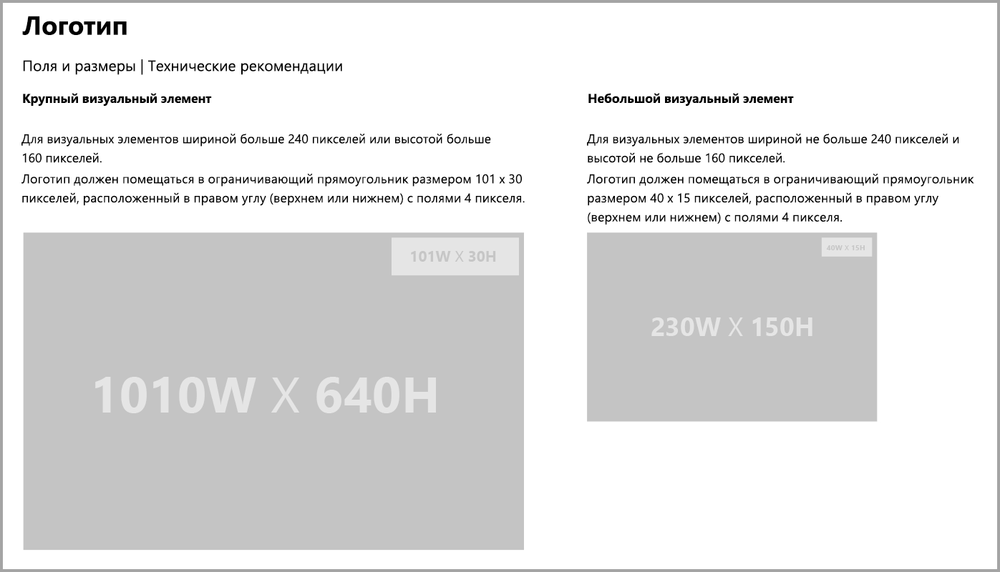
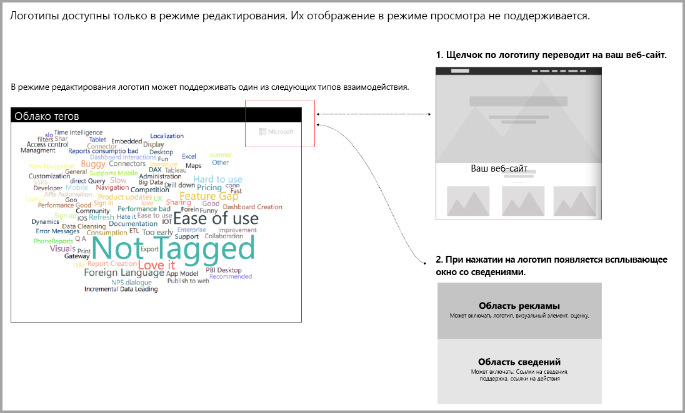

# Рекомендации по визуальным элементам Power BI

## Рекомендации по визуальным элементам Power BI с дополнительными покупками

До недавнего времени магазин AppSource принимал только бесплатные визуальные элементы Power BI. Эта политика была изменена (в декабре 2018 г.), чтобы вы также могли отправить в AppSource визуальные элементы с тегом "Может потребоваться дополнительная покупка". 

Визуальные элементы с тегом "Может потребоваться дополнительная покупка" аналогичны надстройкам "покупки из приложений" (IAP) в Магазине Office. Разработчики могут отправлять эти визуальные элементы для сертификации после утверждения группой AppSource. Кроме того, необходимо убедиться, что они соответствуют требованиям сертификации. Дополнительные сведения о требованиях см. в статье [Сертификация пользовательских визуальных элементов](../power-bi-custom-visuals-certified.md).

> [!NOTE]
> Для сертификации визуального элемента он не должен обращаться к внешним службам и ресурсам.

>[!IMPORTANT]  
> Если вы изменяете свой визуальный элемент с бесплатного на версию с тегом "Может потребоваться дополнительная покупка", пользователи должны получить тот же уровень бесплатных функциональных возможностей, что и до изменения. В дополнение к старым бесплатным функциям можно при необходимости добавить расширенные платные функции. Рекомендуем публиковать визуальные элементы IAP с расширенными функциями как новые визуальные элементы, а не обновлять существующие бесплатные элементы.

## Как изменился процесс отправки?

Разработчики отправляют визуальные элементы IAP в AppSource через панель мониторинга продавца (так же как и для бесплатных визуальных элементов). Чтобы указать, что отправляемый визуальный элемент включает функции IAP, разработчик должен добавить в заметки панели мониторинга продавца фразу "Визуальный элемент с покупкой из приложения". Кроме того, разработчик должен предоставить лицензионный ключ или токен, чтобы команда проверки могла проверить функции IAP. Когда визуальный элемент будет проверен и утвержден AppSource, в списке визуальных элементов IAP в разделе вариантов цен будет указано "Может потребоваться дополнительная покупка".

## Что такое визуальный элемент Power BI с функциями IAP?

Визуальный элемент IAP — это **бесплатный** визуальный элемент с **бесплатными функциями**. Он также включает дополнительные расширенные функции, для работы с которыми может потребоваться дополнительная плата. В описании визуального элемента разработчики обязаны уведомить пользователей о функциях, для работы с которыми требуются дополнительные покупки. Сейчас корпорация Майкрософт не предоставляет собственные API-интерфейсы для поддержки покупки приложений и надстроек.

Для таких покупок разработчики могут использовать любые сторонние платежные системы. Дополнительные сведения см. в статье о [политике магазина](https://docs.microsoft.com/office/dev/store/validation-policies#2-apps-or-add-ins-can-display-certain-ads).

> [!NOTE]
> Для бесплатных функций или визуальных элементов не поддерживаются водяные знаки. Водяные знаки можно использовать только для платных функций, используемых без действительной лицензии. Мы рекомендуем отобразить всплывающее окно со всеми сведениями о лицензии, если дополнительные платные функции используются без действительной лицензии.  

## Рекомендации по логотипам

В этом разделе описываются спецификации для добавления эмблем и логотипов в визуальные элементы.

> [!IMPORTANT]
> Логотипы доступны **только в режиме редактирования**. Их **невозможно** отобразить в режиме просмотра.

## Советы и рекомендации

### Целевая страница визуального элемента

Используйте целевую страницу, чтобы рассказать пользователям о том, как они могут использовать визуальный элемент и где можно приобрести лицензию. Не включайте видео, которые запускаются автоматически. Добавляйте только те материалы, которые повышают удобство работы пользователя, например информацию или ссылки на сведения о покупке лицензии и использовании возможностей IAP.

### Лицензионный ключ и токен

Для удобства пользователей добавьте поля для лицензионного ключа или токена в верхней части области форматирования.

## ВОПРОСЫ И ОТВЕТЫ

Дополнительные сведения о визуальных элементах см. в разделе [Визуальные элементы с дополнительными покупками](https://docs.microsoft.com/power-bi/power-bi-custom-visuals-faq#visuals-with-additional-purchases).

## Дальнейшие действия

Узнайте, как опубликовать настраиваемые визуальные элементы в [AppSource](office-store.md), чтобы они стали доступными для других пользователей.
