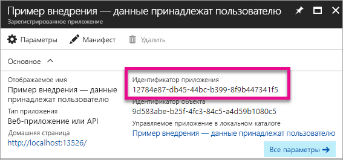
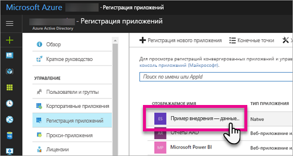
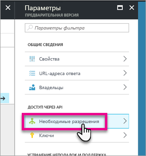
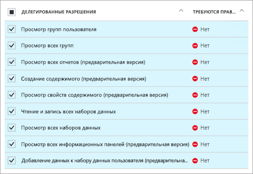

# <a name="register-an-azure-ad-app-to-embed-power-bi-content"></a>Регистрация приложения Azure AD для внедрения содержимого Power BI
Узнайте, как зарегистрировать приложение в Azure Active Directory (Azure AD) для использования внедренного содержимого Power BI.

Чтобы предоставить приложению доступ к интерфейсам REST API Power BI, его необходимо зарегистрировать в Azure AD. Это позволит создать удостоверение для приложения и предоставить ему разрешения на доступ к ресурсам REST Power BI.

> [!IMPORTANT]
> Для регистрации приложения Power BI вам потребуется [клиент Azure Active Directory и пользователь организации](create-an-azure-active-directory-tenant.md). Если вы еще не зарегистрировались в Power BI как пользователь в клиенте, регистрация приложения не завершится успешно.

Существует два способа регистрации приложения. Это можно сделать с помощью [средства регистрации приложений Power BI](https://dev.powerbi.com/apps/) или портала Azure. Средство регистрации приложений Power BI — это наиболее простой вариант, поскольку в нем всего лишь несколько полей для заполнения. Если вы хотите внести изменения в приложение, используйте портал Azure.

## <a name="register-with-the-power-bi-app-registration-tool"></a>Регистрация с помощью средства регистрации приложений Power BI
Чтобы получить удостоверение для приложения и указать разрешения для ресурсов REST Power BI, необходимо зарегистрировать приложение в **Azure Active Directory**. При регистрации приложения, например консольного приложения или веб-сайта, вы получаете идентификатор, который используется приложением для идентификации себя пользователям, у которых запрашиваются разрешения.

Ниже описана процедура регистрации приложения с помощью средства регистрации приложений Power BI.

1. Перейдите по адресу [dev.powerbi.com/apps](https://dev.powerbi.com/apps).
2. Нажмите кнопку **Sign in with your existing account** (Войти по существующей учетной записи).
3. Введите значение в поле **App Name** (Имя приложения).
4. Выбор типа приложения зависит от используемого типа приложения.
   
   * Укажите **Native app** (Собственное приложение) для приложений, работающих на клиентских устройствах. Вариант **Native app** (Собственное приложение) необходимо выбрать при внедрении содержимого для клиентов независимо от фактического типа приложения. Даже если это веб-приложение.
   * Укажите **Server-side Web app** (Серверное веб-приложение) для веб-приложений или интерфейсов веб-API.

5. Введите значения в полях **Redirect URL** (URL-адрес перенаправления) и **Home Page URL** (URL-адрес домашней страницы). В качестве **URL-адреса перенаправления** подойдет любой допустимый URL-адрес.
   
    Поле **Home Page URL** (URL-адрес домашней страницы) доступно, только если вы выбрали тип приложения **Server-side Web app** (Серверное веб-приложение).
   
    Для примеров *внедрения для клиентов* и *integrate-dashboard-web-app* **URL-адрес перенаправления** следующий: `http://localhost:13526/Redirect`. Для примеров отчета и плитки **URL-адрес перенаправления** следующий: `http://localhost:13526/`.
6. Выберите интерфейсы API, к которым у приложения есть доступ. Дополнительные сведения о разрешениях доступа Power BI см. в статье [Разрешения Power BI](power-bi-permissions.md).
   
    
7. Нажмите кнопку **Register App** (Зарегистрировать приложение).
   
    Затем вам будет предоставлен **идентификатор клиента**. Если вы выбрали **Server-side Web app** (Серверное веб-приложение), то вы получите **секрет клиента**. При необходимости **идентификатор клиента** можно будет получить на портале Azure позднее. Если **секрет клиента** потерян, необходимо создать новый на портале Azure.

8. Вам нужно перейти в Azure, чтобы выбрать пункт **Предоставить разрешения**.
   > [!Note]
   > Для этого у вас должны быть права глобального администратора в клиенте Azure.

* Перейдите к Azure.
* Найдите и выберите пункт **Регистрация приложений**.
* Выберите приложение.
* Выберите **Параметры**.
* Выберите **Требуемые разрешения**.
* Выберите **Служба Power BI**, чтобы проверить разрешения, которые вы выбрали в центре регистрации приложений.
* Выберите **Предоставить разрешения**.

Теперь зарегистрированное приложение можно использовать как часть настраиваемого приложения для взаимодействия со службой Power BI.

> [!IMPORTANT]
> При внедрении содержимого для клиентов вам нужно настроить дополнительные разрешения на портале Azure. Дополнительные сведения см. в разделе [Применение разрешений к приложению](#apply-permissions-to-your-application).
> 

## <a name="register-with-the-azure-portal"></a>Регистрация на портале Azure
Зарегистрировать приложение можно также непосредственно на портале Azure. Чтобы зарегистрировать приложение, выполните следующее.

1. Примите [условия использования API Microsoft Power BI](https://powerbi.microsoft.com/api-terms).
2. Войдите на [портал Azure](https://portal.azure.com).
3. Выберите клиент Azure AD, выбрав свою учетную запись в правом верхнем углу страницы.
4. На левой панели навигации выберите **Больше служб**, в разделе **Безопасность и удостоверения** выберите **Регистрация приложений** и щелкните **Регистрация нового приложения**.
   
    
5. Следуя инструкциям на экране, создайте приложение.
   
   * Для веб-приложений укажите URL-адрес входа, который является базовым URL-адресом приложения, используемым пользователями для входа, например `http://localhost:13526`.
   * Для собственных приложений укажите универсальный код ресурса **(URI) перенаправления**, который Azure AD использует для возвращения ответов для токенов. Введите значение, относящимся к вашему приложению, например `http://myapplication/Redirect`.

Дополнительные сведения о регистрации приложений в Azure Active Directory см. в разделе [Интеграция приложений с Azure Active Directory](https://docs.microsoft.com/azure/active-directory/develop/active-directory-integrating-applications).

## <a name="how-to-get-the-client-id"></a>Как получить идентификатор клиента
При регистрации приложения вы получаете **идентификатор клиента**.  По **идентификатору клиента** приложение запрашивает разрешения для идентификации себя пользователям.

Вот как можно получить идентификатор клиента:

1. Войдите на [портал Azure](https://portal.azure.com).
2. Выберите клиент Azure AD, выбрав свою учетную запись в правом верхнем углу страницы.
3. На левой панели навигации выберите **Больше служб** и щелкните **Регистрация приложений**.
4. Выберите приложение, для которого необходимо получить идентификатор клиента.
5. В списке в качестве GUID отображается **идентификатор приложения**. Это идентификатор клиента для приложения.
   
    

## <a name="apply-permissions-to-your-application-within-azure-ad"></a>Применение разрешений к приложению в Azure AD
> [!IMPORTANT]
> Этот раздел относится только к приложениям, которые **внедряют содержимое для организации**.
> 

Кроме разрешений, представленных на странице регистрации приложения, необходимо также включить дополнительные разрешения. Это можно сделать на портале Azure или программным способом.

Вам нужно войти в систему с помощью *главной* учетной записи, используемой для внедрения, или учетной записи глобального администратора.

### <a name="using-the-azure-ad-portal"></a>Применение разрешений на портале Azure AD
1. На портале Azure перейдите к колонке [Регистрация приложений](https://portal.azure.com/#blade/Microsoft_AAD_IAM/ApplicationsListBlade) и выберите приложение, используемое для внедрения.
   
    
2. В разделе **Доступ через API** выберите **Необходимые разрешения**.
   
    

3. В колонке **Необходимые разрешения** выберите **Power BI Service (Power BI)** (Служба Power BI).
   
    
   
   > [!NOTE]
   > Если вы создали приложение непосредственно на портале Azure AD, **служба Power BI (Power BI)** может отсутствовать. Если это не так, выберите **+ Добавить**, затем щелкните **1 Select and API** (1. Выберите API). Выберите **Служба Power BI** из списка API и щелкните **Выбрать**.  Если **служба Power BI (Power BI)** недоступна в списке области **Добавить**, зарегистрируйте в Power BI по крайней мере одного пользователя.
   > 
   > 
4. Установите все разрешения в разделе **Делегированные разрешения**. Их необходимо выбирать по одному. Это позволит сохранить настройки. После завершения щелкните **Сохранить**.
   
    
5. В колонке **Необходимые разрешения** выберите **Предоставить разрешения**.
   
    Действие **Предоставить разрешения** требуется для того, чтобы в *главную учетную запись* не отправлялись запросы на продолжение из Azure AD. Если это действие выполняется с учетной записью глобального администратора, разрешения на использование приложения предоставляются всем пользователям в вашей организации. Если это действие выполняется для *главной учетной записи*, а не для учетной записи глобального администратора, разрешения на использование этого приложения предоставляются только для *главной учетной записи*.
   
    

### <a name="applying-permissions-programmatically"></a>Применение разрешений программным способом
1. В этом сценарии необходимо получить имеющиеся субъекты-службы (пользователей) клиента. Сведения о том, как это сделать, см. в статье [Get servicePrincipal](https://developer.microsoft.com/en-us/graph/docs/api-reference/beta/api/serviceprincipal_get) (Получение объекта servicePrincipal).
   
    API *Get servicePrincipal* можно вызвать без параметра {id}. Это позволит получить все субъекты-службы в клиенте.
2. Проверьте наличие субъекта-службы, задав в качестве значения свойства **appId** идентификатор клиента приложения.
3. Создайте план обслуживания, если он отсутствует в вашем приложении.
   
    ```
    Post https://graph.microsoft.com/beta/servicePrincipals
    Authorization: Bearer ey..qw
    Content-Type: application/json
    {
    "accountEnabled" : true,
    "appId" : "{App_Client_ID}",
    "displayName" : "{App_DisplayName}"
    }
    ```
4. Предоставление разрешений на использование приложения интерфейсу API Power BI
   
   Если вы используете существующий клиент и не собираетесь предоставлять разрешения от имени всех пользователей клиента, можно предоставить разрешения определенному пользователю, заменив значение для **contentType** на **Principal**.

   Значением **consentType** может быть **AllPrincipals** или **Principal**.

   * Значение **AllPrincipals** может использовать только администратор клиента для предоставления разрешений от имени всех пользователей в клиенте.
   * Значение **Principal** используется для предоставления разрешений от имени определенного пользователя. В этом случае в текст запроса следует добавить дополнительное свойство: *principalId={User_ObjectId}*.
    
     Действие *Предоставить разрешения* требуется для того, чтобы в главную учетную запись не отправлялись запросы на продолжение из Azure AD, что невозможно при неинтерактивном входе в систему.
   
     ```
     Post https://graph.microsoft.com/beta/OAuth2PermissionGrants
     Authorization: Bearer ey..qw
     Content-Type: application/json
     { 
     "clientId":"{Service_Plan_ID}",
     "consentType":"AllPrincipals",
     "resourceId":"c78b2585-1df6-41de-95f7-dc5aeb7dc98e",
     "scope":"Dataset.ReadWrite.All Dashboard.Read.All Report.Read.All Group.Read Group.Read.All Content.Create Metadata.View_Any Dataset.Read.All Data.Alter_Any",
     "expiryTime":"2018-03-29T14:35:32.4943409+03:00",
     "startTime":"2017-03-29T14:35:32.4933413+03:00"
     }
     ```
5. Предоставление разрешений на использование приложения службе Azure Active Directory (AAD)
   
   Значением **consentType** может быть **AllPrincipals** или **Principal**.

   * Значение **AllPrincipals** может использовать только администратор клиента для предоставления разрешений от имени всех пользователей в клиенте.
   * Значение **Principal** используется для предоставления разрешений от имени определенного пользователя. В этом случае в текст запроса следует добавить дополнительное свойство: *principalId={User_ObjectId}*.
    
   Действие *Предоставить разрешения* требуется для того, чтобы в главную учетную запись не отправлялись запросы на продолжение из Azure AD, что невозможно при неинтерактивном входе в систему.

   ```
   Post https://graph.microsoft.com/beta/OAuth2PermissionGrants
   Authorization: Bearer ey..qw
   Content-Type: application/json
   { 
   "clientId":"{Service_Plan_ID}",
   "consentType":"AllPrincipals",
   "resourceId":"61e57743-d5cf-41ba-bd1a-2b381390a3f1",
   "scope":"User.Read Directory.AccessAsUser.All",
   "expiryTime":"2018-03-29T14:35:32.4943409+03:00",
   "startTime":"2017-03-29T14:35:32.4933413+03:00"
   }
   ```

## <a name="next-steps"></a>Дальнейшие действия
После регистрации вашего приложения в Azure AD необходимо выполнить проверку подлинности для пользователей в приложении. Дополнительные сведения см. в статье [Проверка подлинности для пользователей и получение маркера доступа Azure AD для приложения Power BI](get-azuread-access-token.md).

Появились дополнительные вопросы? [Попробуйте задать вопрос в сообществе Power BI.](http://community.powerbi.com/)
