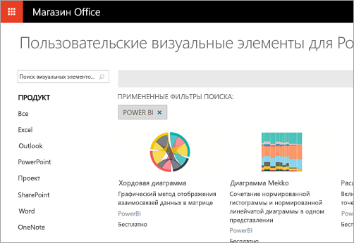

# Что могут разработчики сделать с помощью Power BI
Power BI предлагает целый ряд параметров для разработчиков, начиная от параметров внедрения и заканчивая настраиваемыми визуальными элементами и наборами данных потоковой передачи.

## Внедрение
Возможности службы Power BI и Power BI Embedded в Azure были объединены, что позволило предоставить единый API для внедрения информационных панелей и отчетов. Это означает, что у вас будет одна область API, одинаковый набор возможностей и доступ к последним функциям Power BI, например информационным панелям, шлюзам и рабочим областям приложений, которые можно использовать при внедрении содержимого. Дополнительные сведения см. в статье [Внедрение в Power BI](embedding.md).

## Пользовательские визуальные элементы
Настраиваемые визуальные элементы позволяют создавать собственные визуальные элементы, которые можно использовать в отчетах Power BI. Настраиваемые визуальные элементы написаны на языке TypeScript (надмножество JavaScript), который поддерживает некоторые дополнительные возможности и ранний доступ к функциям ES6 и ES7. Стиль визуального элемента обрабатывается с помощью каскадных таблиц стилей (CSS). Для удобства предварительный компилятор Less используется для поддержки некоторых дополнительных функций, таких как вложения, переменные, примеси, условия, циклы и т. д. Если в любой из этих функций нет необходимости, можно просто записать обычные CSS в файле Less.

Дополнительные сведения о разработке и публикации настраиваемых визуальных элементов см. в статье [Публикация пользовательских визуализаций в Магазине Office](office-store.md).

## Принудительная отправка данных в Power BI
Для принудительной отправки данных в набор данных можно использовать API-интерфейс Power BI. Это позволяет вам добавлять строки в таблицу в наборе данных. После этого новые данные могут отображаться на плитках информационной панели и в визуальных элементах отчета.

Дополнительные сведения см. в статье [Принудительная отправка данных в набор данных Power BI](walkthrough-push-data.md)

## Дальнейшие действия
[Внедрение в Power BI](embedding.md)  
[Как перенести содержимое коллекции рабочих областей Power BI Embedded в Power BI](migrate-from-powerbi-embedded.md)  
[Репозиторий Git JavaScript API](https://github.com/Microsoft/PowerBI-JavaScript)  
[Репозиторий Git Power BI C#](https://github.com/Microsoft/PowerBI-CSharp)  
[Публикация пользовательских визуализаций в Магазине Office](office-store.md)  
[Репозиторий Git настраиваемых визуальных элементов](https://github.com/Microsoft/PowerBI-visuals)  
[Пример внедрения JavaScript](https://microsoft.github.io/PowerBI-JavaScript/demo/)  
[Техническая документация по Power BI Premium](https://aka.ms/pbipremiumwhitepaper)  
Появились дополнительные вопросы? [Ответы на них см. в сообществе Power BI.](http://community.powerbi.com/)

