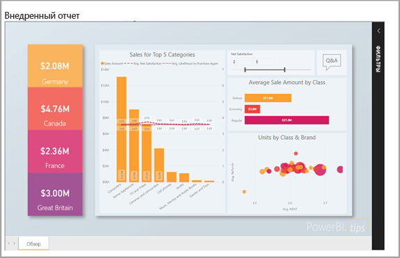

# Что могут разработчики сделать с помощью Power BI

Разработчики могут включить содержимое Power BI в приложения разными способами. Эти параметры включают **внедрение с помощью Power BI**, **пользовательские визуальные элементы** и **принудительную отправку данных в Power BI**.

## Внедрение
Возможности службы Power BI (SaaS) и Power BI Embedded в Azure (PaaS) предоставляют единый API для внедрения информационных панелей и отчетов. Это означает, что у вас будет одинаковый набор возможностей и доступ к последним функциям Power BI, например информационным панелям, шлюзам и рабочим областям приложений, которые можно использовать при внедрении содержимого.

Воспользуйтесь [средством подключения для внедрения](https://aka.ms/embedsetup), чтобы быстро скачать образец приложения и приступить к работе.

Выберите подходящее решение:
* [Внедрение для клиентов](embedding.md#embedding-for-your-customers) позволяет внедрять панели мониторинга и отчеты для пользователей, у которых нет учетной записи Power BI. Запустите решение [Внедрение для клиентов](https://aka.ms/embedsetup/AppOwnsData).
* [Внедрение для организации](embedding.md#embedding-for-your-organization) позволяет расширить возможности службы Power BI. Запустите решение [Внедрение для организации](https://aka.ms/embedsetup/UserOwnsData).

## Разработка пользовательских визуальных элементов
Настраиваемые визуальные элементы позволяют создавать собственные визуальные элементы, которые можно использовать в отчетах Power BI. Пользовательские визуальные элементы написаны на языке TypeScript, который является надмножеством JavaScript. TypeScript поддерживает некоторые дополнительные возможности и ранний доступ к функциям ES6 и ES7. Стиль визуального элемента обрабатывается с помощью каскадных таблиц стилей (CSS). Для удобства предварительный компилятор Less используется для поддержки некоторых дополнительных функций, таких как вложения, переменные, примеси, условия, циклы и т. д. Если в любой из этих функций нет необходимости, можно просто записать обычные CSS в файле Less.

## Принудительная отправка данных в Power BI
Для принудительной отправки данных в набор данных можно использовать API-интерфейс Power BI. Это позволяет вам добавлять строки в таблицу в наборе данных. После этого новые данные могут отображаться на плитках информационной панели и в визуальных элементах отчета.

## Дальнейшие действия
[Внедрение в Power BI](embedding.md)  
[Публикация пользовательских визуализаций в Магазине Office](office-store.md)  
[Принудительная отправка данных на панель мониторинга](walkthrough-push-data.md)
