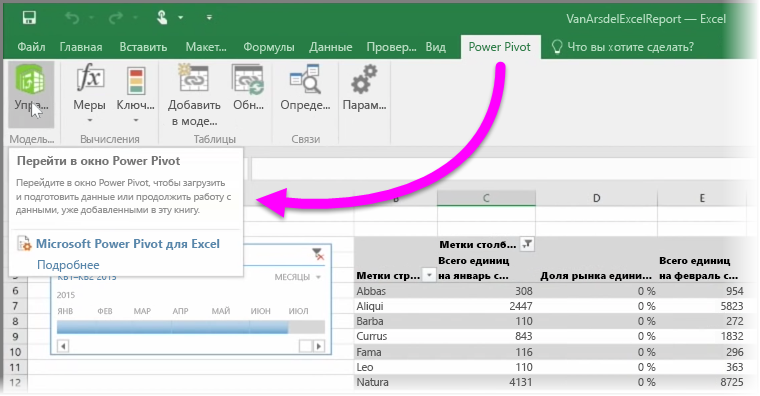

Если требуется использоваться какую-либо дополнительную функцию бизнес-аналитики Excel, например, **Power Query** (которая в Excel 2016 называется **Скачать и преобразовать**) для запроса и загрузки данных, **Power Pivot** для создания мощных моделей данных или **Power View** для создания динамических отчетов, можно выполнить импорт соответствующих функций в Power BI.

Если используется **Power Pivot** для создания расширенных моделей данных, например с несколькими связанными таблицами, мерами, вычисляемыми столбцами и иерархиями, Power BI может все это также импортировать.

Если книга содержит **листы Power View** — нет проблем. Служба Power BI повторно создаст их как новые **отчеты** в Power BI. Можно сразу же начать закреплять визуализации на информационных панелях.

Вот одна из замечательных функций Power BI: если для подключения, выполнения запроса или загрузки данных из внешнего источника используется Power Query или Power Pivot, то после импорта книги в Power BI можно настроить **запланированные обновления**. С помощью запланированных обновлений Power BI будет использовать сведения о подключении из книги, чтобы напрямую подключаться к источнику данных, запрашивать и загружать все данные, которые были изменены. Все визуализации в отчетах также будут автоматически обновлены.

