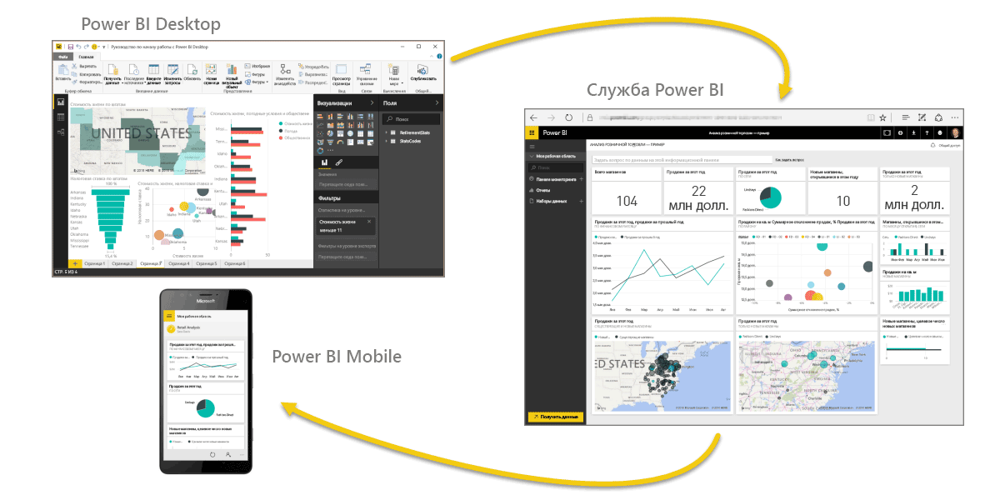
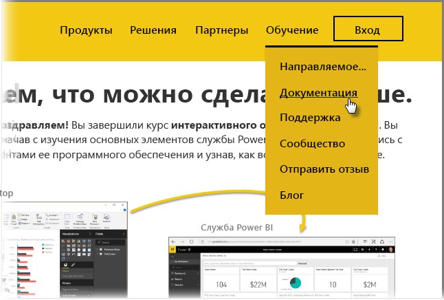

Вы сделали это! **Поздравляем!** Вы завершили курс **интерактивного обучения** для Power BI. Вы прошли весь путь, начав с изучения основных элементов службы Power BI, затем ознакомившись с функциями и элементами ее программного обеспечения и узнав, как все они работают вместе.

Это последняя часть курса (и его последний раздел, если вы не планируете разбираться с выражениями DAX). Поэтому если вы прошли все эти разделы по порядку, то можете вполне заслуженно похвалить себя. Отличная работа! Теперь вы хорошо разбираетесь во всех **важных понятиях**:

* что такое [Power BI](0-0-what-is-power-bi.md);
* [стандартные блоки](0-0b-building-blocks-power-bi.md) Power BI;
* [получение](1-2-connect-to-data-sources-in-power-bi-desktop.md) и [моделирование](2-1-intro-modeling-data.md) данных.
* [Визуализации](3-1-intro-visualizations.md)
* [просмотр данных](4-0-intro-power-bi-service.md) в службе Power BI;
* совместное использование [Excel и Power BI](5-1-intro-excel-data.md);
* [публикация и совместное использование](6-0-intro-content-packs-groups.md) своей работы.

Это большой объем знаний, и теперь, когда вы их изучили, пора эти знания применить на практике. Ниже приведено несколько **ссылок для скачивания файлов** или **подключения браузера к службе Power BI**.

* Вы всегда можете [получить последнюю версию Power BI Desktop](https://powerbi.microsoft.com/desktop).
* Перейти к [службе Power](https://powerbi.microsoft.com/) BI легко.
* Получить [мобильные приложения для Power BI](https://powerbi.microsoft.com/mobile/) можно всего одним касанием.

Кроме того, существуют дополнительные **справочные** материалы. Просто перейдите в верхнюю часть этой страницы и выберите **Learning > Документация**, чтобы отобразить наш обширный набор справочных материалов по Power BI.

Мы надеемся, что вам понравилось **интерактивное обучение работе с Power BI**. Желаем вам удачи, и пусть ваши визуальные элементы Power BI всегда будут иммерсивными и привлекательными.

## Еще один раздел для пользователей DAX
Хотите узнать что-то еще? Вас интересует, как с помощью **DAX (выражений анализа данных)** создавать, фильтровать и использовать настраиваемые столбцы и таблицы в Power BI? У нас есть еще один раздел специально для пользователей, которые готовы к программированию в Power BI: он называется **Знакомство с DAX**. Загляните туда, если вас интересует эта тема: он составлен в таком же приятном стиле, что и остальные руководства для интерактивного обучения.

