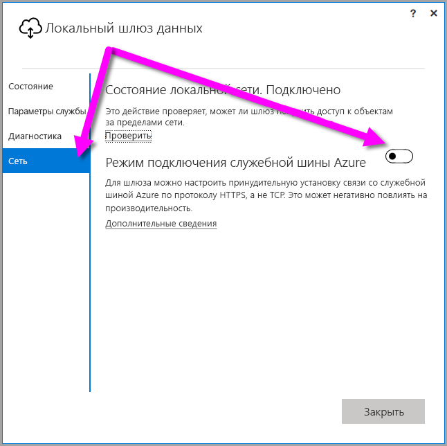
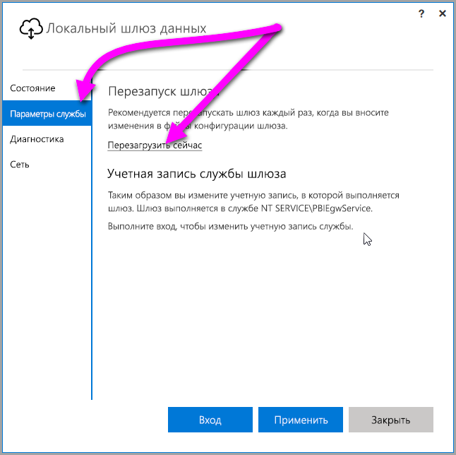

## <a name="sign-in-account"></a>Учетная запись для входа
Пользователи будут входить в систему с рабочей или учебной учетной записью. Это учетная запись вашей организации. Если у вас есть подписка на Office 365 и вы не указали свой реальный рабочий адрес электронной почты, ваша учетная запись может иметь вид nancy@contoso.onmicrosoft.com. Ваша учетная запись в облачной службе хранится в клиенте в каталоге Azure Active Directory (AAD). В большинстве случаев имя участника-пользователя учетной записи AAD совпадает с адресом электронной почты.

## <a name="windows-service-account"></a>Учетная запись служб Windows
Локальный шлюз данных настроен для входа в службы Windows с учетными данными *NT SERVICE\PBIEgwService*. По умолчанию он имеет право выполнять вход в качестве службы. Это происходит в контексте компьютера, на котором устанавливается шлюз.

> [!NOTE]
> Если вы выбрали личный режим, учетная запись служб Windows настраивается отдельно.
> 
> 

Это не та учетная запись, с помощью которой вы подключаетесь к локальным источникам данных.  Кроме того, она не совпадает с вашей рабочей или учебной учетной записью, с которой вы входите в облачные службы.

Если у вас возникнут проблемы с проверкой подлинности через прокси-сервер, вы можете сменить учетную запись службы Windows на учетную запись пользователя домена или управляемую учетную запись службы. Инструкции по смене учетной записи приведены в разделе о [настройке прокси-сервера](../service-gateway-proxy.md#changing-the-gateway-service-account-to-a-domain-user).

## <a name="ports"></a>Порты
Шлюз создает исходящее подключение к служебной шине Azure. Связь осуществляется через исходящие порты TCP 443 (по умолчанию), 5671, 5672, 9350–9354.  Шлюзу не требуются входящие порты. [Дополнительные сведения](https://azure.microsoft.com/documentation/articles/service-bus-fundamentals-hybrid-solutions/)

Рекомендуется добавить IP-адреса для региона, в котором хранятся ваши данные, в список разрешений брандмауэра. Вы можете скачать [список IP-адресов центров данных Microsoft Azure](https://www.microsoft.com/download/details.aspx?id=41653). Он обновляется еженедельно. Шлюз будет взаимодействовать со служебной шиной Azure, используя IP-адрес и полное доменное имя (FQDN). При принудительной установке связи по протоколу HTTPS шлюз будет использовать только полное доменное имя, поэтому он не будет устанавливать связь по IP-адресам.

> [!NOTE]
> IP-адреса в списке адресов центров данных Azure указаны в формате CIDR. Например, запись 10.0.0.0/24 не означает диапазон адресов с 10.0.0.0 по 10.0.0.24. Ознакомьтесь с дополнительными сведениями о [формате CIDR](http://whatismyipaddress.com/cidr).
> 
> 

Вот список полных доменных имен, которые используются шлюзом.

| Имена доменов | Исходящие порты | Описание |
| --- | --- | --- |
| *.download.microsoft.com |80 |HTTP, используемый для скачивания установщика. |
| *.powerbi.com |443 |HTTPS |
| *.analysis.windows.net |443 |HTTPS |
| *.login.windows.net |443 |HTTPS |
| *.servicebus.windows.net |5671-5672 |Расширенный протокол управления очередью сообщений (AMQP) |
| *.servicebus.windows.net |443, 9350-9354 |Прослушиватели для ретранслятора служебной шины по протоколу TCP (порт 443 требуется для получения маркера контроля доступа). |
| *.frontend.clouddatahub.net |443 |HTTPS |
| *.core.windows.net |443 |HTTPS |
| login.microsoftonline.com |443 |HTTPS |
| *.msftncsi.com |443 |Используется для проверки подключения к Интернету, если шлюз недоступен для службы Power BI. |
| *.microsoftonline p.com |443 |Используется для проверки подлинности в зависимости от конфигурации. |

> [!NOTE]
> Трафик, передаваемый на сайты visualstudio.com или visualstudioonline.com, нужен для работы компонента Application Insights. Этот трафик не влияет на функционирование шлюза.
> 
> 

## <a name="forcing-https-communication-with-azure-service-bus"></a>Принудительная установка связи по HTTPS со служебной шиной Azure
Для шлюза можно настроить принудительную установку связи со служебной шиной Azure по протоколу HTTPS, а не TCP. Это может повлиять на производительность. Для такой настройки измените в файле *Microsoft.PowerBI.DataMovement.Pipeline.GatewayCore.dll.config* значение `AutoDetect` на значение `Https`, как показано во фрагменте кода ниже. По умолчанию этот файл располагается здесь: *C:\Program Files\On-premises data gateway*.

```
<setting name="ServiceBusSystemConnectivityModeString" serializeAs="String">
    <value>Https</value>
</setting>
```

В значении параметра *ServiceBusSystemConnectivityModeString* учитывается регистр. Допустимые значения: *AutoDetect* и *Https*.

Кроме того, для шлюза можно настроить принудительный режим, описанный выше, с помощью пользовательского интерфейса шлюза. Ознакомиться с ним вы можете в [мартовском выпуске 2017 г.](https://powerbi.microsoft.com/blog/power-bi-gateways-march-update/) В пользовательском интерфейсе шлюза выберите раздел **Сеть**, а затем задайте для **режима подключения к служебной шине Azure** значение **Включено**.



После внесения изменений появится кнопка **Применить**. После ее нажатия *служба шлюза в ОС Windows* автоматически перезапустится, чтобы изменения вступили в силу.

В будущем, чтобы перезапустить *службу шлюза в ОС Windows*, в диалоговом окне пользовательского интерфейса выберите раздел **Параметры службы**, а затем щелкните *Перезагрузить сейчас*.



## <a name="support-for-tls-1112"></a>Поддержка протокола TLS 1.1 и 1.2
Начиная с обновления за август 2017 г. локальный шлюз данных по умолчанию использует протокол TLS 1.1 или 1.2 для обмена данными со **службой Power BI**. В предыдущих версиях локального шлюза данных по умолчанию используется TLS 1.0. После 15 марта 2018 г. прекращается поддержка TLS 1.0, в том числе возможности взаимодействия шлюза со **службой Power BI** через TLS 1.0. Чтобы продолжать использовать локальные шлюзы данных, обновите их к этому времени как минимум до выпуска от августа 2017 г.

Обратите внимание, что до 1 ноября локальный шлюз данных будет поддерживать протокол TLS 1.0, используя его как резервный механизм. Чтобы при передаче всего трафика шлюза использовался протокол TLS 1.1 или 1.2 (и чтобы прекратить использование шлюзом TLS 1.0), необходимо добавить или изменить следующие разделы реестра на компьютере, где запущена служба шлюза.

        [HKEY_LOCAL_MACHINE\SOFTWARE\Microsoft\.NETFramework\v4.0.30319]"SchUseStrongCrypto"=dword:00000001
        [HKEY_LOCAL_MACHINE\SOFTWARE\Wow6432Node\Microsoft\.NETFramework\v4.0.30319]"SchUseStrongCrypto"=dword:00000001

> [!NOTE]
> При добавлении или изменении этих разделов реестра обновления распространяются на все приложения .NET. Сведения об изменениях реестра, которые влияют на использование TLS в других приложениях, см. в описании [параметров реестра для протокола TLS](https://docs.microsoft.com/windows-server/security/tls/tls-registry-settings).
> 
> 

## <a name="how-to-restart-the-gateway"></a>Как перезапустить шлюз
Шлюз работает в качестве службы Windows. Его можно запустить и остановить, как и любую службу Windows. Существует несколько способов это сделать. Вот как это можно сделать из командной строки.

1. На компьютере, где работает шлюз, откройте командную строку администратора.
2. Остановить службу можно с помощью следующей команды:
   
   net stop PBIEgwService
3. Запустить службу можно с помощью следующей команды:
   
   net start PBIEgwService

