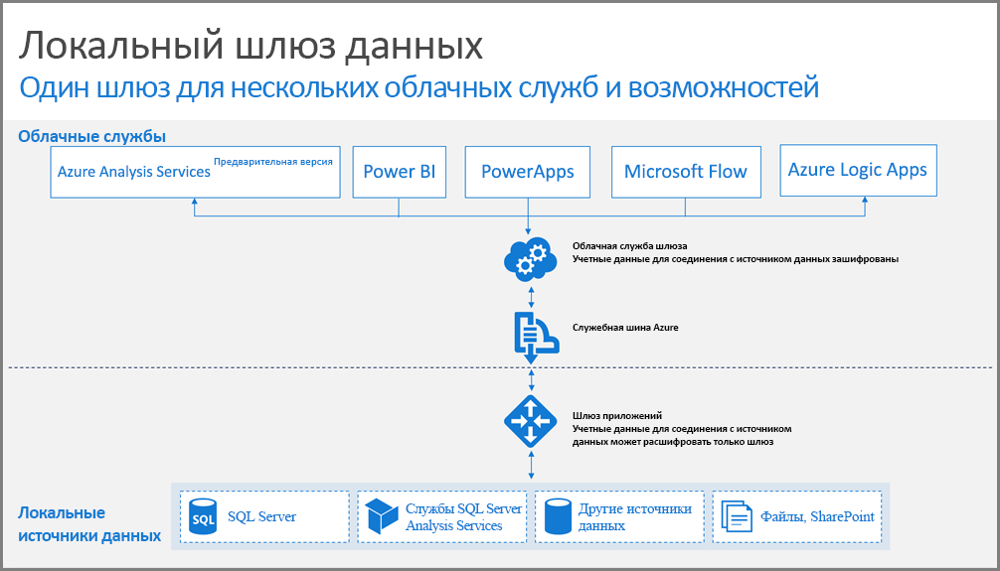

## Принципы работы шлюзов

Давайте сначала посмотрим, что происходит, когда пользователь взаимодействует с элементом, подключенным к локальному источнику данных. 

> [!NOTE]
> В Power BI вам потребуется настроить источник данных для шлюза.
> 
> 

1. Облачная служба создает запрос с зашифрованными учетными данными для локального источника, а затем отправляет его на обработку шлюзу.
2. Облачная служба шлюза анализирует запрос и передает его [служебной шине Azure](https://azure.microsoft.com/documentation/services/service-bus/).
3. Локальный шлюз данных опрашивает [служебную шину Azure](https://azure.microsoft.com/documentation/services/service-bus/) на предмет ожидающих выполнения запросов.
4. Шлюз получает запрос, расшифровывает учетные данные и использует их для установки подключения к источникам.
5. Шлюз отправляет запрос в источник данных на исполнение.
6. Результаты возвращаются источником в шлюз, а оттуда — в облачную службу. Затем служба использует полученные результаты.

