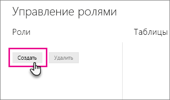

## Создание ролей и правил в приложении Power BI Desktop
В приложении Power BI Desktop можно задавать роли и правила. При публикации в Power BI публикуются и определения ролей.

Чтобы задать роли безопасности, выполните указанные ниже действия.

1. Импортируйте данные в отчет Power BI Desktop или настройте подключение DirectQuery.
   
   > [!NOTE]
   > Задавать определения ролей в Power BI Desktop для динамических подключений служб Analysis Services нельзя. Это делается непосредственно в модели Analysis Services.
   > 
   > 
2. Откройте вкладку **Моделирование**.
3. Выберите **Управление ролями**.
   
   
4. Выберите **Создать**.
   
   
5. Укажите имя роли. 
6. Выберите таблицу, для которой хотите применить правило DAX.
7. Введите выражения DAX. Выражение должно возвращать истину (true) или ложь (false). Пример: [Код объекта] = "Значение".
   
   > [!NOTE]
   > В этом выражении можно использовать функцию *username()*. Помните о том, что в Power BI Desktop функция *username()* возвращает значения в формате *ДОМЕН\имя_пользователя*. В службе Power BI это значение принимает формат имени участника-пользователя. Кроме того, можно использовать функцию *userprincipalname()*, которая всегда возвращает пользователя в формате имени участника-пользователя.
   > 
   > 
   
   
8. Созданное выражение DAX можно проверить с помощью флажка над полем выражения.
   
   
9. Нажмите кнопку **Сохранить**.

Назначать пользователей роли в Power BI Desktop нельзя. Это делается в службе Power BI. Чтобы использовать в Power BI Desktop функции динамической системы безопасности, используйте функции DAX *username()* или *userprincipalname()* и настройте соответствующие связи.

