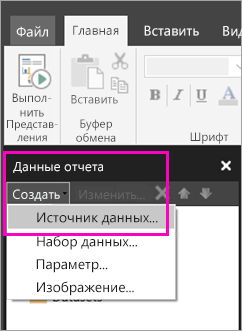

# Создание внедренного источника данных для отчетов с разбивкой на страницы в службе Power BI (предварительная версия)
Из этой статьи вы узнаете, как создать и изменить внедренный источник данных для отчета с разбивкой на страницы в службе Power BI. Внедренный источник данных можно определить только в одном отчете и использовать его только в этом отчете. Сейчас отчеты с разбивкой на страницы, опубликованные в службе Power BI, могут использовать только внедренные наборы данных и внедренные источники данных. Поддерживаются следующие источники данных:

- База данных SQL и хранилище данных Azure;
- SQL Server
- Службы SQL Server Analysis Services 

Отчеты с разбивкой на страницы подключаются к локальным источникам данных через шлюз. Шлюз настраивается после публикации отчета в службе Power BI. Дополнительные сведения о [шлюзах Power BI](service-gateway-getting-started.md). 

## Создание внедренного источника данных
  
1. Откройте построитель отчетов.

1. На панели инструментов в области данных отчета выберите **Новый** > **Источник данных**. Откроется диалоговое окно **Свойства источника данных**.

    
  
2.  В текстовом поле **Имя** введите имя источника данных или сохраните имя по умолчанию.  
  
3.  Установите флажок **Использовать соединение, внедренное в отчет**.  
  
1.  В списке **Выберите тип подключения** выберите тип источника данных. 

1.  Укажите строку подключения, используя один из следующих методов:  
  
    -   Введите строку подключения непосредственно в текстовое поле **Строка подключения**. 
  
    -   Нажмите кнопку выражения (**fx)**, чтобы создать выражение для создания строки подключения. В диалоговом окне **Выражение** введите выражение на панели выражений. Нажмите кнопку **ОК**. 
  
    -   Выберите **Сборка**, чтобы открыть диалоговое окно **Свойства соединения** для источника данных, выбранного на шаге 2.  
  
        В диалоговом окне **Свойства соединения** заполните поля данными для конкретного типа источника данных. В свойствах подключения указывается тип источника данных, имя источника данных и учетные данные для него. Указав значения в этом диалоговом окне, щелкните **Проверка подключения**, чтобы убедиться в доступности источника данных и правильности учетных данных.  
  
4.  Выберите **Учетные данные**.  
  
     Укажите учетные данные для выбранного источника данных. Тип поддерживаемых учетных данных выбирается владельцем источника данных. Дополнительные сведения см. в статье [Задание учетных данных и сведения о соединении для источников данных отчета](https://docs.microsoft.com/sql/reporting-services/report-data/specify-credential-and-connection-information-for-report-data-sources).
  
5.  Нажмите кнопку **ОК**.  
  
     Источник данных появится в области данных отчета.  

## Дальнейшие действия

- [Создание внедренного набора данных для отчета с разбивкой на страницы в службе Power BI](paginated-reports-create-embedded-dataset.md)
- [Сведения об отчетах с разбивкой на страницы в Power BI Premium (предварительная версия)](paginated-reports-report-builder-power-bi.md)