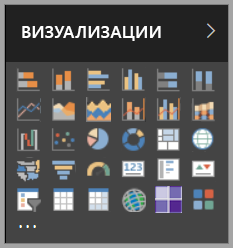
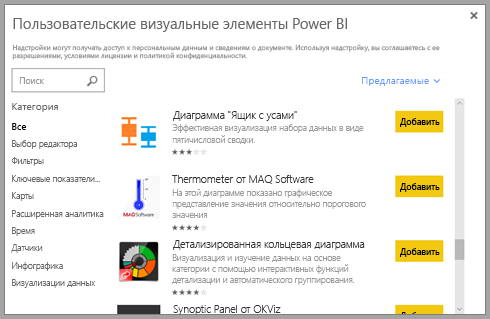
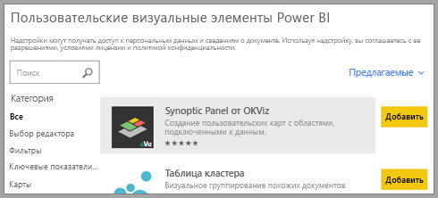
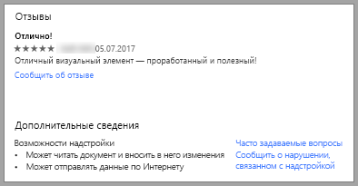
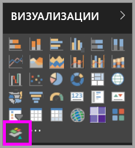
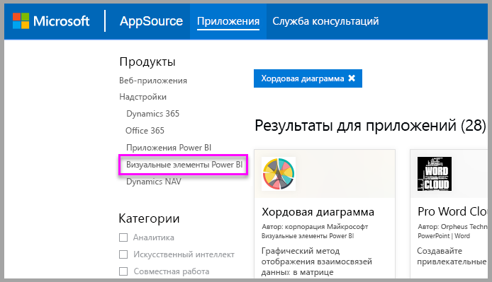
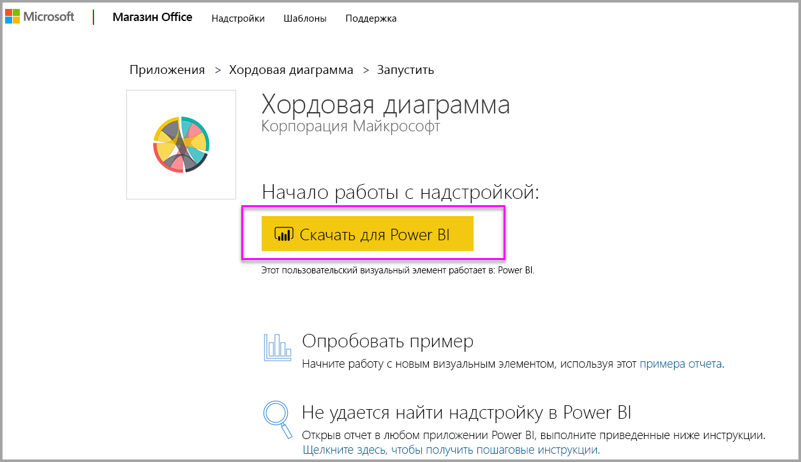

# Пользовательские визуальные элементы в Power BI
При создании или редактировании отчета Power BI доступно множество различных визуальных элементов. Эти визуальные элементы отображаются в области **Визуализации**. Когда вы скачиваете Power BI Desktop или открываете службу Power BI (app.powerbi.com), этот предварительно упакованный набор визуальных элементов поставляется в комплекте. 

Но вам не обязательно использовать именно этот набор. Нажав кнопку с многоточием, можно открыть другой источник визуальных элементов для отчета: *настраиваемые визуальные элементы*.

Настраиваемые визуальные элементы создаются членами сообщества и специалистами Майкрософт и размещаются в [AppSource](https://appsource.microsoft.com/marketplace/apps?product=power-bi-visuals). Эти визуальные элементы можно загрузить и добавлять в отчеты Power BI. Все эти настраиваемые визуальные элементы утверждены корпорацией Майкрософт. С ними можно выполнять те же операции, что и с предварительно упакованными визуализациями, включенными в Power BI: их можно отфильтровывать, выделять, изменять, совместно использовать и т. д. 

Что такое AppSource? Говоря простым языком, это место, где можно найти приложения, надстройки и расширения для программного обеспечения корпорации Майкрософт. [AppSource](https://appsource.microsoft.com) позволяет миллионам пользователей таких продуктов, как Office 365, Azure, Dynamics 365, Cortana и Power BI, находить решения, с помощью которых можно выполнять работу более эффективно, продуманно или элегантно.

## Два вида настраиваемых визуальных элементов

Настраиваемые визуальные элементы Power BI, которые доступны в AppSource делятся на две категории: **утвержденные** и **сертифицированные**. *Утвержденные* визуальные элементы AppSource могут выполняться в браузерах, отчетах и на панелях мониторинга.  *Сертифицированные в Power BI* визуальные элементы прошли тщательную проверку. Все они поддерживаются в дополнительных сценариях, таких как [подписка по электронной почте](service-report-subscribe.md) и [экспорт в PowerPoint](service-publish-to-powerpoint.md).

Просмотреть список сертифицированных пользовательских визуальных элементов или отправить свои визуальные элементы можно [здесь](power-bi-custom-visuals-certified.md).

Вы являетесь веб-разработчиком и заинтересованы в том, чтобы создавать собственные визуальные элементы и добавлять их в AppSource?  См. статью о [начале работы с использованием средств для разработчиков](service-custom-visuals-getting-started-with-developer-tools.md) и узнайте, как [публиковать настраиваемые визуальные элементы в AppSource](https://appsource.microsoft.com/marketplace/apps?product=power-bi-visuals).

## Скачать или импортировать настраиваемые визуальные элементы из Microsoft AppSource
Вы можете скачать и импортировать настраиваемые визуальные элементы двумя способами: из Power BI и с веб-сайта AppSource. 

###    Импорт настраиваемых визуальных элементов из Power BI
1. В нижней части панели "Визуализации" нажмите кнопку с многоточием. 

    

2. В раскрывающемся списке выберите **Импортировать из хранилища**.

    

3. Прокрутите список и найдите визуальный элемент для импорта. 

    

4.  Чтобы получить дополнительные сведения об одном из визуальных элементов, выделите и выберите его.

    

5.  На странице сведений могут быть представлены снимки экрана, видео, подробное описание и многое другое. 

    

6. Прокрутите вниз, чтобы просмотреть обзоры.

    

7.    Импортируйте настраиваемый визуальный элемент, выбрав **Добавить**. В нижнюю часть области "Визуализации" добавляется значок настраиваемого визуального элемента, а это значит, что теперь он доступен для использования в отчете.

       

###    Скачивание и импорт настраиваемых визуальных элементов из Microsoft AppSource

1. Войдите в [Microsoft AppSource](https://appsource.microsoft.com) и выберите вкладку **Приложения**. 

    

2. Откроется [страница с результатами для приложений](https://appsource.microsoft.com/en-us/marketplace/apps), где можно просмотреть основные приложения в каждой категории, включая *приложения Power BI*. Но мы ищем настраиваемые визуальные элементы, так что давайте конкретизируем результаты, выбрав **Power BI visuals** (Визуальные элементы Power BI) в списке на панели навигации слева.

    

3. В AppSource отобразится плитка для каждого настраиваемого визуального элемента.  Каждая плитка содержит моментальный снимок настраиваемого визуального элемента, краткое описание и ссылку для скачивания. Выберите плитку, чтобы получить дополнительные сведения. 

    

4. На странице сведений могут быть представлены снимки экрана, видео, подробное описание и многое другое. Чтобы скачать настраиваемый визуальный элемент, выберите **Get it now** (Получить) и примите условия использования. 

    

5. Перейдите по этой ссылке для скачивания настраиваемого визуального элемента.

    

    На странице для скачивания также приведены инструкции по импорту настраиваемого визуального элемента в приложение Power BI Desktop и службу Power BI.

    Вы также можете скачать пример отчета, в котором используется этот пользовательский визуальный элемент и демонстрируются его возможности.

    

6. Сохраните PBIVIZ-файл и откройте Power BI.    
7. Откройте отчет, в который нужно добавить настраиваемый визуальный элемент и в нижней части области **Визуализации** нажмите кнопку с многоточием и выберите **Импортировать из файла**.  

      

8. Выберите файл настраиваемого визуального элемента, чтобы добавить его значок в нижнюю часть области **Визуализации**. Настраиваемый визуальный элемент теперь можно использовать в отчете.

    
    
##    Рекомендации и устранение неполадок

- При импорте пользовательский визуальный элемент добавляется в определенный отчет. Если вы хотите использовать этот визуальный элемент в другом отчете, необходимо также импортировать его в этот отчет. При сохранении отчета с пользовательским визуальным элементом с помощью параметра **Сохранить как** вместе с новым отчетом сохраняется копия пользовательского визуального элемента.

- Если область **Визуализации** не отображается, значит, вы не изменили разрешения для отчета.  Чтобы добавить настраиваемые визуальные элементы в отчеты, необходимо обладать правами на внесение изменений. Вы не можете добавлять их в отчеты, к которым предоставлен общий доступ.

Появились дополнительные вопросы? [Ответы на них см. в сообществе Power BI.](http://community.powerbi.com/)

