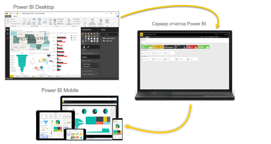

# Что такое Power BI?
**Power BI** — это коллекция программных служб, приложений и соединителей, которые взаимодействуют друг с другом, чтобы превратить разрозненные источники данных в согласованные, визуально иммерсивные и интерактивные аналитические данные. Представлены ли ваши данные простой электронной таблицей Excel или коллекцией облачных и локальных гибридных хранилищ данных, **Power BI** позволяет легко подключаться к источникам данных, визуализировать (или выявлять) важные аспекты и предоставлять общий доступ к результатам всем, кому это необходимо.

**Power BI** может работать просто и быстро, формируя краткие аналитические сведения на базе электронной таблицы Excel или локальной базы данных. Однако **Power BI** также является надежным продуктом корпоративного уровня, который пригоден для масштабного моделирования в режиме реального времени, а также разработки индивидуальных решений. Он может выступать в качестве вашего личного средства визуализации и ведения отчетов, а также служить подсистемой аналитики и принятия решений для групповых проектов, подразделений или целых организаций.

## Компоненты Power BI
Power BI состоит из классического приложения для Windows **Power BI Desktop**, веб-службы SaaS (*программное обеспечение как услуга*), называемой **службой Power BI**, и мобильных **приложений** Power BI, доступных на смартфонах и планшетах Windows, а также на устройствах под управлением iOS и Android.

Три этих элемента — **Desktop**, **служба** и **мобильные** приложения — позволяют людям создавать, использовать бизнес-инсайты и обмениваться ими наиболее эффективно с точки зрения личных или служебных задач.

## Как Power BI соотносится с вашей ролью или должностью
Подход к использованию Power BI может зависеть от вашей роли в проекте или в рабочей группе. Другие люди, занимающие другие должности, могут использовать Power BI иначе, и в этом нет ничего страшного.

Например, вы работать главным образом со **службой Power BI**, а ваш коллега, занимающийся обработкой числовых данных и составлением бизнес-отчетов, может активно использовать **Power BI Desktop** (и публиковать отчеты в службу Power BI, чтобы вы могли их просмотреть). Еще один ваш коллега из отдела продаж может отдавать предпочтение приложению Power BI для телефона, отслеживая ход выполнения своего плана продаж и изучая новые данные о потенциальных клиентах.

Разработчики могут применять API-интерфейсы Power BI для отправки данных в наборы данных и для внедрения панелей мониторинга и отчетов в пользовательские приложения. Вы придумали новый визуальный элемент? Создайте его для себя и поделитесь с другими.  

Вы также можете использовать каждый из элементов **Power BI** в разное время в зависимости от поставленных целей и вашей роли в проекте или мероприятии.

Например, вы можете просматривать сведения о запасах и ходе производства с помощью панели мониторинга реального времени в службе, а также создавать в **Power BI Desktop** статистические отчеты о взаимодействии с клиентами для своей группы. Подход к использованию Power BI может зависеть от того, какой компонент или какая функция Power BI являются оптимальными в сложившейся ситуации. При этом вам всегда доступны все описанные компоненты Power BI, что и делает этот продукт таким гибким и привлекательным.

## Порядок работы в Power BI
Общая последовательность операций при работе с Power BI начинается с подключения к источникам данных и создания отчета в **Power BI Desktop**. Затем этот отчет публикуется из приложения **Desktop** в **службу Power BI** и предоставляется другим пользователям через **службу** и **мобильную версию**, позволяя *применять* этот отчет (просматривать данные и взаимодействовать с ним). В некоторых случаях создатели отчетов предоставляют коллегам аналогичные разрешения *создателя*, позволяющие им с помощью **службы** редактировать отчеты, добавлять панели мониторинга и предоставлять общий доступ к результатам.

Этот рабочий процесс не является обязательным, но он очень широко распространен и хорошо демонстрирует взаимосвязь трех основных элементов Power BI.

Что делать, если вы еще не готовы перейти в облако и хотите оставить отчеты под защитой корпоративного брандмауэра?  Читайте дальше.

## Локальная работа с отчетами с использованием сервера Power BI Report Server
Создание и развертывание отчетов Power BI, мобильных отчетов и отчетов с разбивкой на страниц, а также управление ими в локальной среде с помощью готовых средств и служб, которые предоставляет сервер отчетов Power BI.

Сервер отчетов Power BI развертывается под защитой брандмауэра и предоставляет пользователям доступ к отчетам разными способами, например для просмотра в веб-браузере, в приложении на мобильном устройстве или для получения по электронной почте. Так как решение "Сервер отчетов Power BI" совместимо с Power BI в облаке, вы можете легко перейти в облако в любой удобный момент. 

## Дальнейшие действия
[Регистрация в службе и подключение к ней](/power-bi/service-tutorial-connect-to-github.md)
