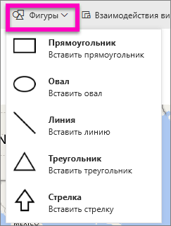
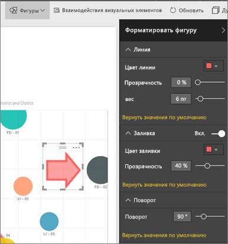

# Статическое содержимое в отчетах Power BI
В службе Power BI в режиме редактирования добавьте в отчет текстовые поля и фигуры. 

> **Примечание**. В Power BI Desktop можно также [добавлять в отчет статические изображения](guided-learning/visualizations.yml#step-11), как показано в этом видео.
> 
> <iframe width="560" height="315" src="https://www.youtube.com/embed/_3q6VEBhGew" frameborder="0" allowfullscreen></iframe>
> 
> 

## Добавление текстового поля в отчет
1. Поместите курсор в любом месте холста отчета и выберите **Текстовое поле**.
   
   
2. Введите текст в текстовое поле и, по желанию, выберите шрифт, цвет и выравнивание текста. 
   
   
3. Чтобы изменить расположение текстового поля, выберите серую область вверху и перетащите поле. Чтобы изменить размер текстового поля, выберите и перетащите один из маркеров. 
   
   
4. Чтобы закрыть текстовое поле, выберите любое пустое место на холсте отчета.
5. Выберите значок булавки , чтобы закрепить текстовое поле на панели мониторинга. 

## Добавление фигуры в отчет
1. Поместите курсор в любом месте холста отчета и выберите **Фигуры**.
   
   
2. В раскрывающемся списке выберите фигуру, чтобы добавить ее на холст отчета. Давайте добавим стрелку, чтобы направить внимание на пузырек с наибольшим суммарным отклонением продаж. 
   
   В области **Формат фигуры** настройте фигуру. В этом примере мы создали красную стрелку с темной красной границей, повернутую на 90 градусов.
   
   
3. Чтобы изменить расположение фигуры, выберите серую область вверху и перетащите фигуру. Чтобы изменить размер фигуры, выберите и перетащите один из маркеров. 

> **ПРИМЕЧАНИЕ**. Фигуры нельзя закрепить на панели мониторинга. 
> 
> 

### Дальнейшие действия
[Добавление гиперссылки в текстовое поле](service-add-hyperlink-to-text-box.md)

[Отчеты в Power BI](service-reports.md)

[Визуализации в отчетах Power BI](power-bi-report-visualizations.md)

[Power BI — основные понятия](service-basic-concepts.md)

Появились дополнительные вопросы? [Ответы на них см. в сообществе Power BI.](http://community.powerbi.com/)

