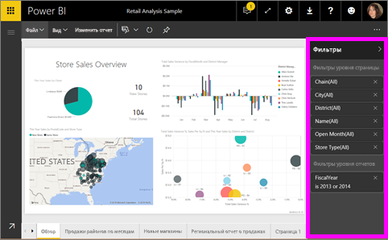
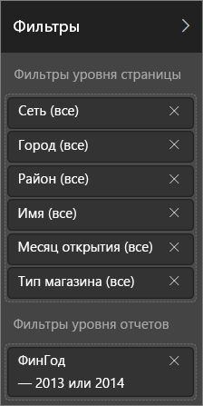
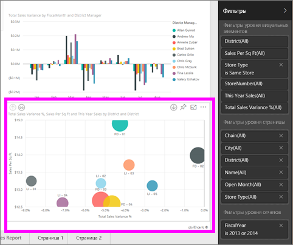
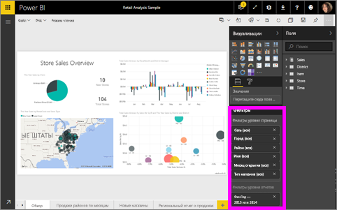

# О фильтрах и выделении в отчетах Power BI
***Фильтры*** удаляют все данные, кроме необходимых.  ***Выделение*** не является фильтрацией, так как оно не удаляет данные, а выделяет подмножество отображаемых данных. Невыделенные данные остаются видимыми и имеют серый цвет.

Есть много способов фильтровать и выделять отчеты в Power BI. Если описать их все в одной статье, вы запутаетесь. Поэтому мы разбили информацию на следующие блоки.

* Общие сведения о фильтрах и выделении (статья, которую вы читаете сейчас).
* Способы, с помощью которых вы можете [создавать и использовать фильтры и выделение в режиме правки или в своих отчетах](power-bi-report-add-filter.md). Если у вас есть разрешение править отчеты, вы можете создавать, изменять и удалять фильтры и выделения в отчетах.
* Способы, с помощью которых вы можете [использовать фильтры и выделения в отчетах, которыми с вами поделились, или в режиме чтения](service-reading-view-and-editing-view.md). Хоть возможности и ограничены, в Power BI все равно доступны разные средства фильтрации и выделения.  
* [Подробная информация об элементах управления фильтрацией и выделением, которые доступны в режиме правки](power-bi-how-to-report-filter.md), в том числе подробная информация о типах фильтров (включая фильтры по дате и времени, числовые и текстовые фильтры) и о разнице между основными и расширенными параметрами.
* Узнав, как по умолчанию работают фильтры и выделение, [научитесь изменять способы, с помощью которых визуализации на странице фильтруют и выделяют друг друга](service-reports-visual-interactions.md).

> [!TIP]
> Как служба Power BI определяет, что данные связаны между собой?  Power BI использует связи между таблицами и полями в базовой [модели данных](https://support.office.com/article/Create-a-Data-Model-in-Excel-87e7a54c-87dc-488e-9410-5c75dbcb0f7b?ui=en-US&rs=en-US&ad=US), чтобы элементы на странице отчета могли взаимодействовать друг с другом.
> 
> 

## Основные сведения о том, как с помощью панели "Фильтры" выполнять фильтрацию и выделение в отчетах

Фильтры и выделение можно применять с помощью панели **Фильтры**. Также для этого можно выбрать нужные элементы непосредственно в отчете (ad-hoc-отчет, см. внизу страницы). На панели "Фильтры" отображаются таблицы и поля, используемые в отчете, а также примененные фильтры, если таковые есть. Есть такие категории фильтров: **фильтры уровня страницы**, **фильтры уровня отчета** и **фильтры уровня визуальных элементов**.  Фильтры уровня визуальных элементов отображаются, только если вы выбрали визуализацию на холсте отчета.

> [!TIP]
> Если напротив фильтра отображается слово **Все**, это значит, что в качестве фильтра используется все поле.  Например, поле **Chain(All)**, изображенное на снимке экрана ниже, означает, что эта страница отчета включает данные обо всех сетях магазинов.  С другой стороны, фильтр уровня отчета **FiscalYear is 2013 or 2014** означает, что в отчет включены только данные за финансовые года 2013 и 2014.
> 
> 

## Фильтры в режиме чтения и фильтры в режиме правки
Есть два режима взаимодействия с отчетами: [режим чтения и режим правки](service-reading-view-and-editing-view.md).  Доступные возможности фильтрации зависят от используемого в настоящий момент режима.

* В режиме правки можно добавлять фильтры страниц, отчетов и визуализаций. При сохранении отчета фильтры сохраняются вместе с ним. Пользователи, просматривающие отчет в режиме чтения, могут работать с добавленными фильтрами, но не могут сохранять свои изменения.
* В режиме чтения можно взаимодействовать с уже существующими в отчете фильтрами страниц и визуальных элементов, однако сохранять изменения фильтров нельзя.

### Панель "Фильтры" в режиме чтения
Если у вас есть доступ к отчетам только в режиме чтения, панель "Фильтры" выглядит так:

Эта страница отчета содержит шесть фильтров уровня страницы и один фильтр уровня отчета.

Чтобы узнать, есть ли фильтры визуализаций, выберите визуализацию. На изображении ниже к пузырьковой диаграмме применены шесть фильтров.

Просмотрите данные в режиме чтения, изменяя существующие фильтры. О том, как это делать, см. в статье [Взаимодействие с отчетом в режиме чтения в Power BI](service-reading-view-and-editing-view.md).

### Панель "Фильтры" в режиме правки
Если у вас есть разрешения владельца и вы открываете отчет в режиме правки, доступна не только панель **Фильтры**, но и несколько других панелей правки.

Видно, что эта страница отчета, как и страница, открытая в режиме чтения (выше), содержит шесть фильтров уровня страницы и один фильтр уровня отчета. Если выберем пузырьковую диаграмму, мы увидим, что к ней применены шесть фильтров уровня визуальных элементов.

При этом в режиме правки доступны и другие возможности, связанные с фильтрацией и выделением. Основная разница в том, что можно добавлять новые фильтры. О том, как делать это и многое другое, см. в статье [Добавление фильтра в отчет в Power BI](power-bi-report-add-filter.md).

## Фильтрация и выделение в ad-hoc-отчете
Выберите поле на холсте отчета, который нужно отфильтровать, и выделите оставшуюся часть страницы. В этой же визуализации выберите пустое место, чтобы удалить его. Хотя этот тип фильтрации и выделения не сохраняется вместе с отчетом, с его помощью вы можете быстро изучить влияние данных. Чтобы настроить этот тип фильтрации и выделения, см. статью [Взаимодействия с визуализациями в отчете Power BI](service-reports-visual-interactions.md).

## Дальнейшие действия
[Взаимодействие с фильтрами и выделение (в режиме чтения)](service-reading-view-and-editing-view.md)

[Добавление фильтра в отчет (в режиме правки)](power-bi-report-add-filter.md)

[Ознакомление с фильтрами отчетов](power-bi-how-to-report-filter.md)

[Взаимодействие с визуализациями в отчете Power BI](service-reports-visual-interactions.md)

Дополнительные сведения об [отчетах в Power BI](service-reports.md)

Появились дополнительные вопросы? [Ответы на них см. в сообществе Power BI.](http://community.powerbi.com/)

