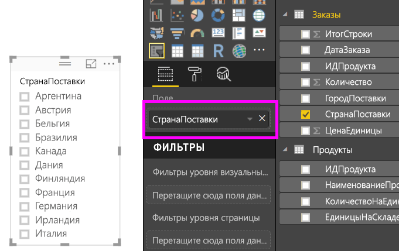
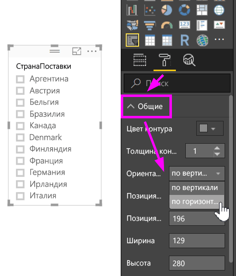
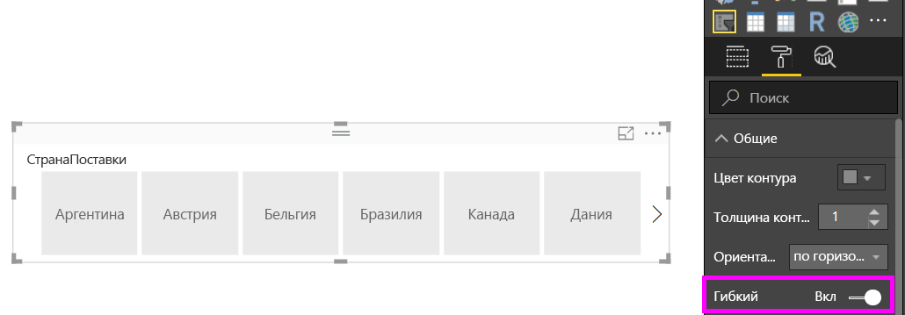
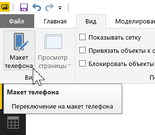
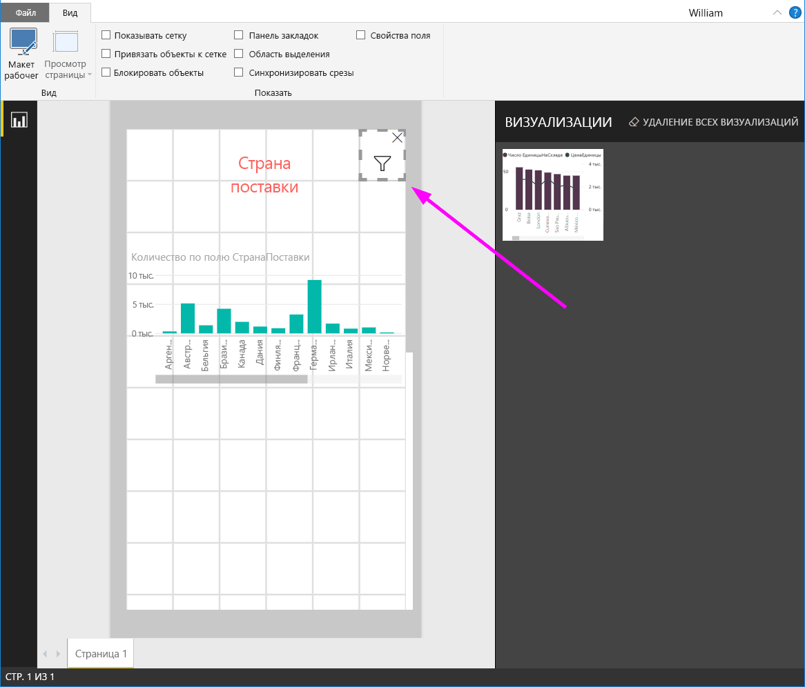

# Создание адаптивного визуального элемента "Срез" в Power BI

Адаптивные срезы изменяют размер, чтобы помещаться в любое пространство в отчете. Вы можете менять размеры и формы адаптивных срезов, например с горизонтального элемента на квадратный, с квадратного на вертикальный. Значения в срезе отобразятся в новом порядке в соответствии с изменениями. В Power BI Desktop и в службе Power BI можно делать адаптивными горизонтальные срезы и среды даты и диапазона. В срезах даты и диапазона также улучшена область сенсорного ввода, что позволяет легко изменять их. Вы можете как угодно уменьшать и увеличивать размер адаптивных срезов. Они также автоматически изменяют размер, чтобы помещаться в отчетах в службе Power BI и в мобильных приложениях Power BI. 

## Создание среза

Чтобы создать динамический срез, сначала нужно создать базовый срез. 

1. Выберите значок **среза**  в области **Визуализации**.
2. Перетащите поле, по которому нужно выполнить фильтрацию, в область **Поле**.

    

## Преобразование в горизонтальной срез

1. Выберите срез, а затем в области **Визуализации** выберите раздел **Формат**.
2. Разверните раздел **Общие**, затем для параметра **Ориентация** выберите значение **Горизонтальная**.

     

1.  Возможно, потребуется расширить срез, чтобы показать дополнительные значения.

     

## Как делать срез адаптивным и экспериментировать с ним

Это легко. 

1. Прямо под параметром **Ориентация** в разделе **Общие** вкладки **Формат** укажите для параметра **Адаптивный** значение **Вкл**.  

    

1. Теперь вы можете экспериментировать со срезом. Перетащите углы, чтобы укоротить его, сделать выше, расширить или сузить. Если сделать его очень маленьким, он станет просто значком фильтра.

    

## Добавление в макет отчета для телефона

В Power BI Desktop можно создать макет для телефона для каждой страницы отчета. Если для страницы есть макет для телефона, она отображается на мобильном телефоне в книжной ориентации. Если нет, она отображается в альбомной ориентации. 

1. В меню **Представление** выберите значок **Макет телефона**.

     
    
1. Перетащите в сетку все визуальные элементы, которые нужно отобразить в отчете на телефоне. Если вы перетаскиваете адаптивный срез, измените его размер до нужного. В нашем случае это значок фильтра.

    

Подробнее о создании [отчетов, оптимизированных для мобильных приложений Power BI](desktop-create-phone-report.md).

## Как сделать адаптивным срез времени или диапазона

Нужно выполнить те же действия, чтобы сделать адаптивным срез времени или диапазона. После установки для параметра **Адаптивный** значения **Вкл.** вы увидите несколько изменений.

- Визуальные элементы оптимизируют порядок полей ввода в зависимости от размера, разрешенного на холсте. 
- Отображение элемента данных оптимизировано, чтобы срез был как можно более удобным в зависимости от размера, разрешенного на холсте. 
- Новый круглые ползунки оптимизируют взаимодействие при сенсорном вводе. 
- Когда визуальный элемент становится слишком мелким, он превращается в значок, который представляет тип визуального элемента на его месте. Для взаимодействия с ним просто дважды коснитесь значка, чтобы открыть визуальный элемент в режиме фокусировки. Таким образом на странице отчета сохраняется свободное пространство без потери функциональности.

## Дальнейшие действия

- [Срезы в службе Power BI](power-bi-visualization-slicers.md)
- Появились дополнительные вопросы? [Попробуйте задать вопрос в сообществе Power BI.](http://community.powerbi.com/)