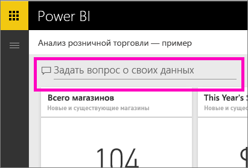
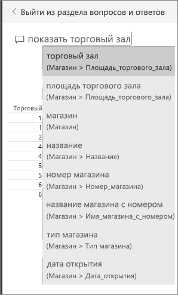
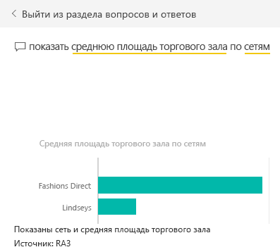
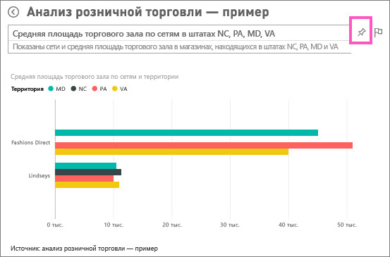
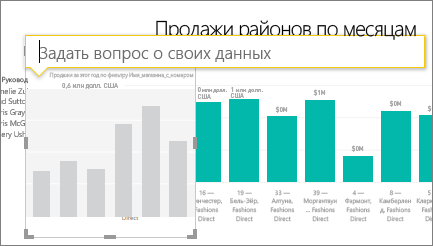
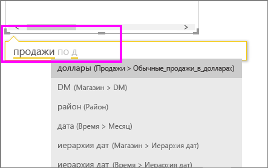
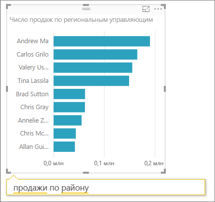
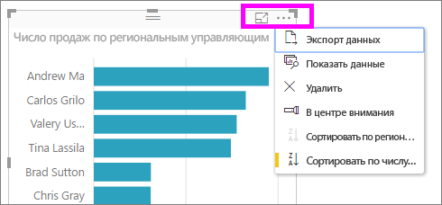

# Руководство по использованию функции "Вопросы и ответы" для создания визуализаций и отчетов
В [этом обзоре](power-bi-q-and-a.md) представлено описание функции "Вопросы и ответы" Power BI с двух сторон: *потребители* используют панели мониторинга и отчеты, которые им предоставлены, а *создатели* управляют отчетами и наборами данных. Первая часть этого руководства предназначена главным образом для тех, кто использует панели мониторинга через службу Power BI. Вторая часть будет полезна тем, кто создает отчеты через в Power BI или Power BI Desktop. Особенности применения функции "Вопросы ответы" совместно с [Power BI Mobile](mobile-apps-ios-qna.md) и [Power BI Embedded](developer/qanda.md) рассматриваются в отдельных статьях.

Функция "Вопросы и ответы" интерактивна и даже интересна, и очень часто один вопрос приводит к многим другим, так как визуализации раскрывают новые пути для поиска. В следующем видео Аманда показывает, как с помощью функции "Вопросы и ответы" создавать визуализации, анализировать их и закреплять на панели мониторинга.

<iframe width="560" height="315" src="https://www.youtube.com/embed/qMf7OLJfCz8?list=PL1N57mwBHtN0JFoKSR0n-tBkUJHeMP2cP" frameborder="0" allowfullscreen></iframe>

## Часть 1. Работа с функцией "Вопросы и ответы" на панели мониторинга в службе Power BI (app.powerbi.com)
Панель мониторинга содержит закрепленные плитки, связанные с одним или несколькими наборами данных, по содержимому которых вы можете задавать вопросы. Чтобы увидеть, какие отчеты и наборы данных использовались для создания панели мониторинга, выберите **Просмотреть похожие** в строке меню.

Поле функции "Вопросы и ответы" находится в левом верхнем углу панели мониторинга. Здесь вы можете ввести любой вопрос, используя естественный язык. Компонент "Вопросы и ответы" распознает слова при вводе и определяет, где (в каком наборе данных) можно найти ответ. Этот компонент также помогает сформулировать вопрос с помощью таких функций, как автоматическое завершение, изменение формулировки и другие текстовые и визуальные подсказки.

Ответ на вопрос отображается как интерактивная визуализация и обновляется по мере изменения вопроса.

1. Откройте панель мониторинга и поместите курсор в поле для вопроса. Еще до начала ввода компонент вопросов и ответов открывает новое окно с полезными предложениями. В списке [базовых наборов данных](service-get-data.md) вы увидите имена таблиц или даже готовые вопросы, если владелец набора подготовил [популярные вопросы](service-q-and-a-create-featured-questions.md).

   

   Всегда можно выбрать один из этих вопросов в качестве отправной точки и уточнять вопрос для поиска конкретного ответа. С другой стороны, имя таблицы поможет вам сформулировать новый вопрос.

2. Выберите один из предложенных вариантов или начните набирать собственный вопрос, а затем выберите подходящее предложение в раскрывающемся списке.

   

3. По мере ввода вопроса функция "Вопросы и ответы" выбирает для отображения ответа наиболее подходящую [визуализацию](power-bi-visualization-types-for-reports-and-q-and-a.md), которая динамически меняется в зависимости от вопроса.

   

4. При вводе вопроса Power BI пытается найти наилучший ответ, используя все наборы данных, плитки которых представлены на этой панели мониторинга.  Если все плитки из *набора данных А*, то ответ будет получен из *набора данных А*.  Если имеются плитки из *набора данных А* и *набора данных Б*, то функция будет искать лучший ответ в этих двух наборах данных.

   > [!TIP]
   > Поэтому будьте внимательны: если имеется только одна плитка из *набора данных А*, и вы удалите ее из панели мониторинга, функция вопросов и ответов больше не будет иметь доступа к *набору данных А*.
   >
   >
5. Если вы довольны результатом, [закрепите визуализацию на информационной панели](service-dashboard-pin-tile-from-q-and-a.md), выбрав значок булавки в правом верхнем углу. Если доступ к панели мониторинга вам предоставил другой пользователь или она является частью приложения, вы не сможете закрепить на ней визуализацию.

   

##    Часть 2. Использование функции "Вопросы и ответы" в отчете службы Power BI или Power BI Desktop

Функция "Вопросы и ответы" позволяет изучать наборы данных и добавлять визуализации в отчеты и на панели мониторинга. Отчет основан на одном наборе данных. Он может оказаться пустым или содержать несколько страниц с разными визуализациями. Но пустой отчет не означает, что в наборе нет данных для изучения — базовый набор данных, связанный с этим отчетом, ожидает от вас запросов и новых визуализаций.  Чтобы узнать, на основе какого набора данных создан отчет, откройте отчет в режиме чтения в службе Power BI и выберите действие **Просмотреть похожие** в строке меню.

Чтобы использовать "Вопросы и ответы" в отчетах, вам нужны разрешения на редактирование отчета и базового набора данных. В [обзорной статье о функции "Вопросы и ответы"](power-bi-q-and-a.md) мы называем пользователя с такими правами *создателем*. Если же вы просто *потребитель* отчета, который вам предоставили другие лица, функция "Вопросы и ответы" будет недоступна.

1. Откройте отчет в режиме правки (служба Power BI) или просмотра отчетов (Power BI Desktop) и выберите **Задать вопрос** в строке меню.

    **Desktop**    
    

    **Служба**    
    

2. На холсте отчетов появится текстовое поле для функции "Вопросы и ответы". В следующем примере такое поле отображается поверх другой визуализации. С ним можно работать и так, но лучше всего [добавить в отчет пустую страницу](power-bi-report-add-page.md), прежде чем задавать вопрос.

    

3. Поместите курсор в поле для вопроса. По мере ввода текста подсистема "Вопросы и ответы" отображает некоторые предложения на основе вашего вопроса.

   

4. По мере ввода вопроса функция "Вопросы и ответы" выбирает для отображения ответа наиболее подходящую [визуализацию](power-bi-visualization-types-for-reports-and-q-and-a.md), которая динамически меняется в зависимости от вопроса.

   

5. Когда предложенная визуализация будет вас устраивать, нажмите клавишу ВВОД. Чтобы сохранить визуализацию в отчете, выберите **Файл > Сохранить**.

6. Создав визуализацию, вы можете использовать с ее. При этом не имеет значения, как именно вы ее создали, — возможности взаимодействия и форматирования будут одинаковыми.

  

  Если вы создали визуализацию в службе Power BI, ее даже можно [закрепить на панели мониторинга](service-dashboard-pin-tile-from-q-and-a.md).

## Назначьте визуализацию, которая будет использоваться функцией вопросов и ответов.
Функция "Вопросы и ответы" позволяет не только подобрать правильные данные, но и сообщить Power BI о том, как лучше всего их отобразить. Просто добавьте в конец своего вопроса текст "как <visualization type>".  Например, "показать объем запасов по заводу как карту" и "показать всего на складе как карточку".  Попробуйте сами.

##  Рекомендации и устранение неполадок
- Если вы подключаетесь к набору данных с помощью активного подключения или шлюза, [для этого набора данных следует включить функцию "Вопросы и ответы"](service-q-and-a-direct-query.md).

- Иногда эта функция не отображается в открытом отчете. Если вы используете службу Power BI, нужно открывать отчет в режиме редактирования. Если режим редактирования открыть не удается, значит у вас нет разрешений на изменение этого отчета и вы не сможете использовать в нем функцию "Вопросы и ответы".

## Дальнейшие действия
Назад к [обзору функции "Вопросы и ответы" Power BI](power-bi-q-and-a.md)   
[Учебник. Использование компонента "Вопросы и ответы" Power BI с примером анализа розничной торговли](power-bi-visualization-introduction-to-q-and-a.md)   
[Советы по запросам в функцию "Вопросы и ответы" в Power BI](service-q-and-a-tips.md)   
[Настройка данных для работы с функцией "Вопросы и ответы" в Power BI](service-prepare-data-for-q-and-a.md)  
[Включение функции вопросов и ответов для активных подключений](service-q-and-a-direct-query.md)
[Закрепление плитки на информационной панели из подсистемы вопросов и ответов](service-dashboard-pin-tile-from-q-and-a.md)
