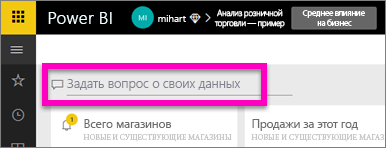

# Вопросы и ответы по началу работы с Power BI

Иногда самый быстрый способ получить ответ по данным — задать вопрос, используя естественный язык.  В этом кратком руководстве мы рассмотрим два разных способа создания одной визуализации: ее встраивание в отчет и ввод вопроса в функции "Вопросы и ответы". Мы будем использовать службу Power BI, но этот процесс применим и для Power BI Desktop.

Для работы с этим руководством нужен отчет, который вы можете изменять. Поэтому будем использовать один из доступных примеров в Power BI.

## Создание визуального элемента в редакторе отчетов

1. В рабочей области Power BI выберите **Получить данные** \> **Примеры** \> **Анализ розничной торговли — пример** > **Подключить**.
   
2. Панель мониторинга содержит плитку диаграммы с областями Last Year Sales and This Year Sales (Продажи за прошлый год и за этот год).  Выберите эту плитку. Если эта плитка была создана с помощью компонента "Вопросы и ответы", при выборе плитки откроется окно "Вопросы и ответы". Однако эта плитка была создана в отчете, поэтому отчет открывается на странице, содержащей эту визуализацию.

    

1. Откройте отчет в режиме редактирования, выбрав пункт **Изменить отчет**.  Не являясь владельцем отчета, вы не сможете открыть отчет в представлении редактирования.
   
    
4. Выберите диаграмму с областями и просмотрите параметры в области **Поля** .  Автор отчета создал эту диаграмму, выбрав эти три значения (**Time > FiscalMonth**, **Sales > This Year Sales**, **Sales > Last Year Sales**) и организовав их в категории **Оси** и **Значения**.
   
    

## Создание того же визуального элемента с помощью функции "Вопросы и ответы"

Как мы можем создать аналогичный график, используя функцию "Вопросы и ответы"?

1. Вернитесь на информационную панель "Анализ розничной торговли — пример".
2. Используя естественный язык, введите примерно следующий вопрос в поле вопроса:
   
   **какими были продажи за текущий и прошлый годы по месяцам в виде диаграммы с областями**
   
   По мере ввода вопроса функция "Вопросы и ответы" Power BI выбирает наиболее подходящую визуализацию для отображения ответа; и эта визуализация динамически меняется по мере изменения вопроса. Кроме того, функция помогает отформатировать вопрос, используя предложения, автоматическое завершение и правку орфографии.
   
   Когда вы закончите вводить вопрос, вы увидите, что результатом является точно такая же диаграмма, какую мы видели в отчете.  Но создать ее таким образом намного быстрее.
   
   
3. Как и при работе с отчетами, в компоненте "Вопросы и ответы" доступны области "Визуализации", "Фильтры" и "Поля".  С их помощью можно просмотреть и настроить параметры визуального элемента.
4. Чтобы закрепить диаграмму на панели мониторинга, выберите значок булавки. .

## Дальнейшие действия
[Вопросы и ответы в Power BI](consumer/end-user-q-and-a.md)

[Настройка данных для работы с функцией "Вопросы и ответы" в Power BI](service-prepare-data-for-q-and-a.md)

Появились дополнительные вопросы? [Ответы на них см. в сообществе Power BI.](http://community.powerbi.com/)

